# 实验流程与分系统状态：联合全周期图

本图依据 `laser-joint-fanout-experiment.yaml` 1.1 和两个分系统状态模型绘制。
同一张图包含流程控制、三个种子源实例及一个二倍频实例；从上往下表示本次实验的执行顺序。
这是一条模型允许的正常执行路径，不代表分系统的所有可选转移。

读图规则：

- 左侧“实验流程”负责节点选择、任务结果聚合和下一节点放行。
- 实线箭头表示下发动作，虚线箭头表示本次任务的成功反馈；图中的成功反馈均已通过模型证据校验。
- 种子源三个实例的命令在等待任何完成反馈前全部发出，任务可以重叠；图中反馈顺序仅为示意，允许乱序。
- “状态”注释按 `current_state / main_state / business_state` 排列；O 列另列为“定义”。
- 覆盖多个种子源泳道的注释表示各实例分别达到相同状态，不表示它们共享一个状态对象。
- 每个种子节点只有三个实例全部成功后才结束，期间流程保持 running；中间任何失败都不会走这条成功路径。

```mermaid
sequenceDiagram
    autonumber
    participant F as 实验流程 / 节点聚合
    participant S1 as 种子源 seed_01
    participant S2 as 种子源 seed_02
    participant S3 as 种子源 seed_03
    participant H as 二倍频 shg_01
    Note over F: 新实验：idle
    Note over S1,S3: 各实例：未上电/离线 / 未就绪 / 未就绪
    Note over H: 未上电/离线 / 未就绪 / 未就绪
    rect rgb(239, 246, 252)
    Note over F: 准备 · seed_self_test 开始
    Note over S1,S3: 各实例动作前置：主状态=未就绪；当前状态=关机完成或未上电/离线
    F->>S1: 开机自检 [power_on_self_test]
    F->>S2: 开机自检 [power_on_self_test]
    F->>S3: 开机自检 [power_on_self_test]
    Note over S1,S3: 各自 task_state=executing；持有独立 task_id
    S1-->>F: 本任务成功，结果=自检完成
    S2-->>F: 本任务成功，结果=自检完成
    S3-->>F: 本任务成功，结果=自检完成
    Note over S1,S3: 各实例状态：自检完成 / 未就绪 / 未就绪<br/>定义：启动中、准备中
    F->>F: all_success：3/3 → seed_self_test succeeded
    end
    rect rgb(240, 250, 244)
    Note over F: 准备 · shg_self_test 开始
    Note over H: 动作前置：主状态=未就绪；当前状态=关机完成或未上电/离线
    F->>H: 开机自检 [power_on_self_test]
    H-->>F: 本任务成功，结果=自检完成
    Note over H: 状态：自检完成 / 未就绪 / 未就绪<br/>定义：启动中、准备中
    F->>F: 1/1 → shg_self_test succeeded
    end
    rect rgb(239, 246, 252)
    Note over F: 准备 · seed_check 开始
    Note over S1,S3: 各实例动作前置：主状态=未就绪或正常或异常；当前状态=自检完成
    F->>S1: 功能检查 [function_check]
    F->>S2: 功能检查 [function_check]
    F->>S3: 功能检查 [function_check]
    Note over S1,S3: 各自 task_state=executing；持有独立 task_id
    S1-->>F: 本任务成功，结果=功能检查完成
    S2-->>F: 本任务成功，结果=功能检查完成
    S3-->>F: 本任务成功，结果=功能检查完成
    Note over S1,S3: 各实例状态：功能检查完成 / 就绪 / 就绪<br/>定义：业务就绪确认
    F->>F: all_success：3/3 → seed_check succeeded
    end
    rect rgb(240, 250, 244)
    Note over F: 准备 · shg_check 开始
    Note over H: 动作前置：主状态=未就绪或正常或异常；当前状态=自检完成
    F->>H: 功能检查 [function_check]
    H-->>F: 本任务成功，结果=功能检查完成
    Note over H: 状态：功能检查完成 / 就绪 / 就绪<br/>定义：业务就绪确认
    F->>F: 1/1 → shg_check succeeded
    end
    rect rgb(239, 246, 252)
    Note over F: 参数准备 · seed_configure 开始
    Note over S1,S3: 各实例动作前置：主状态=就绪或正常；当前状态=功能检查完成或采集完成
    F->>S1: 参数下发 [parameter_dispatch]
    F->>S2: 参数下发 [parameter_dispatch]
    F->>S3: 参数下发 [parameter_dispatch]
    Note over S1,S3: 各自 task_state=executing；持有独立 task_id
    S1-->>F: 本任务成功，结果=参数下发完成
    S2-->>F: 本任务成功，结果=参数下发完成
    S3-->>F: 本任务成功，结果=参数下发完成
    Note over S1,S3: 各实例状态：参数下发完成 / 正常 / 就绪<br/>定义：结果确认/保持有效
    F->>F: all_success：3/3 → seed_configure succeeded
    end
    rect rgb(240, 250, 244)
    Note over F: 参数准备 · shg_configure 开始
    Note over H: 动作前置：主状态=就绪或正常；当前状态=功能检查完成或采集完成
    F->>H: 参数下发 [parameter_dispatch]
    H-->>F: 本任务成功，结果=参数下发完成
    Note over H: 状态：参数下发完成 / 正常 / 就绪<br/>定义：结果确认/保持有效
    F->>F: 1/1 → shg_configure succeeded
    end
    rect rgb(255, 248, 224)
    Note over F,H: laser_ready_gate：读取四个实例当前快照
    F->>F: 检查全部种子实例 AND 二倍频：正常＋参数下发完成＋就绪
    Note over F: 门禁成功，仅允许继续下发；并不执行出光
    end
    rect rgb(239, 246, 252)
    Note over F: 出光 · seed_emit 开始
    Note over S1,S3: 各实例动作前置：主状态=正常；当前状态=参数下发完成
    F->>S1: 种子源出光 [seed_source_emit]
    F->>S2: 种子源出光 [seed_source_emit]
    F->>S3: 种子源出光 [seed_source_emit]
    Note over S1,S3: 各自 task_state=executing；持有独立 task_id
    S1-->>F: 本任务成功，结果=出光完成
    S2-->>F: 本任务成功，结果=出光完成
    S3-->>F: 本任务成功，结果=出光完成
    Note over S1,S3: 各实例状态：出光完成 / 正常 / 出光<br/>定义：结果确认/保持有效
    F->>F: all_success：3/3 → seed_emit succeeded
    end
    rect rgb(240, 250, 244)
    Note over F: 出光 · shg_emit 开始
    Note over H: 动作前置：主状态=正常；当前状态=参数下发完成
    F->>H: 二倍频出光 [frequency_doubled_emit]
    H-->>F: 本任务成功，结果=出光完成
    Note over H: 状态：出光完成 / 正常 / 出光<br/>定义：结果确认/保持有效
    F->>F: 1/1 → shg_emit succeeded
    end
    rect rgb(239, 246, 252)
    Note over F: 参数采集 · seed_collect 开始
    Note over S1,S3: 各实例动作前置：主状态=正常；当前状态=出光完成
    F->>S1: 激光参数采集 [laser_parameter_collect]
    F->>S2: 激光参数采集 [laser_parameter_collect]
    F->>S3: 激光参数采集 [laser_parameter_collect]
    Note over S1,S3: 各自 task_state=executing；持有独立 task_id
    S1-->>F: 本任务成功，结果=采集完成
    S2-->>F: 本任务成功，结果=采集完成
    S3-->>F: 本任务成功，结果=采集完成
    Note over S1,S3: 各实例状态：采集完成 / 正常 / 出光<br/>定义：数据采集/后处理
    F->>F: all_success：3/3 → seed_collect succeeded
    end
    rect rgb(240, 250, 244)
    Note over F: 参数采集 · shg_collect 开始
    Note over H: 动作前置：主状态=正常；当前状态=出光完成
    F->>H: 激光参数采集 [laser_parameter_collect]
    H-->>F: 本任务成功，结果=采集完成
    Note over H: 状态：采集完成 / 正常 / 出光<br/>定义：数据采集/后处理
    F->>F: 1/1 → shg_collect succeeded
    end
    rect rgb(239, 246, 252)
    Note over F: 正常复位 · seed_standby 开始
    Note over S1,S3: 各实例动作前置：主状态=正常；当前状态=采集完成
    F->>S1: 种子源待机/复位 [standby_reset]
    F->>S2: 种子源待机/复位 [standby_reset]
    F->>S3: 种子源待机/复位 [standby_reset]
    Note over S1,S3: 各自 task_state=executing；持有独立 task_id
    S1-->>F: 本任务成功，结果=复位/待机完成
    S2-->>F: 本任务成功，结果=复位/待机完成
    S3-->>F: 本任务成功，结果=复位/待机完成
    Note over S1,S3: 各实例状态：复位/待机完成 / 就绪 / 就绪<br/>定义：待机
    F->>F: all_success：3/3 → seed_standby succeeded
    end
    rect rgb(240, 250, 244)
    Note over F: 正常复位 · shg_standby 开始
    Note over H: 动作前置：主状态=正常；当前状态=采集完成
    F->>H: 二倍频待机/复位 [standby_reset]
    H-->>F: 本任务成功，结果=复位/待机完成
    Note over H: 状态：复位/待机完成 / 就绪 / 就绪<br/>定义：待机
    F->>F: 1/1 → shg_standby succeeded
    end
    rect rgb(239, 246, 252)
    Note over F: 关机收尾 · seed_shutdown 开始
    Note over S1,S3: 各实例动作前置：无业务前置限制；需无活动任务
    F->>S1: 关机 [shutdown]
    F->>S2: 关机 [shutdown]
    F->>S3: 关机 [shutdown]
    Note over S1,S3: 各自 task_state=executing；持有独立 task_id
    S1-->>F: 本任务成功，结果=关机完成
    S2-->>F: 本任务成功，结果=关机完成
    S3-->>F: 本任务成功，结果=关机完成
    Note over S1,S3: 各实例状态：关机完成 / 未就绪 / 未就绪<br/>定义：关机
    F->>F: all_success：3/3 → seed_shutdown succeeded
    end
    rect rgb(240, 250, 244)
    Note over F: 关机收尾 · shg_shutdown 开始
    Note over H: 动作前置：无业务前置限制；需无活动任务
    F->>H: 关机 [shutdown]
    H-->>F: 本任务成功，结果=关机完成
    Note over H: 状态：关机完成 / 未就绪 / 未就绪<br/>定义：关机
    F->>F: 1/1 → shg_shutdown succeeded
    end
    Note over F: 全部 14 个动作节点及 1 个联合门禁成功<br/>实验状态=succeeded
    Note over S1,H: 四个实例均为：关机完成 / 未就绪 / 未就绪
```

## 图中两类状态如何关联

每个流程节点用 `action` 引用一个分系统动作。动作前置状态来自分系统模型的 `precondition`；
反馈结果来自该动作的 `success`，流程通过匹配当前任务及结果才记录节点成功。
因此，图中并非两套互不相关的步骤，而是一条“流程调用 → 分系统转移 → 反馈确认 → 流程推进”的链路。

三个容易混淆的点：

1. 出光节点成功时，分系统进入出光，实验本身仍然 running，后面还有采集和收尾。
2. 采集节点成功时，current_state 变为“采集完成”，business_state 仍是“出光”。直到各自复位成功才退出出光。
3. 关机完成时，分系统 main_state 和 business_state 均是“未就绪”，但实验流程可以是 succeeded。

## 正常路径以外的关系

- 动作失败或完成证据不符：对应实例进入异常，当前节点失败，阻断后续节点，并取消同组尚未完成的仿真任务。取消并不表示物理设备已安全关光。
- 联锁：流程失败并要求补偿。补偿通过各实例 `abort_reset` 动作执行，成功后是“复位/待机完成 / 就绪 / 未就绪”，不会把实验改回 succeeded。
- 普通复位属于图中正常流程；异常中止补偿不在正常节点链内。
- 当前联合门禁是参数准备后的快照检查，没有持续后台跨系统状态一致性证明；真实联锁传感器尚未接入。
- 流程只选择图中顺序，分系统本身还允许其他路径，例如采集完成后再次下发参数。
- 第 19 行二倍频待机的 G/K 写“就绪”，L 写“尚无业务资格”；本图照录当前模型的 G/K 投影，不表示这个原文歧义已消除。
