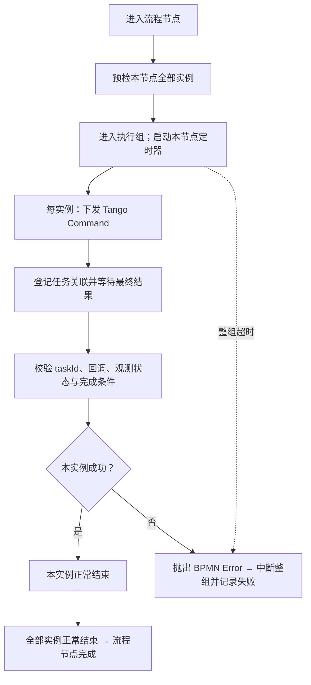

# 当前联合实验 YAML 的 BPMN 定义

来源：`simulator/gxlf_sim_system/models/laser-joint-fanout-experiment.yaml` 1.1。
模型文件：[laser-joint-fanout-experiment.bpmn](bpmn/laser-joint-fanout-experiment.bpmn)。
预览：[BPMN 主流程 SVG](bpmn/laser-joint-fanout-overview.svg)。

这是一份 BPMN 2.0 设计稿，标记 `isExecutable="false"`。包含 XML 流程语义与 BPMN DI 主图布局，
可用 BPMN 查看器查看。已经用 bpmn-js 导入渲染，无解析警告；这不等于 Java 引擎部署或运行验证。
现有 Python 运行流程仍读取 YAML，本次没有切换执行器，也没有引入 Flowable/Camunda 或 Tango 依赖。

## 总体结构

YAML 的 14 个动作节点分别对应 14 个嵌入式 BPMN 子流程。每个种子动作内部有一个并行多实例活动（3 个），
二倍频活动只执行一次。外层动作节点仍按 YAML 顺序串行，不能把种子与二倍频阶段擅自改为并行网关。

| YAML 节点 ID | 业务动作 | BPMN 内部实例语义 | 整组执行超时 |
|---|---|---|---|
| seed_self_test | 开机自检 | 种子源并行多实例 ×3 | 10 秒 |
| shg_self_test | 开机自检 | 二倍频单实例 ×1 | 10 秒 |
| seed_check | 功能检查 | 种子源并行多实例 ×3 | 30 秒 |
| shg_check | 功能检查 | 二倍频单实例 ×1 | 30 秒 |
| seed_configure | 参数下发 | 种子源并行多实例 ×3 | 30 秒 |
| shg_configure | 参数下发 | 二倍频单实例 ×1 | 30 秒 |
| laser_ready_gate | 联合准备条件确认 | 读取四个当前快照＋排他网关 | 无独立超时配置 |
| seed_emit | 种子源出光 | 种子源并行多实例 ×3 | 30 秒 |
| shg_emit | 二倍频出光 | 二倍频单实例 ×1 | 30 秒 |
| seed_collect | 激光参数采集 | 种子源并行多实例 ×3 | 30 秒 |
| shg_collect | 激光参数采集 | 二倍频单实例 ×1 | 30 秒 |
| seed_standby | 种子源待机/复位 | 种子源并行多实例 ×3 | 30 秒 |
| shg_standby | 二倍频待机/复位 | 二倍频单实例 ×1 | 30 秒 |
| seed_shutdown | 关机 | 种子源并行多实例 ×3 | 30 秒 |
| shg_shutdown | 关机 | 二倍频单实例 ×1 | 30 秒 |

`PT10S` / `PT30S` 是当前 YAML 的仿真配置，不是 Excel 确认的真实设备耗时。

## 一个动作子流程的定义



XML 采用三层作用域：动作节点 → 执行组 → 单实例动作。
全组预检在多实例启动前执行；定时器挂在执行组上，覆盖整组而不是给每个目标分别计时。
根流程在动作节点外捕获 ACTION_FAILED；任意实例的错误向外传播，中断同节点的多实例活动。

单实例内部是 `serviceTask(send) → receiveTask(wait) → serviceTask(validate) → exclusiveGateway`。
判定通过后正常结束，判定失败用 error end event 抛出 `ACTION_FAILED`。
发送服务遇到设备拒绝、验证服务出现业务失败，也须显式映射为同一个 BPMN Error。
通信异常/任务故障由 Tango 适配层转换为关联到等待任务的最终失败消息；消息丢失则由定时器兜底。

## all_success 不只是一个多实例标记

种子动作的 XML 使用：

```xml
<bpmn:multiInstanceLoopCharacteristics isSequential="false">
  <bpmn:loopCardinality xsi:type="bpmn:tFormalExpression">3</bpmn:loopCardinality>
</bpmn:multiInstanceLoopCharacteristics>
```

这里以标准 BPMN 的 loopCardinality 表达三次并行执行；生产部署通常绑定 seedInstances 集合，
每个活动实例对应 seed_01/02/03 的一个 Device。具体集合表达式、循环索引和局部变量绑定依引擎确定。
不要令各实例共享 taskId、resultValid 等可变变量。二倍频绑定唯一 shg_01。

实现 all_success 的必要组合是：

1. 不配置“任一个完成就结束”的 completionCondition；全部实例正常结束才能退出多实例活动。
2. 单实例不能把 failed 当作普通成功路径返回，必须抛出错误传播到整组。
3. 中断整组同时通知适配层撤销待执行任务或发送适当设备中止命令，并保留取消结果。
4. BPMN token 被取消不代表设备已停止；设备安全状态必须另行确认。

## 联合门禁

`laser_ready_gate` 拆成读取状态的 serviceTask 和 exclusiveGateway：

```text
jointReady =
  every(seedInstances, 主状态=正常 AND 当前状态=参数下发完成 AND 业务状态=就绪)
  AND shg_01 满足相同三个条件
```

满足才到 seed_emit，默认分支到失败处理。这里不使用并行网关汇合代替状态判断：
之前节点完成是历史事实，设备当前状态可能已经失效。当前 YAML 只有这一个离散门禁；
持续联锁监测属于独立机制，不能从这个 BPMN 判断节点推导出来。

## 超时、故障和联锁

- 动作超时：执行组上的 interrupting boundary timer，经超时记录任务抛出 ACTION_FAILED；外层记录流程失败并处理同组残留任务。
- 普通动作失败/故障：沿错误边界到失败出口，不自动补偿。这与当前 Python 只有联锁才设置 compensation_required 的行为一致。
- 联锁：顶层 interrupting message event subprocess 按 runId 接收消息，中断当前正常流程，记录联锁和业务失败，进入补偿请求等待。
- 使用 message 而非无差别广播 signal，避免一个实验的联锁错误地关联到另一实验；现场全局广播应由独立联锁服务决定影响范围。

## 补偿是显式安全处理流程

当前 runtime.compensation 的两个条目 priority 都为 1，因此按声明顺序稳定排列：
`seed_01 → seed_02 → seed_03 → shg_01`，每个目标执行 abort_reset 并等待证据验证。
BPMN 以一个串行多实例子流程表示这四次复位，不使用自动 compensation event 的默认逆序行为。

操作员请求补偿前有 userTask；这对应现有操作台显式点击补偿，不是新增必须自动执行的策略。
补偿失败进入人工处理等待，保留补偿要求；再次发起会重跑整条链，与当前重调用 API 的含义一致。
补偿成功仅清除待补偿标记，主实验仍为 failed，联锁仍保留记录。
补偿链本身没有配置超时，图中也不自行添加；是否需要独立超时和分目标重试须下一步明确。

## Tango 和引擎之间的契约

部署前至少要定义以下变量和关联：

| 范围 | 变量 | 用途 |
|---|---|---|
| 流程 | runId、seedInstances、shgInstance、modelVersion | 实验身份和目标实例清单 |
| 节点 | nodeId、action、timeout、targetSet | 本次调度与结果聚合 |
| 多实例局部 | instanceId、taskId、callback、observedState、conditions、resultValid | 每实例独立任务与验证结果 |
| 联锁处置 | flowOutcome、interlockTriggered、compensationRequired、compensationResults | 区分业务失败和安全回退 |

本 BPMN 的服务任务实现、消息关联和变量绑定均写在 documentation 中作为设计契约，尚未绑定到 Java delegate 或 worker。
如果选 Flowable，后续应提供相应 delegate、输入输出绑定与关联服务；其他引擎需对应适配。
不能认为文件里的中文说明和伪表达式本身会被引擎自动执行。

## 与当前 Python 的差异和待确认点

1. BPMN 执行组计时从进入组开始；当前 Python 从所有 start 返回后才计时。适配 Tango 前要统一起点以及超时与成功同刻到达的处理规则。
2. Python 支持流程已 failed/succeeded 后再触发联锁；BPMN 流程结束后不再接收事件子流程消息。应由独立的设备安全管理流程覆盖结束后的联锁，不能声称该设计稿已完全等价。
3. 当前 Python 补偿结果在整条链成功后统一加入列表；未来引擎应逐目标持久化，避免部分失败时丢失审计信息。
4. Command 接受后、receiveTask 建立前可能收到反馈。适配层需要持久化关联及消息缓存；不能通过画一条消息箭头解决这个竞态。
5. Tango 实际 command 名、属性名、事件接口以及引擎选型尚未确定，现有 action ID 只是逻辑动作名。

下一个可实施的验证原型应先跑通一个并行三实例动作的“发送→等待→校验→汇合”，验证拒绝、错误、超时、乱序反馈及引擎重启后关联，再迁移完整 14 节点流程。
