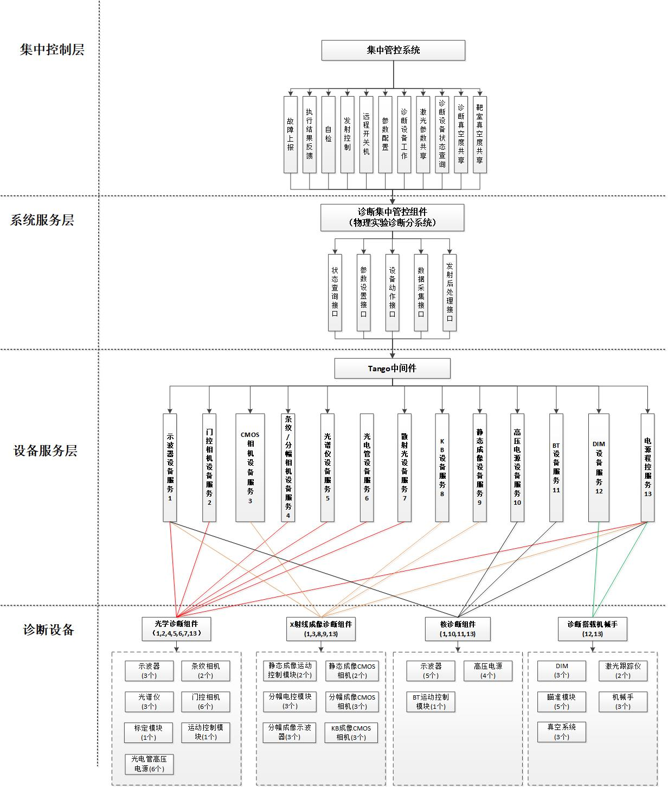
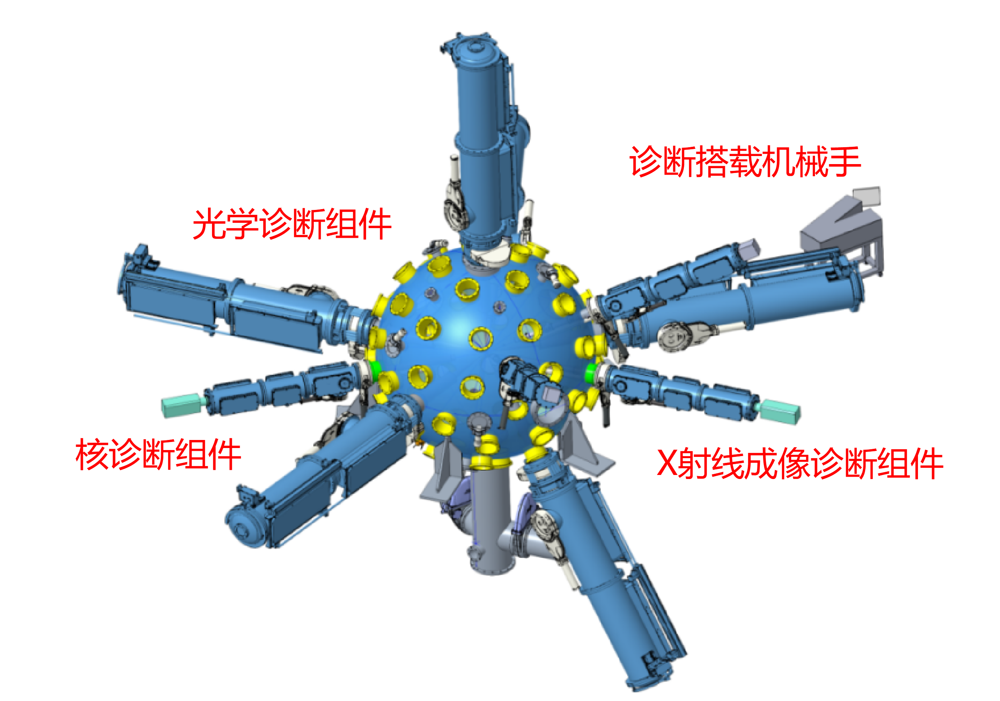
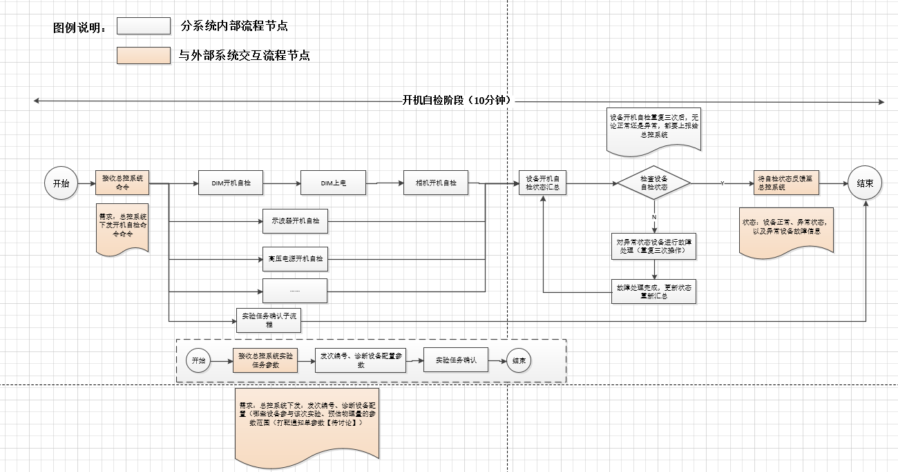
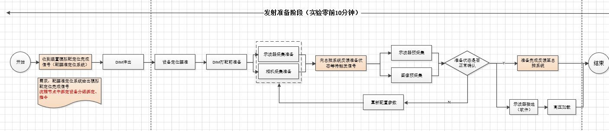
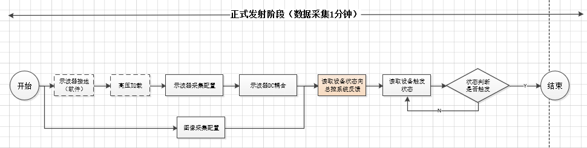
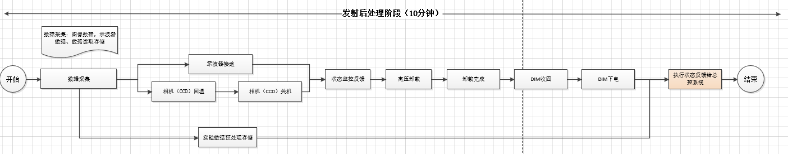
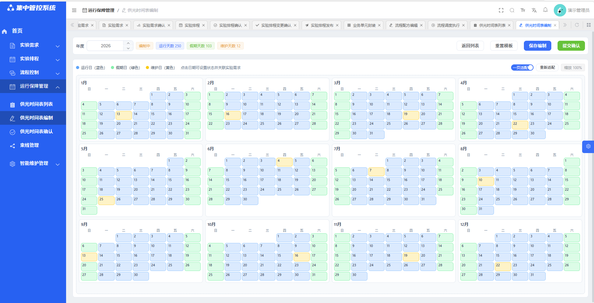

| 密  级：公开 |  | 文件编号：26-GXLF-11-BG-01 |  |  |
| --- | --- | --- | --- | --- |
| 分类号： |  |  |  |  |
| GXLF实验平台项目文件 物理实验诊断系统集中控制软件 需求分析报告 山东中创软件工程股份有限公司 |  |  |  |  |
| 附   件 | UML图 |  | 页    数 | 共 88 页 |
| 发布时间 | 2026年 4 月 3 日 |  | 文件版本 | V1.7 |

| 编写人 |  |
| --- | --- |
| 参加人 |  |
|  |  |
| 校  对 |  |
| 审  核 |  |
| 会  签 |  |
|  |  |
| 标准化 |  |
| 审  批 |  |
| 批  准 |  |

**说明：**

|  |  |  |  |  |  |  |  |  |  |
| --- | --- | --- | --- | --- | --- | --- | --- | --- | --- |
|  |  |  |  |  |  |  |  |  |  |
|  |  |  |  |  |  |  |  |  |  |
| 标记 | 处数 | 更改文号 | 签 字 | 日期 | 标记 | 处数 | 更改文号 | 签 字 | 日期 |

目　　录

# 引言

##  目的

本文为山东中创软件工程股份有限公司（以下简称“中创”）编写的中国工程物理研究院激光聚变研究中心（以下简称“中物院八所”）“物理实验诊断系统集中控制软件”的需求分析报告。对该项目实现所需软件模块的主要功能进行了详细分析，统一各级管理者和系统业务人员、系统最终用户、软件开发人员、软件测试人员等对物理实验诊断系统集中控制软件需求的认识和理解，建立系统软件开发度量和遵循的基准。同时也是集中管控系统进行软件功能确认、验收测试、项目实施的依据。

本文档的预期读者有： 

- 客户方用户：软件测试人员、质量保证人员、配置管理人员、本项目管理人员、系统负责人及实际用户；
- 实施方人员：项目负责人、业务顾问、软件开发、测试人员、软件质量保证人员等。

##  背景

产品名称：物理实验诊断系统集中控制软件

产品代码：

项目来源：为保障 GXLF 装置物理诊断实验有序开展，中国工程物理研究院激光聚变研究中心（以下简称“中物院八所”）启动物理实验诊断系统集中控制软件研制工作，对多类诊断设备实施统一管控、数据采集与状态监测，提升实验自动化水平与运行安全性，满足装置物理实验诊断业务需求。

参与人员：分析报告所涉及人员包括项目负责人、需求分析员、资料员及为开展本项目需求调研的用户。

##  参考资料

- 《公开★集中管控系统采购任务书》
- 《公开★GXLF集中管控系统实施方案》
- 《公开★GXLF实验平台软件工程化规范手册》
- 《公开★GXLF实验平台电气工程设计规范》
- 《公开★GXLF实验平台命名和编码规范》
- 《重大装置项目技术文件标识规范》
- 《公开★采购任务书-X射线和核诊断系统》
- 《公开★采购任务书-背向散射光诊断系统》
- 《公开★采购任务书-诊断搭载平台》

##  术语

激光束线：GXLF实验平台中实现激光放大、频率转换、测量的一路独立的激光光路。

# 项目概述

##  被开发软件的一般描述

- 诊断集中控制软件系统概述
物理实验诊断系统集中控制软件主要服务于诊断值班长和设备运行人员，该软件作为物理实验诊断系统的“物理诊断大脑”，是实验诊断业务的集中控制软件，通过对诊断组件的集中控制与运行管理，实现对物理实验打靶过程的物理目标进行物理量监测和评估；系统集成诊断数据管理、设备控制、流程编排、状态监测、智能运维等核心功能，统一管控光学诊断、X射线成像、中子探测等各类诊断设备，其核心职责包括实验准备阶段的参数配置与流程设计、实验执行阶段的集中控制与状态监测、实验后的数据归集分析与运维保障，同时提供视频融合、VR复现等可视化能力，支撑实验安全高效开展，为物理数据研判、实验流程优化、设备稳定运行提供可靠的软件支撑，助力实验效率与成果转化提升；

物理实验诊断系统集中控制软件主要包括诊断数据管理、诊断控制管理、诊断设备状态监测、诊断智能运维以及离线测试五大模块；该软件功能范围如下图所示：

 物理实验诊断系统集中控制软件功能范围

物理实验诊断系统集中控制软件提供物理诊断实验操作控制平台，围绕诊断单元配置、诊断设备控制、流程控制、状态监测、实验结果展示分析等功能实现诊断设备全生命周期业务管理，通过运维任务管控组件和相关设备服务软件接口及各数据库接口完成衔接，满足实验复杂控制应用需求的实验操作和状态监控服务，确保诊断设备的安全运行与高效控制。

- 诊断数据管理
诊断数据管理模块是系统的数据中枢，负责全量诊断数据的统一接入、存储与管理。通过诊断单元接入实现多类异构诊断设备的标准化接入，依托设备管理、分组管理完成基础资源维护，通过实验数据管理实现按发次归集、可追溯的诊断数据，为实验分析、设备运维提供完整、可靠的数据支撑；

- 诊断控制管理
诊断控制管理模块是实验执行的核心控制单元，覆盖实验参数配置、流程控制、诊断设备控制、安全联锁等诊断控制全流程；它通过实验参数配置与流程控制管理完成实验前的参数编排与流程设计，依托诊断设备控制实现多设备集中控制与时序同步，结合安全连锁与重频智能运行保障实验安全与高效自动化执行，支撑多发次、重频物理实验的精准控制；

- 诊断状态监控
诊断状态监控模块是系统的态势感知窗口，负责设备与实验现场的实时监控与可视化展示。它通过显示方案编辑实现可视化布局的自定义配置，依托状态监测及故障展示完成设备状态采集与告警推送，通过视频融合态势分析与 VR 展示构建沉浸式现场态势，为值班与运维人员提供直观、全面的实验现场感知能力；

- 诊断智能运维
诊断智能运维模块是设备全生命周期管理的核心，聚焦设备健康与运维决策；通过设备健康评估量化设备运行状态，依托性能预测识别潜在性能衰减风险，结合智能运维与维修决策生成精准维护方案，实现故障提前预警、预防性维护与高效维修，提升设备可靠性与运维效率，保障诊断系统长期稳定运行；

- 离线测试
离线测试模块是正式实验的前置质量保障与验证平台，旨在实现设备控制逻辑、实验运行流程的离线仿真与验证；支持非实验时段开展诊断设备单元测试、虚拟实验流程仿真及全链路逻辑校验，可模拟多设备时序联动与数据采集过程，验证控制指令、采集参数的正确性。通过离线环境完成功能验证、精度比对与稳定性测试，提前发现并修复系统缺陷，避免正式实验中出现控制异常、数据异常或设备故障，提升实验成功率与运行可靠性。

- 诊断集中控制软件控制拓扑
物理实验诊断系统集中控制软件向上承接集中管控系统控制指令与任务规划，向下统管诊断控制对象的实时动作、数据与状态，通过标准化的Tango接口查询诊断控制对象的设备状态和运行数据，并下发参数设置以及控制指令，确保物理实验诊断系统在正确的时间、以正确的参数完成正确的测量。物理实验诊断系统集中控制软件控制拓扑如下图所示：

 控制拓扑图

物理实验诊断系统集中控制软件主要完成物理实验诊断分系统和重频诊断分系统中的诊断组件的集中控制与运行管理，物理实验诊断分系统中的控制对象包括光学诊断组件、X射线成像诊断组件、核诊断组件、诊断搭载机械手，重频诊断分系统中的控制对象包括多模态测量组件和自动化搭载组件。具体控制对象如下图所示：

 诊断集中管控组件控制对象

物理实验诊断系统集中控制软件主要对物理实验打靶过程的诊断设备进行物理量监测和评估；利用背向散射光测量模块诊断束靶耦合效率；利用X射线成像测量模块诊断辐照均匀性和内爆对称性；利用核诊断模块测量产额和离子温度表征内爆综合性能；利用诊断搭载机械手搭载调节诊断系统，最终可实现散射光、辐照对称性、内爆产额等表征束靶耦合、辐照均匀性实验关键参数的诊断，支撑平台任务目标实现；

诊断装置分布在靶球周围，其中光学诊断组件、X射线成像诊断组件、中子Bangtime诊断模块直接或通过诊断搭载机械手，安装在靶室法兰上，针对物理目标开展测量；核诊断组件分布在靶场区四周，针对中子信号开展测量，诊断组件如下图所示：

 诊断控制对象集成安装示意图

- 诊断集中管控组件业务流程
物理实验诊断系统集中控制软件的业务流程主要包括开机自检阶段、功能检查、发射准备阶段、发射阶段、发射后处理阶段，涉及每个阶段的具体的业务流程如下图所示：

 开机自检阶段

 功能检查阶段

 发射准备阶段

发射阶段

 发射后处理阶段

##  被开发软件的功能

物理实验诊断系统集中控制软件功能模块包括诊断数据管理、诊断控制管理、诊断设备状态监测、诊断智能运维以及离线测试五个模块。

物理实验诊断系统集中控制软件各组件的功能模块包含的具体功能见，其中需求标识命名规则：集中管控系统（JZGK）_组件（ZDJZGK）_序号（001），系统具体需求功能清单如下表：

              -  需求功能表

| 组件 | 模块 | 子模块 | 需求标识 | 需求名称 |
| --- | --- | --- | --- | --- |
| 物理实验诊断系统集中控制软件 | 诊断数据 管理 | 诊断单元接入 | JZGK_ZDJZGK_001 | 诊断单元接入 |
|  |  | 诊断设备管理 | JZGK_ZDJZGK_002 | 诊断设备管理 |
|  |  | 诊断系统管理 | JZGK_ZDJZGK_003 | 诊断系统管理 |
|  |  | 诊断分组管理 | JZGK_ZDJZGK_004 | 诊断分组管理 |
|  |  | 实验数据分析 | JZGK_ZDJZGK_005 | 实验数据分析 |
|  | 诊断控制 管理 | 实验参数配置 | JZGK_ZDJZGK_006 | 实验参数配置 |
|  |  | 流程控制管理 | JZGK_ZDJZGK_007 | 流程编辑 |
|  |  |  | JZGK_ZDJZGK_008 | 流程执行控制 |
|  |  | 诊断设备控制 | JZGK_ZDJZGK_009 | 诊断设备控制 |
|  |  | 安全联锁 | JZGK_ZDJZGK_010 | 安全联锁 |
|  |  | 重频智能运行 | JZGK_ZDJZGK_011 | 重频智能运行 |
|  | 诊断设备状态监测 | 显示方案编辑 | JZGK_ZDJZGK_012 | 显示方案编辑 |
|  |  | 状态监测及故障显示 | JZGK_ZDJZGK_013 | 监测数据显示 |
|  |  |  | JZGK_ZDJZGK_014 | 故障及告警显示 |
|  |  | 视频融合态势分析 | JZGK_ZDJZGK_015 | 视频融合功能 |
|  |  |  | JZGK_ZDJZGK_016 | 实验态势分析 |
|  |  | VR展示 | JZGK_ZDJZGK_017 | 维修态势 |
|  |  |  | JZGK_ZDJZGK_018 | VR培训 |
|  | 诊断智能 运维 | 设备健康评估 | JZGK_ZDJZGK_019 | 健康评估管理 |
|  |  | 设备性能预测 | JZGK_ZDJZGK_020 | 性能预测 |
|  |  | 智能运维与维修决策 | JZGK_ZDJZGK_021 | 智能运维与维修决策 |
|  | 离线测试 | 单元测试 | JZGK_ZDJZGK_022 | 单元测试 |
|  |  | 虚拟实验流程测试 | JZGK_ZDJZGK_023 | 虚拟实验流程测试 |
|  | 系统管理 | 资源管理 | JZGK_ZDJZGK_024 | 资源管理 |
|  |  | 接口管理 | JZGK_ZDJZGK_025 | 接口管理 |
|  |  | 日志管理 | JZGK_ZDJZGK_026 | 日志管理 |

##  实现语言

- Python、Java语言。

##  用户特点

物理实验诊断系统集中控制软件由中物院激光聚变研究中心承担，项目负责人为陈伯伦，项目组成员由激光聚变研究中心十一部、项目管理部人员构成。

              -   系统服务角色配置表

| 序号 | 角色名称 | 主要职责 |
| --- | --- | --- |
| 1 | 诊断分系统值班长 | 负责整个诊断分系统的操作、日常运维和培训管理；落实诊断任务、运行参数预设和配置、安全联锁控制；实验流程控制、状态监控；诊断数据统计分析、智能分析、系统维护； |
| 2 | 诊断设备运行人员 | 围绕诊断设备，负责对诊断设备进行远程开关机、接入注册、离线测试、设备远程控制联调、设备故障排查、设备维修、设备健康度评估等操作。 |

##  一般约束

- 操作系统：Ubuntu 46.04及以上版本；
- 数据库系统：南大通用数据库GBase 8s V8.8；
- 开发工具：VScode、Idea；
- 软件版本控制工具：SVN；
- 软件中间件平台：Tango9.5及以上；
- 并行操作的用户数：系统各软件同时只有一个用户操作生效；
- 其他用户接口限制：具备权限管理功能，分为管理员权限和授权用户权限，可进行相应操作；
- 操作人员技术水平和培训的要求：软件应简单易用，操作人员须具备基本的数据分析技能，经过培训即可上岗操作；
- 网络环境：工控局域网，与外网物理隔离。

# 功能需求

## 诊断数据管理

### 诊断单元接入

#### 引言

由诊断设备运行人员在系统中实现诊断分系统、诊断子系统、诊断设备以及波形、图像、高压、时序等通用诊断单元的设备接入，并完成Tango服务自动注册，支持权限隔离（用户只能操作自己创建的单元，其他用户仅可查看），所有操作需记录日志。

该功能具备新增、查询、编辑、删除、预设参数、远程控制、实验结果查询等操作。

#### 输入要求

- 数据输入
表 .1 诊断单元数据信息表

| 序号 | 数据名称 | 数据类型 | 是否必填 | 输入源 |
| --- | --- | --- | --- | --- |
| 1 | 诊断单元唯一标识 | String | 是 | 系统自动生成 |
| 2 | 诊断单元编号 | String | 是 | 系统自动生成 |
| 3 | 诊断单元名称 | String | 是 | 用户界面 |
| 4 | 诊断单元类型 | String | 是 | 用户界面 |
| 5 | 诊断单元厂商 | String | 是 | 用户界面 |
| 6 | 诊断单元型号 | String | 是 | 用户界面 |
| 7 | 所属设备分组 | String | 否 | 用户界面 |
| 8 | 所属系统 | String | 否 | 用户界面 |
| 9 | 诊断单元状态 | String | 是 | 系统自动生成 |
| 10 | Tango注册ID | String | 是 | 用户界面 |
| 11 | 通道数量 | Integer | 否 | 系统自动生成 |
| 12 | 数据采集类型 | String | 是 | 用户界面 |
| 13 | 注册时间 | DateTime | 是 | 系统自动生成 |
| 14 | 备注 | String | 否 | 用户界面 |

其中诊断单元状态包括运行中、待机、故障、告警、禁用等；诊断单元类型包括CCD、示波器、高压电源、CMOS相机、分幅/条纹相机等类型；数据采集类型包括波形采集单元基类、电源基类、图像采集单元基类、分幅相机设备基类、条纹相机设备基类、诊断搭载平台基类、能量测量分系统基类。

- 命令输入：
用户输入“新增”“查询”“编辑”“删除”“预设参数”“远程控制”“实验结果查询”等命令。

#### 处理要求

- 新增诊断单元，输入诊断单元信息，创建诊断单元时同步完成Tango服务注册，任一环节失败则回滚所有操作，并保存至数据库；
- 按诊断单元名称、设备类型、注册时间，诊断单元状态等条件查询诊断单元信息，查询结果以列表形式分页展示；
- 用户只可对自己新增的诊断单元信息进行编辑、删除，查询不做限制；
- 诊断单元接入tango服务后，支持初始化并配置各类诊断设备的预设参数值；不同设备的物理参数值不同，比如CMOS相机预设参数值包括制冷温度、监控温度、曝光时间、门控时间、增益、触发模式（内触发、外触发）；
- 支持对已接入诊断单元进行远程控制，调用设备单控界面执行设备调试指令操作；不同设备具备不同的操作指令，比如CMOS相机操作指令包括制冷、本底采集、采集、停止采集；
- 查询设备已参与的实验任务信息，以列表形式展示；
- 新增、编辑、删除、预设参数、远程控制用户操作留痕，日志保存至数据库。

#### 输出要求

- 页面以列表形式展示诊断单元信息，页面展示当前诊断单元的状态，包括“运行中”“待机”“故障”“告警”“禁用”；
- 诊断单元信息保存至数据库后，页面提示“保存成功”；
- 删除诊断单元成功或失败后，页面提示“删除成功”或“删除失败”；
- 诊断单元的参数预设保存后，页面提示“参数设置成功”；
- 诊断单元远程调试指令，页面展示指令的响应结果。

### 诊断设备管理

#### 引言

由诊断设备运行人员在系统中管理诊断设备信息，需维护诊断设备与诊断单元的关联关系，一个诊断设备可由一个或多个诊断单元组成，支持将已有诊断单元关联到设备或从设备中移除。支持权限隔离（用户只能操作自己创建的设备，其他用户仅可查看），所有操作需记录日志。

该功能具备新增、查询、编辑、删除、分配诊断单元、查看诊断单元等操作。

#### 输入要求

- 数据输入
表 .2 诊断设备数据信息表

| 序号 | 数据名称 | 数据类型 | 输入源 |
| --- | --- | --- | --- |
| 1 | 诊断设备唯一标识 | String | 系统自动生成 |
| 2 | 诊断设备名称 | String | 用户界面 |
| 3 | 运行状态 | String | 用户界面 |
| 4 | 关联诊断单元 | List[] | 用户界面 |
| 5 | 设备描述 | String | 用户界面 |
| 6 | 创建人 | String | 系统自动生成 |
| 7 | 创建时间 | DateTime | 系统自动生成 |

- 命令输入：
用户输入“新增”“查询”“编辑”“删除”“分配诊断单元”“查看诊断单元”等命令。

#### 处理要求

- 新增诊断设备，输入诊断设备信息，并保存至数据库；
- 按诊断设备名称、设备类型、创建时间，运行状态等条件查询诊断设备信息，查询结果以列表形式分页展示；
- 用户只可对自己新增的诊断设备信息进行编辑、删除，查询不做限制，执行删除时如有关联的诊断单元系统进行提示，用户同意后解除诊断单元的关联；
- 分配诊断单元添加未关联的诊断单元或移除已关联的诊断单元；
- 查看诊断单元以列表形式展示设备关联的诊断单元；
- 新增、编辑、删除、分配诊断单元操作留痕，日志保存至数据库。

#### 输出要求

- 页面以列表形式展示诊断设备信息；
- 诊断设备信息保存至数据库后，页面提示“保存成功”；
- 删除诊断单元成功或失败后，页面提示“删除成功”或“删除失败”。 
- 分配诊断单元信息保存后，页面提示“关联成功”。

### 诊断系统管理

#### 引言

由诊断设备运行人员在系统中管理诊断系统的信息，需维护诊断系统与诊断设备的关联关系，一个诊断系统可由一个或多个诊断设备组成，支持将已有诊断设备关联到诊断系统或从诊断系统中移除。支持权限隔离（用户只能操作自己创建的设备，其他用户仅可查看），所有操作需记录日志。

该功能具备新增、查询、编辑、删除、分配诊断设备、查看诊断设备等操作。

#### 输入要求

- 数据输入
表 .3 诊断系统数据信息表

| 序号 | 数据名称 | 数据类型 | 输入源 |
| --- | --- | --- | --- |
| 1 | 诊断系统唯一标识 | String | 系统自动生成 |
| 2 | 诊断系统名称 | String | 用户界面 |
| 3 | 系统负责人 | String | 用户界面 |
| 4 | 运行状态 | String | 用户界面 |
| 5 | 关联诊断设备 | List[] | 用户界面 |
| 6 | 系统描述 | String | 用户界面 |
| 7 | 创建人 | String | 系统自动生成 |
| 8 | 创建时间 | DateTime | 系统自动生成 |

- 命令输入：
用户输入“新增”“查询”“编辑”“删除”“分配诊断设备”“查看诊断设备”等命令。

#### 处理要求

- 新增诊断系统，输入诊断系统信息，并保存至数据库；
- 按诊断系统名称、系统类型、创建时间，运行状态等条件查询诊断系统信息，查询结果以列表形式分页展示；
- 用户只可对自己新增的诊断系统信息进行编辑、删除，查询不做限制，删除时解除诊断设备的关联；
- 分配诊断设备添加未关联的诊断设备或移除已关联的诊断设备；
- 查看诊断设备以列表形式展示系统关联的诊断设备；
- 新增、编辑、删除、分配诊断单元操作留痕，日志保存至数据库。

#### 输出要求

- 页面以列表形式展示诊断系统信息；
- 诊断系统信息保存至数据库后，页面提示“保存成功”；
- 删除诊断系统成功或失败后，页面提示“删除成功”或“删除失败”。 
- 分配诊断设备信息保存后，页面提示“关联成功”。

### 诊断分组管理

#### 引言

由诊断设备运行人员在系统中管理诊断分组的信息，诊断分组是将具有相同操作、同一处理流程的诊断单元划分为逻辑组，用于批量操作和统一配置，需维护诊断分组与诊断单元的关联关系，支持分组的启用/禁用状态管理。支持权限隔离（用户只能操作自己创建的分组，其他用户仅可查看），所有操作需记录日志。

该功能具备新增、查询、编辑、删除、分配诊断单元、查看诊断单元、远程控制等操作。

#### 输入要求

- 数据输入
表 .4 诊断分组数据信息表

| 序号 | 数据名称 | 数据类型 | 输入源 |
| --- | --- | --- | --- |
| 1 | 诊断分组唯一标识 | String | 系统自动生成 |
| 2 | 分组编号 | String | 系统自动生成 |
| 3 | 诊断分组名称 | String | 用户界面 |
| 4 | 分组类型 | String | 用户界面 |
| 5 | 关联的诊断单元 | List | 用户界面 |
| 6 | 分组描述 | String | 用户界面 |
| 7 | 创建人 | String | 系统自动生成 |
| 8 | 创建时间 | DateTime | 系统自动生成 |

- 命令输入：
用户输入“新增”“查询”“编辑”“删除”“分配诊断单元”“查看诊断单元”“远程控制”等命令。

#### 处理要求

- 新增诊断分组，输入诊断分组信息，并保存至数据库；
- 按诊断分组名称、分组类型、创建时间等条件查询诊断分组信息，查询结果以列表形式分页展示；
- 用户只可对自己新增的诊断分组信息进行编辑、删除，查询不做限制；
- 分配诊断单元添加未关联的诊断单元或移除已关联的诊断单元；
- 对已关联诊断单元的诊断分组进行远程控制群体调试，通过设备指令进行操作调试；
- 新增、编辑、删除、分配诊断单元、远程控制操作留痕，日志保存至数据库。

#### 输出要求

- 页面以列表形式展示诊断分组信息；
- 诊断分组信息保存至数据库后，页面提示“保存成功”；
- 删除诊断分组成功或失败后，页面提示“删除成功”或“删除失败”。 
- 分配诊断单元信息保存后，页面提示“关联成功”。

### 实验数据分析（修订中）

#### 引言

系统为诊断值班长提供实验对比分析功能，支持用户对单个或多个实验任务进行多维度数据对比分析，实现纵向历史数据对比、横向跨实验关联对比、多设备参数对比等操作；实验数据支持时间范围、实验设备、实验任务名称、数据类型等多种维度的组合查询。

#### 输入要求

实验对比分析功能对处理分析数据进行分类，共分为关键过程数据、原始测量数据、预处理数据、仿真数据等四大类，各类数据含义如下：

关键过程数据：实验运行关键节点设备基本属性数据。

原始测量数据：发射后设备采集数据，包括相机（图片）、示波器（二维数组、图片）、光谱仪（一维数组）；

预处理数据：原始数据采集后，通过设备厂商提供的tango服务处理后的数据（二维数组、图片）；

仿真数据：仿真数据库数据，来自第三方系统，与真实数据结构一致；

表 .5 对比分析数据

| 数据类型 | 设备类型 | 分析参数 | 对比维度 | 分析结果 |
| --- | --- | --- | --- | --- |
| 关键过程数据 | CMOS相机 | 制冷温度 | 多实验发次 对比真实仿真对比单元对比分组对比通道对比 | 求异、均值、极值、偏差 |
|  |  | 监控温度 |  | 求异、均值、极值、偏差 |
|  |  | 曝光时间 |  | 求异、均值、极值、偏差 |
|  |  | 门控时间 |  | 求异、均值、极值、偏差 |
|  |  | 增益 |  | 求异 |
|  |  | 触发模式（内触发、外触发） |  | 求异 |
|  | 示波器 | 触发电平 |  | 求异 |
|  |  | 触发模式 |  | 求异 |
|  |  | 触发通道 |  | 求异 |
|  |  | 时基 |  | 求异、均值、极值、偏差 |
|  |  | 幅值 |  | 求异、均值、极值、偏差 |
|  |  | 基线 |  | 求异、均值、极值、偏差 |
|  |  | 带宽 |  | 求异、均值、极值、偏差 |
|  |  | 耦合模式 |  | 求异 |
|  |  | 触发模式 |  | 求异 |
|  | 分幅/条纹相机 | 高压设置值 |  | 求异、均值、极值、偏差 |
|  |  | 开光状态 |  | 求异 |
|  |  | 环境温度 |  | 求异、均值、极值、偏差 |
|  |  | 环境湿度 |  | 求异、均值、极值、偏差 |
|  | 高压电源 | 电流 |  | 求异、均值、极值、偏差 |
|  |  | 电压 |  | 求异、均值、极值、偏差 |
|  |  | 通道工作状态 |  | 求异 |
|  |  | 极性 |  | 求异 |
|  | 标定模块 | 激光器状态 |  | 求异 |
|  |  | 制冷状态 |  | 求异 |
|  |  | 出光状态 |  | 求异 |
|  |  | 制冷温度 |  | 求异、均值、极值、偏差 |
|  | 运动控制模块 | 当前位置 |  | 求异 |
|  |  | 当前滤片位置 |  | 求异 |
|  |  | 设备故障码 |  | 求异 |
|  | 光电管高压电源 | 电流 |  | 求异、均值、极值、偏差 |
|  |  | 电压 |  | 求异、均值、极值、偏差 |
|  |  | 通道工作状态 |  | 求异 |
|  |  | 极性 |  | 求异 |
|  |  | 设备状态 |  | 求异 |
|  |  | 高压输出状态 |  | 求异 |
|  |  | 加高压的速度 |  | 求异、均值、极值、偏差 |
| 原始测量数据 | CMOS相机 | 图片 | 多试验发次对比真实仿真对比单元对比分组对比 | 直接展示采集图片 |
|  | 示波器 | 示波图、示波器截图 |  |  |
|  | 分幅/条纹相机 | 图片 |  |  |
| 预处理数据 | CMOS相机 | 图片 | 多试验发次对比真实仿真对比单元对比分组对比 | 直接展示处理后图片 |
|  | 示波器 |  |  |  |
|  | 分幅/条纹相机 |  |  |  |

实验数据对比信息见下表：

表 .5 实验数据对比信息表

| 序号 | 模块 | 数据名称 | 数据类型 | 输入源 |
| --- | --- | --- | --- | --- |
| 1 | 实验查询条件 | 实验任务名称 | String | 用户界面 |
| 2 |  | 实验发次编号 | String | 用户界面 |
| 3 |  | 时间范围 | Date | 用户界面 |
| 4 |  | 任务状态 | String | 用户界面 |
| 5 |  | 对比维度 | List | 用户界面 |
| 6 | 分析算法 | 偏差 | Double | 用户界面 |
| 7 |  | 均值 | Double | 用户界面 |
| 8 |  | 求异 | Double | 用户界面 |
| 9 |  | 极值 | Double | 用户界面 |

#### 处理要求

- 实验任务查询
- 查询：支持按实验任务名称、时间范围、实验发次编号等条件组合查询，返回实验任务列表
- 对比：支持一个或多个实验任务进行对比，选择对比维度后勾选实验内设备进行对比。
- 对比维度
- 多实验发次对比：支持分析多个实验之间的关键过程数据、原始数据、预处理数据之间的差异；
例如，关键过程数据：对比CMOS相机在不同发次中的曝光时间、制冷温度等关键属性值；分析不同发次间关键参数（如温度、电流）的均值、极值（最大值/最小值）；

原始数据、预处理数据：直接展示CMOS相机在不同发次中采集的图像和处理后的图像；

- 实验与仿真对比：支持实验数据库和仿真数据中对应发次编号进行对比，实现实测数据与仿真数据的验证分析；
例如，关键过程数据：对比同一发次的同一关键节点中CMOS相机的曝光时间、制冷温度等关键属性值；原始数据、预处理数据：直接展示CMOS相机在同一发次中真实和仿真采集的图像和处理后的图像；

- 同类型单元数据对比：支持不同发次编号之间同类型的单元数据进行对比；
- 分组单元对比：支持相同分组中多个不同单元数据对比；
- 通道对比：支持不同通道之间进行比对，分析通道间数据一致性；
例如，示波器的不同通道之间的参数（触发电平、触发模式、触发通道、时基、幅值、基线、带宽、耦合模式、触发模式）；

- 对比结果分析
- 偏差分析：系统自动计算对比数据之间的偏差值，以数值和百分比形式展示；
- 求平均分析：支持对对比数据进行平均值计算，展示平均水平对比
- 求异分析：自动识别并标注对比数据中的差异项，支持差异详情查看
- 趋势分析：生成多发次编号参数趋势图，展示参数随发次变化的趋势走向。
注意：实验中参数和信息可以求偏差、求异、求均值、求极值；采集结果（相机、示波器、光谱仪）直接用图片或示波图排列展示；

#### 输出要求

- 以列表形式呈现实验数据明细，检索结果分页（默认 10 条）展示；无匹配数据时提示无相关记录；
- 系统提示数据对比操作成功，页面输出对应成功提示；操作失败、权限不足、数据不存在时，输出精准异常提示，标注失败原因；
- 对比结果实时更新并同步展示，差异分析结论直观呈现；显著差异项高亮标注（颜色区分差异等级），支持差异项快速定位；通过偏差值、极值、平均值、图像等分析结果以数值和图表形式同步展示。

## 诊断控制管理

### 实验参数配置

#### 引言

系统为诊断值班长提供实验任务管理功能，接收装置集中管控系统下发的实验任务参数，实现实验任务管理及审核（修改物理通知单参数）；在实验任务执行过程中，支持用户查看实验流程、各类数据和设备状态信息，支持实验运行流程、查看原始数据、查看处理数据、状态确认数据、实验任务审核等操作。

#### 输入要求

- 命令输入
实验任务数据项信息见下表：

表 .6 实验任务数据项信息表

| 序号 | 模块 | 数据名称 | 数据类型 | 输入源 |
| --- | --- | --- | --- | --- |
| 1 | 实验任务管理 | 实验名称 | String | 集中管控系统 |
| 2 |  | 实验发次编号 | String | 集中管控系统 |
| 4 |  | 实验目的 | String | 集中管控系统 |
| 5 |  | 参试设备 | List | 集中管控系统 |
| 6 |  | 实验时间 | Date | 系统自动生成 |
| 7 |  | 实验状态 | String | 用户界面 |
| 8 |  | 靶型 | String | 用户界面 |
| 9 |  | 靶号 | String | 用户界面 |
| 10 |  | 装置要求 | String | 用户界面 |
| 11 |  | 值班长 | String | 用户界面 |
| 12 |  | 其他参数 | String | 用户界面 |
| 13 | 激光参数 | 束线 | String | 用户界面 |
| 14 |  | 总能量（J） | Float | 用户界面 |
| 15 |  | 单束能量（J） | Float | 用户界面 |
| 16 |  | 波长 | Float | 用户界面 |
| 17 |  | 脉冲延时（ns） | Float | 用户界面 |
| 18 |  | 二倍频光谱（nm） | Float | 用户界面 |
| 19 |  | 带宽（%） | Float | 用户界面 |
| 20 |  | 波形 | Float | 用户界面 |
| 16 |  | 脉宽（ns） | Float | 用户界面 |
| 17 |  | 峰值功率（TW） | Float | 用户界面 |
| 18 |  | 束间能量不平衡度（%） | Float | 用户界面 |
| 19 | 靶参数 | 靶类型 | String | 用户界面 |
| 20 |  | 靶编号 | String | 用户界面 |
| 21 |  | 直径（μm） | Float | 用户界面 |
| 22 |  | 弹着点坐标（μm） | Float | 用户界面 |
| 23 |  | 离焦量（μm） | Float | 用户界面 |

- 命令输入
用户输入“查询”“编辑”“配置实验任务”“查看原始数据”“查看处理数据”“查看设备状态”“实验任务审核”等命令。

#### 处理要求

- 实验任务信息管理
- 修改任务信息：用户选择已有实验任务进行编辑，系统校验用户权限，若用户具有修改权限，允许更新实验任务中的靶参数相关字段，更新后自动记录操作日志；
- 查询任务：支持按实验发次编号、任务状态（待执行/运行中/已完成/异常）、审核状态、创建时间范围等条件组合查询，返回任务列表及详情；
- 配置实验任务：支持用户可选择添加多个实验设备，实验设备按照树形展示；选择设备后，在已选设备列表中添加设备的详细信息，方便选择区分；信息包括设备厂商、设备编号、设备IP等，保存后自动绑定；支持设置设备参数，系统校验用户权限，若用户具有修改权限，则允许修改设备属性，并自动记录修改时间。
- 查看原始数据：支持用户查看各类诊断设备采集的结果（如图像、信号数据），支持预览；
- 查看处理数据：系统调用设备厂商tango接口处理原始数据后的结果（如图像、信号数据），支持预览；
- 查看设备状态：已选设备基本信息，包括设备名称、设备类型、设备状态、设备IP等信息；
- 实验流程运行：系统为实验用户提供实验流程的可视化查看和运行控制，实时显示流程进度，支持流程运行操作（详见实验过程展示）；
- 实验任务审核：系统为诊断值班长提供查看任务信息后确认上报至装置集中管控系统的功能；
- 操作日志记录
系统自动记录所有用户操作（操作类型、操作对象标识、用户标识、时间戳），用于审计与追溯。

#### 输出要求

- 页面以“列表”的形式展现实验任务信息；
- 系统提示任务增删改查、审核等操作成功，页面输出对应成功提示；操作失败、权限不足时，输出精准异常提示，标注失败原因；
- 查看原始数据，页面展示任务采集设备的详细信息；
- 查看处理数据，页面展示已处理的详细信息；
- 查看实验任务关联设备，页面展示关联设备的信息及状态；

### 流程控制管理

#### 流程编辑

##### 引言                                                                                                                                                                         

系统为诊断值班长提供流程编辑功能，该功能提供图形化流程编辑界面，对实验任务、离线测试等流程进行流程配方编排，支持流程配方的配置、选择、校核、发布，支持将设备控制节点以图例方式拖拽至流程设计画布进行连线、编排，形成可发布的流程配方。

##### 输入要求

- 流程数据项
表 .7 流程数据项信息表

| 序号 | 模块 | 数据名称 | 数据类型 | 输入源 |
| --- | --- | --- | --- | --- |
| 1 | 流程基本信息 | 流程名称 | String | 用户界面 |
| 2 |  | 流程描述 | String | 用户界面 |
| 3 |  | 关联实验任务 | String | 系统自动生成 |
| 4 |  | 版本描述 | String | 用户界面 |
| 5 |  | 配置人 | String | 系统自动生成 |
| 6 |  | 配置时间 | Date | 系统自动生成 |

表 .8设备控制节点

| 序号 | 模块 | 数据名称 |  | 数据类型 | 输入源 |
| --- | --- | --- | --- | --- | --- |
| 1 | 设备节点属性 | 节点名称 | String |  | 用户界面 |
| 2 |  | 节点ID | String |  | 系统获取 |
| 3 |  | 设备分组 | String |  | 系统获取 |
| 4 |  | 设备列表 | Object |  | 系统获取 |
| 5 |  | 设备命令 | String |  | 系统获取 |
| 6 |  | 设备参数 | Object |  | 系统获取 |

表 .8节点连接线

| 序号 | 模块 | 数据名称 |  | 数据类型 | 输入源 |
| --- | --- | --- | --- | --- | --- |
| 1 | 连接线属性 | 连接线名称 | String |  | 用户界面 |
| 2 |  | 连接线ID | String |  | 系统获取 |
| 3 |  | 条件表达式 | Object |  | 用户界面 |

- 数据输入
流程配方编排与调度执行时需在界面上输入或者选择的数据项包括：

- 配置设备节点信息；
- 配置连线线信息；
3.流程配方基础信息：流程名称、描述信息等；

4.流程编排信息：业务活动单元、单元关联关系、参数配置、时序关系等；

5.流程筛选与配置条件；

6.已发布的流程配方信息；

- 命令输入
用户输入“新增”“查看”“编辑”“保存”“校核”“删除”“发布”“撤销”“查询”“命令。

- 实验阶段指令
dim伸出、设备定位瞄准、设备参数配置、示波器接地、高压加载、示波器采集参数配置、示波器DC耦合、读取设备状态、数据采集（相机、示波器、光谱仪）、相机（CCD）回温、相机（CCD）关机、状态监控、高压卸载、	DIM收回、DIM下电等。

##### 处理要求

- 按流程名称、流程状态、发布时间等条件查询流程配方信息，查询结果以树形目录或列表形式展示；
- 新增流程配方，录入流程基础信息，拖拽设备控制节点进行流程编排，通过连接线连接各设备控制节点，需配置各设备控制节点业务参数，并保存至数据库；
- 对设备控制节点进行参数配置，包括节点名称、设备分组（来源于设备分组功能，下拉选择）、设备命令（选择设备分组后自动加载对应设备分类指令，下拉选择）、设备参数（根据设备分组和所选指令对当前节点需要的参数进行配置）等；
- 支持对流程中各节点连线，支持基于条件表达式、数据状态或业务规则的复杂判断，实现对并行、分支等流程路径的自动化执行和安全连锁的判断、提示。
- 查看流程配方详细信息，展示流程画布、活动单元、参数配置、表单、操作及上下文数据等内容；
- 对未发布的流程配方进行编辑、保存、校核和删除；
- 对流程配方进行完整性和合规性校核，校核通过后提交发布，发布后的流程配方可供调度执行调用；
- 对流程配方编辑操作进行记录，并将相关信息保存至数据库。
- 实验阶段指令处理如下：
- 诊断系统给dim系统下达dim伸出的指令，并要求一定时间内完成，若发生故障，反馈给相应节点，由诊断值班长决定是否暂停诊断流程，并上报装置集中管控系统；
- 诊断系统给dim系统下达设备定位瞄准的指令，并要求一定时间内完成，若发生故障，反馈给相应节点，由诊断值班长决定是否暂停诊断流程，并上报装置集中管控系统；
- 诊断系统下达设备参数配置的指令，并要求一定时间内完成，若发生故障，反馈给相应节点，由诊断值班长决定是否暂停诊断流程，并上报装置集中管控系统；
- 诊断系统下达示波器接地的指令，并要求一定时间内完成，若发生故障，反馈给相应节点，由诊断值班长决定是否暂停诊断流程，并上报装置集中管控系统；
- 诊断系统下达高压加载的指令，并要求一定时间内完成，若发生故障，反馈给相应节点，由诊断值班长决定是否暂停诊断流程，并上报装置集中管控系统；
- 诊断系统下达示波器采集参数配置的指令，并要求一定时间内完成，若发生故障，反馈给相应节点，由诊断值班长决定是否暂停诊断流程，并上报装置集中管控系统；
- 诊断系统下达示波器DC耦合的指令，并要求一定时间内完成，若发生故障，反馈给相应节点，由诊断值班长决定是否暂停诊断流程，并上报装置集中管控系统；
- 诊断系统下达读取设备状态的指令，并要求一定时间内完成，若发生故障，反馈给相应节点，由诊断值班长决定是否暂停诊断流程，并上报装置集中管控系统；
- 诊断系统下达数据采集的指令，并要求一定时间内完成，若发生故障，反馈给相应节点，由诊断值班长决定是否暂停诊断流程，并上报装置集中管控系统；
- 诊断系统下达相机（CCD）回温的指令，并要求一定时间内完成，若发生故障，反馈给相应节点，由诊断值班长决定是否暂停诊断流程，并上报装置集中管控系统；
- 诊断系统下达相机（CCD）关机的指令，并要求一定时间内完成，若发生故障，反馈给相应节点，由诊断值班长决定是否暂停诊断流程，并上报装置集中管控系统；
- 诊断系统下达高压卸载的指令，并要求一定时间内完成，若发生故障，反馈给相应节点，由诊断值班长决定是否暂停诊断流程，并上报装置集中管控系统；
- 诊断系统给dim系统下达DIM收回的指令，并要求一定时间内完成，若发生故障，反馈给相应节点，由诊断值班长决定是否暂停诊断流程，并上报装置集中管控系统；

##### 输出要求

- 页面以树形目录或列表形式展示流程配方信息，并标识流程当前状态；
- 页面展示流程设计画布、各类设备控制节点、关联关系及参数配置等内容；
- 展示设备节点绑定设备、绑定命令、绑定设备等参数配置；
- 展示连接线条件表达式、数据状态或业务规则等配置；
- 保存、校核、删除、发布、撤销、执行等操作成功后，页面提示对应结果信息；
- 校核失败时，页面提示具体校核异常信息；流程配方编辑记录、状态变更记录、流程运行日志、节点运行状态及异常处理记录录入数据库。

#### 流程执行控制

##### 引言

系统为诊断值班长提供流程执行控制功能，用于查看及监控实验过程的数据；该功能根据实验参数配置功能预设的实验流程，完成当天实验发次的自动化调度，通过tango向相关设备服务或子系统下发控制指令，设备服务系统接收指令并执行，并将执行结果，状态反馈给集中控制系统，完成流程流转、运行监控和异常处理，实现诊断集中控制流程自动化执行与全过程管控。

##### 输入要求

- 数据项输入
用户根据已选的发次编号加载预设的实验流程文件查看实验流程；选择的数据项包括：

- 已发布的流程基本信息；
- 已关联的实验任务信息和设备信息；
3.流程筛选与配置条件；

4.各设备服务反馈的任务节点运行状态数据；

5.异常处理过程中所需的人工干预指令。

说明：该功能在实验任务管理、状态监测及故障显示等功能中应用，进行实验运行流程的可视化监控的实验发次任务。

- 命令输入
用户操作包括启动、暂停、执行、跳过、预设子流程、设备取消等；

##### 处理要求

- 流程执行监控
- 选择已发布的流程配方，加载流程步骤、关联活动、关联实验任务等基础信息，形成可执行的调度任务数据；
- 启动流程自动化调度执行，通过tango向相关设备服务及子系统下发控制指令，并根据节点反馈自动流转；
- 对流程执行过程进行监控，展示流程整体状态及各节点运行时间、运行状态等信息；
- 具备安全联锁诊断设备/诊断分系统的响应功能，在流程执行中展示并优先响应系统检测的安全联锁事件；
- 对流程执行异常进行展示和处理，协助运行人员决策流程停止、继续等干预操作；
- 对流程执行每次成功的故障处理方案进行结构化存储，作为未来类似问题的参考模板；
- 对流程配方调度执行、异常处理等操作进行记录，并将相关信息保存至数据库。
- 流程控制操作
- 启动：初始化设备、自检，加载参数，进入待命状态；触发实验任务流程开始执行，系统自动加载预设参数、联动相关诊断设备，同步进入流程实时监控状态，确保流程按既定逻辑启动；
- 暂停：临时中断当前实验任务流程，保留所有当前运行参数与节点状态，暂停期间设备处于待命状态，可随时恢复流程继续执行；
- 执行：按照编辑好的流程节点、时序要求，依次触发各诊断设备动作、数据采集等操作，全程同步反馈执行进度与设备运行状态；
- 跳过：当某一流程节点无需执行或出现非关键性异常时，跳过该节点，直接进入下一节点执行，不影响整体流程的连续性；
- 预设子流程：提前编辑好可复用的子流程模块（如设备校准、数据预处理），在主流程中按需调用，提升流程编辑效率与规范性；
- 设备取消：撤销已下达的诊断设备控制指令，停止该设备在当前流程中的所有操作，释放设备资源，不影响其他流程节点正常执行；

##### 输出要求

- 页面展示已选流程配方的基础信息、已关联的实验任务和设备信息；
- 页面展示流程整体运行状态及各节点详细运行信息，包括运行时间、运行状态等，正常执行节点绿色显示，异常红色显示，动态表征流程执行过程；
- 流程执行存在安全联锁事件时流程停留在当前节点，同时页面展示安全联锁提示信息和人工干预操作；其中安全联锁事件包括当前联锁条件、关联安全联锁设备、风险描述等信息，根据经过人工排查无影响后，执行人工确认操作；
- 流程执行异常时，页面展示异常提示信息及人工干预选项；执行人工干预操作后页面输出操作结果，包括“暂停”“跳过”“设备取消”等；
- 流程执行完成或终止后，页面输出执行结果，包括“执行成功”“执行失败”“异常终止”等；
- 流程运行日志、节点运行状态及异常处理记录录入数据库。

### 诊断设备控制

#### 引言

系统为诊断值班长提供诊断设备控制功能，该功能具备设备控制界面编辑能力，用于绘制和编辑设备控制界面，需要对集中控制系统中注册的各类设备进行界面配置功能；通过设备控制界面可实现对各诊断设备的操控和调试工作。其中在实验阶段由主流程自动控制，若需要人工干预，需负责人申请权限来实现各诊断设备的操控。

#### 输入要求

- 设备属性配置：已接入设备的属性信息，包括属性名称、数据类型、读写权限、默认值等（具体详见各服务接口），在画布中初始化展示，支持编辑；
- 设备操作指令配置：设备操作指令包括CMOS相机、示波器、分幅/条纹相机、高压电源、标定模块、运动控制模块、光电管高压电源。
- CMOS相机指令：制冷、本底采集、采集、停止采集
- 示波器指令：通道选择、单次采集、停止采集、耦合
- 分幅/条纹相机指令：CCD开关、平压增益开关、同步触发复位、高压设置（阴极高压、屏压、扫描高压、像增强器高压）
- 高压电源指令：通道扫描、高压上电、高压下电、监控开启、关闭监控
- 标定模块指令：波长切换、横纵模式切换、重频设置、能量设置、触发模式设置、出光、停止出光
- 运动控制模块指令：设置转动速度、设置手动转/后转、设置零点、电机重置、电机上电、电机下电
- 光电管高压电源指令：通道扫描、高压上电、高压下电、监控开启、关闭监控

#### 处理要求

- 设备控制界面绘制：通过设备控制界面编辑在画布中生成设备控制界面，页面内的控件绑定的属性为Tango服务属性，接入设备后自动获取，布局和属性展示可在画布中编辑。
- 设备控制：非实验阶段，设备负责人可以通过设备控制界面直接操控设备，无需额外权限申请。实验阶段，设备是在流程中控制，如果设备负责人需要通过设备控制界面来控制设备，提供控制权限申请的功能，审批通过后方可操作。以CMOS相机为例，控制指令如下：
- 设备负责人在设备控制界面下达相机制冷指令，并要求一定时间内完成，在试验阶段若发生故障，反馈给总控系统，由设备负责人决定是否暂停实验；
- 设备负责人在设备控制界面下达相机采集指令，并要求一定时间内完成，在试验阶段若发生故障，反馈给总控系统，由设备负责人决定是否暂停实验；
- 设备负责人在设备控制界面下达相机本集采集指令，并要求一定时间内完成，在试验阶段若发生故障，反馈给总控系统，由设备负责人决定是否暂停实验；
- 设备负责人在设备控制界面下达相机停止采集指令，并要求一定时间内完成，在试验阶段若发生故障，反馈给总控系统，由设备负责人决定是否暂停实验；
- 日志记录管理：详细记录每个设备控制操作的调用日志，包括单控、群控、系统控制的所有操作。

#### 输出要求

- 设备控制编辑器页面和操作对应结果信息；
- 查看单控、群控、分系统控制信息，页面展示设备表单已配置的属性、操作指令等内容；
- 各设备指令操作成功后，页面提示对应结果信息，结果示例如下：
- 非采集指令：设备负责人在设备控制界面设置制冷温度后下达相机制冷指令，页面展示制冷完成后制冷温度；
- 采集指令：示波器设备采集后展示波形图和示波器截图；相机设备采集后展示拍摄的图片；

### 安全联锁

#### 引言

安全连锁用于防范诊断设备运行过程中的关键安全风险，重点实现DIM搭载平台移动碰撞防护、DIM装置伸缩过程真空度达标校验，同时兼顾各类异常场景的应急处理，保障系统设备安全，核心安全联锁设备包括DIM搭载平台（碰撞防护核心设备）、闸板阀、真空机（真空度管控核心设备）等。

该功能支持与真空靶室分系统交互获取实时靶室内的真空度数据，与靶瞄准定位系统交互获取靶室内靶瞄设备的实时位置，同时采集各关联设备的运行状态及核心参数，基于每类输入信号的预设条件自动触发诊断设备或分系统的安全响应动作。

安全连锁逻辑在整个系统中享有最高运行优先级，一旦检测到联锁触发条件（如DIM搭载平台碰撞风险、真空度不达标、异常指令等），立即暂停常规运行流程，执行预设保护动作。

#### 输入要求

表 .9  安全连锁输入信息表

| 序号 | 数据名称 | 数据类型 | 显示属性 | 输入源 |
| --- | --- | --- | --- | --- |
| 1 | 关联设备 | Object | 用户界面 | 用户界面 |
| 2 | 关联输入信号 | Object | 信息面板 | 外部系统 |
| 3 | 判断逻辑 | Object | 信息面板 | 用户界面 |
| 4 | 重置命令 | Object | 状态面板按钮 | 用户界面 |
| 5 | 人工联锁信息 | Object | 信息面板 | 用户界面 |
|  | 中止指令 | Object | 信息面板 | 用户界面 |
|  | 设备核心参数 | Object | 信息面板 | 用户界面 |

#### 处理要求

- 真空度安全联锁规则：
- DIM装置伸入、伸出前，系统与真空靶室分系统交互获取实时真空度，若真空度不达标，触发真空联锁，禁止DIM装置伸缩动作；
- DIM装置伸缩过程中，实时监测真空度，若真空度超出一定的波动范围或不达标，立即触发真空联锁，中止DIM伸缩动作；
- 正常工作期间，若真空度不达标，触发真空联锁，控制闸板阀关闭、真空机加大抽真空功率，直至真空度达标；
- 闸板阀、真空机出现故障（如闸板阀密封失效、真空机抽真空速率不达标）导致真空度无法满足要求，立即触发联锁，禁止所有相关设备运行。
- 设备碰撞安全联锁规则：
- 系统与靶瞄准定位系统实时交互，获取DIM搭载平台X/Y/Z轴实时坐标，计算其与周边设备、靶室壁、其他运动部件的实际距离；
- 当DIM搭载平台与周边设备/靶室壁的距离小于一定值，或与其他运动部件的距离小于一定值，立即触发碰撞联锁，中止DIM搭载平台所有移动动作；
- DIM搭载平台移动过程中，若检测到位置信号异常（如定位丢失），视为碰撞风险，触发联锁并中止动作；
- 多设备联动时，DIM搭载平台移动期间，禁止闸板阀开启、真空机启停操作，避免设备动作冲突引发碰撞或真空度异常。
- 设备互斥校验：
明确各联锁设备间的互斥关系，DIM搭载平台移动时，闸板阀、真空机禁止进行启停、开关操作；闸板阀开启/关闭期间，禁止DIM装置伸缩、DIM搭载平台移动；真空机启停过程中，禁止DIM装置伸缩，确保设备操作无冲突。

- 异常指令处理：
若检测到中止指令，立即终止当前联锁响应流程，不触发任何保护动作，同步记录中止指令的执行时间、操作人、指令来源，便于后续追溯；若中止指令失效，按正常联锁规则执行。

- 关键信号失效处理：
若关键安全信号（如真空度检测信号、DIM搭载平台位置信号、急停信号）失效，系统立即进入安全锁定状态，禁止DIM搭载平台、闸板阀、真空机等所有关联设备运行，直至故障排除、信号恢复正常，并完成人工重置后，方可解除锁定。

#### 输出要求

- 告警信息输出：
- 实验态势分析界面：实时展示安全联锁告警信息，包括告警描述（如“真空度不达标，当前真空度，超出DIM伸缩允许范围”“DIM搭载平台距离靶室壁太近，存在碰撞风险”）、告警级别、告警时间，同时明确告警影响的设备（如“影响设备：DIM搭载平台、闸板阀、真空机”）；
- 流程控制界面显示：同步显示告警信息，与实验态势分析界面告警内容一致，便于操作人员快速查看；
- 设备自身告警：触发联锁后，对应的安全联锁设备（DIM搭载平台、闸板阀、真空机）自身发出声光告警，直至联锁解除。
- 流程控制输出：
一旦发生安全联锁，系统立即中断当前运行流程，流程节点停留在联锁触发时的当前位置，禁止该节点及后续节点的自动执行；操作人员需查看告警信息、排查安全隐患，确认无风险后，通过用户界面进行人工确认，发送手动确认指令，流程方可继续执行；若未完成人工确认，流程始终处于暂停状态，禁止强行启动。

- 实时状态与记录输出：
- 信息面板同步显示设备运行状态、真空度实时数值、DIM搭载平台实时位置、联锁触发状态（正常/触发/中止）、告警状态等信息，便于用户实时监控；
- 自动记录所有联锁相关事件，包括告警触发时间、告警原因、影响设备、处理过程（人工确认记录、重置操作记录）、联锁解除时间等内容，支持查询、导出，便于故障追溯与系统优化。
- 安全锁定输出：
当系统进入安全锁定状态时，输出锁定提示信息（明确锁定原因、影响设备），同步禁止所有关联设备操作，直至完成故障排查、信号恢复正常，并完成人工重置操作后，自动解除锁定并输出解锁提示，流程方可恢复正常运行。

### 重频智能运行（未确定）

#### 引言

重频智能运行模块是实验系统的核心管控与调度单元，核心承载实验任务全流程管控、系统间协同交互、部件管理及状态分析等关键功能，为实验高效、有序、稳定运行提供核心支撑。模块严格按照预设功能要求，实现与实验智能管控系统的数据互通与信息交互，精准接收系统下发的实验任务，通过智能任务分解与指令派发，驱动各关联设备协同运行，同时完成诊断包、耗材等部件的全生命周期管理，调取各类采集数据并开展深度分析，保障实验过程的可控性与可追溯性。

模块采用“规划－执行－反馈－优化”的闭环逻辑，借鉴Plan and Execute设计模式的核心思想，将复杂实验任务拆解为可执行的子任务序列，明确子任务依赖关系与资源需求，实现任务的有序调度与高效执行，突破传统任务处理“输入－输出”的直接映射局限，提升复杂实验任务的处理能力与可控性。通过标准化接口设计，模块可灵活适配各采集模块、实验智能管控系统及关联设备，支持多系统间的无缝信息交互，同时依托数据调取与分析功能，实时掌握诊断包状态、设备运行情况及实验环境参数，为实验任务优化、故障排查提供数据支撑，全面满足实验运行的智能化、精细化管控需求。

#### 输入要求

表 .10重频智能运行输入信息表

| 序号 | 数据名称 | 数据类型 | 显示属性 | 输入源 |
| --- | --- | --- | --- | --- |
| 1 | 实验智能管控系统交互数据 | Object | 用户界面 | 用户界面 |
| 2 | 任务分解配置参数 | Object | 用户界面 | 用户界面 |
| 3 | 诊断包、耗材相关信息 | Object | 用户界面 | 用户界面 |
| 4 | 采集模块相关数据 | Object | 用户界面 | 用户界面 |
| 5 | 分析规则与参数 | Object | 用户界面 | 用户界面 |
| 6 | 人工操作指令 | Object | 用户界面 | 用户界面 |

所有输入数据需符合系统交互标准，传输延迟≤100ms，数据准确率≥99.9%；实验任务、分析规则等可通过用户界面灵活修改、补充，确保模块适配不同实验场景需求；采集模块数据需支持实时调取，确保状态分析的及时性。

#### 处理要求

- 系统间数据互通与信息交互处理
建立与实验智能管控系统的标准化数据互通通道，支持双向数据传输，确保互通数据的实时性与完整性；接收系统下发的各类信息与指令，同步反馈模块运行状态、任务执行进度等数据；支持与各采集模块、部件管理终端等相关系统的信息交互，规范交互协议，避免数据冲突，确保系统间协同运行。

- 实验任务接收与处理
精准接收实验智能管控系统下发的实验任务，对任务信息（目标、参数、时限等）进行有效性校验，过滤无效、异常任务，对异常任务及时反馈至实验智能管控系统；校验通过后，按照功能d要求，采用“自上而下”的拆解策略，结合预设分解规则，将实验任务智能分解为若干可执行的子任务，明确各子任务的执行优先级、依赖关系与资源需求，形成完整的任务执行蓝图。

- 任务分解与指令派发处理
基于分解后的子任务，结合设备资源状态，按照预设分配优先级，派发设备分配指令，明确各设备的任务分工；根据子任务执行进度，同步下发设备运行指令，指令内容需清晰、准确，包含运行参数、执行时限等核心信息；实时监控子任务执行状态，若出现子任务执行失败、设备异常等情况，及时调整任务分配与指令下发策略，确保实验任务整体推进，体现闭环反馈与动态调整的核心逻辑。

- 诊断包、耗材部件管理处理
建立诊断包、耗材的全生命周期管理机制，对输入的部件信息进行分类录入、更新与存储，实时维护库存数据；定期校验诊断包有效期、耗材用量，当出现诊断包过期、耗材库存不足等情况时，触发提醒机制；支持诊断包、耗材的入库、出库、更换等操作记录，确保部件管理可追溯；同步关联诊断包与实验任务，合理调度诊断包资源，提升资源利用效率。

- 数据调取处理
建立与各采集模块的稳定连接，支持按需调取诊断包数据、环境数据、设备状态数据，调取过程需不影响采集模块正常运行；对调取的数据进行预处理，过滤无效、异常数据，规范数据格式，存储至指定数据库，为后续分析功能提供高质量的数据支撑；支持数据实时调取与历史数据查询，确保数据调取的便捷性与及时性。

- 诊断包与设备状态分析处理
基于调取的相关数据与预设分析规则，开展诊断包、设备状态的智能化分析；对诊断包的运行参数、检测结果进行分析，判断诊断包是否正常、是否需要校准或更换；对设备状态数据进行综合分析，识别设备运行异常、潜在故障，明确异常原因与影响范围；分析完成后，生成分析结果，同步反馈至相关系统与用户界面，为故障排查、设备维护提供依据。

- 异常处理
当出现数据互通失败、任务分解异常、指令下发失败、数据调取失败、分析结果异常等情况时，立即触发异常告警，记录异常信息（时间、原因、影响范围）；针对不同异常类型，执行预设处理策略，无法自动处理的异常，提醒人工干预；异常解决后，恢复模块正常运行，同步更新相关记录，确保处理过程可追溯。

#### 输出要求

- 数据互通与信息交互输出
向实验智能管控系统反馈模块运行状态、任务执行进度、异常信息、分析结果等互通数据；向各采集模块、部件管理终端等相关系统输出信息交互指令、数据调取请求等；输出系统间交互日志，记录交互时间、数据内容、交互结果，便于追溯与排查问题。

- 任务相关输出
输出实验任务接收确认信息，反馈至实验智能管控系统；输出任务分解结果，包括子任务清单、执行优先级、依赖关系等，可在用户界面查看；输出设备分配指令、运行指令，下发至对应设备，同时记录指令下发时间、内容、接收状态；输出任务执行进度报告，实时展示各子任务执行情况、整体任务完成度，任务完成后输出任务总结报告。

- 部件管理输出
输出诊断包、耗材的管理界面，实时展示部件的库存状态、有效期、使用记录等信息；输出部件管理报表，包括库存统计、耗材用量统计、诊断包校准/更换记录等，支持查询、导出；当诊断包过期、耗材库存不足时，输出提醒信息，同步在用户界面、相关终端展示；输出部件操作记录，确保管理过程可追溯。

- 数据调取与分析输出
输出调取的数据清单，明确数据来源、调取时间、数据内容，支持数据查询与导出；输出诊断包、设备状态分析报告，包括分析结果、异常判定、处理建议等，分析报告需清晰、直观，便于操作人员理解；输出异常分析告警信息，明确异常类型、影响范围、原因分析，同步在实验态势分析界面、用户界面展示。

- 操作与日志输出
输出模块运行状态信息，在信息面板实时展示，包括数据互通状态、任务执行状态、数据调取状态、分析状态等；输出人工操作记录，记录操作人、操作时间、操作内容、操作结果；输出模块运行日志，记录所有运行事件、异常情况、处理过程等，支持查询、导出，便于系统维护与故障追溯。

- 界面输出
提供标准化的用户操作界面，支持任务管理、部件管理、数据查询、分析结果查看、参数配置等操作；界面布局清晰，操作便捷，实时同步各类输出信息，确保操作人员能够快速掌握模块运行状态，开展相关操作；支持界面参数自定义配置，适配不同操作人员的使用习惯。

## 诊断设备状态监测

### 显示方案编辑

#### 引言

系统为诊断负责人提供显示方案编辑功能，实现控制室大屏的显示模板编辑及管理，根据用户权限不同支持对显示方案的模板进行保存、编辑、删除、查询等操作，支持用户在显示空间中以拖拉拽的方式自由组合显示模板，编辑完成后将显示方案下发至显示大屏正常显示；支持对显示方案中的显示控件、文字进行编辑、修改、查询及删除操作。

#### 输入要求

显示方案编辑数据项信息见下表：

表 .10 显示方案编辑数据项信息表

| 序号 | 模块 | 数据名称 | 数据类型 | 输入源 |
| --- | --- | --- | --- | --- |
| 1 | 显示方案模板管理 | 方案模板名称 | String | 用户界面 |
| 2 |  | 方案模板ID | String | 系统自动生成 |
| 3 |  | 方案模板描述 | Text | 用户界面 |
| 4 |  | 方案模板配置数据 | String | 用户界面 |
| 5 |  | 模板创建/修改时间 | Date | 系统自动生成 |
| 6 |  | 模板缩略图 | Image | 用户界面 |
| 7 |  | 模板状态（草稿、发布） | String | 用户界面 |
| 8 |  | 操作类型（新建、预览、修改、删除、保存） | String | 用户界面 |
| 9 | 显示控件 | 显示组件/控件 | String | 用户界面 |
| 10 |  | 显示组件/控件属性 | String | 用户界面 |
| 11 |  | 组件/控件ID | String | 系统自动生成 |
| 12 |  | 用户标识 | String | 系统自动生成 |
| 13 |  | 模板JSON串 | String | 系统自动生成 |
| 14 |  | 空间布局坐标 | String | 用户界面 |

显示控件包括文本、图片、视频、音频、表格、柱状图、折线图、饼图等常见控件，提供CCD、示波器、频谱等传感器虚拟仪表组件，可对显示组件的主题、大小、 数据源 、展示方式（饼图、折线、柱状图等）等属性进行设置；

可对显示组件的主题、大小、数据源绑定、展示方式（饼图、折线、柱状图等）等属性进行设置；可对显示方案布局和显示组件进行编辑。

#### 处理要求

- 显示方案模板管理
- 新建模板：系统根据用户输入的方案模板名称、描述、配置数据、显示控件类型与属性、布局坐标等，自动生成唯一方案模板ID、用户标识、创建时间，并持久化存储。
- 修改模板：用户选择已有模板（通过方案模板ID标识）进行编辑，系统允许更新模板描述、配置数据、状态、控件属性、文字内容及样式等，并自动记录修改时间。
- 删除模板：用户选择模板并确认删除，系统校验用户权限，若为模板创建者或管理员，则删除模板及相关数据（包括关联的控件、文字内容），并记录操作日志。
- 查询模板：支持按方案模板名称、ID、状态、创建时间范围等条件组合查询，返回模板列表及详情。
- 拖拉拽自由组合模板
- 在显示空间（可视化编辑界面）中，系统允许用户拖拽显示控件（如图表、文本框等）到指定区域。
- 系统实时记录控件的空间布局坐标，并动态更新方案模板配置数据。
- 支持控件对齐、缩放、图层调整等交互操作，系统自动校验布局合理性。
- 显示方案下发与显示
- 用户完成方案设计后，选择目标硬件大屏标识，提交下发请求。
- 系统校验方案状态为“已发布”，并将方案模板配置数据、控件布局、文字内容等打包发送至指定大屏。
- 大屏接收数据后解析并渲染显示，系统监控下发状态，成功后记录日志。
- 操作日志记录
系统自动记录所有用户操作（操作类型、操作对象标识、用户标识、时间戳），用于审计与追溯。

#### 输出要求

- 实验用户编辑完成，点击“保存”，显示方案保存成功，持久化保存到关系型数据库。 
- 以列表形式展示已编辑完成的显示方案模板列表，包括显示方案名称、显示方案状态、显示方案简介、创建用户、创建时间。
- 点击方案名称可以查看显示方案模板详情。

### 状态监测及故障显示

#### 状态监测显示

###### 引言

为诊断值班长提供设备监测数据看板，通过图形化界面直观展示关键设备的运行参数和现场环境温湿度信息，实现数据监控与分析能力；支持自定义数据看板、查看设备详细，详细信息包括当前参数、历史曲线、告警记录，当设备发生故障时，在拓扑图上自动高亮闪烁，并弹出告警窗口。

###### 输入要求

- 数据输入
输入数据项包括：

- 已关联的实验任务和设备基本信息；
- 关键设备参数信息；
- 设备历史数据和告警记录；
- 用户筛选数据项；
表 .10状态监测显示查询数据项

| 序号 | 数据名称 | 数据类型 | 输入源 |
| --- | --- | --- | --- |
| 1 | 设备编号 | String | 用户界面输入 |
| 2 | 设备名称 | String | 用户界面输入 |
| 3 | 实验发次编号 | String | 用户界面输入 |
| 4 | 设备工作状态 | String | 用户界面选择 |
| 5 | 设备类型 | String | 用户界面选择 |

- 命令输入
用户输入 “查询”“查看历史曲线”“查看告警记录”“设备详情” 等操作指令。

###### 处理要求

- 查询：通过时间、设备类型、状态等查询条件，查询关键设备的运行参数和设备关键参数；
- 设备拓扑图：根据设备布局与连接关系生成并渲染设备状态拓扑图，当设备状态为故障时，自动触发拓扑图高亮闪烁，并弹出告警提示窗口；对设备状态与数据健康度进行颜色编码处理：绿色正常、黄色预警、红色异常/故障；
- 设备详情：支持用户在设备拓扑图上查看设备详情，初始化展示该设备详细信息、当前参数、历史曲线、告警记录。
- 对数据采集、展示、告警、用户操作等行为进行日志记录并保存至数据库。

###### 输出要求

- 输出实时数据看板，以数字、图表、进度条等形式展示关键设备运行参数和设备关键参数；设备运行参数（如运行、待机、故障、告警、禁用等），设备关键参数（如CMOS相机：制冷温度、监控温度、增益、曝光时间等设备关键参数）；
- 输出图形化设备状态拓扑图，以不同图标和颜色动态显示各设备实时状态（运行、待机、故障）；
- 当设备状态为故障时自动触发拓扑图高亮闪烁，以列表形式展示设备故障信息；
- 在设备拓扑图中以窗口形式弹出设备详情；详情中使用信息面板展示当前参数、以折线图展示历史曲线、以列表形式展示告警记录。

#### 故障及告警显示

##### 引言

由诊断值班长通过故障及告警显示功能实时查看各类诊断设备故障信息，支持按轻微、严重、紧急三个等级进行分类显示，将设备故障与设备的健康履历表、维修记录、报警历史进行关联绑定，支持设备故障关联数据的联动显示；具备故障报警即时触发的功能，报警方式（如声音、弹窗）可灵活配置，报警信息会详细显示故障位置与类型。

##### 输入要求

故障及告警的输入查询条件数据项：

表 .11 故障档案查询数据项

| 序号 | 数据名称 | 数据类型 | 输入源 |
| --- | --- | --- | --- |
| 1 | 故障等级（轻微/严重/紧急） | String | 用户界面 |
| 2 | 历史查询起始时间 | Date | 用户界面 |
| 3 | 历史查询结束时间 | Date | 用户界面 |
| 4 | 故障类型 | String | 用户界面 |
| 5 | 故障位置 | String | 用户界面 |
| 6 | 故障跟踪人 | String | 用户界面 |
| 7 | 故障解决时间 | Date | 用户界面 |
| 8 | 报警处理状态 | String | 用户界面 |

故障及告警详情信息见下表：

表 .21 故障档案详情数据项

| 序号 | 数据名称 | 数据类型 | 输入源 |
| --- | --- | --- | --- |
| 1 | 故障编号 | String | 参数字典 |
| 2 | 故障名称 | String | 系统自动识别 |
| 3 | 故障发生时间 | Date | 系统自动识别 |
| 4 | 故障信息描述 | Text | 系统自动识别 |
| 5 | 故障等级（轻微/严重/紧急） | String | 系统自动识别 |
| 6 | 故障位置 | String | 系统自动识别 |
| 7 | 故障类型 | String | 系统自动识别 |
| 8 | 报警触发方式（声音、弹窗） | String | 系统自动识别 |
| 9 | 报警记录时间 | Date | 系统自动生成 |
| 10 | 发次编号 | String | 系统自动识别 |
| 11 | 初步原因分析 | String | 系统自动识别 |
| 12 | 所属束组/子束 | String | 系统自动识别 |
| 13 | 发生阶段 | String | 系统自动识别 |
| 14 | 所属系统/分系统/组件 | String | 系统自动识别 |
| 15 | 故障器件 | String | 系统自动识别 |
| 16 | 故障异常参数 | JSON | 系统自动识别 |

##### 处理要求

- 故障等级分类：根据检测数据统计当前故障等级分类情况，以故障等级字段（轻微/严重/紧急）进行不同的颜色显示，其中轻微：黄色标识，严重：橙色标识，紧急：红色标识，支持按等级筛选显示故障列表；
- 故障报警详情：从故障列表中读取某一故障及告警的详细信息，并显示在页面上，详见故障报警数据项；
- 故障报警：当接收到严重或紧急等级故障时立即触发报警，根据系统配置的报警方式执行，用户可手动关闭或确认报警，同时系统通过调用公共故障接口将故障报警信息实时上报给总控系统；
- 故障关联数据联动：根据故障发生时间与设备编号，从历史监测数据库中提取，故障发生前N分钟（可配置）的设备状态与监测数据，故障发生后M分钟（可配置）的数据变化，在故障详情面板中绘制趋势图或列表展示关联数据；
- 历史追溯查询：根据故障发生时间、故障类型等条件进行筛选，展示符合条件的故障报警信息，信息包括故障位置、故障类型、故障等级、发生时间、描述等。

##### 输出要求

- 以图表形式展示故障等级分类并做颜色区分，在图表上点击“详情”，可查看故障详情信息；
- 对严重或紧急等级的故障进行触发操作，提示“触发完成”或“触发失败”；
- 以图表形式展示故障关联数据详情；
- 以列表形式展示故障报警的历史记录信息。

### 视频融合态势分析（修订中）

#### 视频融合

##### 引言

视频融合功能结合靶场区域多摄像头实时监控视频，完成靶室内虚拟场景与实际场景的拼接融合；靶球内部支持虚拟漫游、设备运动轨迹模拟，联动DIM搭载平台机械手、物理设备诊断包等可深入靶球的设备，实时获取诊断设备的位置并完成坐标转换，同时对接靶瞄系统获取靶瞄位置，通过系统预设阈值触发安全联锁，在对应设备模型上进行高亮显示，为实验过程中参试诊断设备的运动控制、安全联锁等事件提供直观、全面的可视化支撑。

##### 输入要求

- 数据输入
1. 虚拟场景参数（靶室场景模型、坐标体系）

2. 靶球、靶室内部诊断设备和靶瞄设备的三维模型；

3. 靶室内设备属性数据，包括诊断/靶瞄设备位置和设备属性信息；

4. 靶场实时监控视频；

5. 诊断/靶瞄设备运动轨迹数据；

- 命令输入
用户操作包括“摄像头视角切换”“虚拟漫游”等；

##### 处理要求

- 视频融合处理规则
- 实时采集靶场各区域摄像头监控画面，提取画面特征点（如靶室轮廓、设备标识、固定参照物等），与系统预设的靶室内虚拟场景（含靶球三维模型、各诊断设备三维模型、靶瞄三维模型、设备虚拟模型）进行特征匹配，完成实际场景与虚拟场景的拼接融合，生成一体化融合画面，确保画面无错位、无卡顿，满足设备监控与位置判断需求；
- 支持多摄像头视角切换，根据用户操作指令，快速切换不同摄像头对应的融合画面，同步更新虚拟场景视角，确保不同视角下融合画面的连贯性与准确性，便于操作人员全面查看靶场及靶球内部情况；
- 实现靶球内部虚拟漫游功能，用户通过操作指令可控制虚拟视角在靶球内部自由漫游，清晰地查看靶球内部结构、虚拟设备模型及设备运动轨迹，在漫游过程中同步关联实时设备位置信息，确保虚拟漫游与实际设备运行状态一致。
- 设备位置获取与转换处理
- 实时读取DIM搭载平台控制设备的属性信息，获取DIM搭载平台（含机械手）的深入位置及实时坐标（相对位置），结合靶球内部坐标体系参数，将DIM搭载平台的相对位置转换为靶球内部的坐标，确保位置数据准确；
- 与靶瞄系统交互，获取靶瞄的实时位置坐标，同步录入系统融合模型，实现DIM搭载平台、靶瞄位置在虚拟场景与实际融合画面中的同步显示；
- 实时采集物理诊断设备的位置信息，同步融入虚拟场景与融合画面，实现所有可深入靶球设备的位置可视化监控。
- 碰撞预判与安全联锁联动处理
- 基于系统预设的距离阈值，结合转换后的DIM搭载平台靶球内部坐标、靶瞄位置坐标，实时计算DIM搭载平台与靶球内壁、靶瞄设备及其他关联设备的实际距离；
- 当计算得出的实际距离小于预设距离阈值时，判定为存在碰撞风险，立即向安全连锁系统发送触发信号，由安全连锁执行预设保护动作（如中止DIM搭载平台移动、禁止设备深入等）；
- 若安全联锁触发保护动作，视频融合功能同步接收连锁反馈信号及设备模型高亮显示参数，在融合画面、信息面板中突出显示碰撞风险告警及设备状态，同时在对应设备三维模型上进行高亮显示，同步暂停设备运动轨迹模拟，直至碰撞风险解除、安全联锁解除。
- 设备运动轨迹模拟处理
- 基于实时获取的DIM搭载平台等设备的位置信息（含历史位置数据），在靶球内部虚拟场景中动态模拟设备的运动轨迹，轨迹显示清晰、准确，同步标注轨迹对应的时间节点及设备位置坐标；
- 运动轨迹模拟支持实时更新与历史回溯，操作人员可查看当前设备运动轨迹，也可回溯指定时间段内的设备运动轨迹，便于设备运行状态分析与故障追溯；
- 当设备发生位置信号异常（如定位丢失、位置数据错误）时，立即暂停轨迹模拟，触发信号异常告警，同步向安全联锁系统反馈，避免错误轨迹误导操作。
- 异常处理
- 摄像头监控信号失效（如画面中断、模糊）时，立即触发信号异常告警，在融合界面标注失效摄像头位置及故障提示，同步保留当前融合画面（不含失效摄像头内容），直至监控信号恢复正常；
- DIM搭载平台位置信号、靶瞄位置信号失效时，暂停场景融合中的设备位置显示及运动轨迹模拟，触发信号异常告警，禁止虚拟漫游中设备相关视角的查看，同步联动安全联锁系统，按安全规则执行设备管控；
- 场景融合失败（如特征匹配失败、画面错位严重）时，立即切换至纯监控画面模式，触发融合失败告警，提示操作人员排查故障（如摄像头角度、虚拟场景参数），故障排除后自动恢复融合模式。

##### 输出要求

- 融合画面输出
- 主融合界面：实时输出靶室内虚拟场景与靶场实际监控画面的融合画面，清晰显示靶球三维模型、DIM搭载平台（含机械手）、物理设备诊断包、靶瞄设备等核心设备的实际位置与三维模型，标注设备名称、实时位置坐标、距离阈值、设备运行状态等关键信息，安全联锁触发时高亮显示对应设备模型；
- 多视角输出：支持多摄像头视角切换输出，每个视角对应独立的融合画面，操作人员可通过操作面板切换查看，也可开启多画面分屏显示，同时查看多个视角的融合内容；
- 虚拟漫游输出：靶球内部虚拟漫游时，输出流畅的虚拟漫游画面，清晰展示靶球三维模型内部结构、各诊断设备三维模型、靶瞄三维模型及设备运动轨迹，漫游视角可自由调整，支持缩放、平移、旋转操作，安全联锁触发时高亮显示对应设备模型，确保漫游体验流畅、画面清晰。
- 设备位置与轨迹输出
- 信息面板输出：同步显示DIM搭载平台（含机械手）、物理设备诊断包的实时位置坐标（相对位置、靶球内部绝对位置）、靶瞄位置坐标，实时更新设备运动状态（静止、移动、异常）；
- 轨迹显示输出：在融合画面及虚拟漫游场景中，动态输出设备运动轨迹，轨迹采用差异化颜色标注（如当前运动轨迹为红色、历史轨迹为灰色），同步标注轨迹对应的时间、位置坐标，便于操作人员直观查看设备运动路径；
- 数据导出输出：支持设备位置数据、运动轨迹数据的查询与导出，导出格式兼容常用办公软件，便于后续设备运行分析、故障追溯及数据归档。
- 告警信息输出
- 融合界面告警：在融合画面、虚拟漫游界面突出显示各类告警信息，包括碰撞风险告警、信号失效告警、融合失败告警等，标注告警描述（如“DIM搭载平台距离靶球内壁过近，存在碰撞风险”“摄像头1监控信号失效”）、告警级别、告警时间；
- 告警面板输出：独立告警面板同步显示所有告警信息，与融合界面告警内容一致，支持告警筛选、告警确认操作，操作人员确认告警后，告警状态同步更新；
- 联动告警输出：当触发碰撞风险告警时，同步联动设备声光告警，与安全联锁系统告警同步，直至告警解除、风险消除。
- 安全联锁联动输出
- 当判定存在碰撞风险并触发安全联锁时，输出连锁触发提示信息（明确触发原因、涉及设备、保护动作），同步在融合画面中突出标注触发联锁的设备及风险区域，禁止相关设备操作指令的执行；
- 安全联锁解除后，输出连锁解除提示信息，同步恢复融合画面中的设备位置显示、运动轨迹模拟，允许相关设备正常操作，保留连锁触发及解除的相关记录；
- 同步向安全联锁系统输出设备位置、碰撞风险判断结果等相关数据，为安全联锁系统的保护动作执行提供数据支撑，确保联动管控一致；

#### 实验态势分析

##### 引言

实验态势分析功能用于对整个实验过程进行全面监控与可视化展示，实现实验全流程态势的集中管控。该功能展示实验任务信息、整个实验流程及各节点运行状态、参与实验的所有设备信息及设备运行状态、诊断设备关键参数信息，同时集成视频融合功能的展示内容，为实验操作人员提供直观、全面的实验态势参考，便于实时掌握实验进展、设备运行情况及诊断数据。

##### 输入要求

表 .1  实验态势分析数据项

| 序号 | 数据名称 | 数据类型 | 输入源 |
| --- | --- | --- | --- |
| 1 | 实验任务信息 | Object | 系统获取 |
| 2 | 实验流程信息 | Object | 系统获取 |
| 3 | 实验流程节点状态 | Object | 系统获取 |
| 4 | 参与实验设备基础信息 | Object | 系统获取 |
| 6 | CMOS相机关键参数 | Object | 系统获取 |
| 7 | 示波器关键参数 | Object | 系统获取 |
| 8 | 分幅/条纹相机关键参数 | Object | 系统获取 |
| 9 | 高压电源关键参数 | Object | 系统获取 |
| 10 | 运动控制模块关键参数 | Object | 系统获取 |
| 11 | 光电管高压电源关键参数 | Object | 系统获取 |
| 12 | 诊断设备采集信息 | Object | 系统获取 |

物理诊断设备关键参数说明：

CMOS相机关键参数：制冷温度、监控温度、曝光时间、增益

示波器关键参数：触发模式、耦合模式

分幅/条纹相机关键参数：阴极高压、屏压、扫描高压、像增强器高压

高压电源关键参数：设置电流、实际电流、设置电压、实际电压

运动控制模块关键参数：当前位置

光电管高压电源关键参数：设置电流、实际电流、设置电压、实际电压、高压输出状态、加高压速度

##### 处理要求

- 实验态势展示处理
- 按照大屏监控的展示逻辑，对所有输入数据进行分类整合，划分实验任务区、实验流程区、设备信息区、参数监控区、视频融合区、采集信息等功能模块，实现各模块的有序布局，确保展示内容清晰、直观，便于操作人员快速查看；
- 实时接收各输入源的数据，同步更新大屏展示内容，确保实验任务信息、流程节点状态、设备状态、参数数据及视频融合内容的实时性，数据刷新频率满足实验监控需求，无明显延迟；
- 实验任务与流程处理
- 接收实验控制系统发送的实验任务信息，提取任务名称、任务参数、任务进度等核心内容，在大屏实验任务区进行可视化展示，清晰标注任务当前所处阶段；
- 同步获取实验流程信息及各节点状态，以流程图形式展示整个实验流程，用差异化颜色标注各节点状态（如运行中为绿色、暂停为黄色、完成为蓝色、异常为红色），节点状态发生变化时，立即更新显示并同步提示；
- 当实验流程节点出现异常时，同步触发告警提示，关联显示异常节点的相关信息（如异常原因、影响范围），便于操作人员快速定位问题。
- 设备信息与状态处理
- 整合参与实验设备的基础信息与运行状态，在设备信息区分类展示各设备的名称、型号及当前运行状态，在设备状态发生变化（如从正常变为异常）时，立即更新显示，同步标注状态变化时间；
- 实时采集各诊断设备的关键参数信息，按设备类型分类整理，在参数监控区对应设备模块下清晰展示，参数超出预设正常范围时，自动标记异常并触发告警；
- 对诊断设备采集的信号进行实时处理，转换为可视化波形或数据形式，在信号面板展示，支持信号的放大、缩小查看，便于操作人员分析信号变化规律。
- 视频融合内容集成处理
具体处理要求见3.1.1.1视频融合章节。

##### 输出要求

- 实验态势整体展示输出
- 态势大屏：以大屏监控形式，按功能模块输出实验态势所有内容，包括实验任务区、实验流程区、设备信息区、参数监控区、视频融合区、采集信息区，各模块布局合理、内容清晰，整体展示直观、全面；
- 显示效果：输出画面清晰、无卡顿、无错位，数据实时更新，各模块颜色区分明显，状态标注直观，便于操作人员快速识别实验态势；
- 实验任务与流程输出
- 实验任务输出：在实验任务区输出实验任务名称、任务参数、任务进度、当前阶段等信息，任务进度以进度条或百分比形式展示，清晰直观；
- 实验流程输出：以可视化流程图形式输出整个实验流程，各节点标注节点名称、节点状态，状态以差异化颜色区分，节点状态变化时实时更新，同步输出状态变化提示；
- 流程异常输出：流程节点出现异常时，输出异常节点高亮提示、异常描述、异常时间，同步联动告警输出，便于操作人员快速定位异常节点。
- 设备信息与参数输出
- 设备信息输出：在设备信息区输出参与实验设备的基础信息（名称、型号）及运行状态，设备状态用文字+颜色标注（正常为绿色、异常为红色、待机为灰色），状态变化实时更新；
- 关键参数输出：按设备类型分类，在参数监控区输出各诊断设备的关键参数，参数名称与对应数值一一对应，参数异常时标注异常颜色并闪烁提示，同时显示参数正常范围；
- 采集信息输出：在采集信息面板输出诊断设备采集的信息，以波形、图片形式展示，支持放大、缩小，输出信号清晰、准确，便于查看。

### VR展示（修订中）

#### 维修态势

##### 引言

为设备运行人员提供维修态势功能用于诊断设备故障部位展示、故障定位并提出维修建议；系统在VR场景中以三维模型形式直观展示故障类诊断设备，根据设备故障数据自动定位故障位置并高亮标注；该功能支持对三维设备模型的虚拟拆装、故障定位和展示故障详情，支持从诊断知识库中筛选符合条件的维修建议方案供设备运行人员参考。

##### 输入要求

- 数据输入
1. 故障类诊断设备的三维模型；

2. 当前故障设备的故障详细信息；

3. 故障诊断规则库；

- 命令输入
用户操作包括“查询”“故障详情”“设备组装”“设备拆装”“维修建议方案”等；

##### 处理要求

- 查询：根据设备状态筛选故障类所有诊断设备；
- 故障详情：在虚拟场景中初始化已选诊断设备的三维模型图；支持模型拆分/组装、故障定位和标注操作、故障显示等操作，具体操作如下：
- 模型拆分/组装：支持对当前展示的三维模型进行拆分及组装操作，虚拟呈现设备内部结构和部件关系；
- 故障定位和标注：在VR场景中根据检测到的设备故障信息，自动定位故障设备位置并颜色区分高亮显示，将视角引导至故障点；
- 故障显示：在故障设备旁显示故障类型、故障位置、故障等级、发生时间等信息；
- 维修建议方案：根据当前故障类型和故障等级从故障规则库中筛选符合条件的维修建议方案；

##### 输出要求

- 以列表形式展示故障设备信息列表；
- 在VR场景中以静态3D实体展示故障设备三维模型，根据检测故障数据定位并高亮显示设备故障位置；在详情页面中以信息面板展示故障信息包括故障类型、等级、故障内容、故障发生时间等信息；
- VR场景中以列表形式展示维修建议方案，维修建议方案包括维修方案内容、维修工具、关联故障信息、责任分配等信息。

#### VR培训

##### 引言

由诊断值班长识别出常规或典型的维修和实验流程，结合诊断设备模型生成三维动画，对诊断人员进行标准化流程培训；培训过程中VR场景展示培训步骤列表，支持根据不同操作步骤切换相应的三维动画，支持培训流程的增删改查。

##### 输入要求

- 数据输入
前提条件：

- 已识别的实验流程和维修流程；
- 参与培训流程的诊断设备三维模型；
表 .16 VR培训信息表

| 序号 | 数据名称 | 数据类型 | 显示属性 | 输入源 |
| --- | --- | --- | --- | --- |
| 1 | 培训名称 | String | 文本框 | 用户界面 |
| 2 | 培训类型 | String | 文本框 | 用户界面 |
| 3 | 关联实验流程 | String | 下列列表 | 用户界面 |
| 4 | 关联维修流程 | String | 下列列表 | 用户界面 |
| 5 | 诊断设备 | List | 树形列表 | 用户界面 |
| 6 | 培训内容 | String | 文本框 | 用户界面 |
| 7 | 培训目的 | String | 文本框 | 用户界面 |
| 8 | 参与培训人员 | List | 树形列表 | 用户界面 |
| 9 | 上传文件 | Object | 文件选择 | 用户界面 |
| 10 | 创建人 | String | 文本框 | 系统自动生成 |
| 11 | 创建时间 | Date | 时间控件 | 系统自动生成 |

- 命令输入
用户操作包括“查询”“新增”“删除”“编辑”“步骤选择”“查看培训记录”；

##### 处理要求

- 新增培训流程，输入培训流程信息并保存至数据库；
- 按培训类型、培训流程等条件筛选VR培训流程，查询结果以列表形式分页展示；
- 根据培训标识加载培训流程的三维动画、流程操作步骤以及相关的培训资料，培训过程中支持用户通过切换操作步骤加载相应的三维动画；
- 用户只可对自己新增的培训信息进行编辑、删除，查询不作限制；
- 新增、编辑、删除、操作留痕，日志保存至数据库。
- 用户可实时查看自己所有的培训记录；
- 支持下载操作，下载该流程的培训材料和在线学习记录。

##### 输出要求

- 以列表形式展示培训实验/维修流程；
- 基于诊断设备三维模型，以3D动画初始化参与培训的诊断设备和流程操作动画；
- 以列表形式展示当前培训流程的操作步骤，支持步骤切换；
- 以列表形式展示当前用户的培训记录；
- 以超链接方式加载培训上传的相关培训材料，支持下载。

## 诊断智能运维（未确认）

### 诊断设备健康评估

#### 引言

系统为诊断值班长提供设备健康状态的智能化评估与全生命周期管控。通过采集各设备上报的健康度值（%）和设备信息，选取设备中健康度最低值作为系统整体健康度上报给装置集中管控系统，诊断设备健康评估功能实现对各诊断系统、关键设备的健康状态进行统一展示，并按束线级/分系统级→设备级从属关系层级呈现。

#### 输入要求

- 关键设备上报的健康度值、设备信息

#### 处理要求

- 诊断系统与各服务厂商对接，采集关键设备健康度值、设备信息；
- 健康度计算采用关键设备中最低得分作为诊断系统整体健康度；
- 支持按系统编号、系统名称、设备编号、设备名称、所属束线、健康等级进行组合查询，展示评估结果与统计数量；
- 支持健康度评估详情、评分明细查看。
- 支持采用统一的三色编码（绿/黄/红）和文字标注，直观展示每个设备的实时健康等级，当设备健康等级下降或进入“功能降低”状态时，自动弹窗告警，并同步推送至相关责任人
- 将故障档案与设备的健康履历表、维修记录、操作日志进行关联绑定，形成完整的生命周期档案；

#### 输出要求

- 图形化展示诊断设备健康度评估数据；
- 输出诊断系统整体健康度得分，并展示分系统、单设备健康度指数排行；
- 提供系统健康度值、关键设备上报的健康度值给装置集中管控系统；
- 支持健康度详情参数查看；
- 支持按束线/分系统展开层级查看，任一设备异常则上级节点同步标红预警。
- 支持在集中集控看板上查看设备的实时健康等级和告警提醒；

### 诊断设备性能预测

#### 引言

系统为诊断值班长提供设备寿命预测及多目标性能分析报告功能。以历史故障特征、历史故障数据为基础，结合寿命预测建模的结果，实现对设备性能趋势、风险预警和剩余寿命估算。支持报告模板的配置与生成。

#### 输入要求

- 数据输入
- 查询条件：所属系统、设备编号、可能故障原因等；
- 设备历史故障特征、历史故障数据（含故障发生时间、故障部件、故障现象等），性能预测功能输出的健康度、预计剩余寿命、推荐更换时间参数等。
- 命令输入
用户输入“查询”“查看”“导出”命令。

#### 处理要求

- 展示关键设备性能趋势、性能预测结果及对应维护建议，按性能倒序排列，支持组合条件查询，列表分页展示匹配记录；
- 基于设备历史故障特征、历史故障数据及寿命预测建模计算结果自动完成设备性能预测；
- 支持查看设备性能完整详情信息（当前健康度、预计剩余寿命、推荐更换时间、可能的故障原因、影响范围评估等）；
- 支持根据预测信息自动提升设备的整体风险等级。
- 支持对诊断与预测结果信息进行导出。

#### 输出要求

- 页面展示设备名称、设备编号、所属系统、性能预测结果、数据列表；
- 查看详情时，页面展示性能预测结果、风险等级及更换时间建议；
- 操作失败页面提示“操作失败”；
- 性能预测记录、维护建议及操作记录录入数据库。

### 诊断设备智能运维

#### 引言

系统为诊断值班长提供本地化智能运维与维修决策助手，通过深度文档理解能力，实现对设备非结构化数据（手册、日志、案例）的解析与结构化存储，构建本地化专属知识库；通过 AI 智能体与检索策略，检索本地知识库，为用户提供自然语言问答、复杂故障推理分析及分级自动化响应。

#### 输入要求

各指标信息见下表：

表 .19 智能运维数据项

| 序号 | 页面 | 数据名称 | 数据类型 | 输入源 |
| --- | --- | --- | --- | --- |
| 1 | 知识库构建 | 知识库名称 | String | 用户界面 |
| 2 |  | 文件上传 | DOC、DOCX、EXCEL、PPT、IMAGE、PDF、TXT、MD、JSON、EML、HTML等格式 | 用户界面 |
| 3 |  | 描述 | String | 用户界面 |
| 4 |  | 语言 | String | 用户界面 |
| 5 |  | 权限 | Object | 用户界面 |
| 6 |  | 嵌入模型 | String | 用户界面 |
| 7 |  | 解析方法 | String | 用户界面 |
| 8 |  | 自动关键词 | Integer | 用户界面 |
| 9 |  | 块Token数 | Integer | 用户界面 |
| 10 |  | 分段标识符 | String | 用户界面 |
| 11 | 检索配置 | 相似度阈值 | Integer | 用户界面 |
| 12 |  | 关键字相似度权重 | Integer | 用户界面 |
| 13 |  | 多轮对话优化 | String | 用户界面 |
| 14 |  | Rerank模型 | String | 用户界面 |
| 15 | 智能问答配置 | 助理姓名 | String | 用户界面 |
| 16 |  | 助理描述 | String | 用户界面 |
| 17 |  | 系统提示词 | String | 用户界面 |
| 18 |  | 空回复 | String | 用户界面 |
| 19 |  | 设置开场白 | String | 用户界面 |
| 20 |  | 显示引文 | String | 用户界面 |
| 21 |  | 知识库 | String | 用户界面 |

#### 处理要求

- 知识库构建
- 上传三类本地化知识库的相关文件，知识库包括设备基础信息库（型号参数、运行阈值、历史故障）、故障诊断规则库（排查手册、维修经验、处理案例）、实验流程关联库（设备协同要求、参数联动关系）；
- 文档解析：支持对设备说明书、维修日志等多格式文档进行深度解析；
- 多样数据识别：利用OCR 图片识别、文档布局分析、表结构识别，确保非结构化数据的完整性；
- 文本切片：基于配置的模板策略（Token上限、重叠数、分段标识符）进行灵活切片，平衡语义完整性与检索精度；
- 向量化：调用本地嵌入模型将文本切片转换为高维向量表示；
- 索引构建：创建高效的向量索引与全文索引，为实时检索奠定基础；
- 完成本地知识库的构建。
- 智能问答
- 输入问题：用户通过自然语言输入运维问题（如“设备故障如何处理？”）；
- 查询预处理：对用户输入进行预处理和理解；
- 数据库查询：系统根据配置的“相似度阈值”和“关键字权重”，在向量数据库中检索相关切片；
- 命中重排序：对初步检索结果进行二次排序，剔除干扰项，确保高价值信息优先；
- LLM 组织回答：大语言模型结合“系统提示词”与检索到的上下文（Context），生成逻辑严密、依据充分的最终回答；
- 返回结果：将生成的答案及引用的原文来源返回给用户，支持多轮对话追问。

#### 输出要求

- 以列表形式展示知识库配置、检索配置；
- 以对话框形式展示智能问答配置结果信息；
- 对 AI智能体的所有操作和推理过程进行日志记录。

## 离线测试（修订中）

### 单元测试

#### 引言

由诊断设备运行人员根据单元测试需求对离线设备开展单元测试，验证设备控制指令、采集参数及数据读取的正确性，实现设备控制逻辑、实验运行流程的离线仿真与验证；支持自定义单元测试项、输入测试参数、展示测试结果等操作，单元测试后支持生成单元测试报告，报告内容包括所有的检测项、检测参数、检测结果等内容；

诊断单元测试包括波形采集单元测试用例、图像采集单元测试用例、电源测试用例、分幅相机设备测试用例、条纹相机设备测试用例、诊断搭载平台测试用例等各种诊断测试用例。

#### 输入要求

- 数据输入
单元测试流程执行时需在界面上输入数据项包括：

- 已接入的诊断设备单元；
- 由设备方已编辑的诊断设备单元测试界面，包括诊断设备测试参数和设备控制指令；
2. 单元测试界面输入测试参数，以示波器为例测试参数包括触发模式、触发通道、时基、幅值、基线、带宽、耦合模式、触发模式等；

3. 诊断设备控制指令输入；以示波器为例指令包括通道选择、单次采集、停止采集、耦合等。

- 测试操作
用户输入“启动”“执行”“停止”“继续”“重置”“跳过”等命令。

#### 处理要求

- 选择已接入的诊断设备单元，依据设备类型、调用tango服务接口加载设备属性和设备控制指令等信息，支持灵活配置离线设备单元测试项，形成可执行的测试用例；
- 启动单元测试用例开始进行流程测试，在界面输入相应的测试参数，完成后可启动单元测试流程调试；
- 执行单元测试页面中的设备控制指令，调用对应的tango服务接口，测试设备的接口和状态是否正确，包括接口调用状态、接口返回值、数据读取等信息；
- 执行重置操作，可将单元测试参数恢复到初始状态；
- 单元测试结束后可生成测试报告，测试报告内容包括所有的检测项、检测参数、检测结果等内容。

#### 输出要求

- 页面展示自定义的诊断设备单元测试参数、设备控制指令；
- 设备指令操作成功后展示设备单元测试输出结果；测试输出结果分两类：一类为根据输入的目标参数输出设备对应的属性值（如高压电源的电压和电流）；第二类是采集类设备反馈的采集数据（如示波器：波形二维数组数据；光谱仪采集数据：一维数据；相机采集数据：图像tif格式）；
- 单元测试数据与实验流程数据要分开保存，互不影响；
- 页面展示单元测试执行过程的失败项和执行日志；
- 根据实验用户提供的报告模板或系统内置模板生成单元测试报告。

### 虚拟实验流程测试

#### 引言

由诊断设备运行人员根据离线测试需求对离线设备开展虚拟实验流程测试，实现虚拟实验流程仿真及全链路逻辑校验，可模拟多设备时序联动与数据采集过程，通过离线环境完成功能验证、精度比对与稳定性测试，提前发现并修复系统缺陷，避免正式实验中出现控制异常、数据异常或设备故障；支持流程自定义校验、输入测试参数、展示测试结果等操作，虚拟实验流程测试完成后支持生成测试报告，报告内容包括所有的检测项、检测参数、检测结果等内容；

各类设备单元虚拟程序包括波形采集单元虚拟程序、图像采集单元虚拟程序、分幅相机设备虚拟程序、条纹相机设备虚拟程序、诊断搭载平台虚拟程序、能量测量分系统虚拟程序、各种诊断包分系统虚拟程序。

#### 输入要求

- 数据输入
虚拟实验流程执行时需在界面上输入数据项包括：

1. 已编辑并校核通过的虚拟实验流程；其中基本信息包括流程名称、流程描述、设备分组、虚拟程序等；

2. 虚拟实验流程节点中仿真参数的输入；以示波器为例仿真参数包括触发模式、触发通道、时基、幅值、基线、带宽、耦合模式、触发模式，各流程节点的仿真参数由设备方提供；

3. 虚拟实验流程节点中诊断设备指令输入；以示波器为例，指令包括通道选择、单次采集、停止采集、耦合等，各诊断设备操作指令由设备厂商提供；

- 测试操作
用户输入“启动”“执行”“停止”“继续”“重置”“跳过”等命令。

#### 处理要求

- 按流程名称、流程状态、发布时间等条件查询虚拟实验流程信息，查询结果以树形目录或列表形式展示；
- 新增虚拟实验流程录入流程基础信息，拖拽流程节点进行流程编排，并保存至数据库；虚拟实验流程测试数据与实验流程数据要分开保存，互不影响；
- 查看虚拟实验测试流程详细信息，展示流程画布、活动单元、参数配置、表单、操作及上下文数据等内容；
- 虚拟实验测试流程编辑和操作，包括流程自定义校验、流程启动、停止、继续、跳过和重置等；
- 流程自定义校验：在已编辑的虚拟实验流程中系统自动进行流程定义校验，若通过校验则自动部署到仿真工作流引擎中并进入流程仿真测试页面；若不通过校验，则弹出校验错误内容页面；
- 启动虚拟实验流程开始进行流程调试，在需要的测试流程节点中输入仿真参数，完成后可启动虚拟实验流程的调试；执行虚拟实验流程后执行流程流转，当流程遇到表达式规则判断或者需要输入仿真参数为止；
- 执行停止操作，可将虚拟实验测试流程进行暂停，支持查看已执行的节点状态和结果信息；
- 执行继续操作，可继续虚拟实验测试流程，支持查看已执行的节点状态和结果信息；
- 执行跳过操作，可将当前测试节点跳过，跳过到下一个节点进行执行；
- 执行重置操作，可将虚拟实验测试页面恢复到初始状态；
- 虚拟实验流程测试结束后可生成测试报告，测试报告内容包括所有的检测项、检测参数、检测结果等内容。

#### 输出要求

- 页面以树形目录或列表形式展示虚拟实验流程信息，并标识流程当前状态；
- 虚拟实验流程详情页面展示流程设计画布、设备单元图例、关联关系及参数配置、设备控制指令输出结果等内容；
- 流程调试页面展示流程整体运行状态及各节点详细运行信息，包括运行时间、运行状态等，正常执行节点绿色显示，异常红色显示，动态表征流程执行过程；
- 流程调试过程中执行暂停、跳过、继续、执行等操作成功后，页面提示对应结果信息；
- 流程节点运行成功后展示流程测试结果，测试输出结果分两类：一类为根据输入的目标参数输出设备对应的属性值（如高压电源的电压和电流）；第二类是采集类设备反馈的采集数据（如示波器：波形二维数组数据；光谱仪采集数据：一维数据；相机采集数据：图像tif格式）；
- 流程执行异常时，页面展示异常提示信息及人工干预选项；执行人工干预操作后页面输出操作结果，包括“修改仿真参数”“暂停”“跳过”“继续”等；
- 虚拟实验流程编辑记录、状态变更记录、流程运行日志、节点运行状态及异常处理记录录入数据库；
- 根据实验用户提供的报告模板或系统内置模板生成虚拟实验流程测试报告。

## 系统管理

### 资源管理

#### 引言

身份认证与权限管理功能构建系统全链路的安全防护体系，通过 “组织机构 — 用户 — 角色 — 权限” 的四级架构，实现对系统访问者的身份核验、功能管控与数据隔离。该功能覆盖组织机构、用户、角色、权限的全生命周期增删改查，配套统一登录认证机制，结合安全管理、审计管理三大核心手段，形成多重防护网。既能通过精细化配置控制用户对功能菜单、数据资源的访问范围，又能通过多角色协同（系统管理员、授权管理员、安全审计员）实现权限分级管控与操作留痕，保障系统操作合规、数据安全、权责清晰，为系统稳定运行提供核心安全支撑。

#### 输入要求

系统管理数据信息见下表。

系统管理数据信息表

| 序号 | 数据名称 | 数据类型 | 输入源 |
| --- | --- | --- | --- |
| 1 | 组织机构信息 | String | 系统配置 |
| 2 | 用户基本信息 | String | 系统配置 |
| 3 | 用户注册信息 | String | 系统自动生成 |
| 4 | 角色信息 | String | 系统配置 |
| 5 | 权限信息 | String | 系统配置 |
| 6 | 角色－权限关联信息 | String | 用户界面 |
| 7 | 用户－角色关联信息 | String | 用户界面 |
| 8 | 用户登录凭证 | String | 用户界面 |
| 9 | 用户会话信息 | String | 系统自动生成 |
| 10 | 功能菜单访问权限配置 | String | 用户界面 |
| 11 | 数据访问权限配置 | String | 用户界面 |
| 12 | 关键操作授权请求 | String | 用户界面 |
| 13 | 授权审批 | String | 用户界面 |
| 14 | 系统操作日志 | String | 系统自动生成 |
| 15 | 系统访问日志 | String | 系统自动生成 |
| 16 | 审计查询与导出条件 | String | 用户界面 |

#### 处理要求

- 组织机构管理处理：实现组织机构的新增、删除、修改、查询功能，维护组织架构的层级关系与完整性，支持层级拖拽与结构展示；
- 用户管理处理：实现用户的新增、删除、修改、查询功能，管理用户账户状态，处理用户注册、登录、密码重置等生命周期管理操作；
- 角色管理处理：实现角色的新增、删除、修改、查询功能，定义角色的权限集合，支持角色与用户、组的多对多关联配置；
- 权限管理处理：实现权限项的新增、删除、修改、查询功能，定义系统各资源的访问权限，支持权限项与功能菜单、数据资源的绑定；
- 安全权限管控处理：
控制用户对功能菜单的访问权限，配置组、角色、用户的菜单可见性与操作权限；

控制数据访问权限，配置不同角色 / 用户对业务数据的可见范围与过滤规则；

系统管理员负责日常维护、注册与权限配置；授权管理员负责对关键操作授权、账户与权限配置的审核生效，实现双人作业与权限闭环；

- 审计管理处理：
安全审计员对系统管理员、授权管理员的操作行为进行综合审计分析，记录操作人、时间、内容、结果；

安全审计员对所有用户（含管理员、普通用户）的系统访问情况进行审计，支持访问记录查询、操作日志导出与审计报告生成。

#### 输出要求

- 组织机构展示：以树形 / 列表结构展示组织全貌，清晰呈现层级关系，支持检索、新增、修改、删除操作反馈；
- 用户信息展示：分页展示用户列表，呈现用户归属组织、状态、角色等核心信息，支持用户详情查看、状态修改与操作反馈；
- 角色信息展示：页面展示角色列表，清晰地呈现角色关联的权限数量与归属组织，支持角色权限配置弹窗与操作反馈；
- 权限信息展示：页面展示权限项列表，呈现权限类型、关联资源等信息，支持权限项的新增、修改、查询与删除反馈；
- 安全管控输出：
功能菜单权限配置生效后，用户登录系统仅可见授权菜单；数据权限配置生效后，用户仅能访问授权数据范围；

系统管理员操作需经授权管理员审核后生效，关键操作记录留痕，权限变更实时同步；

### 接口管理

#### 引言

统一接口管理功能实现系统各类接口的集中化、规范化、可视化管控，搭建全流程接口管控体系，兼顾接口状态监测、权限配置、调用溯源、依赖分析等核心能力。该功能通过接口总览仪表盘实现核心指标可视化展示，实时同步接口运行状态，配套精细化权限分配、调用历史溯源、依赖图谱可视化能力，既能直观掌握接口运行态势、管控访问权限，又能快速排查调用故障、梳理系统耦合关系，保障系统接口稳定运行、调用合规、管理高效，为跨系统数据交互、业务协同提供坚实支撑。

#### 输入要求

接口管理数据信息见下表。

接口管理数据信息表

| 序号 | 数据名称 | 数据类型 | 输入源 |
| --- | --- | --- | --- |
| 1 | 注册接口总数 | Int | 系统自动生成 |
| 2 | 接口在线率 | Double | 系统自动生成 |
| 3 | 接口调用成功率 | Double | 系统自动生成 |
| 4 | 接口错误率 | Double | 系统自动生成 |
| 5 | 接口实时状态（如：已启用、维护中） | String | 系统自动生成 |
| 6 | 角色/用户组名称 | String | 系统配置 |
| 7 | 接口访问权限配置 | String | 用户界面 |
| 8 | 查询时间范围（近7天/30天） | String | 用户界面 |
| 9 | 调用者IP | String | 系统自动生成 |
| 10 | 调用时间 | Date | 系统自动生成 |
| 11 | 调用耗时 | Double | 系统自动生成 |
| 12 | 状态码 | Int | 系统自动生成 |
| 13 | 入参摘要 | Text | 系统自动生成 |
| 14 | 接口调用链路关系（如：A→B→C） | Array | 系统自动生成 |

#### 处理要求

- 接口总览数据处理：统计汇总所有注册接口的核心运行指标，计算接口在线率、调用成功率、错误率，通过总览仪表盘可视化展示，直观呈现接口整体运行态势；
- 接口状态同步处理：页面加载时自动拉取各接口最新运行状态，实时同步更新“已启用”“维护中”等状态标识，确保页面展示状态与接口实际运行情况一致，无延迟、无偏差；
- 接口权限分配处理：搭建权限分配面板，基于系统角色、用户组维度，配置各接口的访问权限，支持单条/批量权限配置、变更、回收操作，校验权限合规性，拦截非法权限配置；
- 调用历史查询处理：接收用户查询指令，根据选定接口、时间范围（近7天/30天）筛选调用明细记录，分页展示调用者IP、时间、耗时、状态码、入参摘要等信息，支持检索、翻页操作；
- 依赖图谱构建处理：梳理各接口间调用链路与依赖关系，生成可视化依赖关系图谱，清晰地展示接口间调用流向（如A→B→C），直观呈现系统接口耦合度，便于架构分析与问题排查；
- 数据更新与维护：定时同步接口运行、调用、权限变更数据，更新仪表盘、状态页、依赖图谱内容，保证各类展示数据的实时性、准确性。

#### 输出要求

- 接口总览展示：输出接口总览仪表盘，可视化展示注册接口总数、在线率、调用成功率、错误率等核心指标，数据直观清晰，支持指标明细钻取；
- 接口状态展示：页面加载完成后，实时展示各接口最新运行状态，状态标识清晰区分，更新及时无延迟，维护中、已启用状态一目了然；
- 权限配置反馈：权限分配、批量操作执行成功后，页面提示操作结果，权限配置即时生效；配置失败时，标注失败原因，支持重新配置；权限面板清晰展示各角色/用户组接口权限；
- 调用记录输出：按查询条件分页输出接口调用历史记录，完整展示调用者IP、时间、耗时、状态码、入参摘要等信息，无数据时提示无匹配记录，支持记录导出；
- 依赖图谱展示：输出可视化接口依赖关系图谱，清晰标注接口调用流向、层级关系，直观体现系统耦合度，支持图谱缩放、节点查看，便于架构分析。

### 日志管理

#### 引言

日志管理功能是记录系统运行状态、故障信息、操作行为的核心支撑功能，通过规范化日志管控，实现系统全流程行为留痕、异常可查、问题可溯，助力运维人员实时掌握系统运行态势、快速定位故障隐患、优化系统性能。该功能搭建标准化日志体系，完成日志结构定义、分级分类管控，配套日志配置、记录、清理、归档、监控、分析及安全保护等全链路能力，同时对外提供日志记录接口，兼顾日志管理的灵活性、实用性与安全性，既能满足系统日常运维溯源需求，又能保障日志数据完整可信，为系统稳定运行、故障排查、合规审计提供坚实的数据支撑。

#### 输入要求

日志管理数据信息见下表。

日志数据信息表

| 序号 | 数据名称 | 数据类型 | 输入源 |
| --- | --- | --- | --- |
| 1 | 时间戳 | Long | 系统自动获取 |
| 2 | 日志等级 | String | 系统自动获取 |
| 3 | 日志源 | String | 系统自动获取 |
| 4 | 日志信息 | String | 系统自动获取 |
| 5 | 线程ID | String | 系统自动获取 |
| 6 | 详细描述 | String | 系统自动获取 |

日志等级信息表

| 序号 | 数据名称 | 数据类型 | 输入源 |
| --- | --- | --- | --- |
| 1 | DEBUG | String | 系统自动获取 |
| 2 | INFO | String | 系统自动获取 |
| 3 | WARN | String | 系统自动获取 |
| 4 | ERROR | String | 系统自动获取 |
| 5 | FATAL | String | 系统自动获取 |

#### 处理要求

- 日志标准化定义：搭建统一的日志数据结构，规范日志字段与存储格式；按既定规则完成日志分级，划分ALL、TRACE、DEBUG、INFO、WARING、ERROR、FALTAL、OFF多个级别；按业务场景完成日志分类，区分设备服务、外部系统服务、流程、操作、审计等各类日志；
- 日志配置管理：提供可视化日志配置入口，支持自定义设置日志级别、日志文件大小、日志保留期限等参数，适配不同系统场景与运维需求，配置后即时生效；
- 日志记录与接口交互：按标准化结构、分级分类规则，实时记录各类日志数据；对外提供统一日志记录功能接口，完成权限校验后，响应外部子系统/系统的日志记录请求，实现跨系统日志统一归集；
- 日志清理与归档：开启定期清理机制，按预设周期自动清理超期、冗余日志数据，释放存储空间；按既定周期对有留存价值的日志进行归档存储，规范归档路径与格式，兼顾存储效率与数据安全；
- 日志监控与分析：实时监控日志数据，针对异常、错误类日志触发告警提示；支持离线日志分析，按时间、级别、类型、模块等维度开展分析，挖掘系统性能短板、故障频发点，形成分析结果；
- 日志安全保护：建立精细化权限管控机制，限定日志查看、修改、删除权限，防止未授权操作；采用防篡改、防删除技术手段，保障日志数据完整可信，杜绝日志被恶意篡改、丢失。

#### 输出要求

- 日志配置反馈：日志级别、文件大小、保留期限等参数配置成功后，页面提示生效状态；配置失败时标注异常原因，支持重新配置，配置参数可查看、可修改；
- 日志存储与展示：各类日志按标准化结构、分级分类规则存储至对应数据库，分页展示日志列表，清晰呈现日志级别、类型、来源、时间、内容等核心信息，支持多条件筛选查询；
- 接口调用响应：外部系统调用日志记录接口时，权限校验通过后完成日志录入，返回调用成功响应；校验失败、录入异常时，返回错误提示，保障接口调用可追溯；
- 管控操作输出：定期清理、归档任务自动执行，完成后推送操作结果，清理/归档日志数量、路径清晰可查；日志监控发现异常时，实时推送告警信息；离线分析完成后，输出可视化分析报告；
- 安全管控输出：日志权限配置精准生效，未授权用户无法查看、篡改、删除日志；日志数据全程留痕，出现恶意操作时即时拦截并告警，保障日志数据完整、可信、不可篡改。

#   外部接口需求

##  用户界面

**1.屏幕格式**

响应式布局：界面应采用响应式设计，能够自适应不同尺寸的屏幕，包括桌面端（大屏幕显示器、笔记本电脑等）和移动端（手机、平板等），确保在各种设备上都能清晰、合理地展示内容，操作便捷。

整体风格：采用蓝色科技主题进行定制化设计，保持整体风格的一致性，与色彩搭配协调，视觉元素统一，给用户带来专业、舒适的视觉感受。

 用户界面示例

布局结构：采用常见的布局方式，如顶部导航栏、左侧菜单栏、主要内容区域和底部信息栏。导航栏应清晰展示主要功能模块，方便用户快速定位和切换；菜单栏提供详细的功能分类和子菜单选项；主要内容区域根据用户操作动态展示相应内容；底部信息栏可显示版权信息、系统状态等。

报表页面显示格式及内容

表格报表：对于数据展示类的报表，采用表格形式呈现。表格应具备清晰的表头，明确标识各列数据的含义；数据行应整齐排列，便于用户浏览和对比；支持分页显示，当数据量较大时，可通过分页控件进行翻页操作；提供排序功能，用户可点击表头对数据进行升序或降序排列。

图表报表：根据数据特点，选择合适的图表类型（如柱状图、折线图、饼图等）进行可视化展示。图表应具有清晰的标题和图例，准确传达数据信息；支持交互操作，如鼠标悬停显示数据详情，方便用户深入分析数据。

报表内容：报表应包含必要的数据字段，根据业务需求进行筛选和展示。同时，可提供导出功能，支持将报表数据导出为常见的文件格式（如Excel、PDF等），方便用户进行进一步处理和分享。

菜单页面显示格式及内容

菜单结构：采用层级式菜单结构，将功能模块进行合理分类和分级展示。主菜单涵盖系统的核心功能，子菜单则提供更详细的功能选项，确保菜单层次清晰，易于理解和操作。

菜单样式：菜单项应具有明显的视觉标识，如不同的图标、颜色或字体样式，以区分不同功能。当鼠标悬停在菜单项上时，应显示相应的提示信息，帮助用户了解该功能的作用。

菜单内容：菜单应包含系统所有的功能入口，确保用户能够方便地访问各个功能模块。同时，可根据用户的角色和权限，动态显示或隐藏部分菜单项，实现个性化的菜单展示。

**2.用户命令格式**

操作按钮：在界面中提供明确、直观的操作按钮，按钮上应标注清晰的功能名称或图标，方便用户识别和点击。按钮的样式应与整体界面风格一致，具有明显的可点击状态反馈（如鼠标悬停变色、点击凹陷效果等）。

命令输入框：对于需要用户输入命令或参数的操作，提供专门的输入框。输入框应具有清晰的提示信息，告知用户需要输入的内容格式和要求。同时，可对输入内容进行实时验证，当用户输入不符合要求时，及时给出错误提示。

**3.程序功能键的可用性**

功能键布局合理：将常用的功能键放置在用户容易触及的位置，如界面顶部或左侧，减少用户的操作路径和操作时间。同时，根据功能的相关性进行分组排列，使功能键的布局更加有条理，便于用户查找和使用。

功能键状态明确：功能键应具有明确的状态标识，如可用状态、禁用状态、选中状态等。当功能键处于禁用状态时，应显示为灰色或不可点击的样式，并给出相应的提示信息，告知用户该功能当前不可用的原因。

功能键响应及时：用户点击功能键后，系统应立即做出响应，执行相应的操作。如果操作需要一定时间完成，应显示加载提示信息，告知用户操作正在进行，避免用户误以为操作未成功而重复点击。

功能键可访问性：确保功能键能够通过键盘进行操作，方便一些特殊用户（如使用屏幕阅读器的用户）使用。同时，为功能键设置合适的tab键顺序，使用户能够通过键盘依次访问各个功能键。

**4.错误信息的格式**

错误信息显示位置：错误信息应在用户操作的相关位置附近显示，方便用户快速定位和发现问题。例如，当用户在输入框中输入错误信息时，错误提示应显示在输入框下方或旁边。

错误信息内容：错误信息应清晰、明确地告知用户错误的原因和解决方法。避免使用过于专业或模糊的技术术语，使用通俗易懂的语言表达。例如，当用户输入的密码不符合要求时，错误提示可显示为“密码长度至少为6位，请重新输入”。

错误信息样式：错误信息应采用醒目的样式进行显示，如红色字体、加粗显示或带有警示图标等，以引起用户的注意。同时，错误信息的背景可设置为浅色，与正常内容形成对比，提高可读性。

错误信息记录：系统应记录用户操作过程中出现的错误信息，包括错误时间、错误类型、错误位置等，方便开发人员进行问题排查和修复。同时，可提供错误信息查询功能，允许用户查看自己操作过程中出现的错误记录。

**5.日志信息格式**

 日志信息输出结构定义表

| 序号 | 字段 | 含义 |
| --- | --- | --- |
| 1 | LogTimestamp | 时间戳（YYYY-MM-DD HH:MM:SS.XXX，其中XXX为三位毫秒） |
| 2 | LogLevel | 日志等级（见表4） |
| 3 | LogSource | 日志源（如设备名、用户名等） |
| 4 | LogMsg | 日志信息 |
| 5 | LogNDC | 预留 |
| 6 | ThreadID | 预留 |

日志等级（LogLevel）定义为DEBUG、INFO、WARN、ERROR和FATAL五个等级，INFO以上的仅限于关键日志信息，具体含义下表。

 日志等级说明表

| 序号 | 等级 | 含义 |
| --- | --- | --- |
| 1 | DEBUG | 调试信息，一般用于开发者调试软件，如软件执行路径跟踪等 |
| 2 | INFO | 给软件用户的操作提示或记录信息 |
| 3 | WARN | 警告 |
| 4 | ERROR | 一般错误 |
| 5 | FATAL | 致命错误（不可继续运行，程序可能关闭） |

不同级别的日志可采用不同的颜色或样式进行区分，方便用户快速识别和筛选。

日志信息存储：日志信息应存储在指定的文件中，确保日志数据的安全性和完整性。同时，应根据日志数据的大小和重要性，设置合理的日志存储周期和清理策略，避免日志数据过多占用系统资源。

日志信息查看：提供日志信息查看功能，允许用户根据时间、级别、操作类型等条件进行日志查询和筛选。同时，可支持日志信息的导出功能，方便用户将日志数据导出为文件进行进一步分析。

**6.状态信息显示格式**

操作状态信息：在用户执行操作过程中，实时显示操作的状态信息，如操作进度、操作结果等。操作进度可通过进度条或百分比数字进行展示，操作结果可采用成功、失败等明确的标识进行显示。同时，当操作出现异常时，应及时给出错误提示信息，告知用户操作失败的原因。

状态信息样式：状态信息应采用与整体界面风格一致的样式进行显示，同时根据状态的重要程度和紧急程度，采用不同的颜色或图标进行区分。

##  硬件接口

无。

##  软件接口

### 与集中管控系统的接口

#### 服务标识同步

该接口由集中管控系统提供。装置其他系统/分系统服务软件应每天访问该接口读取全装置系统服务软件和设备服务软件标识（简称：服务标识），将数据同步到各分系统。

#### 远程开机

##### 描述

接收集中管控系统控制环境组件下发远程开机指令，物理诊断系统执行并进行反馈执行结果。

##### 输入

远程开机指令。

##### 输出

接收状态（0：失败；1：收到：2：无服务权限），执行完成反馈开机状态。

#### 远程关机

##### 描述

接收集中管控系统控制环境组件下发远程关机指令，物理诊断系统执行并进行反馈执行结果。

##### 输入

远程关机指令。

##### 输出

接收状态（0：失败；1：收到：2：无服务权限），执行完成反馈关机状态。

#### 开机自检

##### 描述

接收集中管控系统运维任务管控组件下达开机自检任务，物理诊断系统执行并进行反馈执行结果。

【说明】：

- 系统服务层软件首先要使用运维任务管控组件提供的“服务权限验证接口”进行验证，再执行自检流程，最后进行执行结果反馈。
- 系统服务层软件要与运维任务管控组件确认是否有例行巡检（开机自检后的动作，流程与开机自检流程一致/类似，需要确认服务软件权限）。
- 开机自检一般要求为运行当天首次开机，判断各类设备上电是否正常，工作状态是否正常；远程开机后一定时间内使用该接口。

##### 输入

发射任务编号，阶段编号，自检标识（0：开机自检；1：集中同步自检触发；2：例行巡检）。

##### 输出

接收状态（0：失败；1：收到；2：无服务权限）

【说明】：当自检标识为“1”时，不执行后续动作视为“正常”。

#### 执行结果反馈

##### 描述

该接口由集中管控系统提供。系统服务层软件根据集中管控系统下发的控制类任务编号调用该接口，及时反馈任务执行的最终状态。

说明：

- 集中管控系统下达控制类任务时给出任务编号和完成该任务的预期时长；系统服务层软件应记住任务编号、并计时，在任务完成后根据任务编号调用该接口反馈最终状态；正常状态下超时，默认继续执行任务。
- 该接口不需要服务权限验证。

##### 输入

任务编号、执行结果（0：失败；1：成功：2：超时），超时时间（单位：分钟）。

##### 输出

接收状态（0：异常；1：收到）。

#### 参数配置

##### 描述

物理实验诊断分系统接收集中管控系统下发的诊断设备配置参数，确认并反馈

##### 输入

实验发次编号、参与实验的诊断设备、诊断设备预估物理量的参数范围。

##### 输出

确认配置（0：失败；1：收到：2：无服务权限）。

#### 故障上报

##### 描述

该接口由集中管控系统提供。装置各系统/分系统在开机自检（例行巡检），以及后续运行过程中若出现故障，需立即调用该接口向集中管控系统上报故障信息。

故障上报的数据如下表。“√”表示该数据项为必填项，需及时上报。

 故障上报数据说明

| 序号 | 数据名称 | 说明 |
| --- | --- | --- |
| 1 | 故障编号（按照三性设计的编号定义进行编号） | √ |
| 2 | 故障发生时间（年月日时分秒、date格式、系统获取） | √ |
| 3 | 故障所在束组/子束（能识别到束组/子束的，用相应编号标识） | 有必填 |
| 4 | 故障所属系统/分系统/组件（优先用PBS编号） | √ |
| 5 | 故障器件信息（生产厂家、序列号、启用时间） | 有必填 |
| 6 | 严酷度类别（灾难性、致命、严重、一般、轻微） | 有必填 |
| 7 | 发生概率等级（经常、有时、偶然、很少、极少） | 有必填 |
| 8 | 故障现象 | 有必填 |

##### 输出

接收状态（0：异常；1：收到）。

#### 系统状态反馈

##### 描述

该接口由集中管控系统提供。装置各系统/分系统调用该接口实时（或有变化时）反馈当前运行（含待机）状态。

【说明】：

- 状态标识要求：按束组（集束）级→子束级→部（组）件级→设备级（单一设备或元器件）的从属关系记录状态，无法识别的除外；系统中仅有部（组）件/设备且无法与束组/子束对应的，应给出部（组）件的总状态、单个部（组）件/设备的状态，无法识别的除外。
- 状态判定规则：给出正常、异常两种状态；按各层级所辖对象一一标识，同一层级内全部正常则为“正常”，否则为“异常”；无故障待机视为“正常”。
- 该接口不需要“服务权限验证”。

##### 输入

按下表给出状态。

  系统状态反馈结果说明

| 状态标识级别 | 状态 | 备注 |
| --- | --- | --- |
| 束组编号 | 0：异常；1：正常 | 示例：A01 |
| 子束编号 | 0：异常；1：正常 | 示例：A01Z1 |
| 部（组）件总状态 | 0：异常，1：正常 | 有多个部（组）件的 |
| 单个部（组）件名称/编号 | 0：异常，1：正常 | 优先用PBS的编号 |
| 单个设备名称/编号 | 0：异常，1：正常 | 示例：CCD/01 |

##### 输出

接收状态（0：异常；1：收到）。

#### 发射控制

##### 描述

集中管控系统调用发射接口下达预发射、主发射、发射后处理（仅针对数据采集）三个阶段的任务，相关系统/系统反馈任务执行情况；与发射流程密切相关的系统服务层软件都应提供该接口。

##### 输入

发射任务编号，阶段编号，指令标识（0：主发射准备；1：主发射数据采集2：主发射流程结束；3：主发射流程中止）。

【说明】：

- 各指令标识适用的各系统/分系统，见各系统接口章节，如真空工程分系统仅有0、2，含义是真空度确认；片放能源分系统仅有3。
- 数据采集的含义是：各系统将需要永久保存的数据上传至各自系统数据库（中心控制室机房内）。
- 对需要永久保存的数据，一般要求为：集中管控系统对所有系统数据库统一配置，各系统无权增加表字段；对占用空间大的图片类数据仅存储原始数据（需要分析时采用现用现调配套的处理程序进行分析），或者仅存储分析后的简单结果（数据正常/异常、特征值）；对占用空间小的能量、波形类数据可存储分析后处理数据；各系统结合上述要求明确需要永久存储的原始数据和后处理数据。 
- 发射流程中止的情况包括：主发射过程中片放能源分系统紧急停充反馈；前端安全联锁已执行；计算机集成控制系统的发射许可已执行；除上述系统外，相关系统收到集中管控系统下达的“发射流程中止”指令后，应自行恢复到发射准备之前的状态。
- 集中同步分系统自检流程单独进行，需要集中管控系统对自检流程进行控制。

##### 输出

接收状态（0：异常；1：收到；2：无服务权限）。

#### 诊断设备状态查询

##### 描述

接收集中管控系统诊断设备状态查询指令，执行并反馈诊断设备状态。

##### 输入

任务标识、状态查询指令、查询对象标识、查询范围、查询时间。

##### 输出

接收状态（0：失败；1：收到：2：无服务权限），执行并反馈，任务标识、执行结果状态、执行结果说明、设备运行状态、设备工作模式、设备告警状态、状态采集时间。

#### 诊断设备动作

##### 描述

接收集中管控系统下发的诊断设备工作指令（收回、就位、试触发、上电、采集设置等），反馈执行结果。

##### 输入

任务标识、设备动作指令、动作类型（收回、就位、试触发、上电、采集设置等）、动作对象标识、动作参数、指令触发时间。

##### 输出

任务标识、执行结果状态、执行结果说明、动作执行结果、动作执行状态、失败错误码、失败原因、处理完成时间。

#### 诊断设备数据采集

##### 描述

物理实验诊断分系统接收集中管控系统下发的诊断设备数据采集指令，完成数据采集存储、预处理等工作，执行并反馈。

##### 输入

任务标识、数据采集指令、采集对象标识、采集参数、采集时间范围。

##### 输出

任务标识、执行结果状态、执行结果说明、数据采集结果、数据上传状态、失败错误码、失败原因、处理完成时间。

#### 发射后处理

##### 描述

物理实验诊断分系统接收集中管控系统下发的诊断设备发射后处理指令（如退高压、收回、下电等），反馈执行结果。

##### 输入

任务标识、发射后处理动作列表、动作类型（如退高压、收回、下电等）、动作对象标识、动作参数、指令触发时间。

##### 输出

任务标识、执行结果状态、执行结果说明、各动作执行结果、动作执行状态、失败错误码、失败原因、处理完成时间。

### 与诊断设备控制对象的接口

#### 状态查询

##### 描述

各设备接收物理实验诊断分系统的状态查询指令，反馈诊断设备状态。

##### 输入

任务标识、状态查询指令、查询对象标识、查询范围、查询时间。

##### 输出

任务标识、执行结果状态、执行结果说明、设备运行状态、设备工作模式、设备告警状态、状态采集时间。

#### 参数设置

##### 描述

设备接收物理实验诊断分系统下发的配置参数，确认并反馈。

##### 输入

各类配置参数（Real：数据类型）。

##### 输出

确认配置（0：失败；1：收到：2：无服务权限）。

#### 设备动作

##### 描述

各设备接收物理诊断分系统的动作指令（收回、就位、试触发、上电、采集设置等），反馈执行结果。

##### 输入

任务标识、设备动作指令、动作类型（收回、就位、试触发、上电、采集设置等）、动作对象标识、动作参数、指令触发时间。

##### 输出

任务标识、执行结果状态、执行结果说明、动作执行结果、动作执行状态、失败错误码、失败原因、处理完成时间。

#### 数据采集

##### 描述

各设备接收物理实验诊断分系统的数据采集指令，完成数据采集、上传等任务，执行并反馈。

##### 输入

任务标识、数据采集指令、采集对象标识、采集参数、采集时间范围。

##### 输出

任务标识、执行结果状态、执行结果说明、数据采集结果、数据上传状态、失败错误码、失败原因、处理完成时间。

#### 发射后处理

##### 描述

物理实验诊断分系统接收各设备的执行发射后诊断保护动作（如退高压、收回、下电等），反馈执行结果。

##### 输入

任务标识、发射后处理动作列表、动作类型（如退高压、收回、下电等）、动作对象标识、动作参数、指令触发时间。

##### 输出

任务标识、执行结果状态、执行结果说明、各动作执行结果、动作执行状态、失败错误码、失败原因、处理完成时间。

#### 示波器设备服务

##### 描述

示波器接收物理实验诊断分系统的执行指令，反馈状态执行结果。

##### 输入

开机指令、关机指令、服务程序启动指令、服务程序停止指令、状态查询指令、设备参数下发指令、设备参数查询指令、数据采集指令、采集控制指令。

##### 输出

通道状态、电流、电压、总功率、触发电平、触发模式、触发通道、时基、幅值、基线、带宽、耦合模式、触发模式、一维波形数据。

#### 门控相机设备服务

##### 描述

门控相机接收物理实验诊断分系统的执行指令，反馈状态执行结果。

##### 输入

开机指令、关机指令、服务程序启动指令、服务程序停止指令、状态查询指令、设备参数下发指令、设备参数查询指令、数据采集指令。

##### 输出

通道状态、电流、电压、总功率、二维图像数据。

#### CMOS相机设备服务

##### 描述

CMOS相机接收物理实验诊断分系统的执行指令，反馈状态执行结果。

##### 输入

开机指令、关机指令、服务程序启动指令、服务程序停止指令、状态查询指定、设备参数下发指令、设备参数查询指令、数据采集指令（本底采集、采集、停止采集）、制冷指令。

##### 输出

通道状态、电流、电压、总功率、二维图像数据、制冷温度、监控温度、曝光时间、门控时间、增益、触发模式（内触发、外触发）。

#### 条纹/分幅相机设备服务

##### 描述

条纹/分幅相机接收物理实验诊断分系统的执行指令，反馈状态执行结果。

##### 输入

开机指令、关机指令、服务程序启动指令、服务程序停止指令、状态查询指定、设备参数下发指令、设备参数查询指令、数据采集指令、CCD开关指令、平压增益开关指令、同步触发复位指令、高压设置（阴极高压、屏压、扫描高压、像增强器高压）指令。

##### 输出

通道状态、电流、电压、总功率、二维图像数据、高压设置值、开关状态、环境状态（温度、湿度）。

#### 光谱仪设备服务

##### 描述

光谱仪设备接收物理实验诊断分系统的执行指令，反馈状态执行结果。

##### 输入

开机指令、关机指令、服务程序启动指令、服务程序停止指令、状态查询指定、设备参数下发指令、设备参数查询指令、数据采集指令、波长切换指定、横纵模式切换指令、重频设置指令、能量设置指令、触发模式设置指令、出光指令、停止出光指令。

##### 输出

通道状态、电流、电压、总功率、一维光谱数据、激光器状态、制冷状态、出光状态、制冷温度。

#### 光电管设备服务

##### 描述

光电管设备服务接收物理实验诊断分系统的执行指令，反馈状态执行结果。

##### 输入

开机指令、关机指令、服务程序启动指令、服务程序停止指令、状态查询指令、设备参数下发指令、设备参数查询指令、数据采集指令、通道扫描指令、高压上电指令、高压下电指令、监控开启指令、关闭监控指令。

##### 输出

通道状态、电流、电压、总功率、电流（设置电流、实际电流）、电压（设置电压、实际电压）、通道工作状态、极性、设备状态、高压输出状态、加高压速度。

#### 散射光设备服务

##### 描述

散射光设备接收物理实验诊断分系统的执行指令，反馈状态执行结果。

##### 输入

开机指令、关机指令、服务程序启动指令、服务程序停止指令、状态查询指令、设备参数下发指令、设备参数查询指令、数据采集指令。

##### 输出

通道状态、电流、电压、总功率。

#### KB设备服务

##### 描述

KB设备接收物理实验诊断分系统的执行指令，反馈状态执行结果。

##### 输入

开机指令、关机指令、服务程序启动指令、服务程序停止指令、状态查询指令、设备参数下发指令、设备参数查询指令、数据采集指令。

##### 输出

通道状态、电流、电压、总功率。

#### 静态成像设备服务

##### 描述

静态成像设备接收物理实验诊断分系统的执行指令，反馈状态执行结果。（包含机械手更换指令）

##### 输入

开机指令、关机指令、服务程序启动指令、服务程序停止指令、状态查询指定、设备参数下发指令、设备参数查询指令、数据采集指令、机械手更换指令（2个）、指向调节、平台回收。

##### 输出

通道状态、电流、电压、总功率。

#### 高压电源设备服务

##### 描述

高压电源接收物理实验诊断分系统的执行指令，反馈状态执行结果。

##### 输入

开机指令、关机指令、服务程序启动指令、服务程序停止指令、状态查询指令、设备参数下发指令、设备参数查询指令、数据采集指令、通道扫描指令、高压上电指令、高压下电指令、监控开启指令、关闭监控指令。

##### 输出

通道状态、电流、电压、总功率、电流（设置电流、实际电流）、电压（设置电压、实际电压）、通道工作状态、极性。

#### BT设备服务

##### 描述

BT设备接收物理实验诊断分系统的执行指令，反馈状态执行结果。

##### 输入

开机指令、关机指令、服务程序启动指令、服务程序停止指令、状态查询指令、设备参数下发指令、设备参数查询指令、数据采集指令、平台回收指令。

##### 输出

通道状态、电流、电压、总功率。

#### DIM设备服务

##### 描述

DIM设备接收物理实验诊断分系统的执行指令，反馈状态执行结果。

##### 输入

开机指令、关机指令、服务程序启动指令、服务程序停止指令、状态查询指令、设备参数下发指令、设备参数查询指令、数据采集指令。

##### 输出

通道状态、电流、电压、总功率。

#### 电源程控服务

##### 描述

电源程控服务接收物理实验诊断分系统的执行指令，反馈状态执行结果。

##### 输入

开机指令、关机指令、服务程序启动指令、服务程序停止指令、状态查询指令、设备参数下发指令、设备参数查询指令、数据采集指令。

##### 输出

通道状态、电流、电压、总功率。

##  通讯接口

无。

#   性能需求

- 软件系统简单页面响应时间＜3 s，涉及大量图片/模型数据加载的复杂页面响应时间＜5 s；
- 数据采集的误差（本系统采集存储的数据结果与原厂软件读取结果之间的误差）≤0.1%；
- 单次实验的数据获取率（=实际正确处理数据条数/应当正确处理数据条数*100%）≥98%（故障设备不计入应当正确处理的数据条数统计）；
- 软件重启恢复时间≤20 min。

#   软件属性需求

- 正确性：程序运行所完成的功能与需求说明书规定的各种功能相一致的程度；
- 健壮性：在不合理的输入情况下，如打错命令、输入数据超界、提供参数不合理等情况下，程序仍能运行或给出错误信息后转到预先规定的错误处理程序运行；
- 可用性：可以指定一些因素，如设备自检以保证整个系统有一个确定的可用性级别。 
- 报警：出现异常或故障时报警要求；
- 安全性，遭受意外损害后的恢复能力；
- 可维护性，软件维护的难易程度，可以设置一些检测点等；
- 可移植性，程序从一个环境转移到另一个环境进行运行的难易程度；
- 软件升级：适应操作系统更改、升级或硬件更改后的软件升级要求。

#   数据需求

无。

#  数据库需求 

控制软件数据库分为公共库、系统库，用于存储不同来源、不同用途的各类数据。公共库和系统库由集中管控软件与各系统控制软件协同进行库/表及权限设计，库/表及权限的建立和维护均由数据库管理方统一执行。

公共库：存储全系统共用的基础数据信息，如：系统定义、组件定义、设备定义、束组定义、实验定义等信息。权限定义：装置管控软件对公共库具有读写权限，系统控制软件对公共库具有读权限。

系统库：存储各系统的实验参数、实验数据等相关信息。权限定义：系统控制软件对各自系统库具有读写权限，对其他分系统的系统库具有读权限，装置管控软件对所有系统库具有读权限。

公共库中的核心数据结构如下图所示，各系统数据库的相关数据应以公共库中的相关编号为索引进行存储，以规范数据的组织、方便数据的查找与应用。

 软件数据结构设计

##  数据存储规范

标量数据：要求存储为数值类型。

数据表、数据字段必须加入中文注释。

无特殊要求必须使用UTF8字符集。

不可在数据库做运算。

禁止使用TEXT、BLOB类型（大文本、大文件、大照片存放在文件系统），可以把文件放到文件服务器中，数据库以url形式保存。

字符串类型一律使用VARCHAR类型，对于明确长度的建议使用char。

实验数据仅保留原始数据及标准化后的结果数据，坚决避免数据冗余。装置各系统需提供标准化数据处理程序（包含近场处理、波形截取等），处理后的图片类数据一般不做永久保存，需要分析时采用“现用现调”策略。对各类测量数据存储的基本要求如下：

脉冲时间波形：存储原始数据，以及标准化处理数据（截取后的子束时间波形、脉宽、峰值功率、幅频调制度、波形对比度）；

近场：存储原始数据，以及标准化处理的数据（近场调制度、近场对比度、峰值通量）；

远场：存储原始数据，以及标准化处理数据（峰值强度、能量集中度曲线，95%能量集中度半径）；

波前：存储原始数据，以及标准化处理数据（PV值、RMS）。

##  数据库表命名规范

所有数据库、表的命名要求采用大写英文字母、数字或下划线组合。数据库、表的命名应能体现其中存储的数据内容。数据库采用集中存储方式，各个数据库对象命名规则如下：

- 系统库命名规则：[分系统编码]_DB；
- 数据对象命名规则：对象类型_[分系统编码][_基表类型]_自定义名[_触发器类型]。
- 对象类型定义如下几类：
- T：数据库基表；
- P：数据库存储过程；
- V：视图；
- TR：触发器；
- IDX：索引；
- TMP：临时表。
在对象类型为T（即数据库基表）时，要求定义“基表类型”字段，对于其他对象类型，基表类型字段省略，即基表的命名规则为：T_[分系统编码]_基表类型_自定义名。

基表类型定义如下几类，可根据需要增加：

- CFG：设备配置参数表；
- SYS：系统公共信息表；
- PARA：实验参数表；
- DATA：实验结果数据表。
自定义名由设计人员自定义，要求采用英文字母、数字或下划线组成。

在对象类型为TR时，要求定义“触发器类型”字段，对于其他对象类型，触发器类型字段省略，即触发器的命名规则为：TR_[分系统编码]_自定义名_ 触发器类型。其中，触发器类型标识为：

- I：Insert触发器；
- D：Delete触发器；
- U：Update触发器。

#  特殊操作需求 

无。
