| 密  级：公开 |  | 文件编号：26-GXLF-12-BG-01 |  |  |
| --- | --- | --- | --- | --- |
| 分类号： |  |  |  |  |
| GXLF实验平台项目文件 集中管控系统 需求分析报告 山东中创软件工程股份有限公司 |  |  |  |  |
| 附   件 | UML图 |  | 页    数 | 共 146 页 |
| 发布时间 | 2026年 4 月 3 日 |  | 文件版本 | V2.4 |

| 编写人 |  |
| --- | --- |
| 参加人 |  |
|  |  |
| 校  对 |  |
| 审  核 |  |
| 会  签 |  |
|  |  |
| 标准化 |  |
| 审  批 |  |
| 批  准 |  |

**说明：**

目　　录

# 引言

## 目的

本文为山东中创软件工程股份有限公司（以下简称“中创”）编写的中国工程物理研究院激光聚变研究中心（以下简称“中物院八所”）“集中管控系统”的需求分析报告。对该项目实现所需软件模块的主要功能进行了详细分析，统一各级管理者和系统业务人员、系统最终用户、软件开发人员、软件测试人员等对集中管控系统需求的认识和理解，建立系统软件开发度量和遵循的基准。同时也是集中管控系统进行软件功能确认、验收测试、项目实施的依据。

本文档的预期读者有：

- 客户方用户：软件测试人员、质量保证人员、配置管理人员、本项目管理人员、系统负责人及实际用户；
- 实施方人员：项目负责人、业务顾问、软件开发、测试人员、软件质量保证人员等。

## 背景

软件产品：集中管控系统

软件产品代码：集中管控系统

项目来源：中物院八所决定研制集中管控系统，提升装置运行维护的智能化水平。

参与人员：需求分析报告所涉及人员包括项目负责人、需求分析员、资料员及为开展本项目需求调研的用户。

## 参考资料

- 《公开★集中管控系统采购任务书》
- 《公开★GXLF集中管控系统实施方案》
- 《公开★GXLF实验平台软件工程化规范手册》
- 《公开★GXLF实验平台电气工程设计规范》
- 《公开★GXPT命名和编码规范》
- 《重大装置项目技术文件标识规范》

## 术语

激光束线：GXLF实验平台中实现激光放大、频率转换、测量的一路独立的激光光路。

# 项目概述

## 被开发软件的一般描述

- **系统定位**
集中管控系统作为总控平台，是整个实验平台的中枢神经，发挥总控作用。集中管控系统致力于构建“实验需求-智能排程-全自动化发射-发射报告”智能化装置运行模式，其中全自动化发射由集中管控系统运维任务管控组件自主调度激光注入（含4个组件）、多程放大、频率转换等14个分系统（组件）完成装置发射任务；发射过程中状态监控组件监控实验平台运行性能及健康度评估；由控制环境组件为实验平台各分系统提供基础网络环境。

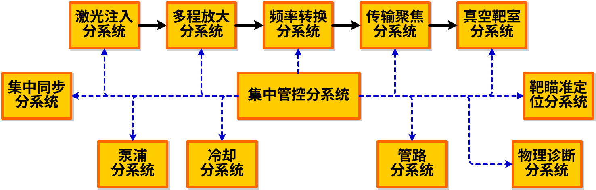

系统定位

集中管控系统采用总控-系统服务-设备服务三层控制结构，集中管控系统控制各分系统的系统服务软件。软件采用B/S架构，通过Tango实现总控、系统服务和设备服务之间的通信，完成发射流程的控制。控制拓扑图详见附件。

集中管控系统包括：运维任务管控组件、状态监控组件、控制环境组件。

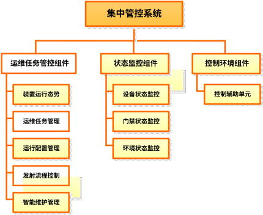

**集中管控系统**PBS图

- **运维任务管控组件**
运维任务管控组件主要服务于装置运行团队和物理实验方，该组件是实验平台运行流程的总体控制，指挥、调度装置其他系统完成发射任务；运维任务管控组件提供运行任务管理、运行及流程配置等功能，负责落实实验计划、运行参数配置、主导发射控制与执行等实验运行任务，实验后开展数据分析并生成发射报告，同时完成全过程数据采集与汇总，实现全域数据的集中存储与管理，并结合智能化技术手段达成实验任务的科学管控，有力保障实验任务顺利推进。运维任务管控组件功能范围如下图：

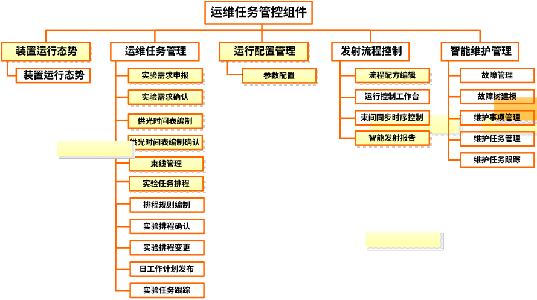

运维任务管控组件功能范围

运维任务管控组件实现装置运维任务全流程闭环管控，覆盖装置运行态势、运维任务管理、运行配置管理、发射流程控制和智能维护管理等方面，其中发射流程控制是运维任务管控组件的核心业务，系统内部各软件的信息传递、流程协调，通过运维任务管控组件和相关系统服务软件接口及各数据库接口完成衔接。

- 装置运行态势
装置运行态势展示今天运行任务、今日运维任务、当前发次参数信息、当前时间、实验任务多角度统计图、实验环境（包括：温度、湿度、氧浓度及真空度）和安全连锁信息。

- 运维任务管理
该模块规范实验需求申报流程，依据实验需求及实验平台运行状态、保障资源等情况进行智能排程，并支持动态调整实验任务，灵活配置实验参数，通过收集实验平台的故障信息，分析故障信息发生概率及严酷度来动态调整维护策略及运行任务配置。

- 运行配置管理
运行配置模块实现通过参数反演内核进行智能反演及参数配置，同时对实验报告进行管理；该模块调用SGX参数逆算接口输出激光反演配置参数，通过调节输入脉冲波形来使激光束线输出平顶脉冲或整形脉冲。

- 发射流程控制
流程控制模块提供流程配方编辑、运行控制工作台、束间同步时序控制等功能，支持灵活配置运行流程，具备束间同步时序数据处理和反馈功能，将示波器的三倍频在线测量数据进行偏差计算，偏差结果反馈给光纤种子源组件作为参考，人工调整AWG出光时序，完成束间时序同步。调度光纤种子源组件系统服务、集中同步分系统系统服务、再生与双程放大组件系统服务、多程放大分系统系统服务、开关驱动源组件、泵浦分系统、测量取样组件、频率转换分系统、靶瞄准定位分系统、LD靶分系统、真空靶室分系统、物理实验诊断分系统、集中同步分系统等系统完成实验平台发射任务。

- 智能维护管理
在发射控制流程中发生运行故障后，系统智能分析运行故障，给出预警提示、故障原因分析和处置建议，支持运行人员快速决策流程中断、继续或切换。全流程自动化调度执行。减少人工干预，发射任务执行后，通过数据分析处理后生成智能发射报告。

运维任务管控组件业务流程如下图所示：

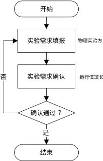

实验需求管理业务流程图

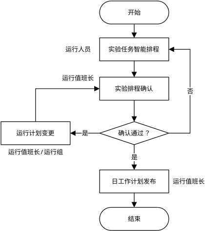

实验任务智能排程业务流程图

运维任务管控组件通过消息中间件Tango与其他系统实现接口数据交互与反馈，如光纤种子源组件系统服务、集中同步分系统系统服务、再生与双程放大组件系统服务、多程放大分系统系统服务、开关驱动源组件、泵浦分系统、测量取样组件、频率转换分系统、靶瞄准定位分系统、LD靶分系统、真空靶室分系统、物理实验诊断分系统、集中同步分系统以达到高效、可靠的实验任务计划、管理和调度功能。Tango的模块化设计允许各个设备和服务作为独立的模块进行开发、部署和管理。这种设计便于系统的扩展和维护，能够根据需求增加或替换模块，确保系统的灵活性和可扩展性。Tango支持多种数据格式和协议，能够灵活处理不同类型的数据，确保系统的适应性和兼容性。

运维任务管控组件与状态监控组件、控制环境组件之间通过内部接口进行数据类、控制类、状态类数据交互与反馈，如与状态监控组件、控制环境组件通过故障上报接口，接收其上报的故障信息。

集中管控系统各组件内部接口交互如下图所示：

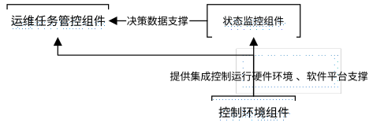

集中管控系统各组件内部交互示意图

运行模式：

根据实验平台实际发射流程及运行管控要求，装置常规发射流程可分为发射前准备、正式发射和发射后处理三个阶段，常规运行约10个月，维护期约2个月；常规情况下每日约开展10个发次，发次间隔控制在1个小时；装置LD靶发射流程区别于常规运行流程，无法实现不间断运行。设置运行岗位3人/班，运行平台实现不间断自动化、智能化运行。各分系统控制软件统一采用B/S架构，集成部署于统一运行平台，实现设备状态监视、参数配置、流程联动、报警管理和数据汇聚的集中化管控。参数配置由运行人员调整确认与自动化配置下发相结合的方式，关键参数由操作人员完成复核确认后，通过集中管控系统自动下发至各分系统。

各阶段的主要任务分别是：

- 发射前准备：完成靶定位和光束引导，设备进入待命状态（各设备上电、电光开关、测量挡位设置、进入能量/波形闭环状态、切换到单次），部分设备进行发射状态确认。
- 正式发射：装置在统一控制下，完成正式的打靶发射。具体环节包括确认真空状态后清场，打开音响警灯，激光注入和放大系统充电触发，发射过程中同步进行环境状态参数记录。
- 发射后处理：完成全系统的数据采集，形成发射报告；实验数据进入数据库，集中管控系统更新激光模型；开展片放吹扫洁净和灯箱充气冷却，完成对系统状态检查和故障排查；解除警报后设备退出待命状态（包括电光开关退高压、二极管电源下电等），使装置恢复到可再次发射的状态。日常运行流程及各阶段发射流程控制过程如下图所示：

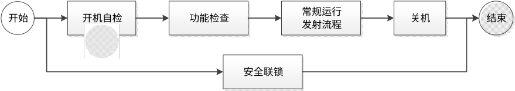

日常运行流程图

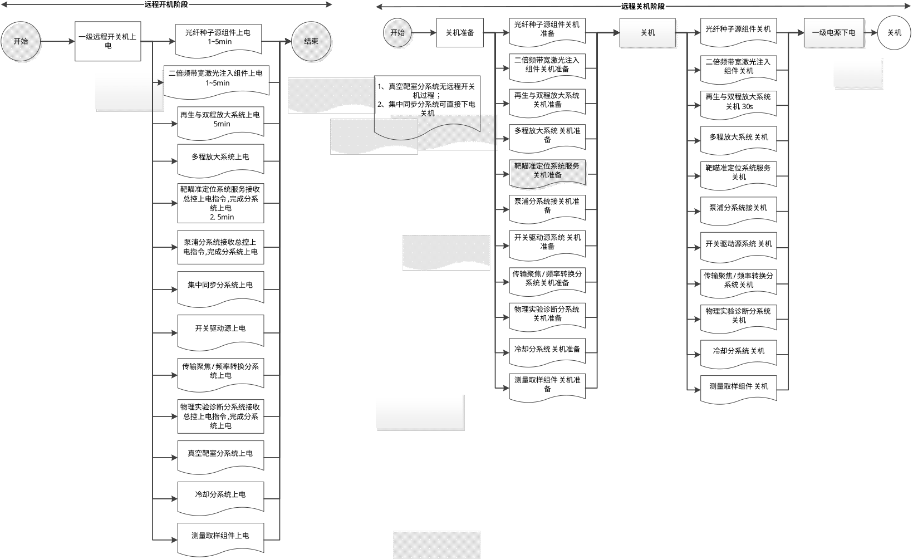

远程开/关机阶段流程图

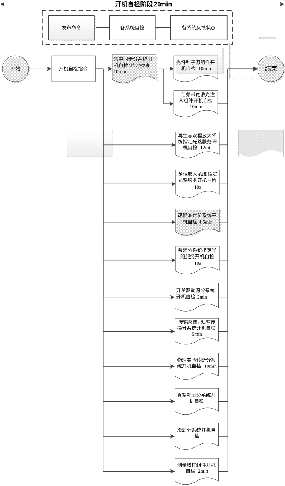

开机自检阶段流程图

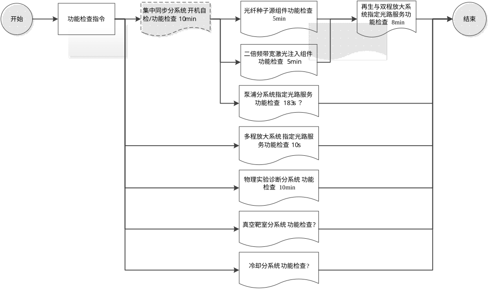

功能检查阶段流程图

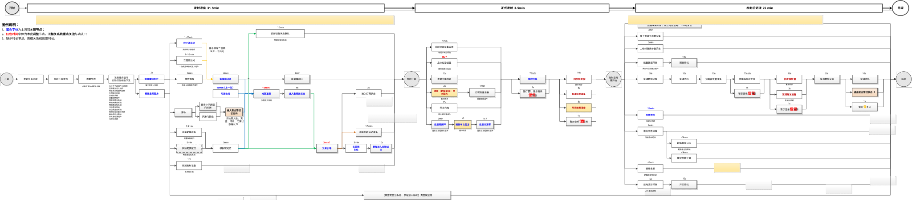

常规运行流程示意图

常规运行流程-发射准备阶段流程图

常规运行流程-发射阶段流程图

常规运行流程-发射后处理阶段流程图

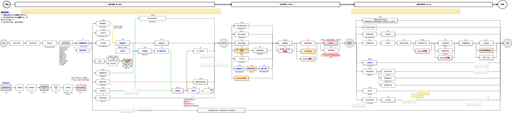

LD靶运行流程示意图

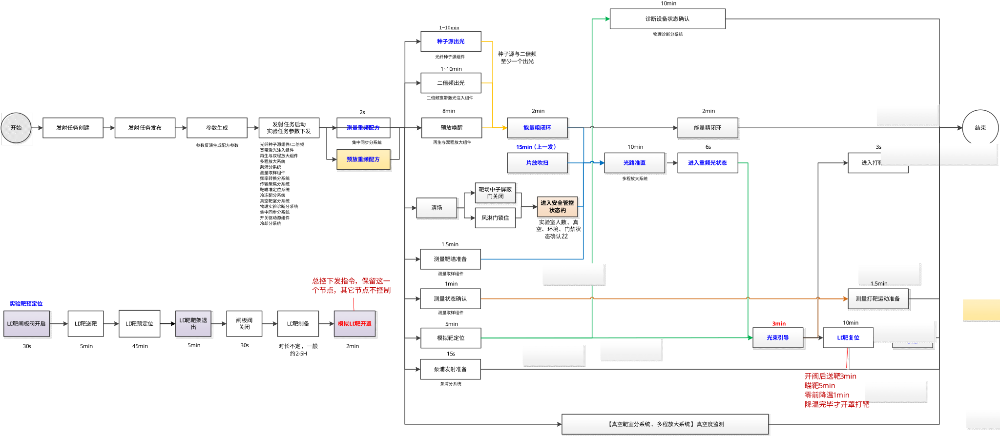

LD靶运行流程-发射准备阶段流程图

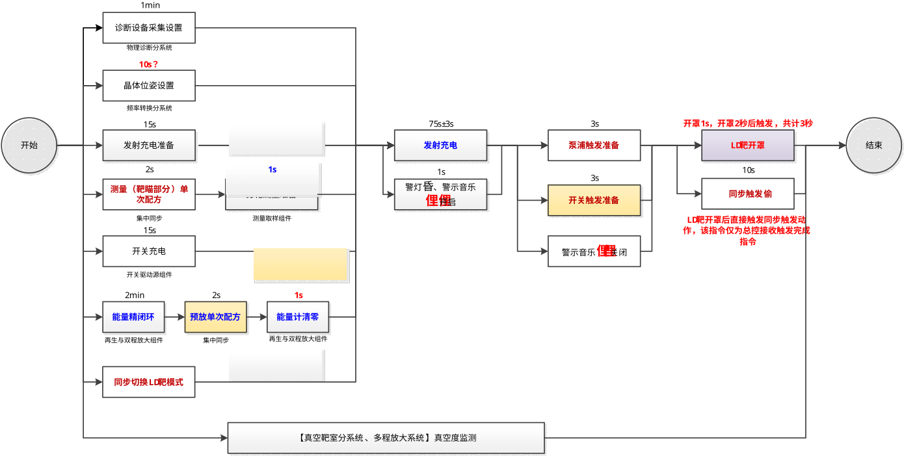

LD靶运行流程-发射阶段流程图

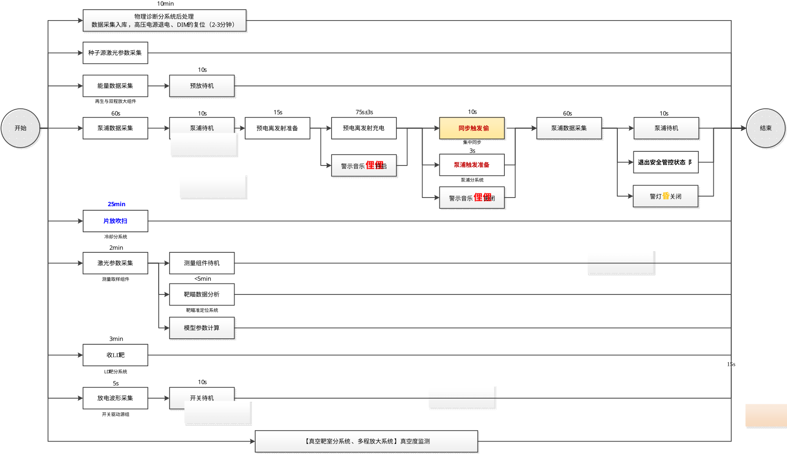

LD靶运行流程-发射后处理阶段流程图

为保障每天10个发次常规运行，每天第一发次的发射后处理阶段，冷空分系统的片放吹扫动作（15分钟）延续至下一发次的发射前准备阶段；每天最后一个发次将执行75分钟，发次结束后，系统自动执行片放吹扫、状态恢复和条件自检。

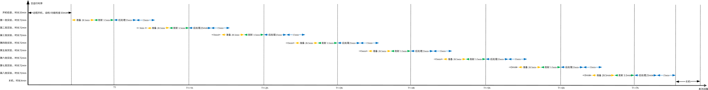

常规运行发射安排图

流程控制管理实现流程执行自动化控制，通过tango自动下发各类控制指令，如种子源出光、发射充电、光路准直等，其他系统/分系统服务接收控制指令，完成指定任务并反馈任务节点的执行状态（正常、异常），通过流程引擎驱动流转到下一个活动节点，触发下一步活动分支或活动状态，从而实现流程流转。发射流程控制通过标准化的流程编排和智能调度，大幅提升设备操作效率，减少人工干预，确保操作的一致性和可靠性，为激光设备的高效稳定运行提供全面的自动化保障。

流程调度执行过程中，系统具备异常监测、告警提示和辅助决策能力。当流程发生异常时，可及时提示异常信息，结合设备状态、报警信息及处置预案，为运行人员提供异常处理建议，并辅助判断后续流程是继续执行、暂停还是终止。

- **状态监控组件**
状态监控组件在实验平台运行过程中收集各系统中关键部件的运行情况、门禁状态、实验室环境状态等状态信息，对状态进行智能分析，充分评估实验平台健康度，指导实验平台安全可靠运行。

状态监控组件功能结构包括设备状态监控模块、门禁状态监控模块、环境状态监控模块、定制化看板模块、装置健康度评估模块。主要是对装置的系统及设备、门禁、环境等进行统一监控。状态监控功能范围如下图所示：

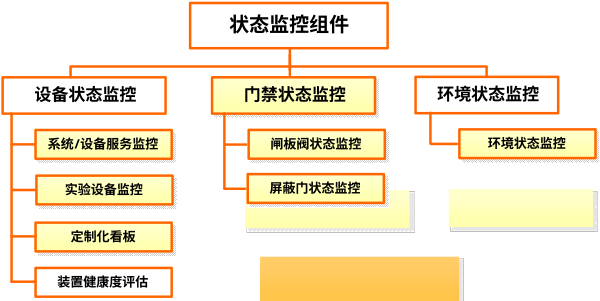

状态监控组件功能范围

- 设备状态监控模块
具备设备状态监控功能，包括系统服务及设备服务、泵浦系统电容器、关键诊断设备、电光开关、真空泵等的监控，按束线级→系统级→设备级（单一设备或器件）的从属关系呈现。

- 定制化看板模块
基于各类组件，通过拖拽的方式进行布局配置与显示配置、同时可以针对不同图表组件进行数据源的自定义配置，支持动态显示实验统计结果，可自由配置数据图层。

- 装置健康度评估模块
采集并分析实验平台其他系统中关键设备的健康度数据，建立评估模型评估实验平台整体健康度。

- 门禁状态监控模块
具备门禁状态监控功能，收集各系统与实验运行密切相关的各类关键阀门和门禁开关信息，界面化展示诊断DIM闸板阀、靶室闸板阀开关情况、屏蔽门开关情况等，并支持控制门禁开关状态，保障实验顺利开展和人员安全。

- 环境状态监控模块
具备环境状态监控功能，通过数据接口读取激光大厅、靶场等区域的温度、湿度、氧浓度等信息，并按监测点、监测对象查询显示，通过数据接口获取真空度数值，统计并界面化显示真空数值。

- **控制环境组件**
控制环境组件为实验平台各系统控制软件部署与运行提供集成控制软硬件环境，为实验平台安全高效运行提供远程开关机、安全联锁等软件服务。

控制环境组件软件功能范围如下图所示：

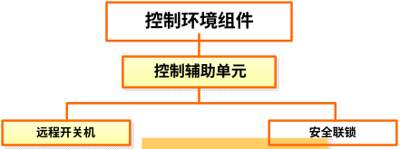

控制环境组件功能范围

## 被开发软件的功能

运维任务管控组件：功能模块主要包括装置运行态势、运维任务管理、运行配置管理、发射流程控制、智能维护管理。

状态监控组件：功能模块主要包括门禁状态监控、设备状态监控、环境状态监控。

控制环境组件：功能包括控制辅助单元。

集中管控系统各组件的功能模块包含的具体功能详见下表，其中需求标识命名规则：集中管控系统（JZGK）_组件（YWRWGK）_序号（001）。

集中管控系统需求功能表

| 组件名称 | 模块名称 | 需求标识 | 需求名称 |
| --- | --- | --- | --- |
| 运维任务管控组件 | 装置运行态势 | JZGK_YWRWGK_001 | 装置运行态势 |
|  | 运维任务管理 | JZGK_YWRWGK_002 | 实验需求申报 |
|  |  | JZGK_YWRWGK_003 | 实验需求确认 |
|  |  | JZGK_YWRWGK_004 | 供光时间表编制 |
|  |  | JZGK_YWRWGK_005 | 供光时间表编制确认 |
|  |  | JZGK_YWRWGK_006 | 束线管理 |
|  |  | JZGK_YWRWGK_007 | 实验任务排程 |
|  |  | JZGK_YWRWGK_008 | 排程规则编制 |
|  |  | JZGK_YWRWGK_009 | 实验排程确认 |
|  |  | JZGK_YWRWGK_010 | 实验排程变更 |
|  |  | JZGK_YWRWGK_011 | 日工作计划发布 |
|  |  | JZGK_YWRWGK_012 | 实验任务跟踪 |
|  | 运行配置管理 | JZGK_YWRWGK_013 | 参数配置 |
|  | 发射流程控制 | JZGK_YWRWGK_014 | 流程配方编辑 |
|  |  | JZGK_YWRWGK_015 | 运行控制工作台 |
|  |  | JZGK_YWRWGK_016 | 束间同步时序控制 |
|  |  | JZGK_YWRWGK_017 | 智能发射报告 |
|  | 智能维护管理 | JZGK_YWRWGK_018 | 故障管理 |
|  |  | JZGK_YWRWGK_019 | 故障树建模 |
|  |  | JZGK_YWRWGK_020 | 维护事项管理 |
|  |  | JZGK_YWRWGK_021 | 维护任务管理 |
|  |  | JZGK_YWRWGK_022 | 维护任务跟踪 |
| 状态监控组件 | 设备状态监控 | JZGK_ZTJK_001 | 系统/设备服务监控 |
|  |  | JZGK_ZTJK_002 | 实验设备监控 |
|  |  | JZGK_ZTJK_003 | 定制化看板 |
|  |  | JZGK_ZTJK_004 | 装置健康度评估 |
|  | 门禁状态监控 | JZGK_ZTJK_005 | 闸板阀状态监控 |
|  |  | JZGK_ZTJK_006 | 屏蔽门状态监控 |
|  | 环境状态监控 | JZGK_ZTJK_007 | 环境状态监控 |
| 控制环境组件 | 控制辅助单元 | JZGK_KZHJ_001 | 远程开关机 |
|  |  | JZGK_KZHJ_002 | 安全联锁 |

## 实现语言

- Python、Java语言。

## 用户特点

实验平台运行岗位配置表

| 序号 | 角色名称 | 主要职责 |
| --- | --- | --- |
| 1 | 运行负责人 | 参与并落实运维计划、发射排程，确认打靶参数配置，运维任务发布和跟踪；数据使用管理；实验准备和实施状态跟踪检查；装置运行保障条件分析汇总、上报；发射技术状态评估、决策，排程调整审批；组织年度运维总结；运维管理系统维护 |
| 2 | 值班长 | 日常运维管理，落实发射/维护任务，分配当日运维人员；组织班前会、班后会进行运维协调；日常安全检查；组织完成发射报告；装置技术状态分析 |
| 3 | 总控运行岗 | 远程开关机；激光发射过程中的语音通讯，警灯警报控制，安全联锁控制；运行参数预设和配置；激光参数调控；发射流程控制、状态监控；数据统计分析、智能分析；管控系统维护。 |

在装置运行过程中，用户根据实际情况可能需求对运行计划或运行参数进行一定调整，装置运行团队可根据具体情况进行部分调整，但实验排程调整需经过一定的更改和确认流程。实验计划的调整、更改和确认采取分级授权的模式，分为装置管理级负责人和装置现场级负责人（运行负责人或值班长）两级。

## 一般约束

- 操作系统：Ubuntu 46.04及以上版本；
- 数据库系统：南大通用数据库GBase 8s V8.8；
- 开发工具：VScode、Idea；
- 软件版本控制工具：SVN；
- 软件中间件平台：Tango9.5及以上；
- 并行操作的用户数：系统各软件同时只有一个用户操作生效；
- 其他用户接口限制：具备权限管理功能，分为管理员权限和授权用户权限，可进行相应操作；
- 操作人员技术水平和培训的要求：软件应简单易用，操作人员须具备基本的数据分析技能，经过培训即可上岗操作；
- 网络环境：工控局域网，与互联网物理隔离。

# 功能需求

## 运维任务管控组件

### 装置运行态势

#### 引言

装置运行态势展示今天运行任务、今日运维任务、当前发次参数信息、当前时间、实验任务多角度统计图、实验环境（包括：温度、湿度、氧浓度及真空度）和安全连锁信息。

#### 输入要求

无。

#### 处理要求

- 查询今日实验任务、维护任务；
- 查询正在进行的发次，展示发次相关信息；
- 从多角度统计查询今年实验任务情况。
- 查询实验环境监测值，包括：温度、湿度、氧浓度及真空度。
- 查询安全联锁相关信息。

#### 输出要求

- 页面以列表形式展示今日实验任务信息，并在当天凌晨4点更换展示，实验任务信息包括实验名称（链接）、编号、预计发射时间，束线集合（如果有束线缺失情况）等信息；
- 页面以列表形式展示今日维护任务信息，包括任务编号、任务名称、维护级别、状态等信息；
- 页面以表单形式展示当前发次信息，展示当前发次信息：包括发次编号，实验名称，编号，开始时间，当前状态，总能量等参数；
- 从多角度统计今年实验任务情况，以柱状图、饼状图等图表显示。
- 显示实验环境当前温度、湿度、氧浓度及真空度。
- 显示安全联锁相关信息，如屏蔽门开关状态，实验现场人数。

### 运维任务管理

#### 实验需求管理

实验需求管理规范实验需求申报流程，主要包括实验需求填报及实验需求确认两个功能模块，物理方填报实验需求，运行组进行实验需求确认。

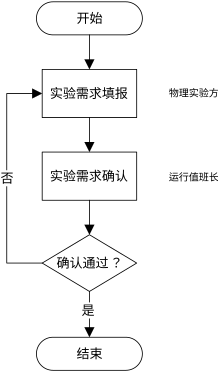

实验需求管理业务流程图

##### 实验需求申报

###### 引言

实验需求申报实现了物理需求提出方在实验运行前完成实验需求填报，并提交物理值班长审批确认。实验需求申报功能具备新建、保存、删除、修改、查询、提交等功能，用户只可以操作自己新增的需求，操作过程日志记录。

###### 输入要求

- 数据输入：
实验需求填报参数具体见下表：

实验需求参数

| 模块 | 参数 | 描述 | 说明 | 是否必填 | 备注 |
| --- | --- | --- | --- | --- | --- |
| 实验需求 | 实验名称 | 输入项 |  | 是 |  |
|  | 实验类型 | 单选 | 打靶、调试 | 是 |  |
|  | 实验属性 | 单选 | 程序校验、技术发展、基础研究、验证判断、 | 否 |  |
|  | 实验类别 | 下拉选择 | 激光实验、其他实验 | 否 |  |
|  | 实验时间 | 日期 | 实验日期 | 否 |  |
|  | 能量水平 | 参数字典 | 高、中、低 | 是 |  |
|  | 实验目标 | 输入项 |  | 否 |  |
|  | 实验内容 | 输入项 |  | 否 |  |
|  | 合格判据 | 输入项 |  | 否 |  |
|  | 理论预期 | 输入项 |  | 否 |  |
|  | 理论设计结论 | 输入项 |  | 否 |  |
|  | 其他信息 | 输入项 |  | 否 |  |
|  | 备注 | 输入项 |  | 否 |  |
| 激光需求 | 束线 | 字典，勾选 | 勾选约束，支持批量勾选，添加图形化界面提醒 | 是 |  |
|  | 波长 | 参数字典 | 二倍频/三倍频 | 是 | 束线级（每束一个） |
|  | 二倍频光谱（nm） | 数字 |  | 否 |  |
|  | 带宽（%） | 数字 |  | 否 |  |
|  | 波形 | 参数字典 | 整形（带数据文件、图形展示）、方波（图形展示） | 是 | 束线级（每束一个） |
|  | 束间能量不平衡度（%） | 数字 | 默认值20% | 是 |  |
|  | 总能量偏差（%） | 数字 | 默认值20% | 是 |  |
|  | 单束能量偏差（%） | 数字 | 默认值20% | 是 |  |
|  | 功率不平衡度（%） | 数字 | 默认值20% | 是 |  |
|  | 总功率偏差（%） | 数字 | 默认值20% | 是 |  |
|  | PS匀滑 | 参数字典 |  | 否 | 束线级（每束一个） |
|  | CPP整形 | 参数字典 |  | 否 | 束线级（每束一个） |
| 靶需求 | 靶类型 | 参数字典 | 常温靶、LD靶，默认常温靶 | 是 |  |
|  | 靶编号 | 输入字符段 | 可带图片 | 是 |  |
|  | 直径（μm） | 数字 |  | 是 |  |
|  | 弹着点坐标（μm） | (a,b) | 两个输入值，默认（0,0） | 是 | 束线级（每束一个） |
|  | 离焦量（μm） | 数字 | 默认0 | 是 | 束线级（每束一个） |
| 物理诊断（选择勾选） | 诊断设备 | 设备列表勾选 | 数据对接 | 是 |  |
|  | 诊断设备方位 | 真空靶室功能法兰编号 | 数据对接 | 是 | 诊断设备级（每个设备一组） |
|  | 预计物理参数 | 物理量、数值、单位 | 数据对接 | 是 | 诊断设备级（每个设备一组） |
| 危险源 | 源项 | 勾选参数字典 | 聚变中子源、x射线、γ射线，默认勾选：x射线、γ射线； | 是 |  |
|  | 中子产额 | 输入框 | 科学计数法 | 是 | 可从物理参数中获取 |

- 命令输入：
用户输入“新增”“保存”“编辑”“删除”“查询”“提交”等命令。

###### 处理要求

- 新增实验需求，录入实验参数，并保存至数据库；
- 按实验名称、实验类别、实验日期，状态等条件查询实验需求信息，查询结果以列表形式分页展示；
- 用户只可对自己新增的实验需求进行编辑，删除，提交，查询不做限制。
- 对处于未提交或已驳回状态的实验需求进行编辑、删除和提交，提交后，系统将数据流转至实验需求确认模块，供后续审批确认。
- 新增、编辑、删除、提交操作留痕，日志保存至数据库。

###### 输出要求

- 页面展示实验需求当前状态，包括“编辑中”“已提交”“已驳回”“已确认”；
- 页面以列表形式展示实验需求申报信息；
- 实验需求申报参数保存至数据库后，页面提示“保存成功”；
- 删除实验需求成功或失败后，页面提示“删除成功”或“删除失败”。
- 提交实验需求成功后，页面提示“提交成功”，并生成提交记录。

##### 实验需求确认

###### 引言

由装置运行组长在系统中对物理方提交的实验需求进行确认。装置运行组长依据装置现状，对实验需求进行确认或驳回；驳回时需填写驳回意见。

###### 输入要求

- 数据输入
实验需求确认时需在界面上输入或者选择的数据项包括：

1.已提交的实验需求信息；

2.确认意见；

3.确认说明或驳回说明。

- 命令输入
用户输入“查询”“查看”“确认”“提交”等命令。

###### 处理要求

- 按实验名称、任务编号、预计开始日期等条件查询实验需求确认信息，查询结果按确认状态（未确认、已确认、驳回），时间倒序分页展示；
- 查看已提交实验需求的详细信息；
- 确认或驳回实验需求，驳回时需填写驳回意见；提交确认结果，更新实验需求确认状态；对确认、驳回等操作进行记录，并将确认信息保存至数据库；已驳回的实验需求支持物理方再次编辑并重新提交确认。
- 确认操作留痕，日志保存至数据库。

###### 输出要求

- 页面展示当前状态，包括“待确认”“已确认”“已驳回”；
- 页面以列表形式展示实验需求确认信息；
- 确认或驳回成功后，页面提示“确认成功”或“驳回成功”；
- 确认或驳回失败后，页面提示“确认失败”或“驳回失败”；

#### 实验任务智能排程

实验任务智能排程实现实验任务的排程、确认、变更、发布和跟踪功能，完成实验任务从创建到跟踪的完整闭环。

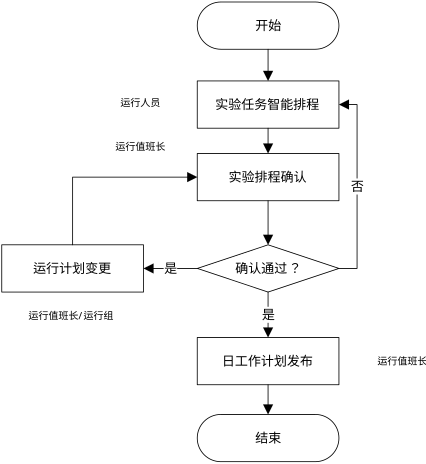

实验任务智能排程业务流程图

##### 供光时间表编制

###### 引言

编制供光时间表用于安排的年度运行时间、维护时间以及假期时间，为之后的实验需求和实验任务智能排程中实验时间的选择提供参考。

###### 输入要求

- 数据输入
供光时间表编制参数具体见下表：

供光时间表编制参数

| 字段名 | 字段id | 说明 |
| --- | --- | --- |
| 年份 | year | 运行计划年份 |
| 实验天数 | experiment_days | 实验天数统计 |
| 假期天数 | vacation_days | 假期天数统计 |
| 维护天数 | maintenance_days | 维护天数统计 |
| 状态 | status | 暂存/审批中/通过 |
| 审批人 | approval_user | 审批人 |
| 提审时间 | submit_time | 提审时间 |
| 审批时间 | approval_time | 审批时间 |

- 命令输入
用户输入“新增”“保存”“编辑”“删除”、“查询”“提交”“常规编排”“自定义编排等命令”“发布”。

###### 处理要求

- 新增供光时间表编制，录入供光参数，并保存至数据库；
- 支持常规编排与自定义规则编排供光安排，常规编排默认周一至周五为运行日，周六为维护日，周日为休息日；自定义规则编排支持按照时间点、时间段统一编排运行/维护/休息日安排；
- 按年度，状态等条件查询供光信息，查询结果以列表形式分页展示；
- 对处于未发布状态的供光信息可进行编辑、删除和发布。
- 新增、编辑、删除、提交、发布操作留痕，日志保存至数据库。

###### 输出要求

- 页面展示光时间表编制信息当前状态，包括“编辑中”“已确认”“已驳回”；
- 页面以列表形式展示光时间表汇总编制信息，详情页面以日历形式展示编排内容；
- 供光时间表编制信息保存至数据库后，页面提示“保存成功”；
- 删除供光时间表编制信息成功或失败后，页面提示“删除成功”或“删除失败”。
- 提交供光时间表编制信息成功后，页面提示“提交成功”，并生成提交记录。
- 确认通过的供光时间表编制信息可进行发布，发布成功后，页面提示“发布成功”，并生成发布记录。

##### 供光时间表编制确认

###### 引言

由装置运行组长在系统中对物理方提交的供光时间表编制进行确认。装置运行组长依据装置现状，对供光时间表编制进行确认或驳回；驳回时需填写驳回意见。

###### 输入要求

- 数据输入
供光时间表编制确认时需在界面上输入或者选择的数据项包括：

1.已提交的供光时间表编制信息；

2.确认意见；

3.确认说明或驳回说明。

- 命令输入
用户输入“查询”“查看”“确认”“提交”等命令。

###### 处理要求

- 按年度、状态条件查询供光时间表编制确认信息，查询结果按确认状态（未确认、已确认、驳回），时间倒序分页展示；
- 查看已提交供光时间表编制的详细信息；
- 确认或驳回供光时间表编制，驳回时需填写驳回意见；提交确认结果，更新供光时间表编制确认状态；对确认、驳回等操作进行记录，并将确认信息保存至数据库；已驳回的供光时间表编制信息支持物理方再次编辑并重新提交确认。
- 确认操作留痕，日志保存至数据库。

###### 输出要求

- 页面展示当前状态，包括“待确认”“已确认”“已驳回”；
- 页面以列表形式展示供光时间表编制信息；
- 确认或驳回成功后，页面提示“确认成功”或“驳回成功”；
- 确认或驳回失败后，页面提示“确认失败”或“驳回失败”；

##### 束线管理

###### 引言

束线管理用于每日更新装置所有束线的可用性，并对排程、任务进行提醒，不做强校验。

###### 输入要求

- 数据输入
束线管理需在界面上输入或者选择的数据项包括：

1.束线编号，只读项。

2.所在扇区，只读项。

3.束线状态（下架、正常、维护中），单选项

4.说明，选填项。

- 命令输入
用户输入“查看”“保存”等命令。

###### 处理要求

- 每日实验运行任务开始前，或当天实验完成后更新与维护束线状态信息和备注信息，并保存至数据库，保存后，排程与运行任务执行过程中系统对束线的可用性进行检查，并给予页面提醒；
- 束线管理，操作留痕，日志保存至数据库。

###### 输出要求

- 页面按照所在扇区展示束线的束线编号，束线状态和备注信息；
- 编辑束线状态和备注信息，保存束线管理至数据库后，页面提示“保存成功”；

##### 实验任务排程

###### 引言

由运行组成员在系统中开展实验任务排程。实验任务智能排程以周日历表为主要展示形式，默认展示当前周，用于在实验任务运行前对已确认的实验需求进行任务编排。系统支持自动生成实验任务排程方案，并支持人工调整，以提高资源利用率和实验执行效率。

实验任务智能排程功能包括智能排程参数配置、排程结果展示、发射参数维护以及排程查询等。

排程结果支持日历视图+列表视图展示，具备保存、删除、修改、查询、提交等操作能力。

###### 输入要求

- 数据输入：
实验任务排程数据表

| 模块 | 参数 | 描述 | 说明 | 是否必填 | 备注 |
| --- | --- | --- | --- | --- | --- |
| 任务 | 发次编号 | SY20260205XXX(001~999) | 每年累计编号、自动生成，任务单唯一ID（主键） | 是 |  |
|  | 预计打靶日期 | 20260205 |  | 是 |  |
|  | 预计打靶时间 | 10:10 |  | 是 |  |
|  | 任务类型 | 参数字典 | 调试（WH）、维护（WH）、物理实验（SY） | 是 |  |
|  | 能量水平 | 参数字典 | 高、中、低 | 是 | 从排程处继承 |
|  | 任务编号 | WH2026XXXX(0001~9999)SY2026XXXX(0001~9999) | 全年累计编号、自动生成，依据实验是否实际打靶生成 | 是 |  |
| 激光 | 束线 | 字典，勾选 | 勾选约束，支持批量勾选，添加图形化界面提醒 | 是 |  |
|  | 总能量（J） | 数字 | 单束能量求和 | 是 |  |
|  | 单束能量（J） | 数字 | 范围（0~500），阈值可配置 | 是 | 束线级（每束一个） |
|  | 波长 | 参数字典 | 二倍频/三倍频 | 是 | 束线级（每束一个） |
|  | 脉冲延时（ns） | 数字 |  | 是 | 束线级（每束一个） |
|  | 二倍频光谱（nm） | 数字 |  | 否 |  |
|  | 带宽（%） | 数字 |  | 否 |  |
|  | 波形 | 参数字典 | 整形（带数据文件、图形展示）、方波（图形展示）， | 是 | 束线级（每束一个） |
|  | 脉宽（ns） | 数字 | 小数点后一位 | 是 | 束线级（每束一个） |
|  | 峰值功率（TW） | 数字 | 小数点后两位 | 是 | 束线级（每束一个） |
|  | 束间能量不平衡度（%） | 数字 | 默认值20% | 是 |  |
|  | 总能量偏差（%） | 数字 | 默认值20% | 是 |  |
|  | 单束能量偏差（%） | 数字 | 默认值20% | 是 |  |
|  | 功率不平衡度（%） | 数字 | 默认值20% | 是 |  |
|  | 总功率偏差（%） | 数字 | 默认值20% | 是 |  |
|  | PS匀滑 | 参数字典 |  | 否 | 束线级（每束一个） |
|  | CPP整形 | 参数字典 |  | 否 | 束线级（每束一个） |
| 靶 | 靶类型 | 参数字典 | 常温靶、LD靶，默认常温靶 | 是 |  |
|  | 靶编号 | 输入字符段 | 可带图片 | 是 |  |
|  | 直径（μm） | 数字 |  | 是 |  |
|  | 弹着点坐标（μm） | (a,b) | 两个输入值，默认（0,0） | 是 | 束线级（每束一个） |
|  | 离焦量（μm） | 数字 | 默认0 | 是 | 束线级（每束一个） |
| 物理诊断 | 诊断设备 | 设备列表勾选 |  | 是 |  |
|  | 诊断设备方位 | 真空靶室功能法兰编号 | 字段 | 否 | 诊断设备级（每个设备一组） |
|  | 预计物理参数 | 物理量、数值、单位 |  | 是 | 诊断设备级（每个设备一组） |
| 危险源 | 源项 | 勾选参数字典 | 聚变中子源、x射线、γ射线，默认勾选：x射线、γ射线； | 是 |  |
|  | 中子产额 | 输入框 | 科学计数法 | 是 | 可从物理参数中获取 |

- 命令输入：
用户输入“保存”“删除”“修改”“查询”“提交”等命令。

###### 处理要求

- 展示已确认的实验发次和周计划日历，支持按照排程规则进行实验任务初次编排，如将实验发次编排至指定日期，默认每日最大排程8发次，且支持每日默认发次数量配置；
- 支持手动调整当天发次的排程顺序；
- 对已排程的实验任务维护发射参数，发射参数默认继承实验需求相关参数，并支持编辑、保存和提交，其中激光参数配置支持图形化汇总展示本发次使用的束线、波形；
- 按发次编号、能量水平、任务类型、日期等条件查询排程信息，查询结果支持查看当前排程及历史排程计划；

###### 输出要求

- 系统以周日历形式展示所选日期范围内生成的运行任务，对于未按照实验时间执行的运行任务，支持统一展示实验需求名称、延期天数、拖拽重新手动编排排程；
- 系统以日历表形式展示排程信息，其中编辑中以黄色标识、已确认以蓝色标识、已完成以绿色标识；
- 点击日历表中的实验需求名称，可查看对应运行任务参数信息；
- 在实验任务智能排程任务列表页面点击“实验名称”，可查看实验需求详情信息；
- 实验任务详情页面展示发射目标参数分解详细信息；
- 约束规则校核成功，界面提示“规则校验成功”；
- 约束规则校核失败，界面提示“规则校验冲突，请调整后重新校验！”；
- 智能排程参数配置完成后，界面提示“编辑成功”；
- 实验任务智能排程完成后，界面提示“编排成功”；
- 实验任务发射参数保存至数据库，界面提示“保存成功”；
- 删除实验任务成功后，界面提示“删除成功”，且列表页面查询不到该信息；
- 提交实验任务成功后，界面提示“提交成功”，并生成提交记录；
- 实验任务提交后，跟踪页面展示确认流程进程，包括确认状态和确认意见。

##### 排程规则编制

###### 引言

排程规则编制，其核心是构建一个可灵活定义、逻辑清晰且可被算法解析的规则体系，为实验任务智能排程及排程校验提供依据。

###### 输入要求

- 数据输入
实验排程规则编制时需在界面上输入或者选择的数据项包括：规则名称、规则描述、是否启用、触发条件、约束条件、提示信息。

- 命令输入
用户输入“查询”“查看”“保存”“禁用”“启用”“删除”等命令。

###### 处理要求

- 新增排程规则编制，录入排程规则，并保存至数据库；
- 按规则名称，状态等条件查询排程规则编制信息，查询结果以列表形式分页展示，如运行日按照每日八个发次进行编排、依据实验需求的预计打靶时间默认编排运行排程等；
- 保存、禁用、启用、删除操作留痕，日志保存至数据库。
- 实验需求确认通过后，查询启用的排程规则，通过规则引擎，实现实验任务智能排程。
- 对实验任务排程进行调整时，需要通过排程规则引擎的校验，校验不通过时，给予提醒运行人员，进行手动调整，并进行提交确认。

###### 输出要求

- 页面以列表形式展示排程规则编制信息，当前状态，包括“禁用”“启用”；
- 排程规则编制信息保存至数据库后，页面提示“保存成功”；
- 删除排程规则编制信息成功或失败后，页面提示“删除成功”或“删除失败”。

##### 实验排程确认

###### 引言

由装置运行组长在系统中对实验任务排程结果或变更结果进行确认。运行组长依据装置现状，对实验任务排程结果进行确认或驳回；驳回时需填写驳回意见。

###### 输入要求

- 数据输入
实验需求确认时需在界面上输入或者选择的数据项包括：

1.已提交的实验排程信息或已提交的实验排程变更信息；

2.确认意见；

3.确认说明或驳回说明。

- 命令输入
用户输入“查询”“查看”“处理”“确认”等命令。

###### 处理要求

- 按实验名称、实验类别、能量、发次、状态等条件查询实验任务排程确认信息，查询结果按未确认、已确认、已驳回分类，并按时间倒序分页展示，支持批量确认一天的实验发次；
- 查看已提交实验任务排程的详细信息，支持查看排程发射参数信息和对应实验需求信息；
- 对实验任务排程进行确认或驳回处理，驳回时需填写驳回意见；
- 提交确认结果，更新实验任务排程确认状态；
- 确认/驳回操作留痕，日志保存至数据库。
- 对已驳回的实验任务排程，支持运行组再次调整并重新提交。

###### 输出要求

- 页面展示当前状态，包括“待确认”“已确认”“已驳回”；
- 页面以列表形式展示实验任务排程确认信息；
- 确认或驳回成功后，页面提示“确认成功”或“驳回成功”；
- 确认失败后，页面提示“确认失败”；

##### 实验排程变更

###### 引言

由装置运行组长在系统中对已确认的实验任务排程进行变更。装置运行组长依据装置现状，对实验任务排程的发射参数、运行日期等内容进行调整，并提交变更信息进行审批。

###### 输入要求

- 数据输入
实验排程变更时需在界面上输入或者选择的数据项包括：

1.已确认的实验任务排程信息；

2.变更内容，包括发射参数、运行日期等；

3.变更说明。

- 命令输入
用户输入“查询”“查看”“变更”“保存”“提交”等命令。

###### 处理要求

- 按实验名称、任务编号、任务开始时间等条件查询实验任务排程变更信息，查询结果按已确认、变更中、已变更分类，并按时间倒序分页展示；
- 查看已确认实验任务排程的详细信息，支持查看发射参数信息和对应实验需求信息；
- 对已确认的实验任务排程进行变更，支持修改发射参数和排程日期，并保存变更记录；
- 对变更中的实验任务排程进行锁定，变更完成前不可进行其他操作；
- 提交变更后的实验任务排程，供后续审批确认；
- 对实验任务排程变更生成历史版本记录，并将变更信息保存至数据库。

###### 输出要求

- 页面展示当前状态，包括“已确认”“变更中”“已变更”；
- 页面以列表形式展示实验任务排程变更信息；
- 页面以列表形式展示实验任务排程历史版本信息；
- 变更成功后，页面提示“变更成功”；
- 变更失败后，页面提示“变更失败”；
- 提交后，页面提示“提交成功”或“提交失败”；

##### 日工作计划发布

###### 引言

由装置运行组长在系统中对已完成确认的实验任务排程进行发布。系统支持提前一天形成次日打靶任务安排，包括日工作计划表和打靶通知单。装置运行组长依据装置现状，对实验排程计划进行发布。

###### 输入要求

- 数据输入
日工作计划发布时需在界面上输入或者选择的数据项包括：

- 已确认的实验任务编排信息；
- 任务计划开始时间，任务计划完成时间，任务描述。
3.发布。

- 命令输入
用户输入“查询”“查看”“发布”“提交”等命令。

###### 处理要求

- 默认展示当天的运行任务，延期任务，已发布任务和今日待处理任务。按任务名称、任务状态、任务编号、任务类型、打靶日期、确认时间等条件查询日工作计划发布信息，查询结果按待发布、已发布分类，并按时间倒序分页展示；
- 查看待发布日工作计划的详细信息，支持查看日工作计划详情、变更确认记录、发射参数概要及排程变更历史；
- 按日期查看指定日期的日工作计划信息，并支持快速查看当日工作计划列表；
- 发布已确认的实验任务；
- 提交发布结果，生成正式日工作计划和打靶通知单，并触发参数反演流程，形成正式可执行的实验发射参数，并将发布信息保存至数据库；
- 记录发布等操作日志；

###### 输出要求

- 页面展示当前状态，包括“待发布”“已发布”；
- 页面以列表形式展示日工作计划发布信息；
- 发布成功后，页面提示“发布成功”；
- 发布失败后，页面提示“发布失败”；
- 生成已发布的日工作计划正式清单和打靶通知单；
- 页面展示日工作计划发布记录，包括发布人、发布时间、发布意见、驳回说明；
- 发布信息录入数据库。

##### 实验任务跟踪

###### 引言

由运行负责人在系统中对已发布的运行任务进行跟踪。运行负责人可查看任务详情，并依据实验任务实际执行情况对任务进行取消、顺延、暂停、继续、完成等处理，并依据实验具体结果，跟踪完成驱动器、诊断、制靶三个模块的实验完成情况，供后续统计使用。

###### 输入要求

- 数据输入
实验任务跟踪时需在界面上输入或者选择的数据项包括：

1.查询条件：发次编号、任务内容、任务状态、任务计划时间、任务完成时间等；

2.任务状态处理信息：任务状态、处理意见等；

3.任务基础信息：发次编号、任务内容、任务计划时间、任务完成时间。

- 命令输入
用户输入“查询”“重置”“查看”“取消”“顺延”“暂停”“完成”等命令。

###### 处理要求

- 按发次编号、任务内容、任务状态、任务计划时间、任务完成时间等条件查询实验任务信息，查询结果以列表形式展示；
- 查看已发布运行任务的详细信息；
- 对已发布运行任务进行取消、顺延、暂停、继续、完成等状态处理，并更新任务状态；
- 对任务跟踪和状态处理操作进行记录，并将处理结果保存至数据库。

###### 输出要求

- 页面以列表形式展示实验任务跟踪信息，包括发次编号、任务内容、任务状态、任务计划时间、任务完成时间等；
- 页面展示任务当前状态，包括“已发布”“已暂停”“已顺延”“已取消”“已完成”等；
- 查看任务详情时，页面展示任务详细信息；
- 任务状态处理成功后，页面提示“跟踪成功”；
- 任务状态处理失败后，页面提示“跟踪失败”；
- 任务跟踪记录和状态变更记录录入数据库。

### 运行配置管理

运行配置模块采用智能算法反演出激光配置参数，支持灵活配置实验参数。

#### 参数配置

##### 引言

参数配置为实验任务形成可执行参数配置结果。实验参数智能反演基于已构建的虚拟光路，对激光在预放大前的脉冲整形与能量控制过程进行仿真，并通过参数反演算法，根据用户设定的预期输出能量与波形，自动调整输入参数，最终获取满足设计要求的输出激光参数。系统支持对基频和三倍频波形进行反演分析给出实验任务配方参数，反演时长预计5分钟。装置运行团队依据实验参数智能反演结果，对实验任务的配方参数进行设置，并形成可执行的实验参数配置结果。

##### 输入要求

- 数据输入
实验参数智能反演时需在界面上输入或者选择的数据项包括：

1.已构建完成且已发布的虚拟光路信息；

2.起始元件ID、结束元件ID；

3.预期输出能量、预期时间切片、输入能量范围、收敛阈值、最大迭代次数、收敛系数等反演参数；具体数据项见下表。

基频反演数据输入

| 序号 | 数据名称 | 数据类型 | 显示属性 | 是否必填 | 默认值 | 备注 |
| --- | --- | --- | --- | --- | --- | --- |
|  | 类型 | string | type | 否 | basefreq |  |
|  | 打靶要求 |  |  |  |  |  |
|  | 预期能量输出[J] | string | Expected_E | 是 | 1.0 | 期望输出能量 |
|  | 预期时间切片 | string | Nt | 是 | 0 | 时间分辨率控制参数 |
|  | 波形读入文件 | string | savefile_in | 是 | ./It_in.txt | 输入波形文件路径 |
|  | 存储输出文件 | string | savefile_out | 是 | ./It_out.txt | 输出波形文件路径 |
|  | 迭代参数设置 |  |  |  |  |  |
|  | 起始能量 | string | E_in | 是 | 1e-4 | 反演计算的起始输入能量 |
|  | 迭代次数 | string | MaxIterationTimes | 是 | 1000 | 最大迭代次数限制 |
|  | 收敛系数 | string | coef | 是 | 1.3 | 迭代收敛控制系数 |
|  | 收敛要求 | string | ratio | 是 | 1e-2 | 收敛判断阈值 |
|  | 运行参数设置 |  |  |  |  |  |
|  | 起始元件id | string | ModuleIdStart | 是 | id1 | 反演计算起始元件ID |
|  | 结束元件id | string | ModuleIdEnd | 是 | id1 | 反演计算结束元件ID |

三倍频反演数据输入

| 序号 | 数据名称 | 数据类型 | 显示属性 | 是否必填 | 默认值 | 备注 |
| --- | --- | --- | --- | --- | --- | --- |
| 1 | 类型 | string | type | 否 | tripling |  |
| 2 | 打靶要求 |  |  |  |  |  |
| 3 | 预期能量输出[J] | string | Expected_E | 是 | 1.0 | 期望输出能量 |
| 4 | 预期时间切片 | string | Nt | 是 | 0 | 时间分辨率控制参数 |
| 5 | 波形读入文件 | string | savefile_in | 是 | ./It_in.txt | 输入波形文件路径 |
| 6 | 存储输出文件 | string | savefile_out | 是 | ./It_out.txt | 输出波形文件路径 |
| 7 | 迭代参数设置 |  |  |  |  |  |
| 8 | 起始能量 | string | E_in | 是 | 1e-4 | 反演计算的起始输入能量 |
| 9 | 迭代次数 | string | MaxIterationTimes | 是 | 1000 | 最大迭代次数限制 |
| 10 | 收敛系数 | string | coef | 是 | 1.3 | 迭代收敛控制系数 |
| 11 | 收敛要求 | string | ratio | 是 | 1e-2 | 收敛判断阈值 |
| 12 | 运行参数设置 |  |  |  |  |  |
| 13 | 起始元件id | string | ModuleIdStart | 是 | id1 | 反演计算起始元件ID |
| 14 | 结束元件id | string | ModuleIdEnd | 是 | id1 | 反演计算结束元件ID |

- 根据反演结果进行实验配方参数解析，配方参数配置如下：
配方参数

| 参数名称 | 类型 | 数据来源 | 是否必填 | 说明 |
| --- | --- | --- | --- | --- |
| 预放能量（mJ） | 数字 | 反演 | 是 | 束线级（每束一个） |
| 基频光能量（J） | 数字 | 反演 | 是 | 束线级（每束一个） |
| 基频光峰值功率（TW） | 数字 | 反演 | 是 | 束线级（每束一个） |
| 种子源能量（nJ） | 数字 | 反演 | 是 | 束线级（每束一个） |
| 种子源脉冲对比度 | 数字（比例值100:1） |  | 是 | 束线级（每束一个） |
| 种子源脉冲能量比例 | 数字（比例值100:1） |  | 是 | 束线级（每束一个） |
| 信号激光中心波长λS | 数字 |  |  |  |
| 泵浦激光中心波长λP | 数字 |  |  |  |
| 泵浦主充电压（kV） | 数字 | 输入并给出默认值 | 是 |  |

- 命令输入：
用户输入“反演计算”“查询”“查看”“新增”“修改”“删除”等命令

##### 处理要求

- 光路选择
用户需从光路列表中选择合适的光路进行基频/三倍频分析计算。系统在选择后自动校验，有异常提示无法执行基频/三倍频反演。

- 参数初始化
- 根据用户选择的起始与结束元件ID，确定反演计算所需的光路范围；
- 加载预期输出波形文件，读取期望输出能量与时间切片数；
- 按实验任务信息查询参数配置对象，查询结果以列表形式展示；
- 根据参数反演结果，将配方参数配置到对应束线上，并保存至数据库；
- 查看实验任务参数配置信息，展示参数配置详细内容；
- 对实验参数配置进行维护，并将配置结果保存至数据库。

##### 输出要求

- 页面展示当前计算状态，包括“未开始”“计算中”“已暂停”“已完成”“计算失败”；
- 反演成功后，输出最优输入参数、反演波形或空间分布TXT文件、完整脉冲数据HDF5文件及计算统计信息；
- 光路校验失败或计算异常时，页面提示异常信息。
反演计算输出信息见下表：

基频反演计算输出

| 序号 | 数据名称 | 数据类型 | 显示属性 | 备注 |
| --- | --- | --- | --- | --- |
|  | 实际迭代次数 | String | iterationCount | 完成反演所用的实际迭代次数 |
|  | 能量误差 | string | energyError | 输出能量与期望能量的相对误差 |
|  | 反演结果文件 | File(Txt) | resultFile | savefile_out指定路径的结果文件 |
|  | 输入脉冲HDF5 | File(hdf5) | inputHDF5 | 完整的输入脉冲数据文件 |
|  | 输出脉冲HDF5 | file(hdf5) | outputHDF5 | 完整的输出脉冲数据文件 |
|  | 注入能量 | String | Inject_energy | 从输入脉冲中获取 |
|  | 注入波形 | string | Inject_wave | 从输入脉冲中获取 |

**说明**：反演波形数据存储格式为txt、输入脉冲（输出脉冲）数据存储格式为hdf5。

三倍频反演计算输出

| 序号 | 数据名称 | 数据类型 | 显示属性 | 备注 |
| --- | --- | --- | --- | --- |
| 1 | 实际迭代次数 | String | iterationCount | 完成反演所用的实际迭代次数 |
| 2 | 能量误差 | string | energyError | 输出能量与期望能量的相对误差 |
| 3 | 反演结果文件 | File(Txt) | resultFile | savefile_out指定路径的结果文件 |
| 4 | 输入脉冲HDF5 | File(hdf5) | inputHDF5 | 完整的输入脉冲数据文件 |
| 5 | 输出脉冲HDF5 | file(hdf5) | outputHDF5 | 完整的输出脉冲数据文件 |
| 6 | 注入能量 | String | Inject_energy | 从输入脉冲中获取 |
| 7 | 注入波形 | string | Inject_wave | 从输入脉冲中获取 |

**说明**：反演波形数据存储格式为txt、输入脉冲（输出脉冲）数据存储格式为hdf5。

- 页面以列表形式展示实验任务参数配置；
- 查看某次实验任务参数配置信息时，在实验参数配置页面展示详细内容；
- 参数配置保存成功后，页面提示“保存成功”或“修改成功”。

### 发射流程控制

发射流程控制模块实现全装置运行流程的顶层控制、指挥、执行，调度装置其他系统/分系统完成发射任务。发射流程控制模块主要包括模块化流程设计管理、自动化调度执行管理、实时闭环校验、多级熔断等功能，负责协调装置各系统执行并完成实验任务。

日运行流程如下：

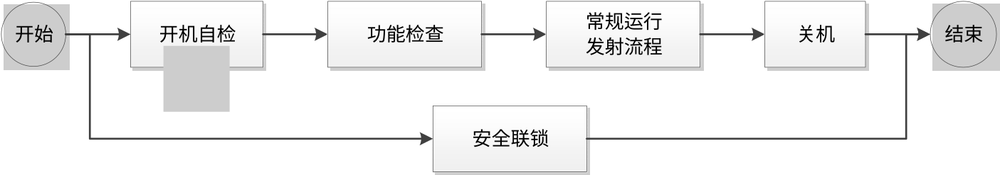

日运行流程图

#### 流程配方编辑

##### 引言

由装置运行组在系统中对外部系统接口调用能力的组件化封装，将各系统接口封装为可复用、可配置、可管控的独立业务单元，并支持参数配置、策略定义、启停控制，为流程编排提供标准化业务单元能力。对已封装的业务活动单元进行流程配方编排，支持流程配方的配置、选择、校核、发布。系统提供图形化流程编辑界面，支持将业务活动单元以图例方式拖拽至流程设计画布进行编排，形成可发布的流程配方。依据业务流程梳理结果，业务单元如下表所示

业务活动单元表

| 业务单元名称 | 系统服务 数量 | 业务单元描述 |
| --- | --- | --- |
| 远程开机 | 365 | 远程开机业务活动单元实现集中管控系统给装置各系统/分系统下发远程开机指令，装置各系统/分系统执行并进行反馈执行结果。 |
| 远程关机 | 365 | 远程关机业务活动单元实现集中管控系统给装置各系统/分系统下发远程关机指令，装置各系统/分系统执行并进行反馈执行结果。 |
| 开机自检 | 365 | 开机自检业务活动单元实现集中管控系统给装置各系统/分系统下发开机自检指令，装置各系统/分系统执行并进行反馈执行结果。 |
| 功能检查 | 365 | 功能检查业务活动单元实现集中管控系统给装置各系统/分系统下发功能检查指令，装置各系统/分系统执行并进行反馈执行结果。 |
| 种子源出光 | 6 | 种子源出光业务活动单元实现对种子源出光指令的封装，集中管控系统通过封装的活动单元下发种子源出光指令，光纤种子源组件接收指令后，依据给定参数完成种子源出光流程，并向总控反馈执行结果。 |
| 种子源激光参数采集 | 6 | 种子源激光参数采集业务活动单元实现对种子源激光参数采集指令的封装，集中管控系统通过封装的活动单元下发种子源激光参数采集指令，光纤种子源组件接收指令后，依据给定参数完成种子源激光参数采集，并向总控反馈执行结果。 |
| 种子源待机 | 6 | 种子源待机业务活动单元实现对种子源待机指令的封装，集中管控系统通过封装的活动单元下发种子源待机指令，光纤种子源组件接收指令后，执行并反馈结果。 |
| 二倍频出光 | 6 | 二倍频出光业务活动单元实现对二倍频出光指令的封装，集中管控系统通过封装的活动单元下发二倍频出光指令，二倍频宽带注入组件接收指令后，依据给定参数完成二倍频出光流程，并向总控反馈执行结果。 |
| 二倍频激光参数采集 | 6 | 二倍频激光参数采集业务活动单元实现对二倍频激光参数采集指令的封装，集中管控系统通过封装的活动单元下二倍频激光参数采集指令，二倍频宽带激光注入组件接收指令后，依据给定参数完成二倍频激光参数采集，并向总控反馈执行结果。 |
| 二倍频待机 | 6 | 二倍频待机业务活动单元实现对二倍频待机指令的封装，集中管控系统通过封装的活动单元下发二倍频待机指令，二倍频宽带激光注入组件接收指令后，执行并反馈结果。 |
| 预放唤醒 | 10 | 预放唤醒业务活动单元实现对预放唤醒指令的封装，再生与双程放大组件负责接收集中管控系统下发的预放唤醒任务指令，按系统给定参数执行预放唤醒操作。组件完成唤醒操作后，返回符合规范的标准唤醒结果；若可正常输出标准唤醒结果，则向集中管控系统反馈执行成功状态。 |
| 预放出打靶光 | 10 | 预放出打靶光业务活动单元实现对预放出打靶光指令的封装，再生与双程放大组件负责接收集中管控系统下发的预放出打靶光任务，执行并反馈结果。 |
| 能量粗/精闭环 | 10 | 能量粗/精闭环业务活动单元实现对能量粗/精闭环指令的封装，再生与双程放大组件负责接收集中管控系统下发的能量粗/精闭环任务，按系统给定参数执行能量粗调/精调闭环操作。组件完成闭环操作后，返回符合规范的标准闭环结果；若可正常输出标准闭环结果，则向集中管控系统反馈执行成功状态。 |
| 能量计清零 | 10 | 能量计清零业务活动单元实现对能量计清零指令的封装，再生与双程放大组件负责接收集中管控系统下发的能量计清零任务，执行并反馈结果。 |
| 能量数据采集 | 10 | 能量数据采集业务活动单元实现对能量数据采集指令的封装，再生与双程放大组件负责接收集中管控系统下发的能量数据采集任务，执行并反馈结果。 |
| 预放组件待机 | 10 | 预放组件待机业务活动单元实现对预放组件待机指令的封装，再生与双程放大组件负责接收集中管控系统下发的预放组件待机任务，执行并反馈结果。 |
| 光路准直 | 61 | 光路准直确认业务活动单元实现对光路准直指令的封装，多程放大系统负责接收集中管控系统下发的光路准直指令，按系统给定参数执行光路准直操作。组件完成光路准直操作后，返回符合规范的标准准直结果；若可正常输出标准准直结果，则向集中管控系统反馈执行成功状态。 |
| 重频光状态确认 | 61 | 重频光状态确认业务活动单元实现对重频光状态确认指令的封装，多程放大系统负责接收集中管控系统下发的重频光状态确认指令，按指令执行状态确认操作。组件完成确认操作后，返回符合规范的标准确认结果；若可正常输出标准确认结果，则向集中管控系统反馈执行成功状态。 |
| 打靶状态确认 | 61 | 打靶状态确认业务活动单元实现对打靶状态确认指令的封装，多程放大系统负责接收集中管控系统下发的打靶状态确认指令，执行并反馈结果。 |
| 开关充电 | 1 | 开关充电活动单元实现对开关充电指令的封装，开关驱动源组件负责接收集中管控系统下发的开关充电任务，按指令执行开关充电操作。组件完成充电操作后，返回符合规范的标准充电结果；若可正常输出标准充电结果，则向集中管控系统反馈执行成功状态。 |
| 开关触发准备 | 1 | 开关触发准备活动单元实现对开关触发准备指令的封装，开关驱动源组件负责接收集中管控系统下发的开关触发准备任务，按指令执行触发准备操作。组件完成准备操作后，返回符合规范的标准准备结果；若可正常输出标准准备结果，则向集中管控系统反馈执行成功状态。 |
| 放电波形采集 | 1 | 放电波形采集活动单元实现对放电波形采集指令的封装，开关驱动源组件负责接收集中管控系统下发的放电波形采集任务，按指令执行放电波形采集操作。组件完成采集操作后，返回符合规范的标准采集结果；若可正常输出标准采集结果，则向集中管控系统反馈执行成功状态。 |
| 开关待机 | 1 | 开关待机活动单元实现对开关待机指令的封装，开关驱动源组件负责接收集中管控系统下发的开关待机任务，按指令进入待机状态。组件完成待机操作后，返回符合规范的标准待机结果；若可正常输出标准待机结果，则向集中管控系统反馈执行成功状态。 |
| 泵浦发射准备 | 2 | 泵浦发射准备业务活动单元实现对泵浦发射准备指令的封装，泵浦分系统负责接收集中管控系统下发的泵浦发射准备指令，按指令执行泵浦发射准备操作。组件完成准备操作后，返回符合规范的标准准备结果；若可正常输出标准准备结果，则向集中管控系统反馈执行成功状态。 |
| 发射充电准备 | 2 | 发射充电准备业务活动单元实现对发射充电准备指令的封装，泵浦分系统负责接收集中管控系统下发的发射充电准备指令，按指令执行充电准备操作。组件完成准备操作后，返回符合规范的标准准备结果；若可正常输出标准准备结果，则向集中管控系统反馈执行成功状态。 |
| 发射充电 | 2 | 发射充电业务活动单元实现对发射充电指令的封装，泵浦分系统负责接收集中管控系统下发的发射充电指令，按指令执行发射充电操作。组件完成充电操作后，返回符合规范的标准充电结果；若可正常输出标准充电结果，则向集中管控系统反馈执行成功状态。 |
| 预电离发射准备 | 2 | 预电离发射准备业务活动单元实现对预电离发射准备的封装，泵浦分系统负责接收集中管控系统下发的预电离发射准备指令，执行并反馈。 |
| 预电离发射充电 | 2 | 预电离发射充电业务活动单元实现对预电离发射充电指令的封装，泵浦分系统负责接收集中管控系统下发的预电离发射充电指令，执行并反馈。 |
| 泵浦触发准备 | 2 | 泵浦触发准备活动单元实现对泵浦触发准备指令的封装，泵浦分系统负责接收集中管控系统下发的泵浦触发准备指令，按指令执行泵浦触发准备操作。组件完成准备操作后，返回符合规范的标准准备结果；若可正常输出标准准备结果，则向集中管控系统反馈执行成功状态。 |
| 泵浦数据采集 | 2 | 泵浦数据采集活动单元实现对泵浦数据采集指令的封装，泵浦分系统负责接收集中管控系统下发的泵浦数据采集指令，按指令执行泵浦数据采集操作。组件完成采集操作后，返回符合规范的标准采集结果；若可正常输出标准采集结果，则向集中管控系统反馈执行成功状态。 |
| 泵浦待机 | 2 | 泵浦待机活动单元实现对泵浦待机指令的封装，泵浦分系统负责接收集中管控系统下发的泵浦待机指令，进入待机状态。组件完成待机操作后，返回符合规范的标准待机结果；若可正常输出标准待机结果，则向集中管控系统反馈执行成功状态。 |
| 紧急停充反馈 | 2 | 紧急停充反馈活动单元实现对紧急停充反馈指令的封装，该接口由集中管控系统提供。泵浦分系统出于安全因素，在充电过程中（含预电离和发射）需自身紧急停止充电时，调用该接口将停充原因上报集中管控系统，以便协调其他系统停止流程，保障装置运行安全。【说明】：该接口不需要服务权限验证。 |
| 充电进程反馈 | 2 | 充电进程反馈活动单元实现对充电进程反馈指令的封装，泵浦分系统在充电过程中，实时向集中管控系统反馈充电进程信息，确保充电状态可监、可控、可追溯。 |
| 关机复位（预电离、发射） | 2 | 关机复位活动单元实现对关机复位指令的封装，泵浦分系统负责接收集中管控系统下发的关机复位指令，进入待机状态。组件完成复位操作后，返回符合规范的标准复位结果；若可正常输出标准复位结果，则向集中管控系统反馈执行成功状态。 |
| 测量靶瞄准备 | 62 | 测量靶瞄准备业务活动单元实现对测量靶瞄准备指令的封装，测量分系统负责接收集中管控系统下发的测量靶瞄准备指令，执行靶瞄设备准备操作。组件完成准备操作后，返回符合规范的标准准备结果，并向集中管控系统反馈准备状态；若可正常输出标准结果，则反馈执行成功状态。 |
| 测量打靶运动准备 | 62 | 测量打靶运动准备业务活动单元实现对测量打靶运动准备指令的封装，测量分系统负责接收集中管控系统下发的测量打靶运动准备指令，控制运动平台执行预设轨迹操作。组件完成运动准备操作后，返回符合规范的标准执行结果，并向集中管控系统反馈执行状态；若可正常输出标准结果，则反馈执行成功状态。 |
| 打靶测量准备 | 62 | 打靶测量准备业务活动单元实现对打靶测量准备指令的封装，测量取样组件负责接收集中管控系统下发的打靶测量准备指令，完成测量设备初始化与能量计清零操作。组件完成准备操作后，返回符合规范的标准准备结果，并向集中管控系统反馈准备状态；若可正常输出标准结果，则反馈执行成功状态。 |
| 激光参数采集 | 62 | 激光参数采集业务活动单元实现对激光参数采集指令的封装，测量分系统负责接收集中管控系统下发的激光参数采集指令，启动激光参数检测模块执行采集操作。组件完成采集操作后，返回符合规范的标准采集结果，并向集中管控系统反馈采集状态；若可正常输出标准结果，则反馈执行成功状态。 |
| 测量组件待机 | 62 | 测量组件待机业务活动单元实现对测量组件待机指令的封装，测量分系统负责接收集中管控系统下发的测量组件待机指令，控制测量设备进入低功耗待机模式。组件完成待机操作后，返回符合规范的标准待机结果，并向集中管控系统反馈操作结果；若可正常输出标准结果，则反馈执行成功状态。 |
| 晶体位姿调整 | 61 | 晶体位姿调整活动单元实现对晶体位姿调整指令的封装，相关组件负责接收集中管控系统下发的晶体位姿调整任务，按系统给定参数执行晶体位姿调整操作。组件完成调整操作后，返回符合规范的标准调整结果；若可正常输出标准调整结果，则向集中管控系统反馈执行成功状态。 |
| 实验靶预定位 | 1 | 实验靶预定位确认业务活动单元实现对实验靶预定位确认指令的封装，靶瞄准定位系统负责接收集中管控系统下发的实验靶预定位确认指令，按系统要求执行预定位确认操作。组件完成预定位确认操作后，返回符合规范的标准确认结果；若可正常输出标准预定位确认结果，则向集中管控系统反馈执行成功状态。 |
| 模拟靶定位 | 1 | 模拟靶定位确认业务活动单元实现对模拟靶定位确认指令的封装，靶瞄准定位系统负责接收集中管控系统下发的模拟靶定位任务，按系统给定参数执行模拟靶定位操作。组件完成定位操作后，返回符合规范的标准定位结果；若可正常输出标准定位结果，则向集中管控系统反馈执行成功状态。 |
| 光束引导 | 1 | 光束引导业务活动单元实现对光束引导指令的封装，靶瞄准定位系统负责接收集中管控系统下发的光束引导任务，按系统给定参数执行光束引导操作。组件完成引导操作后，返回符合规范的标准引导结果；若可正常输出标准引导结果，则向集中管控系统反馈执行成功状态。 |
| 实验靶复位 | 1 | 实验靶复位业务活动单元实现对实验靶复位指令的封装，靶瞄准定位分系统负责接收集中管控系统下发的实验靶复位指令，执行实验靶复位操作。组件完成复位操作后，返回符合规范的标准复位结果，并向集中管控系统反馈靶复位状态；若可正常输出标准复位结果，则反馈执行成功状态。 |
| 打靶状态确认 | 1 | 打靶状态确认业务活动单元实现对打靶状态确认指令的封装，靶瞄准定位分系统负责接收集中管控系统下发的打靶状态确认指令，执行并反馈结果。 |
| 靶瞄收靶 | 1 | 靶瞄收靶业务活动单元实现对靶瞄收靶指令的封装，靶瞄准定位分系统负责接收集中管控系统下发的靶瞄收靶指令，执行并反馈结果。 |
| 靶瞄数据分析 | 1 | 靶瞄数据分析业务活动单元实现对靶瞄数据分析指令的封装，靶瞄准定位分系统负责接收集中管控系统下发的靶瞄数据分析指令，执行并反馈结果。 |
| 模拟LD靶开罩 | 25 | 模拟LD靶开罩业务活动单元实现对模拟LD靶开罩指令的封装，LD靶分系统负责接收集中管控系统下发的模拟LD靶开罩指令，执行并反馈结果。 |
| LD靶复位 | 25 | LD靶复位业务活动单元实现对LD靶复位指令的封装，LD靶分系统负责接收集中管控系统下发的LD靶复位指令，执行并反馈结果。 |
| LD靶开罩 | 25 | LD靶开罩业务活动单元实现对LD靶开罩指令的封装，LD靶分系统负责接收集中管控系统下发的LD靶开罩指令，执行并反馈结果。 |
| 收LD靶 | 25 | 收LD靶业务活动单元实现对收LD靶指令的封装，LD靶分系统负责接收集中管控系统下发的收LD靶指令，执行并反馈结果。 |
| 抽真空 | 1 | 抽真空业务活动单元实现对抽真空指令的封装，真空靶室分系统负责接收集中管控系统下发的抽真空指令，执行并反馈结果。 |
| 诊断设备采集设置 | 1 | 诊断设备数据采集活动单元实现对诊断设备数据采集指令的封装，物理实验诊断分系统负责接收集中管控系统下发的诊断设备数据采集指令，完成数据采集、存储及预处理等工作。组件完成采集操作后，返回符合规范的标准采集结果；若可正常输出标准采集结果，则向集中管控系统反馈执行成功状态。 |
| 诊断设备状态确认 | 1 | 诊断设备状态确认业务活动单元实现对诊断设备状态确认指令的封装，物理诊断分系统负责接收集中管控系统下发的诊断设备状态确认任务，按系统要求执行状态确认操作。组件完成状态确认操作后，返回符合规范的标准确认结果；若可正常输出标准状态确认结果，则向集中管控系统反馈执行成功状态。 |
| 诊断设备动作 | 1 | 诊断设备动作业务活动单元实现对诊断设备动作指令的封装，物理实验诊断分系统负责接收集中管控系统下发的诊断设备动作指令（收回、就位、试触发、上电、采集设置等），反馈执行结果。 |
| 诊断设备数据采集 | 1 | 诊断设备数据采集业务活动单元实现对诊断设备数据采集指令的封装，物理实验诊断分系统负责接收集中管控系统下发的诊断设备数据采集指令，反馈执行结果。 |
| 发射后处理 | 1 | 发射后处理业务活动单元实现对发射后处理指令的封装，物理实验诊断分系统负责接收集中管控系统下发的发射后处理指令（如退高压、收回、下电等），反馈执行结果。 |
| 发射准备配方 | 66 | 发射准备配方活动单元实现对发射准备配方指令的封装，集中同步分系统负责接收集中管控系统下发的发射准备配方指令，按配方执行同步配置操作。组件完成配置操作后，返回符合规范的标准执行结果，并向集中管控系统反馈任务执行情况；若可正常输出标准结果，则反馈执行成功状态。 |
| 预放重频配方 | 66 | 预放重频配方活动单元实现对预放重频配方指令的封装，集中同步分系统负责接收集中管控系统下发的预放重频配方指令，按配方执行参数配置与触发操作。组件完成配置操作后，返回符合规范的标准执行结果，并向集中管控系统反馈任务执行情况；若可正常输出标准结果，则反馈执行成功状态。 |
| 测量重频配方 | 66 | 测量重频配方活动单元实现对测量重频配方指令的封装，集中同步分系统负责接收集中管控系统下发的测量重频配方指令，按配方执行参数配置与同步操作。组件完成配置操作后，返回符合规范的标准执行结果，并向集中管控系统反馈任务执行情况；若可正常输出标准结果，则反馈执行成功状态。 |
| 预放单次配方 | 66 | 预放单次配方活动单元实现对预放单次配方指令的封装，集中同步分系统负责接收集中管控系统下发的预放单次配方，按配方执行参数配置与触发操作。组件完成配置操作后，返回符合规范的标准执行结果，并向集中管控系统反馈任务执行情况；若可正常输出标准结果，则反馈执行成功状态。 |
| 测量单次配方 | 66 | 测量单次配方活动单元实现对测量单次配方指令的封装，集中同步分系统负责接收集中管控系统下发的测量单次配方，按配方执行参数配置与同步操作。组件完成配置操作后，返回符合规范的标准执行结果，并向集中管控系统反馈任务执行情况；若可正常输出标准结果，则反馈执行成功状态。 |
| 同步触发 | 66 | 同步触发活动单元实现对同步触发指令的封装，集中同步分系统负责接收集中管控系统下发的同步触发指令，按指令执行同步触发操作。组件完成触发操作后，返回符合规范的标准触发结果，并向集中管控系统反馈任务执行情况；若可正常输出标准结果，则反馈执行成功状态。 |
| 片放吹扫 | 2 | 片放吹扫活动单元实现对片放吹扫指令的封装，冷却分系统接收集中管控系统下发的片放吹扫开始指令，从参数配置表中读取目标束线编号，并执行片放吹扫操作。若流程正常执行，则反馈执行成功状态。 |
| 警灯控制 | 1 | 警灯控制业务活动单元实现对警灯控制指令的封装，安全联锁分系统负责接收集中管控系统下发的警灯控制指令，执行并反馈结果。 |
| 警示音乐控制 | 1 | 警示音乐控制业务活动单元实现对警示音乐控制指令的封装，安全联锁分系统负责接收集中管控系统下发的警示音乐控制指令，执行并反馈结果。 |
| 清场 | 1 | 清场业务活动单元实现对清场控制指令的封装，安全联锁分系统负责接收集中管控系统下发的清场指令，执行并反馈结果。 |
| 屏蔽门控制 | 1 | 屏蔽门控制业务活动单元实现对屏蔽门控制控制指令的封装，安全联锁分系统负责接收集中管控系统下发的屏蔽门控制指令，执行并反馈结果。 |
| 安全管控状态控制 | 1 | 安全管控状态控制业务活动单元实现对安全管控状态控制指令的封装，安全联锁分系统负责接收集中管控系统下发的安全管控状态控制指令，执行并反馈结果。 |

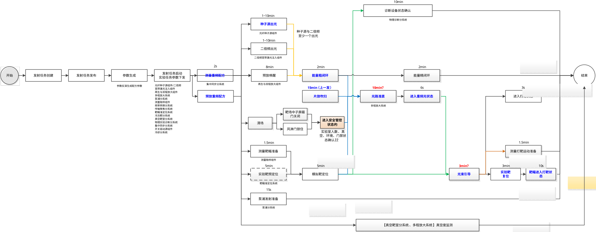

发射准备阶段流程图

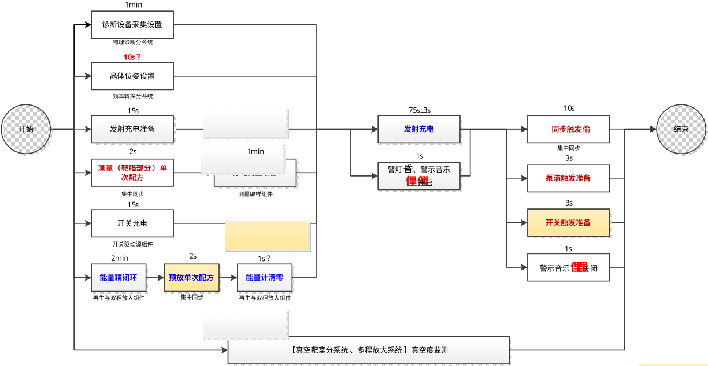

发射阶段流程图

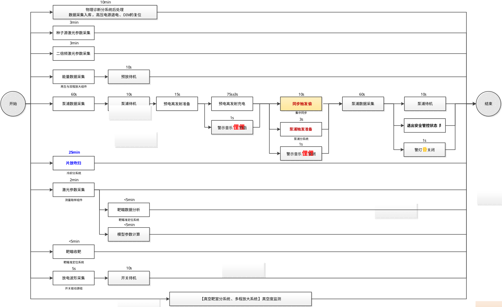

发射后处理阶段流程图

##### 输入要求

- 数据输入
流程配方编排与调度执行时需在界面上输入或者选择的数据项包括：

1.已封装完成的业务活动单元信息；

2.流程配方基础信息：流程名称、描述信息等；

3.流程编排信息：业务活动单元、单元关联关系、参数配置、时序关系等；

4.流程筛选与配置条件；

5.已发布的流程配方信息；

业务活动单元封装时需在界面上输入或者选择的数据项包括：

1.基础信息：单元名称、单元描述、所属系统；

2.接口调用信息：支持配置多组接口调用信息，每个接口包含，Tango设备服务唯一标识、设备服务指令；

3.运行控制信息

失败策略：定义当业务活动单元执行失败时，整个控制流程应如何处理。如：立即终止整个流程、在指定次数内自动重试当前单元、忽略失败继续执行后续单元。

超时策略：当业务活动单元执行时间超过预设的“预计运行时长”时，系统应采取的措施。如：强制终止该单元的执行、记录超时告警但继续等待、跳过本单元直接执行后续单元。

成功策略：业务活动单元成功执行后，决定下一步动作：无条件继续执行下一单元、根据本单元输出的返回值来判断后续执行哪条分支路径。

5.流程约束信息：预计运行时长、前置条件、后置检查点。

- 命令输入
用户输入“新增”“查看”“编辑”“保存”“校核”“删除”“发布”“撤销”“查询”“启用”“停用”“校验”等命令。

##### 处理要求

- 按单元编号、单元名称、所属系统、启停状态等条件查询业务活动单元信息，查询结果以列表形式分页展示；
- 新建业务活动单元，录入基础信息、接口调用信息、运行控制信息、流程约束信息和生命周期信息，并保存至数据库；
- 查看业务活动单元详细信息，查看页面为只读模式；
- 对业务活动单元进行编辑、保存、删除、启用、停用；
- 对同一系统服务支持配置多套接口调用信息；
- 对停用的业务活动单元限制流程编排模块引用；
- 对新增、编辑、启用、停用、删除等操作进行日志记录，并将操作信息保存至数据库；
- 输出标准化业务活动单元元数据，供流程编排模块识别、拖拽和引用。
- 按流程名称、流程状态、发布时间等条件查询流程配方信息，查询结果以树形目录或列表形式展示；
- 流程配方，录入流程基础信息，拖拽业务活动单元进行流程编排，并保存至数据库；
- 查看流程配方详细信息，展示流程画布、活动单元、参数配置、表单、操作及上下文数据等内容；
- 对未发布的流程配方进行编辑、保存、校核和删除；
- 对流程配方进行完整性和合规性校核，校核通过后提交发布，发布后的流程配方可供调度执行调用；
- 对流程配方编辑操作进行记录，并将相关信息保存至数据库。

##### 输出要求

- 页面以分页列表形式展示业务活动单元信息，包括单元名称、单元描述、所属系统、请求方法、失败策略、运行时间、前置条件、启停状态等；
- 页面展示业务活动单元详细信息，包括基础信息、接口配置、运行策略、流程约束和生命周期信息；
- 新增业务活动单元成功后，页面提示“业务活动单元新增成功”；
- 保存业务活动单元成功后，页面提示“业务活动单元保存成功”；
- 启用或停用业务活动单元成功后，页面提示“业务活动单元已启用”或“业务活动单元已停用”；
- 删除业务活动单元成功后，页面提示“删除成功”，且列表不再展示该记录；
- 参数校验通过后，页面提示“参数格式校验成功”；校验失败后，页面提示“参数格式错误，请检查后重新提交”；

- 页面以树形目录或列表形式展示流程配方信息，并标识流程当前状态；
- 页面展示流程设计画布、业务活动单元图例、关联关系及参数配置等内容；
- 保存、校核、删除、发布、撤销、执行等操作成功后，页面提示对应结果信息；
- 校核失败时，页面提示具体校核异常信息；
- 流程配方编辑记录、状态变更记录、流程运行日志、节点运行状态及异常处理记录录入数据库。

#### 运行控制工作台

##### 引言

通过设备服务预约机制实现精细化的权限控制。实现过程分为三层：首先，实现预约服务功能，负责管理设备日历、审核流程和状态机（空闲、已预约、使用中）；其次，Tango设备服务在原有属性上增加adminMode（管理模式：控制设备是否可被远程操作）、controlMode（控制模式：定义设备当前在谁的控制下）等字段，并在Tango 设备的always_executed_hook或具体命令方法中调用预约服务进行实时鉴权；最后，数据库记录设备－角色映射、预约单和操作日志。

控制逻辑遵循“预约－签到－控制－签退”的闭环：用户根据角色权限提交预约申请，通过审核后，在预约时段内签到，系统将该设备状态置为“使用中”并将用户ID同步至对应Tango设备的controlMode属性，此时设备命令接口才允许执行；到达结束时间或手动签退后，系统自动回收控制权。

权限控制采用“静态角色+动态时间片”双重验证：静态层面通过设备－角色关联表控制可预约范围，动态层面确保只有当前时间片内的授权用户才能操作，同时支持超时强制释放、违规黑名单和完整操作审计，从根本上解决了多用户场景下的设备冲突与安全管控问题。同时集中管控系统拥有最高角色权限，可以取消其他系统服务的预约。

由装置运行组在系统中根据当日实验发次对已发布的流程配方进行选择、配置，支持当天流程自动化调度执行。通过tango向相关系统或分系统下发控制指令， 分系统接收指令并执行，并将执行结果，状态反馈给集中控制系统，完成流程流转、运行监控和异常处理，实现发射准备阶段流程的自动化执行与全过程管控。当流程节点发生异常时，系统通过异常上报接口获取分系统异常信息，自动关联当前流程、节点状态、参数快照、历史故障记录、处置规则、操作规程和维修手册，输出异常提醒、可能原因、处置建议和人工干预选项。对于历史故障，系统应给出相似案例及处理结果；对于新增故障，系统应提示“无历史案例”，并基于规则库和知识库分析给出初步建议。实现异常分类识别、原因分析、影响判断和处置建议生成，辅助运行人员快速定位问题，并为流程继续执行、重试、跳过、停止等处理操作提供决策支撑。

##### 输入要求

- 数据输入
依据待执行的实验发次任务，选择流程配方，支持依据实验类型关联默认配方，如LDB类型关联LDB配方，选择的数据项包括：

1.已发布的流程配方信息；

2.流程筛选与配置条件；

3.各系统或分系统反馈的任务节点运行状态数据；

4.故障信息上报的数据项、

5.用户提供的其他装置的运行故障记录、

6.本系统记录的故障信息数据项

7.异常处理过程中所需的人工干预指令。

- 命令输入
用户输入“查询”“选择”“执行”“暂停”“继续”“停止”等命令。

##### 处理要求

- 选择已发布的流程配方，加载流程步骤、关联活动等基础信息，形成可执行的调度任务数据；
- 启动流程自动化调度执行，通过tango向相关系统或分系统下发控制指令，并根据节点反馈自动流转；
- 对流程执行过程进行监控，展示流程整体状态及各节点运行时间、运行状态等信息；
- 对流程执行异常进行分析和处理，支持流程发生异常时，智能体辅助异常处理，给出异常解决建议方案，协助运行人员决策流程停止、继续等干预操作；
- 系统支持对流程上下文、规则库、知识库、历史案例和日志证据进行联合分析，形成异常处理建议。
- 系统完成异常接入、上下文组装、知识检索、规则匹配、智能分析、建议生成、人工确认和结果回写等处理过程。
- 系统支持输出继续执行、重试、跳过、停止、参数调整和转人工等建议动作，并说明建议依据。
- 系统对分析结果给出置信度或推荐优先级；对低置信度、无法识别或超出处置规则范围的异常。
- 系统支持运行人员对建议进行采纳、修改或驳回，并记录最终处理结果。
- 系统将异常分析记录、人工处置结果和有效案例保存至数据库，并用于后续知识库更新。
- 对流程配方调度执行、异常处理等操作进行记录，并将相关信息保存至数据库。

##### 输出要求

- 页面展示已选流程配方的基础信息和可执行调度任务信息；
- 页面展示流程整体运行状态及各节点详细运行信息，包括运行时间、运行状态等，正常执行节点绿色显示，异常红色显示，动态表征流程执行过程；
- 流程执行异常时，页面展示异常提示信息、智能辅助分析结果及人工干预选项；
- 页面展示异常基本信息，包括异常来源、异常时间、异常描述、所属流程、所属节点等；
- 页面展示异常基本信息，包括异常来源、异常时间、异常描述、所属流程、所属节点、异常级别和当前状态。
- 页面展示异常分析结果，包括异常类型、可能原因、影响范围、紧急程度、可恢复性和置信度。
- 页面展示异常处理建议及建议依据，包括建议动作、规则依据、关键日志信息、相关知识内容和相似案例信息。
- 页面展示历史相似异常案例及处置结果，供运行人员参考。
- 异常分析成功后，页面提示“分析成功”；分析失败后，页面提示“分析失败”。
- 人工提交处置结果后，页面提示“处理成功”或“处理失败”。
- 流程执行完成或终止后，页面输出执行结果，包括“执行成功”“执行失败”“异常终止”等；
- 流程运行日志、节点运行状态及异常处理记录录入数据库。

#### 束间同步时序控制

##### 引言

束间同步时序控制实现多束激光束线在时间维度上的严格对齐。获取测量取样组件示波器的三倍频在线测量数据进行偏差计算，偏差结果反馈给光纤种子源组件作为参考，人工调整AWG出光时序，完成束间时序同步。

##### 输入要求

- 数据输入
从数据库中获取临近实验发次的测量数据，如示波器的三倍频在线测量数据；

- 命令输入
输入“查询”“获取数据”“计算”“下发”

##### 处理要求

- 支持获取示波器的测量数据，进行束间同步时序的偏差计算，形成偏差结果，存储至数据库中；
- 支持将偏差结果下发给光纤种子源组件，供其参考调整时序，完成时序调整后，返回对应的时序调整结果。
- 支持对束间同步时序调整结果进行获取与展示。

##### 输出要求

- 展示示波器的在线测量数据；
- 输出偏差计算结果；
- 展示束间同步时序调整结果。

#### 智能发射报告

##### 引言

智能发射报告生成通过提取实验数据（输入/输出参数、异常记录）填充预设的发射报告模板，生成结构化报告（PDF/Word/Excel），经装置运行值班长确认后发送给实验负责人。

##### 输入要求

- 实验概况：包括发次编号、实验时间、实验负责人、束线数、备注等基本信息；
- 能量与功率信息：总能量、总功率，总能量预测值、总能量测量值、总能量偏差、总功率预测值、总功率测量值、总功率偏差等；
- 束线测量能量分散度直方图：预放测量能量分散度、三倍频测量能量分散度；
- 铷玻璃片数：束线编号、内腔放大器片数，助推放大器片数；
- 能源信息：主发射（kV），预发射；
- 光束质量：预放光束质量图，预放近场调制图，预放近场对比度图，预放远场能量集中度图；
- 功率平衡图：预放能量直方图、主放能量直方图、三倍频能量直方图、三倍频（集束间）功率平衡图、预放（峰值）功率直方图、三倍频（峰值）功率直方图
- 支持Word格式导出。

##### 处理要求

依据采集数据，进行数据分析形成数据统计图，导出智能发射报告文件。

##### 输出要求

- 报告文件输出：成功生成后，提供Word格式的下载链接；
- 系统提示反馈：报告生成成功，页面提示“发射报告生成成功”；

### 智能维护管理

智能维护管理基于故障信息通过故障风险建模，为实验平台安全稳定运行、预防性维护与智能排程提供风险依据与策略支撑。根据故障信息和维护事项生成维护任务，对维护任务进行发布和跟踪形成维护任务完整闭环。

#### 故障管理

##### 引言

故障管理功能实现故障信息的统一采集、诊断分析、风险定级、处置和闭环跟踪。故障来源包括分系统故障上报接口自动采集、运行维护人员人工录入、标准模板批量导入三种方式。系统完整记录故障发生时间、发次编号、所属束线、任务类别、发生阶段、故障现象、故障所属系统、故障部件、故障责任人、故障跟踪人、严酷度类别、发生概率等级、故障应对措施、故障处理用时、故障处理时间等关键信息，以列表形式集中呈现。调用维护的故障树模型，对故障现象进行故障匹配、根因辅助诊断和故障风险定级依据提取，并将最终诊断结论、风险等级和处置结果同步到故障树模型相关记录。并依据“故障发生概率等级×故障严酷度等级”计算故障风险定级结果，为维护任务创建、故障预测和运行决策提供基础数据支撑

##### 输入要求

- 数据输入
故障管理需在界面上输入或选择的数据项包括：

- 查询条件：故障发生时间、发次编号、故障束线、任务类别、发生阶段、故障跟踪人员、严酷度类别、发生概率等级等；
- 故障基本信息：故障发生时间、故障编号、发次编号、故障束线、任务类别、发生阶段、故障所属系统、故障器件信息、故障责任人、故障跟踪人、严酷度类别、发生概率等级、故障应对措施、故障处理用时、故障处理时间、故障现象；
基于各分系统提供的故障树及相关故障识别与标注信息，故障风险建模时需在界面上输入或者选择的数据项包括：

- 基础数据：历史运行数据、历史故障数据（故障发生时间、故障部件、故障系统、故障频次、停机时长、维护工作量等）；
- 设备信息：设备/元件基础信息、所属系统、所在束线、关键等级；
- 模型参数：故障概率权重、严酷程度权重、停机时长系数、维护工作量系数；
- 命令输入
用户输入“查询”“新增”“修改”“删除”“保存”“导入”“查看”“处理”命令。

##### 处理要求

- 展示当前全部故障信息并按故障发生时间倒序排列，支持组合条件查询，列表分页展示匹配记录；
- 支持查看故障完整详情信息；
- 支持三种故障新增方式：接收分系统故障上报接口自动上报、在线手动填写提交、通过标准模板批量导入，信息校验通过后完成新增；
- 选择单条或多条故障信息执行删除操作，操作人员确认后完成删除；
- 对故障新增、修改、删除、导入、处理等操作进行记录，并将处理结果保存至数据库。
- 支持对故障进行处理（处理、无需处理），跟踪处理状态，对“处理”的故障支持维护任务创建与跟踪解决。
- 所属系统、束线、设备部件、风险等级、计算时间等条件查询设备风险评估结果，查询结果以列表形式展示，按风险等级倒序排列，支持分页展示与条件重置；
- 查看单台设备/元件风险建模详情，包括历史数据来源、故障概率计算结果、故障严酷程度计算结果、风险等级、评估时间、关联策略等信息；

##### 进行自适应策略调整：针对高风险设备/元件自动生成提升巡检频率、规避关键实验窗口策略；针对低风险设备/元件自动生成延长维护周期、降低巡检频率策略；策略可查看、可确认、可应用至维护任务管理与实验排程模块；输出要求

- 页面展示故障当前处理状态与数据列表；
- 查看故障详情时，页面展示故障全量详细信息；
- 操作成功页面提示“新增成功”“修改成功”“删除成功”“导入成功”，“处理成功”，“保存成功”；
- 操作失败页面提示“操作失败”；
- 故障操作记录与信息变更记录录入数据库。

#### 故障树建模

##### 引言

故障树建模提供对故障树建模与分析能力，建立各分系统的统一故障树模型库。支持对装置运行时发生的故障进行故障树建模，主要功能包括：新增、编辑、校核、发布和版本管理。

##### 输入要求

- 数据输入
基于各分系统提供的故障树及相关故障识别与标注信息，故障风险建模时需在界面上输入或者选择的数据项包括：

1.基础信息：系统名称、系统编号、所属束线、设备层级关系等；

2.故障树模型信息：顶事件、中间事件、底事件、事件编码、事件名称、事件描述、逻辑门关系、子树引用关系、关联设备/器件、适用范围、模型版本等；

3.模型规则信息：标准故障树模板、节点命名规则、逻辑关系约束规则、模型审核规则、发布规则等；

4.分析数据：历史运行数据、历史故障数据、故障处理记录、维护记录、停机时长、影响发次信息、设备失效参数等；

5.预测参数：统计周期、顶事件分析对象、底事件发生概率/失效率、重要度阈值、预警阈值、预测周期等；

##### 处理要求

- 支持各个分系统标准故障树模板维护，在统一规则框架下支持各分析题对本专业故障树进行填报、补充、编辑和维护；
- 支持以图形化方式维护故障树模型及其逻辑关系进行配置，支持子树复用、模型导入导出、模型校核与发布；
- 当故障管理模块发起调用时，系统应根据故障现象、所属分系统、设备部件等信息匹配对应故障树，输出可能故障路径、关联设备/部件、重点排查项和分析依据，供故障诊断和故障风险定级使用；
- 支持对故障树调整、预测分析、结果调用、结果回写等操作进行记录，并将处理结果保存至数据库。

##### 输出要求

- 页面以列表形式展示故障树模型信息，包括所属分系统、分系统、顶事件名称、模型版本、模型状态、发布时间、最近计算时间等；
- 页面展示故障预测结果及预测结论；
- 查看故障树详情时，页面展示故障树图、事件节点信息、逻辑关系、分析参数、计算依据及历史版本信息；
- 当被故障管理模块调用时，输出可能故障原因路径、预测依据和建议检查顺序；
- 输出故障树模型报告和故障预测分析报告，包含模型范围、分析依据、关键薄弱环节、预测结果和维护建议；
- 故障树新增、编辑、发布、计算、预测、导出等操作成功后，页面提示对应操作成功信息；
- 相关操作失败后，页面提示操作失败信息和失败原因；

#### 维护事项管理

##### 引言

维护事项管理功能实现对系统内各类维护事项信息的统一录入、查询与管理，支持维护事项信息新增、查询、详情查看、修改、删除操作；系统完整记录维护事项的所属系统、维护内容、维护对象、所属束线、维护周期、创建人等关键信息，以列表形式展示。

##### 输入要求

- 数据输入
- 查询条件：所属系统、所属束线、维护周期等；
- 维护事项信息：所属系统、维护内容、维护对象、所属束线、维护周期、创建人等。
- 命令输入
用户输入“查询”“新增”“修改”“删除”“保存”“生成任务”命令。

##### 处理要求

- 进入维护事项管理页面，默认展示当前全部维护事项信息，按创建时间倒序排列；支持按组合条件查询，列表分页展示匹配记录；
- 系统从数据库中查询维护事项信息，可查看维护事项完整详情信息，展示所属系统、维护内容、维护对象、所属束线、维护周期、创建人等全量字段；
- 支持对维护事项信息如维护内容、维护对象、维护周期等进行修改；
- 选择单条或多条维护事项信息执行删除操作，系统弹出确认提示框，用户确认后完成删除；
- 对维护事项新增、修改、删除、导入等操作进行记录，并将处理结果保存至数据库。
- 可勾选维护事项生成维护任务，并进行任务跟踪。

##### 输出要求

- 页面以列表形式展示维护事项信息，包括所属系统、维护内容、维护对象、所属束线、维护周期、创建人；
- 查看维护事项详情时，页面展示维护事项详细信息；
- 操作成功页面提示“新增成功”“修改成功”“删除成功”；
- 操作失败页面提示“操作失败”；
- 维护事项操作记录和信息变更记录录入数据库。

#### 维护任务管理

##### 引言

维护任务管理功能实现由故障信息、维护事项生成维护任务，并对维护任务进行编制、发布、跟踪解决管理，系统完整记录维护任务的任务编号、来源类型（故障/维护事项）、任务内容、任务状态、生成人、生成时间等关键信息，以列表形式集中呈现。

##### 输入要求

- 数据输入
维护任务生成时需要在界面上输入或选择的数据项如下表所示：

- 维护任务查询条件：维护任务、维护对象、所属系统、创建时间等
- 维护任务生成信息：维护级别、维护对象、所属系统、所属束线、维护内容、维护周期、任务计划时间、创建人、来源。
- 命令输入
用户输入“查询”“生成任务”“查看”“保存”命令。

##### 处理要求

- 支持由故障信息、维护事项生成维护任务，对维护任务进行编辑、发布、跟踪；
- 已发布的维护任务不可再进行修改，可进行维护任务跟踪；
- 对维护任务生成、修改、删除、发布、跟踪等操作进行记录，并将处理结果保存至数据库。

##### 输出要求

- 页面以列表形式展示维护任务信息；
- 页面展示任务当前状态，包括“编辑中”“已发布”“已跟踪”等；
- 查看任务详情时，页面展示任务详细信息；
- 任务生成成功/失败后，页面提示“创建成功/失败”；
- 任务发布成功/失败后，页面提示“发布成功/失败”；
- 无查询结果时，页面提示“未查询到符合条件的维护任务信息”；
- 维护任务生成记录与信息变更记录录入数据库。

#### 维护任务跟踪

##### 引言

由维护人员在系统中对已发布的维护任务进行跟踪。维护人员可查看任务详情，并依据任务执行情况对任务进行完成、取消、顺延、暂停等处理。

##### 输入要求

- 数据输入
维护任务跟踪时需在界面上输入或者选择的数据项包括：

1.查询条件：维护级别、任务状态、所属系统等；

2.任务状态处理信息：任务状态、处理意见等；

3.任务基础信息：维护内容、任务计划时间、任务状态等。

- 命令输入
用户输入“查询”“重置”“查看”“取消”“顺延”“暂停”“完成”等命令。

##### 处理要求

- 按维护级别、任务状态等条件查询维护任务信息，查询结果以列表形式展示；
- 查看已发布维护任务的详细信息；
- 对已发布维护任务进行取消、顺延、暂停、继续、完成等状态处理，并更新任务状态；
- 对任务跟踪和状态处理操作进行记录，并将处理结果保存至数据库。

##### 输出要求

- 页面以列表形式展示维护任务跟踪信息，包括所属系统、维护内容、任务状态等；
- 页面展示任务当前状态，包括“已发布”“已暂停”“已顺延”“已取消”“已完成”等；
- 查看任务详情时，页面展示任务详细信息；
- 任务状态处理成功后，页面提示“跟踪成功”；
- 任务状态处理失败后，页面提示“跟踪失败”；
- 任务跟踪记录和状态变更记录录入数据库。

## 状态监控组件

### 设备状态监控

设备状态监控功能实现包括系统服务及设备服务、物理诊断设备、电光开关、真空泵等的监控，按束线级/部（组）件级→设备级（单一设备或器件）的从属关系呈现。

#### 系统设备服务状态监控

##### 引言

系统/设备服务状态监控功能实现对实验平台其他系统/分系统的系统服务、设备服务状态进行监控展示，支持查询、详情查看、异常信息查看，按束线级/部（组）件级→设备级（单一设备或器件）的从属关系呈现。

系统/设备服务状态监控功能列表展示所属系统编号、所属系统、所在束线、服务\设备名称、运行状态、工作状态（正常、异常）等信息，统计展示工作状态为正常、异常数量。其中正常状态用绿色标识；异常状态用红色标识，支持用户查看异常信息，异常信息包括设备编号、设备名称、所属束线、所属系统、异常原因和异常时间，异常信息持久化存储支持历史异常信息查询与查看操作。

##### 输入要求

- 数据输入
系统/设备服务状态监控所查询数据及来源见下表所示：

系统服务/设备服务状态数据

| 序号 | 数据名称 | 数据类型 | 数据来源 | 说明 |
| --- | --- | --- | --- | --- |
| 1 | 系统编号 | String | 实验平台各分系统 |  |
| 2 | 系统名称 | String | 实验平台各分系统 |  |
| 3 | 设备编号 | String | 实验平台各分系统 |  |
| 4 | 设备名称 | String | 实验平台各分系统 |  |
| 5 | 所属束线 | String | 实验平台各分系统 |  |
| 8 | 系统服务标识 | String | 实验平台各分系统 |  |
| 9 | 系统服务名称 | String | 实验平台各分系统 |  |
| 10 | 运行状态 | String | 实验平台各分系统 |  |
| 11 | 工作状态 | String | 实验平台各分系统 | 0：异常；1：正常 |
| 12 | 异常信息 | String | 实验平台各分系统 | 异常信息详情 |

- 命令输入
用户输入“查询”“查看”“查看异常”命令。

##### 处理要求

- 状态监控组件与各分系统通过Tango订阅功能实现系统/设备服务状态信息，按照工作状态、所属束线、所属系统排序；
- 支持按照系统编号、所属系统等进行组合查询，按要求展示查询结果及数量；
- 支持查看系统/设备状态详情以及异常信息详情，异常信息持久化存储。

##### 输出要求

- 以列表的形式展示系统/设备服务状态信息；
- 页面中工作正常状态用绿色标识，工作异常状态用红色标识。

#### 实验设备监控

##### 引言

实验设备监控功能实现对实验平台的物理诊断关键设备、真空泵设备、电光开关进行监控展示，支持查询、详情查看、异常信息查看。

实验设备监控功能列表展示所属系统、设备名称、设备位置、设备状态（原位、工作位、故障）、工作状态（正常、异常）等信息，统计展示工作状态为正常、异常数量。其中，设备原位状态用蓝色标识、工作位状态用绿色标识、故障状态用红色标识；工作正常状态用绿色标识；异常状态用红色标识，支持用户查看异常信息，异常信息包括设备编号、设备名称、所属束线、所属系统、异常原因和异常时间，异常信息持久化存储支持历史异常信息查询与查看操作。

##### 输入要求

- 数据输入
实验设备监控所查询数据及来源见下表所示：

诊断设备监控数据表

| 序号 | 数据名称 | 数据类型 | 数据来源 | 说明 |
| --- | --- | --- | --- | --- |
| 1 | 所属系统 | String | 物理实验诊断分系统/多程放大系统 |  |
| 2 | 名称 | String | 物理实验诊断分系统/多程放大系统 |  |
| 3 | 位置 | String | 物理实验诊断分系统/多程放大系统 |  |
| 4 | 设备状态 | String | 物理实验诊断分系统/多程放大系统 | 0：原位；1：工作位；2：故障 |
| 5 | 工作状态 | String | 物理实验诊断分系统/多程放大系统 | 0：异常；1：正常 |
| 6 | 异常信息 | String | 物理实验诊断分系统/多程放大系统 | 异常信息详情 |

- 命令输入
用户输入“查询”“查看”“查看异常”命令。

##### 处理要求

- 状态监控组件与物理实验诊断分系统、多程放大分系统完成对接，获取物理诊断关键设备、真空泵设备、电光开关状态信息；
- 支持按照设备名称、设备位置等进行组合查询，按要求展示查询结果；
- 系统从物理诊断分系统、多程放大分系统中获取诊断设备、真空泵设备状态信息，可进行详情查看。

##### 输出要求

- 页面以列表的形式展示系统/设备服务状态信息；
- 页面中工作正常状态用绿色标识，工作异常状态用红色标识；
- 页面中设备原位状态用蓝色标识、工作位状态用绿色标识、故障状态用红色标识。

#### 定制化看板

##### 引言

定制化看板提供可视化编辑功能，具备多种显示组件与图表组件，通过拖拽的方式进行布局配置与显示配置、支持对图表组件进行数据源的自定义配置，完成看板的定制化配置，并支持对已保存看板方案进行管理，用户可以对看板方案进行查询、修改、删除、新增等操作，方便管理员用户及时更新看板方案或删除过时的看板方案。

##### 输入要求

- 显示组件、图表组件拖拽操作信息；
- 看板布局、样式、标题、刷新频率等配置信息；
- 图表组件对应数据源、数据库表、字段等绑定信息；
- 看板名称、类型、备注等基础信息；
- 已保存的看板配置方案数据；
- 查询条件：看板名称、类型、创建人、创建时间、状态等；
- 修改/删除/新增/发布等操作指令。

##### 处理要求

- 支持创建新看板方案，进入可视化编辑界面，支持拖拽式组件布局与排版；
- 提供完整组件库：虚拟仪表、状态图、折线图、饼图、柱状图、极坐标图、关系图、二维甘特图、参数列表、设备状态图、性能配置面板等；
- 支持对各组件进行数据绑定，可指定对应数据库表、字段、采集接口、刷新策略；
- 支持对组件进行样式配置：颜色、字体、尺寸、单位、阈值、告警色阶等；
- 支持预览、保存、重置、撤销等编辑操作，配置过程实时生效；
- 页面默认加载并展示全部看板方案列表，支持多条件组合查询；
- 支持新增看板，直接跳转至看板编辑界面；
- 支持选择看板并进入修改模式，可重新编辑布局、组件、数据源、样式；
- 支持删除选中看板，执行逻辑删除/物理删除并校验权限与关联关系；
- 支持看板启用/停用、发布/取消发布，控制视图是否可被调用。

##### 输出要求

- 输出可视化看板编辑界面，支持拖拽布局、显示配置、数据源配置一体化操作；
- 支持为图表组件选择数据源与字段，系统自动解析并加载数据；
- 保存后，看板配置信息持久化存储，数据库同步更新；
- 支持预览当前编辑效果，实时展示组件样式与数据呈现效果；
- 以列表形式输出所有看板方案，展示名称、类型、创建人、更新时间、状态等；
- 修改后自动刷新列表，同步展示最新看板信息；
- 删除操作成功后列表实时更新，数据库同步删除对应配置数据；
- 输出操作结果提示（保存成功/删除成功/发布成功等）。

#### 装置健康度评估

##### 引言

装置健康度评估指标，如下：

1.基于预放能量测量和靶点能量测量的评估指标

根据每一发的能量测量值监测束线转换效率的变化情况，实时反馈束线上光学元件透过率的变化情况。如果转换效率下降10%则进行告警，下降20%提示需要下架维护。（评估之前需先排除频率转换晶体温度跟随、光路卡孔等非光学元件性能引起的问题）

2.基于离线测量近场图像/元件损伤图像的评估指标

根据束线下架后离线测量的近场图像或光学元件离线检测图像，评估特定束线的透过率下降情况和近场不均匀度发展情况，以及束线上不同光学元件的受损程度。帮助运维人员评价不同方位束线的光学性能健康度下降情况和特定元件的损伤特点，支撑优化束线维护策略和光学元件循环策略。

通过采集各分系统上报的健康度值（%），选取分系统健康度最低值作为实验平台整体健康度，装置健康度评估功能实现对实验平台各分系统、关键设备的健康状态进行统一展示，并按束线级/分系统级→设备级从属关系层级呈现。

功能界面展示系统编号、系统名称、所属束线、设备编号、设备名称、单设备健康度得分、分系统健康度得分、整体健康度得分、评估状态、评估指标等信息，统计展示健康、异常设备数量与占比。其中健康状态用绿色标识；异常状态用红色标识；支持健康度详情查看、评估模型说明，所有健康度数据与评估记录持久化存储并支持查询。

##### 输入要求

- 实验平台各分系统、关键设备上报的健康度值

##### 处理要求

- 状态监控组件与各分系统对接，采集分系统健康度值、设备健康度值；
- 健康度计算采用所有分系统中最低得分作为当前装置整体健康度；
- 支持按系统编号、系统名称、设备编号、设备名称、所属束线、健康等级进行组合查询，展示评估结果与统计数量；
- 支持健康度评估详情、评分明细查看。

##### 输出要求

- 图形化展示实验平台健康度评估数据；
- 输出实验平台整体健康度得分，并展示分系统、单设备健康度指数排行；
- 支持健康度详情参数查看；
- 支持按束线/分系统展开层级查看，任一设备异常则上级节点同步标红预警。

### 门禁状态监控

门禁状态监控功能收集实验平台各系统与实验平台运行密切相关的各类阀门和门禁开关信息，界面化展示真空闸板阀开关情况、屏蔽门开关情况等。

#### 闸板阀状态监控

##### 引言

收集真空靶室及泵组的闸板阀开关信息，对实验平台运行过程中的闸板阀开关进行监控。

闸板阀状态监控功能列表展示闸板阀编号、位置、所属系统、所属分类、工作状态、设备状态等信息，界面统计展示闸板阀总数、开启数量、关闭数量、故障数量。其中开启/正常状态用绿色标识，故障/异常状态用红色标识，支持用户查看异常信息，异常信息包括闸板阀编号、闸板阀名称、位置、所属系统、异常原因、异常时间，异常信息持久化存储并支持历史异常信息查询与查看操作。

##### 输入要求

- 数据输入
闸板阀状态监控所查询数据及来源见下表所示：

闸板阀开关状态数据

| 序号 | 数据名称 | 数据类型 | 数据来源 | 说明 |
| --- | --- | --- | --- | --- |
| 1 | 闸板阀编号 | String | 真空靶室及泵组 | 闸板阀标识 |
| 2 | 闸板阀状态 | String | 真空靶室及泵组 | 0：关；1：开；2：故障； |
| 3 | 工作状态 | String | 真空靶室及泵组 | 1.正常；0：异常 |
| 4 | 闸板阀位置 | String | 真空靶室及泵组 | 所在束线或者靶室 |
| 5 | 所属系统标识 | String | 真空靶室及泵组 | 分系统名称 |
| 6 | 异常信息 | String | 真空靶室及泵组 | 异常详情 |

- 命令输入
用户输入“查询”“查看”“查看异常”命令。

##### 处理要求

- 状态监控组件与真空靶室及泵组分系统通过Tango实现对接，获取闸板阀状态信息，按系统、位置显示；
- 支持按照闸板阀编号、位置、所属系统、所属分类等进行组合查询，按要求展示查询结果及统计数量；
- 支持查看闸板阀状态详情、异常信息详情；
- 支持按分系统查看闸板阀详情，按束线层级展示。

##### 输出要求

- 页面以“列表”形式展示闸板阀状态信息；统计展示闸板阀总数、开启数量、关闭数量、故障数量；
- 工作状态/设备状态正常用绿色标识，异常/故障用红色标识；
- 支持按束线层级展示数据，束线节点按规则标识颜色（异常红/正常绿/无数据灰）；
- 支持查看异常记录详情。

#### 屏蔽门状态监控

##### 引言

收集靶场系统的屏蔽门开关信息，对实验平台运行过程中的屏蔽门开关状态进行监控。

屏蔽门状态监控功能列表展示屏蔽门编号、位置、所属系统等信息，界面统计展示屏蔽门总数、开启数量、关闭数量、故障数量。其中关闭/正常状态用绿色标识，故障/异常状态用红色标识，支持用户查看异常信息，异常信息包括屏蔽门编号、屏蔽门名称、位置、所属系统、异常原因、异常时间，异常信息持久化存储并支持查询与查看操作。

##### 输入要求

- 数据输入
屏蔽门状态监控所查询数据及来源见下表所示：

屏蔽门开关状态数据

| 序号 | 数据名称 | 数据类型 | 数据来源 | 说明 |
| --- | --- | --- | --- | --- |
| 1 | 屏蔽门编号 | String | 安全联锁系统 | 屏蔽门标识 |
| 2 | 屏蔽的状态 | String | 安全联锁系统 | 0：关；1：开；2：故障；3：锁定 |
| 3 | 屏蔽的位置 | String | 安全联锁系统 |  |
| 4 | 所属系统标识 | String | 安全联锁系统 | 分系统名称 |
| 5 | 异常信息 | String | 安全联锁系统 | 异常详情 |

- 命令输入
用户输入“查询”“查看”“查看异常”命令。

##### 处理要求

- 状态监控组件与靶场系统通过Tango实现对接，获取屏蔽门状态信息，按照工作状态、所属系统、位置排序；
- 支持按照屏蔽门编号、位置、所属系统、所属分类、开关状态、工作状态进行组合查询，按要求展示查询结果及统计数量，支持展示所有屏蔽门历史异常/故障信息；
- 支持查看屏蔽门状态详情、异常信息详情，异常信息持久化存储。

##### 输出要求

- 以“列表”形式展示屏蔽门状态信息；统计展示屏蔽门总数、开启数量、关闭数量、故障数量；
- 工作状态/设备状态正常用绿色标识，异常/故障用红色标识。

### 环境状态监控

#### 引言

环境状态监控功能实现通过数据接口读取激光大厅、靶场、实验室的温度、湿度、氧浓度等信息，并按监测点、监测对象查询显示；通过数据接口获取真空度数值，统计并界面化显示靶室、DIM设备各监测点的真空度及正常数量、异常数量，当异常率>5%或温湿度超标时，自动推送告警至中心控制室显示大屏和控制台终端。

#### 输入要求

- 数据输入
环境状态监控所查询数据及来源见下表所示：

环境数据监控表

| 序号 | 数据名称 | 数据类型 | 数据来源 | 说明 |
| --- | --- | --- | --- | --- |
| 1 | 监测点位置 | String | 安全联锁、真空靶室及泵组、物理诊断分系统 |  |
| 2 | 监测点编号 | String | 安全联锁、真空靶室及泵组、物理诊断分系统 |  |
| 3 | 监测对象 | String | 安全联锁、真空靶室及泵组、物理诊断分系统 | 温度/湿度/氧浓度/真空度 |
| 4 | 监测值 | String | 安全联锁、真空靶室及泵组、物理诊断分系统 |  |
| 5 | 状态 | String | 安全联锁、真空靶室及泵组、物理诊断分系统 | 0：异常；1：正常 |
| 6 | 异常信息 | String | 安全联锁、真空靶室及泵组、物理诊断分系统 |  |
| 7 | 故障信息 | String | 安全联锁、真空靶室及泵组、物理诊断分系统 |  |

#### 处理要求

- 系统与环境检测相关分系统通过Tango实现对接，获取实验室温度、湿度、氧浓度、真空状态信息；
- 支持按监测点、时间区间组合查询；
- 展示所有环境历史异常/告警记录；
- 支持环境参数详情、异常详情、历史数据曲线查看；
- 支持真空度统计最大值、最小值。

#### 输出要求

- 图形化展示环境监测数据温度、湿度、氧浓度的变化值。

## 控制环境组件

控制环境组件为实验平台各系统控制软件部署与运行提供集成控制软硬件环境，为实验平台安全高效运行提供语音通讯、视频监控、警灯警报等辅助服务，提供智能报警功能。

### 控制辅助单元需求

#### 远程开关机

##### 引言

实验平台各分系统一级电控柜的远程开关机采用以太网加光纤串口通讯的两层控制结构，采用定制的开关机控制模块结合工业成熟的远程控制及断路器、继电器等执行机构实现机柜输入电源可靠的开关控制和状态监测。

根据对各分系统的调研，集中管控系统为各分系统的一级电控柜提供远程开关机控制，各分系统控制各自的二级远程开关机及设备上电。集中管控系统在负一层电控区为每条束线上的分系统（再生与双程放大分系统（二倍频光纤种子源注入）、频率转换分系统、多程放大分系统、测量取样组件、靶瞄准定位分系统）配置远程开关机模块配电箱三相五线制（满足5.8kW、380V要求），由多程放大系统提供接线排为束线上各家供电，实际在负一层电控区安装开关控制器具体控制需求如下表：

远程开关机需求统计表

| 控制机柜所属区域 | 所属分系统/组件 | 控制机柜名称 | 输入电源参数 |  | 智能断路 控制器数量（套） |
| --- | --- | --- | --- | --- | --- |
|  |  |  | 交流 电压（V） | 功率（W） |  |
| 负一层种子源同步间 | 光纤种子源分系统 | 光纤种子源配电机柜 | 220 | 15000 | 2 |
|  | 集中同步分系统 | 同步机柜 | 220 | 2000 | 16 |
| 负一层电控区 | 再生与双程放大分系统 | 预放二级配电箱 | 380 | 33000 | 10 |
|  | 管路分系统 | 管路吹扫控制柜 | 380 | 8000 | 10 |
|  | 开关驱动源组件 | 开关驱动源机柜 | 220 | 3000 | 30 |
| 负一层冷空间 | 冷却分系统 | 冷却控制柜 | 380 | 16000 | 1 |
|  | 管路分系统 | 管路控制柜 | 380 | 16000 | 1 |
| 一层束线上 | 二倍频宽带注入组件 | 共用 | 220 | 100 | 30 |
|  | 频率转换分系统 | 频率转换分系统控制柜 | 220 | 750 |  |
|  | 多程放大分系统 | 多程放大机柜 | 220 | 3000 |  |
|  | 测量取样组件 | 测量取样控制箱 | 220 | 200 |  |
|  | 靶瞄准定位分系统 | 准直光源控制柜 | 220 | 1000 |  |
| 靶场一层 | 集中同步分系统 | 同步机柜 | 220 | 2000 | 1 |
| 靶场零层 | 集中同步分系统 | 同步机柜 | 220 | 2000 | 1 |
|  | 靶瞄准定位分系统 | 靶支撑及靶室中心定位控制柜 | 220 | 5000 | 1 |
|  |  | 真空机组控制柜 | 220 | 5000 | 1 |
| 靶场负一层 | 传输聚焦分系统 | 传输聚焦分系统控制柜 | 380 | 20000 | 10 |
|  | 测量取样组件 | 时间波形测量机柜 | 220 | 1000 | 5 |
| P1能库 | 泵浦分系统 | 现场监控单元机柜 | 220 | 2000 | 1 |
| 综合楼光机维护间 | 频率转换分系统 | 频率转换分系统控制柜 | 220 | 750 | 1 |
| 综合楼光机维护间 | 管路分系统 | 管路吹扫控制机柜 | 380 | 8000 | 1 |
| 综合楼冷空间 | 冷却分系统 | 冷却控制柜 | 380 | 16000 | 1 |
| 综合楼光机维护间 | 管路分系统 | 管路吹扫控制柜 | 380 | 8000 | 1 |

##### 输入要求

各分系统开机/关机指令输入。

##### 处理要求

通过控制指令控制各分系统一级电控机柜中的智能断路器的设备服务完成远程开关机。

##### 输出要求

软件界面展示各分系统的一级电控机柜的当前状态，包括“开机”“关机”。

#### 安全联锁

##### 引言

集中管控系统控制环境组件安全联锁模块实现屏蔽门控制，实验楼的屏蔽门与实验平台电源联锁。门处于关闭状态，实验平台才能通电；实验平台运行时，门无法打开；门被意外打开时，集中管控系统接收屏蔽门信号并下发指令实验平台电源立即断电。

实现人员安全联锁控制，由基建方负责在门、走廊等进出通道，安装RFID阅读器天线，形成一道“射频门帘”。当佩戴无源UHFRFID标签的人员或物品通过时，两个天线会依次或同时读到标签，判断出人员移动方向是“进入”还是“离开”。

安全联锁动作链：停止激光输出、激活全域声光报警、保持屏蔽门闭锁。

##### 输入要求

屏蔽门信号（故障、打开中、打开、关闭中、关闭）、警灯信号（打开、关闭）、紧急停机信号、RFID人员计数清单数据。

##### 处理要求

门与实验平台电源联锁：实验阶段泵浦能源触发前，接收运维任务管控组件的关闭指令，关闭靶场区域所有中子屏蔽门。

紧急停机开关：由基建方在靶场防护门内侧处、出中子区域、控制台上设紧急停机开关10个。实验平台运行时，任何一个紧急停机开关被触发，集中管控系统接收急停信号终止实验流程。

人员安全联锁：实验平台运行时，集中管控系统接收基建方安防系统人员计数清单信息，人员计数数据若未清零，集中管控系统立刻终止实验流程。

门－灯联锁：靶场防护门内外侧上方醒目位置处安装警灯，并与防护门联锁，实验平台运行时防护门关闭，警灯亮起，当实验结束，解除安全联锁状态，防护门开启警灯熄灭。

##### 输出要求

输出控制指令实验平台运行流程立即终止，电源立即断电。

# 外部接口需求

## 用户界面

**1.屏幕格式**

响应式布局：界面应采用响应式设计，能够自适应不同尺寸的屏幕，包括桌面端（大屏幕显示器、笔记本电脑等）和移动端（手机、平板等），确保在各种设备上都能清晰、合理地展示内容，操作便捷。

整体风格：采用蓝色科技主题进行定制化设计，保持整体风格的一致性，与色彩搭配协调，视觉元素统一，给用户带来专业、舒适的视觉感受。

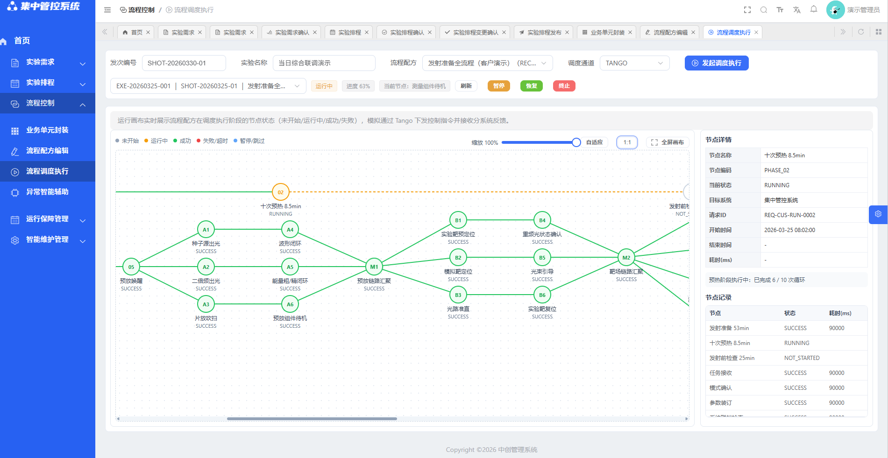

用户界面示例

布局结构：采用常见的布局方式，如顶部导航栏、左侧菜单栏、主要内容区域和底部信息栏。导航栏应清晰展示主要功能模块，方便用户快速定位和切换；菜单栏提供详细的功能分类和子菜单选项；主要内容区域根据用户操作动态展示相应内容；底部信息栏可显示版权信息、系统状态等。

报表页面显示格式及内容

表格报表：对于数据展示类的报表，采用表格形式呈现。表格应具备清晰的表头，明确标识各列数据的含义；数据行应整齐排列，便于用户浏览和对比；支持分页显示，当数据量较大时，可通过分页控件进行翻页操作；提供排序功能，用户可点击表头对数据进行升序或降序排列。

图表报表：根据数据特点，选择合适的图表类型（如柱状图、折线图、饼图等）进行可视化展示。图表应具有清晰的标题和图例，准确传达数据信息；支持交互操作，如鼠标悬停显示数据详情，方便用户深入分析数据。

报表内容：报表应包含必要的数据字段，根据业务需求进行筛选和展示。同时，可提供导出功能，支持将报表数据导出为常见的文件格式（如Excel、PDF等），方便用户进行进一步处理和分享。

菜单页面显示格式及内容

菜单结构：采用层级式菜单结构，将功能模块进行合理分类和分级展示。主菜单涵盖系统的核心功能，子菜单则提供更详细的功能选项，确保菜单层次清晰，易于理解和操作。

菜单样式：菜单项应具有明显的视觉标识，如不同的图标、颜色或字体样式，以区分不同功能。当鼠标悬停在菜单项上时，应显示相应的提示信息，帮助用户了解该功能的作用。

菜单内容：菜单应包含系统所有的功能入口，确保用户能够方便地访问各个功能模块。同时，可根据用户的角色和权限，动态显示或隐藏部分菜单项，实现个性化的菜单展示。

**2.用户命令格式**

操作按钮：在界面中提供明确、直观的操作按钮，按钮上应标注清晰的功能名称或图标，方便用户识别和点击。按钮的样式应与整体界面风格一致，具有明显的可点击状态反馈（如鼠标悬停变色、点击凹陷效果等）。

命令输入框：对于需要用户输入命令或参数的操作，提供专门的输入框。输入框应具有清晰的提示信息，告知用户需要输入的内容格式和要求。同时，可对输入内容进行实时验证，当用户输入不符合要求时，及时给出错误提示。

**3.程序功能键的可用性**

功能键布局合理：将常用的功能键放置在用户容易触及的位置，如界面顶部或左侧，减少用户的操作路径和操作时间。同时，根据功能的相关性进行分组排列，使功能键的布局更加有条理，便于用户查找和使用。

功能键状态明确：功能键应具有明确的状态标识，如可用状态、禁用状态、选中状态等。当功能键处于禁用状态时，应显示为灰色或不可点击的样式，并给出相应的提示信息，告知用户该功能当前不可用的原因。

功能键响应及时：用户点击功能键后，系统应立即做出响应，执行相应的操作。如果操作需要一定时间完成，应显示加载提示信息，告知用户操作正在进行，避免用户误以为操作未成功而重复点击。

功能键可访问性：确保功能键能够通过键盘进行操作，方便一些特殊用户（如使用屏幕阅读器的用户）使用。同时，为功能键设置合适的tab键顺序，使用户能够通过键盘依次访问各个功能键。

**4.错误信息的格式**

错误信息显示位置：错误信息应在用户操作的相关位置附近显示，方便用户快速定位和发现问题。例如，当用户在输入框中输入错误信息时，错误提示应显示在输入框下方或旁边。

错误信息内容：错误信息应清晰、明确地告知用户错误的原因和解决方法。避免使用过于专业或模糊的技术术语，使用通俗易懂的语言表达。例如，当用户输入的密码不符合要求时，错误提示可显示为“密码长度至少为6位，请重新输入”。

错误信息样式：错误信息应采用醒目的样式进行显示，如红色字体、加粗显示或带有警示图标等，以引起用户的注意。同时，错误信息的背景可设置为浅色，与正常内容形成对比，提高可读性。

错误信息记录：系统应记录用户操作过程中出现的错误信息，包括错误时间、错误类型、错误位置等，方便开发人员进行问题排查和修复。同时，可提供错误信息查询功能，允许用户查看自己操作过程中出现的错误记录。

**5.日志信息格式**

 日志信息输出结构定义表

| 序号 | 字段 | 含义 |
| --- | --- | --- |
| 1 | LogTimestamp | 时间戳（YYYY-MM-DD HH:MM:SS.XXX，其中XXX为三位毫秒） |
| 2 | LogLevel | 日志等级（见表4） |
| 3 | LogSource | 日志源（如设备名、用户名等） |
| 4 | LogMsg | 日志信息 |
| 5 | LogNDC | 预留 |
| 6 | ThreadID | 预留 |

日志等级（LogLevel）定义为DEBUG、INFO、WARN、ERROR和FATAL五个等级，INFO以上的仅限于关键日志信息，具体含义下表。

 日志等级说明表

| 序号 | 等级 | 含义 |
| --- | --- | --- |
| 1 | DEBUG | 调试信息，一般用于开发者调试软件，如软件执行路径跟踪等 |
| 2 | INFO | 给软件用户的操作提示或记录信息 |
| 3 | WARN | 警告 |
| 4 | ERROR | 一般错误 |
| 5 | FATAL | 致命错误（不可继续运行，程序可能关闭） |

不同级别的日志可采用不同的颜色或样式进行区分，方便用户快速识别和筛选。

日志信息存储：日志信息应存储在指定的文件中，确保日志数据的安全性和完整性。同时，应根据日志数据的大小和重要性，设置合理的日志存储周期和清理策略，避免日志数据过多占用系统资源。

日志信息查看：提供日志信息查看功能，允许用户根据时间、级别、操作类型等条件进行日志查询和筛选。同时，可支持日志信息的导出功能，方便用户将日志数据导出为文件进行进一步分析。

**6.状态信息显示格式**

操作状态信息：在用户执行操作过程中，实时显示操作的状态信息，如操作进度、操作结果等。操作进度可通过进度条或百分比数字进行展示，操作结果可采用成功、失败等明确的标识进行显示。同时，当操作出现异常时，应及时给出错误提示信息，告知用户操作失败的原因。

状态信息样式：状态信息应采用与整体界面风格一致的样式进行显示，同时根据状态的重要程度和紧急程度，采用不同的颜色或图标进行区分。

## 硬件接口

以工程设计时智能断路器、语音视频监控、警灯警报设备选型结果确定硬件接口需求。

## 软件接口

### 公共接口

集中管控系统与其他分系统（组件）的系统服务层软件在装置运行过程中的大部分交互过程存在共性，故此定义出公共接口。

运维任务管控组件提供的公共接口为：服务权限验证、故障上报、服务权限申请、执行结果反馈、系统状态反馈、服务标识同步、发射控制、参数配置。

状态监控组件提供的公共接口为：健康度反馈。

控制环境组件提供的公共接口为：远程开/关机、自检、功能检查。

【说明】：

服务权限验证、故障上报、服务权限申请、执行结果反馈、系统状态反馈、参数配置接口与集中管控系统运维任务管控组件对接；服务标识同步接口与运维任务管控组件数据库对接。

远程开/关机、开机自检、功能检查、发射控制由集中管控系统下发指令，各分系统执行并反馈。

数据库接口见相应系统/分系统的“数据存储共享”章节，本文档明确运维任务管控组件需要快速读取的数据类别（发射后出具发射报告使用），暂不对数据库接口进行细致描述（包括需要读取的表和字段，以及具体的接口定义）。

装置各系统/分系统的用户管理由运维任务管控组件统一管理（用户认证的具体实现方式后续确定），设计阶段各系统/分系统完成角色（一般按三类人员划分，即运行人员、维护人员、数据分析人员）和对应的软件功能权限配置设计。

装置运行阶段编号、发次编号定义如下表。

装置运行过程中，各系统服务软件的交互过程如下图。

装置运行阶段编号定义

| 序号 | 实验类型 | 类型编号 | 阶段名称 | 阶段编号 | 备注 |
| --- | --- | --- | --- | --- | --- |
|  | 调试 | TS | 发射准备 | A |  |
|  |  |  | 发射 | B |  |
|  |  |  | 后处理 | C |  |
|  | 维护 | WH | 发射准备 | A |  |
|  |  |  | 发射 | B |  |
|  |  |  | 后处理 | C |  |
|  | 实验 | SY | 发射准备 | A |  |
|  |  |  | 发射 | B |  |
|  |  |  | 后处理 | C |  |

              - 装置发次编号定义

| 序号 | 编号名称 | 编号规则 | 编号示例 | 备注 |
| --- | --- | --- | --- | --- |
| 1 | 发次编号 | 类型编号+年月日+4位序号 | SY20260205XXXX(0001~9999) | 每年累计编号、自动生成，任务单唯一ID（主键） |

【说明】：

- 装置发次编号由运维任务管控组件在执行管控流程时下发，同时给出当前发射阶段编号。

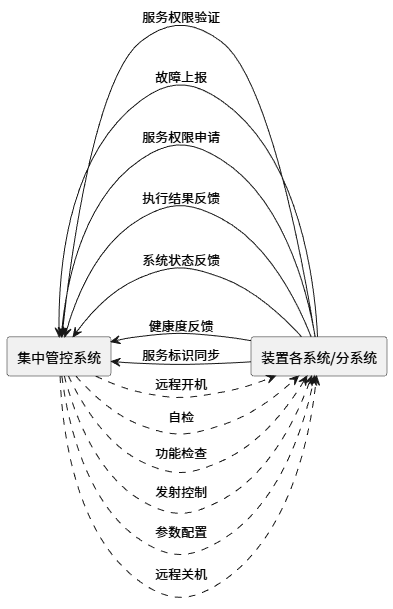

集中管控系统的公共接口关系

#### 远程开机

##### 描述

由集中管控系统控制环境组件下发远程开机指令，装置各系统/分系统执行并进行反馈执行结果。

##### 输入

任务编号

##### 输出

接收状态（0：失败；1：收到；2：无服务权限）

#### 远程关机

##### 描述

由集中管控系统控制环境组件下发远程关机指令，装置各系统/分系统执行并进行反馈执行结果。

##### 输入

任务编号

##### 输出

接收状态（0：失败；1：收到；2：无服务权限）

#### 自检

##### 描述

集中管控系统运维任务管控组件下达开机自检任务，装置各系统/分系统执行并进行反馈执行结果。

【说明】：

- 系统服务层软件首先要使用运维任务管控组件提供的“服务权限验证接口”进行验证，再执行自检流程，最后进行执行结果反馈。
- 系统服务层软件要与运维任务管控组件确认是否有例行巡检（开机自检后的动作，流程与开机自检流程一致/类似，需要确认服务软件权限）。
- 开机自检一般要求为运行当天首次开机，判断各类设备上电是否正常，工作状态是否正常；远程开机后一定时间内使用该接口。

##### 输入

任务编号，发次编号，阶段编号。

##### 输出

接收状态（0：失败；1：收到；2：无服务权限）

【说明】：当自检标识为“1”时，不执行后续动作视为“正常”。

#### 功能检查

##### 描述

由集中管控系统运维任务管控组件下发功能检查指令，装置各系统/分系统执行并进行反馈。

泵浦分系统功能检查阶段执行预电离流程。

##### 输入

任务编号。

##### 输出

接收状态（0：失败；1：收到；2：无服务权限）

#### 服务权限申请

##### 描述

该接口由运维任务管控组件提供。该接口应对装置各系统运行过程中出现的异常情况，当出现异常且需要在发次间维护时，需经装置运行值班长/负责人同意后进行。装置各系统/分系统给出所需服务标识清单（含自身标识），调用该接口申请权限。

【说明】：

- 该接口是集中管控流程节点是否长时间暂停/返回上一步/流程中止的前提条件。

##### 输入

服务标识（申请方），服务标识（申请对象）。

##### 输出

反馈结果（1：申请成功；0：申请失败）。

#### 服务权限验证

##### 描述

该接口由运维任务管控组件提供。运维任务管控组件下达控制类任务时（控制类接口），系统服务层软件应调用运维任务管控组件提供的服务权限验证接口完成所需的全部服务软件（含自身系统服务软件）的使用权限验证，验证通过后方可执行任务。

【说明】：

- 贯彻服务权限验证机制，要求装置所有系统的服务请求必须带有请求方服务标识（各系统/分系统服务标识、设备服务标识）。
- 运维任务管控组件下达的任务完成以后，相关系统/分系统服务、设备服务权限默认收归运维任务管控组件。
- 控制类接口均需进行权限验证，状态类、数据类接口无须权限验证。
- 正常情况（无故障）下验证不通过需使用该接口重新验证；异常情况下应使用“服务权限申请”接口。
- 每天开机后，系统服务层软件自行访问运维任务管控组件数据库提供的“服务标识同步”接口读取全部服务软件标识，一般首次登录后读取一次即可（若当天有更新则另行通知）；各系统/分系统自行抽取控制类接口所需的服务标识。
- 验证通过的标准为系统服务软件提交的全部服务标识（含自身）与运维任务管控组件已分配的服务标识、权限匹配。
- 正常情况下超时，权限不变更；相关系统要给出完成控制类任务的预期时长，供运维任务管控组件制定服务权限分配表、跟踪流程执行进度使用。

##### 输入

系统服务标识（请求方）、系统服务标识（响应方）、设备服务标识（响应方）。

              - 服务权限验证输入参数

| 参数名 | 类型 | 必填 | 说明 |
| --- | --- | --- | --- |
| serviceList | DevVarString Array | 是 | 服务软件列表（必须包含自身系统服务软件和其他依赖服务软件）。 示例：["system_service_layer","launch_system","monitor_system"]关键要求：列表中必须包含调用方自身系统服务软件（如system_service_layer），否则验证失败 |
| caller | DevString | 是 | 调用方标识（即系统服务层软件自身名称，用于权限上下文匹配）。示例：“system_service_layer"必须与serviceList中自身系统服务软件名称一致 |
| operation | DevString | 是 | 操作类型（用于权限粒度控制，如controlLaunch、shutdown）。若未指定，视为通用权限验证（需所有服务软件有基础权限） |

##### 输出

              - 服务权限验证输出参数

| 参数名 | 类型 | 说明 |
| --- | --- | --- |
| results | DevString | JSON格式字符串，包含每个服务软件的权限状态：{"serviceA":"allowed","serviceB":"denied",}键：服务软件名（必须与serviceList一致）。值：“allowed”（通过）或“denied”（拒绝） |
| allAllowed | DevBoolean | 整体验证结果：true=所有服务软件权限通过；false=至少一个服务软件权限拒绝 |
| errorMessage | DevString | 错误描述（仅当allAllowed=false时有效）。 示例：“Permissiondeniedforservice:launch_system(operation:controlLaunch)" |

错误处理：

              - 服务权限验证错误码

| 错误码 | 说明 | 触发条件 |
| --- | --- | --- |
| INVALID_SERVICE_LIST | 服务列表无效 | serviceList为空、缺少caller或包含重复项 |
| INVALID_CALLER | 调用方标识无效 | caller不在serviceList中（自身系统服务软件未包含） |
| INVALID_SERVICE_NAME | 服务名未注册 | serviceList中存在运维任务管控组件未注册的服务软件 |
| PERMISSION_DENIED | 权限拒绝 | allAllowed=false（至少一个服务软件权限不足） |
| SYSTEM_ERROR | 服务端异常 | 运维任务管控组件内部错误（如数据库连接失败） |

#### 故障上报

##### 描述

该接口由运维任务管控组件提供。装置各系统/分系统在开机自检（例行巡检），以及后续运行过程中若出现故障，需立即调用该接口向运维任务管控组件上报故障信息。

故障上报的数据表如下。“√”表示该数据项为必填项，需及时上报。

              - 故障上报数据说明

| 序号 | 数据名称 | 说明 |
| --- | --- | --- |
| 1 | 故障编号（按照三性设计的编号定义进行编号） | √ |
| 2 | 故障发生时间（年月日时分秒、date格式、系统获取） | √ |
| 3 | 故障所在束线 | 有必填 |
| 4 | 故障所属系统/分系统/组件（优先用系统或组件编号） | √ |
| 5 | 故障器件信息（生产厂家、序列号、启用时间） | 有必填 |
| 6 | 严酷度类别（灾难性、致命、严重、一般、轻微） | 有必填 |
| 7 | 发生概率等级（经常、有时、偶然、很少、极少） | 有必填 |
| 8 | 故障现象 | 有必填 |

##### 输出

接收状态（0：异常；1：收到）。

#### 执行结果反馈

##### 描述

该接口由运维任务管控组件提供。系统服务层软件根据运维任务管控组件下发的控制类任务编号调用该接口，及时反馈任务执行的最终状态。

说明：

- 运维任务管控组件下达控制类任务时给出任务编号并记录任务信息及开始时间判断任务是否超时，正常状态下超时默认继续执行任务。系统服务层软件在任务完成后根据任务编号调用该接口反馈最终状态。
- 该接口不需要服务权限验证。

##### 输入

任务编号、执行结果（0：失败；1：成功），失败原因。

##### 输出

接收状态（0：异常；1：收到）。

#### 系统状态反馈

##### 描述

运维任务管控组件通过订阅装置各系统/分系统selfCheckState和selfCheckStatus属性实时获取系统状态，当系统状态发生变化时反馈当前系统状态。

【说明】：

- 状态标识要求：按束级→设备级（单一设备或元器件）的从属关系记录状态，无法识别的除外；系统中仅有部（组）件/设备且无法与束线对应的，应给出部（组）件的总状态、单个部（组）件/设备的状态，无法识别的除外。
- 状态判定规则：给出正常、异常两种状态，如何存在异常需给出异常信息。
- 该接口不需要“服务权限验证”。

##### 输入

	系统标识/组件标识，束线，系统状态，异常信息。

##### 输出

接收状态（0：异常；1：收到）。

#### 健康度反馈

##### 描述

运维任务管控组件通过订阅装置各系统/分系统healthState和healthStatus属性实时获取健康度信息，当系统健康度发生变化时反馈当前系统健康度。

##### 输入

系统标识/组件标识、所属束线，系统/分系统健康度（%）、关键设备名称、关键设备编号、关键设备健康度（%）。

##### 输出

接收状态（0：异常；1：收到）。

#### 参数配置

##### 描述

该接口由装置各系统/分系统提供。由运维任务管控组件下发参数配置指令，装置各系统/分系统执行并进行反馈。

装置各系统/分系统在接收到参数配置指令时，根据发次编号、阶段编号，束线编号从运维任务管控组件提供的参数配置表获取各自所需参数配置信息。

##### 输入

任务编号、发次编号。

##### 输出

接收状态（0：失败；1：收到：2：无服务权限）。

#### 发射控制

##### 描述

集中管控系统运维任务管控组件调用发射接口下达发射准备、发射、发射后处理（仅针对数据采集）三个阶段的任务，分系统反馈任务执行情况；与发射流程密切相关的系统服务层软件都应提供该接口。

##### 输入

任务编号、发次编号，阶段编号，指令标识（0：发射准备；1：发射数据采集2：发射流程结束；3：发射流程中止）。

【说明】：

- 各指令标识适用的各系统/分系统，见各系统接口章节。
- 数据采集的含义是：各系统将需要永久保存的数据上传至各自系统数据库。
- 对需要永久保存的数据，一般要求为：集中管控系统对所有系统数据库统一配置，各系统无权增加表字段。
- 发射流程中止的情况包括：发射过程中泵浦分系统紧急停充反馈；前端安全联锁已执行；集中管控系统的发射许可已执行；除上述系统外，相关系统收到集中管控系统下达的“发射流程中止”指令后，应自行恢复到发射准备之前的状态。

##### 输出

接收状态（0：失败；1：收到；2：无服务权限）

#### 服务标识同步

该接口由集中管控系统数据库提供。装置其他系统/分系统服务软件应每天访问该接口读取全装置系统服务软件和设备服务软件标识（简称：服务标识），将数据同步到各分系统。

#### 数据存储共享

该接口是装置各系统/分系统数据库提供的数据快速读取接口。

【说明1】：本文档各系统/分系统接口章节中的“数据存储共享”接口用于运维任务管控组件快速生成发射报告/显示使用。各系统/分系统数据库的具体接口（含数据存储共享）后续完成，各系统/分系统自行明确需要快速读取的数据，为数据库的统一开发提供条件）。

【说明2】：对故障数据，各系统/分系统应适时访问运维任务管控组件数据库，读取各自系统的全部故障记录，完成故障闭环，原则上各系统/分系统数据库不再重复存储故障数据。完整的故障记录表如下：

              - 故障记录说明

| 序号 | 数据名称 | 说明 |
| --- | --- | --- |
| 1 | 故障编号 | 系统自动生成 |
| 2 | 故障发生时间 | date格式（暂定到秒）、系统获取 |
| 3 | 发次编号 | 运维任务管控组件给出 |
| 4 | 任务类别 | 运维任务管控组件给出 |
| 5 | 故障所在束线 | 束线编号 |
| 6 | 故障发生阶段（发射准备、发射、发射后处理） | 运维任务管控组件给出 |
| 7 | 故障所属系统/分系统/组件 | 故障上报时给出，优先用系统或组件编号 |
| 8 | 故障器件信息（生产厂家、序列号） | 未及时上报的需跟踪 |
| 9 | 严酷度类别（灾难性、致命、严重、一般、轻微） | 未及时上报的需跟踪 |
| 10 | 发生概率等级（经常、有时、偶然、很少、极少） | 未及时上报的需跟踪 |
| 11 | 故障检测方法 | 未及时上报的需跟踪 |
| 12 | 故障分类（硬件、软件、网络） | 未及时上报的需跟踪 |
| 13 | 故障现象 | 未及时上报的需跟踪 |
| 14 | 故障原因 | 未及时上报的需跟踪 |
| 15 | 故障影响（功能丧失、任务失败、时间影响、经济影响） | 未及时上报的需跟踪 |
| 16 | 故障应对措施（临时措施、纠正措施） | 未及时上报的需跟踪 |
| 17 | 故障处理开始时间（系统获取，精确到秒） | 未及时上报的需跟踪 |
| 18 | 故障处理结束时间（系统获取，精确到秒） | 未及时上报的需跟踪 |
| 19 | 故障处理用时（系统自行计算，精确到秒） | 未及时上报的需跟踪 |
| 20 | 其他 | 未及时上报的需跟踪 |

【说明3】：日志数据按照《GXLF实验平台电气工程设计规范》规定的“日志信息输出要求”（5.3.6章节）进行记录，及时保存到分布式文件存储服务器中，供运维分析使用。

#### 单点登录相关接口

##### 概述

	单点登录的核心逻辑：一次认证（在认证中心），多系统免密访问。通过 Token 作为身份凭证在系统和认证中心之间传递，确保了用户在多个业务系统间的无缝切换，提升了用户体验和系统安全性。基于Token的单点登录（SSO）的核心交互过程，具体步骤解释如下：

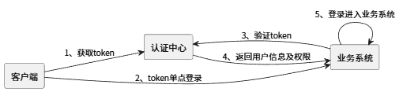

1. 获取 Token

客户端（用户浏览器）向认证中心发起请求，目的是获取用于认证的 Token。这一步是单点登录的基础，客户端需要先从认证中心获得有效的认证凭证。

2. Token 单点登录

客户端携带已获取的 Token 向业务系统发起单点登录请求。此时，客户端无需再次输入账号密码，而是直接利用 Token 来证明用户身份，尝试访问目标业务系统。

3. 验证 Token

业务系统接收到客户端的 Token 后，会与认证中心进行交互，将 Token 提交给认证中心进行合法性验证。认证中心会根据自身的会话状态、Token 的签名、有效期等信息，判断该 Token 是否有效。

4. 返回用户信息及权限

如果认证中心验证 Token 有效，会将对应的用户信息（如用户名、用户 ID、角色等）以及该用户在当前业务系统中的权限信息返回给业务系统。这些信息是业务系统进行后续权限控制、个性化展示的依据。

5. 登录进入业务系统

业务系统收到认证中心返回的用户信息和权限后，会完成自身的登录流程，创建用户的本地会话，允许用户进入业务系统并使用相应功能。至此，用户实现了从认证中心到业务系统的单点登录，无需重复认证。

##### 获取token接口

###### 描述

客户端（用户浏览器）向认证中心发起请求，目的是获取用于认证的 Token。这一步是单点登录的基础，客户端需要先从认证中心获得有效的认证凭证。

###### 输入

用户名、用户密码。

###### 输出

请求结果（成功、失败）、TOKEN字符串。

##### token验证接口

###### 描述

业务系统接收到客户端的 Token 后，会与认证中心进行交互，将 Token 提交给认证中心进行合法性验证。如果认证中心验证 Token 有效，会将对应的用户信息以及该用户在当前业务系统中的权限信息返回给业务系统。

###### 输入

TOKEN字符串。

###### 输出

请求结果（成功、失败），如果请求成功返回用户信息，用户信息如下：

| 序号 | 属性 | 属性名 | 属性类型 |
| --- | --- | --- | --- |
| 1 | userName | 用户姓名 | String |
| 2 | userCode | 用户编码 | String |
| 3 | orgCode | 所在单位编码 | String |
| 4 | orgName | 所在单位名称 | String |
| 5 | deptCode | 所在部门编码 | String |
| 6 | deptName | 所在部门名称 | String |
| 7 | authMenuList | 授权菜单列表 | List |
| 8 | authRoleList | 授权角色列表 | List |
| 9 | authStrategyList | 授权策略列表 | List |

### 运维任务管控组件的接口

#### 光纤种子源组件接口

##### 概述

光纤种子源组件的接口关系如下：

光纤种子源组件接口与集中管控流程的关系

| 序号 | 接口名称 | 发射准备阶段 | 发射阶段 | 后处理阶段 |
| --- | --- | --- | --- | --- |
|  |  |  |  |  |
| 1 | 种子源出光 | ● |  |  |
| 2 | 种子源激光参数采集 |  |  | ● |
| 3 | 种子源待机 |  |  | ● |

集中管控系统与光纤种子源组件软件接口关系示意图

##### 种子源出光

###### 描述

光纤种子源组件接收运维任务管控组件下达的种子源出光任务（需要的束线编号从参数配置表读取），执行并反馈。光纤种子源组件开机后默认关光，直至运维任务管控组件下达“种子源出光”指令为止。

###### 输入

任务编号、发次编号，阶段编号，出光标识（0：关光；1：出光）。

###### 输出

接收状态（0：失败；1：收到；2：无服务权限）。

##### 种子源激光参数采集

###### 描述

光纤种子源组件接收运维任务管控组件下达的种子源激光参数采集任务执行并反馈。

###### 输入

任务编号

###### 输出

接收状态（0：异常；1：收到）。

##### 种子源待机

###### 描述

光纤种子源组件接收运维任务管控组件下达的种子源待机任务（由出光状态切换为待机状态），执行并反馈。

###### 输入

任务编号

###### 输出

接收状态（0：失败；1：收到；2：无服务权限）

#### 二倍频宽带激光注入组件接口

##### 概述

二倍频宽带激光注入组件的接口关系如下：

二倍频宽带激光注入组件接口与集中管控流程的关系

| 序号 | 接口名称 | 发射准备阶段 | 发射阶段 | 后处理阶段 |
| --- | --- | --- | --- | --- |
|  |  |  |  |  |
| 1 | 二倍频出光 | ● |  |  |
| 2 | 二倍频激光参数采集 |  |  | ● |
| 3 | 二倍频待机 |  |  | ● |

集中管控系统与二倍频宽带激光注入组件软件接口关系示意图

##### 二倍频出光

###### 描述

接收运维任务管控组件下达的二倍频出光任务（需要的束线编号从参数配置表读取），执行并反馈。二倍频宽带激光注入组件开机后默认关光，直至运维任务管控组件下达“二倍频出光”指令为止。

###### 输入

任务编号，发次编号，阶段编号，出光标识（0：关光；1：出光）。

###### 输出

接收状态（0：失败；1：收到；2：无服务权限）

##### 二倍频激光参数采集

###### 描述

二倍频宽带激光注入组件接收运维任务管控组件下达的二倍频激光参数采集任务执行并反馈。

###### 输入

任务编号

###### 输出

接收状态（0：失败；1：收到；2：无服务权限）

##### 二倍频待机

###### 描述

二倍频宽带激光注入组件接收运维任务管控组件下达的二倍频待机任务（由出光状态切换为待机状态），执行并反馈。

###### 输入

任务编号

###### 输出

接收状态（0：失败；1：收到；2：无服务权限）

#### 再生与双程放大组件接口

##### 概述

再生与双程放大组件的接口关系如下：

再生与双程放大接口与集中管控流程的关系

| 序号 | 接口名称 | 发射准备阶段 | 发射阶段 | 后处理阶段 |
| --- | --- | --- | --- | --- |
|  |  |  |  |  |
| 1 | 预放唤醒 | ● |  |  |
| 2 | 预放出打靶光 | ● |  |  |
| 3 | 能量粗闭环 | ● |  |  |
| 4 | 能量精闭环 | ● | ● |  |
| 5 | 能量计清零 |  | ● |  |
| 6 | 能量数据采集 |  |  | ● |
| 7 | 待机 |  |  | ● |

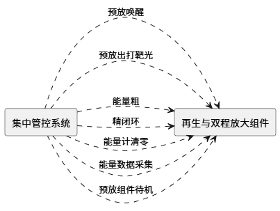

集中管控系统与再生与双程放大服务软件接口关系示意图

##### 预放唤醒

###### 描述

再生与双程放大组件接收运维任务管控组件下发的预放唤醒任务指令，反馈执行结果。

###### 输入

任务编号，发次编号，束线编号。

###### 输出

接收状态（0：失败；1：收到；2：无服务权限）

##### 预放出打靶光

###### 描述

再生与双程放大组件接收运维任务管控组件下发的预放出打靶光任务指令，反馈执行结果。

###### 输入

任务编号，发次编号，阶段编号，出光标识（0：关光；1：出光）。

###### 输出

接收状态（0：失败；1：收到；2：无服务权限）。

##### 能量粗闭环

###### 描述

再生与双程放大组件接收运维任务管控组件下达的能量粗闭环任务，执行并反馈。

###### 输入

任务编号，发次编号、束线编号、预放目标能量。

###### 输出

接收状态（0：异常；1：收到；2：无服务权限）。

##### 能量精闭环

###### 描述

再生与双程放大组件接收运维任务管控组件下达的能量精闭环任务，执行并反馈。

###### 输入

任务编号，发次编号、束线编号、预放目标能量。

###### 输出

接收状态（0：失败；1：收到；2：无服务权限）

##### 能量计清零

###### 描述

再生与双程放大组件接收运维任务管控组件下达的能量计清零任务，执行并反馈。

###### 输入

任务编号，发次编号、束线编号。

###### 输出

接收状态（0：失败；1：收到；2：无服务权限）

##### 能量数据采集

###### 描述

再生与双程放大组件接收运维任务管控组件下达的能量数据采集任务，执行并反馈。

###### 输入

任务编号，发次编号，阶段编号。

###### 输出

接收状态（0：失败；1：收到；2：无服务权限）

##### 预放组件待机

###### 描述

再生与双程放大组件接收运维任务管控组件下达的待机任务，执行并反馈。

###### 输入

任务编号。

###### 输出

接收状态（0：失败；1：收到；2：无服务权限）

#### 多程放大分系统接口

##### 概述

多程放大系统的接口关系如下：

多程放大系统接口与集中管控流程的关系

| 序号 | 接口名称 | 发射准备阶段 | 发射阶段 | 后处理阶段 |
| --- | --- | --- | --- | --- |
|  |  |  |  |  |
| 1 | 光路准直 | ● |  |  |
| 2 | 重频光状态确认 | ● |  |  |
| 3 | 打靶状态确认 | ● |  |  |

集中管控系统与多程放大系统服务软件接口关系示意图

##### 光路准直

###### 描述

多程放大系统接收运维任务管控组件下发的光路准直任务指令，反馈执行结果。

###### 输入

任务编号，发次编号，阶段编号。

###### 输出

接收状态（0：失败；1：收到；2：无服务权限）。

##### 重频光状态确认

###### 描述

多程放大系统接收运维任务管控组件下达的重频光状态确认指令，并反馈。

###### 输入

任务编号，发次编号，阶段编号。

###### 输出

接收状态（0：失败；1：收到；2：无服务权限）。

##### 打靶状态确认

###### 描述

多程放大系统接收运维任务管控组件下达的打靶状态确认指令，执行并反馈。

###### 输入

任务编号，发次编号。

###### 输出

接收状态（0：失败；1：收到；2：无服务权限）。

#### 开关驱动源组件接口

##### 概述

开关驱动源组件的接口关系如下：

开关驱动源组件接口与集中管控流程的关系

| 序号 | 接口名称 | 发射准备阶段 | 发射阶段 | 后处理阶段 |
| --- | --- | --- | --- | --- |
|  |  |  |  |  |
| 1 | 开关充电 |  | ● |  |
| 2 | 触发准备 |  | ● |  |
| 3 | 放电波形采集 |  |  | ● |
| 4 | 开关待机 |  |  | ● |

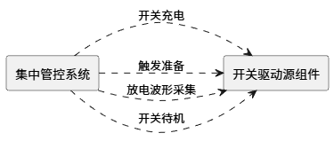

集中管控系统与开关驱动源组件软件接口关系示意图

##### 开关充电

###### 描述

开关驱动源组件接收运维任务管控组件下达的开关充电任务，执行并反馈。

###### 输入

任务编号，发次编号，束线编号。

###### 输出

接收状态（0：失败；1：收到；2：无服务权限）

##### 触发准备

###### 描述

开关驱动源组件接收运维任务管控组件下达的触发准备任务，执行并反馈。

###### 输入

任务编号，发次编号，束线编号。

###### 输出

接收状态（0：失败；1：收到；2：无服务权限）

##### 放电波形采集

###### 描述

开关驱动源组件接收运维任务管控组件下达的放电波形采集任务，执行并反馈。

###### 输入

任务编号，发次编号、束线编号。

###### 输出

接收状态（0：失败；1：收到；2：无服务权限）

##### 开关待机

###### 描述

开关驱动源组件接收运维任务管控组件下达的开关待机任务，执行并反馈。

###### 输入

任务编号。

###### 输出

接收状态（0：失败；1：收到；2：无服务权限）

#### 泵浦分系统接口

##### 概述

泵浦分系统的接口关系如下：

泵浦分系统接口与集中管控流程的关系

| 序号 | 接口名称 | 发射准备阶段 | 发射阶段 | 后处理阶段 |
| --- | --- | --- | --- | --- |
|  |  |  |  |  |
| 1 | 泵浦发射准备 | ● |  |  |
| 2 | 发射充电准备 |  | ● |  |
| 3 | 发射充电 |  | ● |  |
| 4 | 泵浦触发准备 |  | ● | ● |
| 5 | 泵浦数据采集 |  |  | ● |
| 6 | 泵浦待机 |  |  | ● |
| 7 | 预电离发射准备 |  |  | ● |
| 8 | 预电离发射充电 |  |  | ● |
| 9 | 充电进程反馈 |  |  | ● |
| 10 | 关机复位（预电离、发射） |  | ● | ● |
| 11 | 紧急停充反馈 |  | ● | ● |

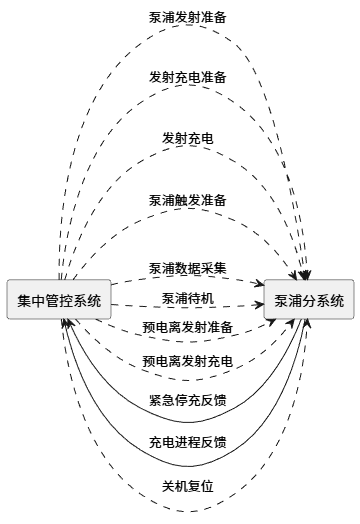

集中管控系统与泵浦分系统服务软件接口关系示意图

##### 泵浦发射准备

###### 描述

泵浦分系统接收运维任务管控组件下发的泵浦发射准备指令，执行并反馈。

###### 输入

任务编号，发次编号，束线编号，预、主电压。

###### 输出

接收状态（0：失败；1：收到；2：无服务权限）

##### 发射充电准备

###### 描述

泵浦分系统接收运维任务管控组件下达的能源发射充电准备指令，执行并反馈。

###### 输入

任务编号，发次编号，束线编号，预、主电压。

###### 输出

接收状态（0：失败；1：收到；2：无服务权限）

##### 发射充电

###### 描述

泵浦分系统接收运维任务管控组件下达的发射充电任务指令，执行并反馈。

###### 输入

任务编号，发次编号，束线编号，预、主电压，发射充电指令标识。

###### 输出

接收状态（0：失败；1：收到；2：无服务权限）

##### 预电离发射准备

###### 描述

泵浦分系统接收运维任务管控组件下达的预电离发射准备指令，执行并反馈。

###### 输入

任务编号，发次编号，束线编号，预、主电压。

###### 输出

接收状态（0：失败；1：收到；2：无服务权限）

##### 预电离发射充电

###### 描述

泵浦分系统接收运维任务管控组件下达的预电离发射充电任务指令，执行并反馈。

###### 输入

任务编号，发次编号，束线编号，预、主电压。

###### 输出

接收状态（0：失败；1：收到；2：无服务权限）

##### 泵浦触发准备

###### 描述

泵浦分系统接收运维任务管控组件下达的泵浦触发准备指令，执行并反馈。

###### 输入

任务编号，发次编号，束线编号，预、主电压。

###### 输出

接收状态（0：失败；1：收到；2：无服务权限）

##### 泵浦数据采集

###### 描述

泵浦分系统接收运维任务管控组件下达的泵浦数据采集指令，执行并反馈。

###### 输入

任务编号，发次编号，束线编号。

###### 输出

接收状态（0：失败；1：收到；2：无服务权限）

##### 泵浦待机

###### 描述

泵浦分系统接收运维任务管控组件泵浦待机指令，进入待机状态，执行并反馈。

###### 输入

任务编号，束线编号。

###### 输出

接收状态（0：失败；1：收到；2：无服务权限）

##### 充电进程反馈

###### 描述

泵浦分系统实时向运维任务管控组件反馈充电进程。

【说明】：该接口不需要服务权限验证。

###### 输入

发次编号，阶段编号，束线编号（按束线级提供），充电进度（百分比）。

###### 输出

接收状态（0：异常；1：收到）。

##### 关机复位（预电离、发射）

###### 描述

泵浦分系统接收运维任务管控组件关机复位指令，进入待机状态，执行并反馈。

###### 输入

任务编号，关机复位指令。

###### 输出

接收状态（0：失败；1：收到；2：无服务权限）

#### 测量取样组件接口

##### 概述

测量取样组件的接口关系如下：

测量取样组件接口与集中管控流程的关系

| 序号 | 接口名称 | 发射准备阶段 | 发射阶段 | 后处理阶段 |
| --- | --- | --- | --- | --- |
|  |  |  |  |  |
| 1 | 测量靶瞄准备 | ● |  |  |
| 2 | 测量打靶运动准备 | ● |  |  |
| 3 | 打靶测量准备 |  | ● |  |
| 4 | 激光参数采集 |  |  | ● |
| 5 | 测量组件待机 |  |  | ● |

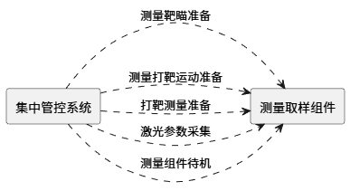

集中管控系统与测量取样组件软件接口关系示意图

##### 测量靶瞄准备

###### 描述

接收运维任务管控组件下达的测量靶瞄准备确认指令，执行并反馈。

###### 输入

任务编号，发次编号，阶段编号。

###### 输出

接收状态（0：失败；1：收到；2：无服务权限）

##### 测量打靶运动准备

###### 描述

接收运维任务管控组件下达的测量打靶运动准备指令，执行并反馈。

###### 输入

任务编号，发次编号。

###### 输出

接收状态（0：失败；1：收到；2：无服务权限）

##### 打靶测量准备

###### 描述

接收运维任务管控组件下达的打靶测量准备指令，执行并反馈。

###### 输入

任务编号，发次编号，阶段编号。

###### 输出

接收状态（0：失败；1：收到；2：无服务权限）

##### 激光参数采集

###### 描述

接收运维任务管控组件下达的激光参数采集指令，执行并反馈。

###### 输入

任务编号，发次编号，阶段编号。

###### 输出

接收状态（0：失败；1：收到；2：无服务权限）

##### 测量组件待机

###### 描述

接收运维任务管控组件下达的测量组件待机指令，执行并反馈。

###### 输入

任务编号。

###### 输出

接收状态（0：失败；1：收到；2：无服务权限）

#### 频率转换分系统接口

##### 概述

频率转换分系统的接口关系如下：

频率转换分系统接口与集中管控流程的关系

| 序号 | 接口名称 | 发射准备阶段 | 发射阶段 | 后处理阶段 |
| --- | --- | --- | --- | --- |
|  |  |  |  |  |
| 1 | 晶体位姿调整 |  | ● |  |

集中管控系统与频率转换分系统接口关系示意图

##### 晶体位姿调整

###### 描述

接收运维任务管控组件下达的晶体位姿调整任务，执行并反馈。

###### 输入

任务编号，发次编号，束线编号。

###### 输出

接收状态（0：失败；1：收到；2：无服务权限）

#### 靶瞄准定位分系统的接口

##### 概述

靶瞄准定位分系统的接口关系如下：

靶瞄准定位分系统接口与装置集中管控流程的关系

| 序号 | 接口名称 | 发射准备阶段 | 发射阶段 | 后处理阶段 |
| --- | --- | --- | --- | --- |
|  |  |  |  |  |
| 1 | 实验靶预定位 | ● |  |  |
| 2 | 模拟靶定位 | ● |  |  |
| 3 | 光束引导 | ● |  |  |
| 4 | 实验靶复位 | ● |  |  |
| 5 | 打靶状态确认 | ● |  |  |
| 6 | 靶瞄数据分析 |  |  | ● |
| 7 | 靶瞄收靶 |  |  | ● |

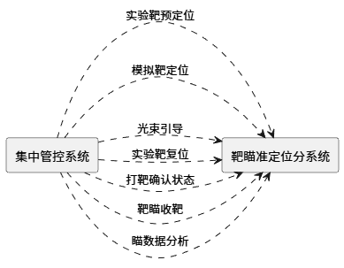

集中管控系统与靶瞄准定位系统软件接口关系示意图

##### 实验靶预定位

###### 描述

靶瞄准定位分系统接收装置运维任务管控组件下达的实验靶预定位任务，执行并反馈。

###### 输入

任务编号，发次编号，阶段编号。

###### 输出

接收状态（0：失败；1：收到；2：无服务权限）

##### 模拟靶定位

###### 描述

靶瞄准定位分系统接收装置运维任务管控组件下达的模拟靶定位任务，执行并反馈。

###### 输入

任务编号，发次编号，阶段编号，靶标识（0：主靶；1：副靶）。

###### 输出

接收状态（0：失败；1：收到；2：无服务权限）

##### 光束引导

###### 描述

靶瞄准定位分系统接收运维任务管控组件下达的光束引导任务，执行并反馈。

###### 输入

任务编号，发次编号，阶段编号。

###### 输出

接收状态（0：失败；1：收到；2：无服务权限）

##### 实验靶复位

###### 描述

靶瞄准定位分系统接收运维任务管控组件下达的实验靶复位指令，执行实验靶复位并反馈靶复位状态。

###### 输入

任务编号，发次编号，阶段编号。

###### 输出

接收状态（0：失败；1：收到；2：无服务权限）

##### 打靶状态确认

###### 描述

靶瞄准定位分系统接收运维任务管控组件下达的实验靶复位/打靶状态任务，执行并反馈；向装置运维任务管控组件反馈打靶确认状态。

###### 输入

任务编号，发次编号，阶段编号，靶标识（0：主靶；1：副靶）和靶瞄打靶状态。

###### 输出

接收状态（0：失败；1：收到；2：无服务权限）

##### 靶瞄收靶

###### 描述

接收装置运维任务管控组件打靶后处理任务（将靶支撑架退出），执行并反馈。

###### 输入

任务编号。

###### 输出

接收状态（0：失败；1：收到；2：无服务权限）

##### 靶瞄数据分析

###### 描述

接收运维任务管控组件下达的靶瞄数据分析任务，执行并反馈。

###### 输入

任务编号。

###### 输出

接收状态（0：失败；1：收到；2：无服务权限）

#### LD靶分系统的接口

##### 概述

LD靶分系统的接口关系如下：

LD靶分系统接口与装置集中管控流程的关系

| 序号 | 接口名称 | 发射准备阶段 | 发射阶段 | 后处理阶段 |
| --- | --- | --- | --- | --- |
|  |  |  |  |  |
| 1 | 模拟LD靶开罩 |  |  |  |
| 2 | LD靶复位 | ● |  |  |
| 3 | LD靶开罩 |  | ● |  |
| 4 | 收LD靶 |  |  | ● |

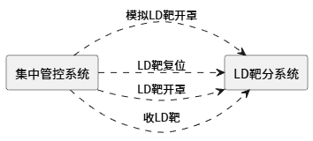

集中管控系统与LD靶分系统接口关系示意图

##### 模拟LD靶开罩

###### 描述

LD靶分系统接收装置运维任务管控组件下达的模拟LD靶开罩任务，执行并反馈。

###### 输入

任务编号，发次编号。

###### 输出

接收状态（0：失败；1：收到；2：无服务权限）

##### LD靶复位

###### 描述

LD靶分系统接收装置运维任务管控组件下达的LD靶复位任务，执行并反馈。

###### 输入

任务编号，发次编号，阶段编号。

###### 输出

接收状态（0：失败；1：收到；2：无服务权限）

##### LD靶开罩

###### 描述

LD靶分系统接收运维任务管控组件下达的LD靶开罩任务，执行并反馈。

###### 输入

任务编号，发次编号，阶段编号。

###### 输出

接收状态（0：失败；1：收到；2：无服务权限）

##### 收LD靶

###### 描述

LD靶分系统接收运维任务管控组件下达的收LD靶指令，执行并反馈。

###### 输入

任务编号，发次编号，阶段编号。

###### 输出

接收状态（0：失败；1：收到；2：无服务权限）

#### 真空靶室分系统的接口

##### 概述

真空靶室分系统的接口关系如下：

真空靶室分系统接口与装置集中管控流程的关系

| 序号 | 接口名称 | 发射准备阶段 | 发射阶段 | 后处理阶段 |
| --- | --- | --- | --- | --- |
|  |  |  |  |  |
| 1 | 抽真空 | ● | ● |  |
| 2 | 真空度反馈 | ● | ● | ● |
| 3 | 数据存储共享 |  |  |  |

集中管控系统与真空靶室分系统软件接口关系示意图

##### 抽真空

###### 描述

接收总控系统下达的靶室真空抽气任务，执行并反馈。接收到该指令后，系统动作流程：控制模式设为自动－〉系统自检－〉功能检查－〉执行控制指令－〉返回指令执行结果。

###### 输入

任务控制指令（int：0：无效，1：启动，2：停止）

###### 输出

接收状态（0：失败；1：收到，系统自检未通过；2：收到，系统自检通过，功能检查未通过；3：收到，系统自检通过，功能检查通过，真空抽气流程启动中）。

##### 真空度反馈

###### 描述

根据总控下发参数配置指令里的工作真空度要求，反馈当前真空度是否满足工作真空度要求。

###### 输入

无

###### 输出

Boolean（0：不满足，1：满足）

##### 数据存储共享

该接口为数据库接口。向装置运维任务管控组件共享真空阀门、水汽捕集泵、干泵机组、低温泵、设备故障的真空度数据和判断结果。

#### 物理实验诊断分系统接口（马存政）

##### 概述

物理实验诊断分系统与运维任务管控组件接口关系如下：

物理实验诊断分系统接口与集中管控流程的关系

| 序号 | 接口名称 | 发射准备阶段 | 发射阶段 | 后处理阶段 |
| --- | --- | --- | --- | --- |
|  |  |  |  |  |
| 1 | 诊断设备采集设置 |  | ● |  |
| 2 | 诊断设备状态确认 | ● |  |  |
| 3 | 诊断设备动作 |  | ● |  |
| 4 | 诊断设备数据采集 |  |  | ● |
| 5 | 发射后处理 |  |  | ● |

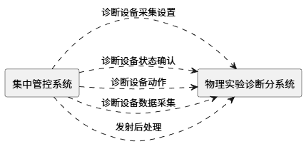

集中管控系统与物理实验诊断分系统接口关系示意图

##### 诊断设备采集设置

###### 描述

接收运维任务管控组件诊断设备采集设置指令，执行并反馈结果。

###### 输入

任务编号，发次编号、阶段编号。

###### 输出

接收状态（0：失败；1：收到：2：无服务权限）

##### 诊断设备状态确认

###### 描述

接收运维任务管控组件诊断设备状态确认指令，执行并反馈诊断设备状态。

###### 输入

任务编号、状态查询指令、查询对象标识、查询范围、查询时间。

###### 输出

接收状态（0：失败；1：收到：2：无服务权限），执行并反馈，任务标识、执行结果状态、执行结果说明、设备运行状态、设备工作模式、设备告警状态、状态采集时间。

##### 诊断设备动作

###### 描述

接收运维任务管控组件下发的诊断设备工作指令（收回、就位、试触发、上电、采集设置等），反馈执行结果。

###### 输入

任务编号、设备动作指令、动作类型（收回、就位、试触发、上电、采集设置等）、动作对象标识、动作参数、指令触发时间。

###### 输出

任务标识、执行结果状态、执行结果说明、动作执行结果、动作执行状态、失败错误码、失败原因、处理完成时间。

##### 诊断设备数据采集

###### 描述

物理实验诊断分系统接收运维任务管控组件下发的诊断设备数据采集指令，完成数据采集存储、预处理等工作，执行并反馈。

###### 输入

任务标识、数据采集指令、采集对象标识、采集参数、采集时间范围。

###### 输出

任务标识、执行结果状态、执行结果说明、数据采集结果、数据上传状态、失败错误码、失败原因、处理完成时间。

##### 发射后处理

###### 描述

物理实验诊断分系统接收运维任务管控组件下发的诊断设备发射后处理指令（如退高压、收回、下电等），反馈执行结果。

###### 输入

任务标识、发射后处理动作列表、动作类型（如退高压、收回、下电等）、动作对象标识、动作参数、指令触发时间。

###### 输出

任务标识、执行结果状态、执行结果说明、各动作执行结果、动作执行状态、失败错误码、失败原因、处理完成时间。

#### 集中同步分系统接口

##### 概述

集中同步分系统与运维任务管控组件接口关系如下：

集中同步分系统接口与集中管控流程的关系

| 序号 | 接口名称 | 发射准备阶段 | 发射阶段 | 后处理阶段 |
| --- | --- | --- | --- | --- |
|  |  |  |  |  |
| 1 | 发射准备配方 | ● |  |  |
| 2 | 测量重批配方 | ● |  |  |
| 3 | 预放重频配方 | ● |  |  |
| 4 | 测量单次配方 |  | ● |  |
| 5 | 预放单次配方 |  | ● |  |
| 6 | 同步触发 |  | ● | ● |

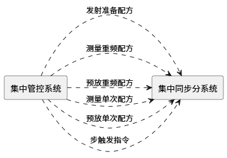

集中管控系统与集中同步分系统软件接口关系示意图

##### 发射准备配方

###### 描述

集中同步分系统接收运维任务管控组件下发的发射准备配方指令，执行并反馈任务执行情况。

###### 输入

任务编号，束线编号，发次编号。

###### 输出

接收状态（0：失败；1：收到；2：无服务权限）

##### 测量重频配方

###### 描述

集中同步分系统接收运维任务管控组件下发的测量重频配方，执行并反馈任务执行情况。

###### 输入

任务编号，发次编号，阶段编号，束线编号。

###### 输出

接收状态（0：失败；1：收到；2：无服务权限）

##### 预放重频配方

###### 描述

集中同步分系统接收运维任务管控组件下发的预放重频配方，执行并反馈任务执行情况。

###### 输入

任务编号，发次编号，阶段编号，束线编号。

###### 输出

接收状态（0：失败；1：收到；2：无服务权限）

##### 测量单次配方

###### 描述

集中同步分系统接收运维任务管控组件下发的测量单次配方，执行并反馈任务执行情况。

###### 输入

任务编号，发次编号，阶段编号，束线编号。

###### 输出

接收状态（0：失败；1：收到；2：无服务权限）

##### 预放单次配方

###### 描述

集中同步分系统接收运维任务管控组件下发的预放单次配方，执行并反馈任务执行情况。

###### 输入

任务编号，发次编号，阶段编号，束线编号。

###### 输出

接收状态（0：失败；1：收到；2：无服务权限）

##### 同步触发

###### 描述

集中同步分系统接收运维任务管控组件下发的同步触发指令，执行并反馈任务执行情况。

###### 输入

任务编号，发次编号，阶段编号，束线编号。

###### 输出

接收状态（0：失败；1：收到；2：无服务权限）

#### 冷空系统的接口

##### 概述

冷空系统的接口关系如下：

冷空系统接口与运维任务管控组件流程的关系

| 序号 | 接口名称 | 发射准备阶段 | 发射阶段 | 后处理阶段 |
| --- | --- | --- | --- | --- |
|  |  |  |  |  |
| 1 | 片放吹扫 | ● |  | ● |

集中管控系统与冷空系统软件接口关系示意图

##### 片放吹扫

###### 描述

接收运维任务管控组件下达的片放吹扫开始指令（需要的束线编号从参数配置表读取），执行并反馈。冷却/管路分系统收到该命令后开始片放吹扫，吹扫时间到后关闭片放吹扫（发送吹扫结束命令），开启小循环（发送小循环开启命令）。

接收运维任务管控组件下达的片放吹扫结束指令，冷却/管路分系统收到该命令后关闭片放吹扫（发送吹扫结束命令），开启小循环（发送小循环开启命令）。

接收运维任务管控组件下达的片放吹扫关机指令，冷却/管路分系统收到该命令后关闭片放吹扫（发送吹扫结束命令），关闭小循环（发送小循环关闭命令）。

###### 输入

任务编号，片放吹扫指令（命令：开始、结束、关机）。

###### 输出

接收状态（0：失败；1：收到；2：无服务权限）。

#### 安全联锁接口

##### 概述

安全联锁的接口关系如下：

安全联锁与运维任务管控组件流程的关系

| 序号 | 接口名称 | 发射准备阶段 | 发射阶段 | 后处理阶段 |
| --- | --- | --- | --- | --- |
|  |  |  |  |  |
| 1 | 警灯控制 |  | ● | ● |
| 2 | 警示音乐控制 |  | ● | ● |
| 3 | 清场 | ● |  |  |
| 4 | 屏蔽门控制 | ● |  |  |
| 5 | 安全管控状态控制 | ● |  | ● |

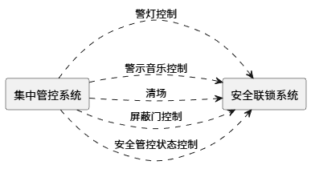

集中管控系统与安全联锁软件接口关系示意图

##### 警灯控制

###### 描述

安全联锁系统接收装置运维任务管控组件下达的警灯控制指令，执行并反馈结果。

###### 输入

任务编号，警灯控制指令（命令：0开启、1关机）。

###### 输出

接收状态（0：失败；1：收到；2：无服务权限）。

##### 警示音乐控制

###### 描述

安全联锁系统接收装置运维任务管控组件下达的警示音乐控制指令，执行并反馈结果。

###### 输入

任务编号，警示音乐控制指令（命令：0开启、1关闭）。

###### 输出

接收状态（0：失败；1：收到；2：无服务权限）。

##### 清场

###### 描述

安全联锁系统接收装置运维任务管控组件下达的清场指令，执行并反馈结果。

###### 输入

任务编号。

###### 输出

接收状态（0：失败；1：收到；2：无服务权限）。

##### 屏蔽门控制

###### 描述

安全联锁系统接收装置运维任务管控组件下达的屏蔽门控制指令，执行并反馈结果。

###### 输入

任务编号，控制指令（命令：0开启、1关机、2锁定）。

###### 输出

接收状态（0：失败；1：收到；2：无服务权限）。

##### 安全管控状态控制

###### 描述

安全联锁系统接收装置运维任务管控组件下达的安全管控状态控制指令，执行并反馈结果。

###### 输入

任务编号，安全管控状态控制指令（命令：0进入、1退出）。

###### 输出

接收状态（0：失败；1：收到；2：无服务权限）。

#### 运行参数获取与性能模型校准的接口

##### 概述

运行参数获取与性能模型校准的接口关系如下：

运行参数获取与性能模型校准接口与运维任务管控组件流程的关系

| 序号 | 接口名称 | 发射准备阶段 | 发射阶段 | 后处理阶段 |
| --- | --- | --- | --- | --- |
|  |  |  |  |  |
| 1 | 模型参数计算 |  |  | ● |

集中管控系统与模型校准系统软件接口关系示意图

##### 模型参数计算

###### 描述

运行参数获取与性能模型校准接收装置运维任务管控组件下达的模型参数计算控制指令，执行并反馈结果。

###### 输入

任务编号，发次编号、阶段编号。

###### 输出

接收状态（0：失败；1：收到；2：无服务权限）。

### 状态监控组件的接口

#### 真空靶室及泵浦分系统接口

##### 靶室真空度共享

###### 描述

通过订阅实时获取真空靶室及泵浦分系统共享的靶室真空度监测结果。

###### 输入

无

###### 输出

监测点、真空度数据、监测时间、异常信息。

##### 真空室阀门开关状态共享

###### 描述

通过订阅实时获取真空靶室及泵浦分系统共享的闸板阀开关状态。

###### 输入

无

###### 输出

闸板阀名称/编号，开关状态（0：关；1：开；2：故障），工作状态（0：正常；1：异常）。

#### 安全联锁接口

##### 环境检测数据共享

###### 描述

通过订阅实时获取安全联锁分系统共享的激光大厅、靶场、实验室的温度、湿度和氧浓度数据。

###### 输入

无。

###### 输出

监测点名称，监测值，监测类型（温度/湿度/氧浓度）

##### 屏蔽门开关状态共享

###### 描述

通过订阅实时获取安全联锁分系统共享的靶场屏蔽门的开关状态。

###### 输入

无

###### 输出

屏蔽门名称/编号，开关状态（0：关；1：开；2：故障；3：锁定）。

#### 物理实验诊断分系统接口

##### 实验设备

###### 描述

通过订阅实时获取物理诊断分系统共享的物理诊断设备结果。

###### 输入

无

###### 输出

设备名称/编号，设备状态（0：原位；1：工作位；2：故障），运行状态（0：异常，1：正常），异常信息。

#### 多程放大分系统接口

##### 真空泵、电光开关

###### 描述

通过订阅实时获取物理诊断分系统共享的真空泵、电光开关设备结果。

###### 输入

无

###### 输出

设备名称/编号，设备状态（0：开；1：关），运行状态（0：异常，1：正常），异常信息。

### 控制环境组件的接口

#### 视频监控控制接口

##### 描述

视频监控设备服务接收装置控制环境组件下达的控制指令，执行并反馈结果。

##### 输入

视频监控控制指令。

##### 输出

视频监控状态。

#### 警灯控制接口

##### 描述

警灯设备服务接收装置控制环境组件下达的控制指令，执行并反馈结果。

##### 输入

警灯控制指令。

##### 输出

警灯状态。

#### 音响控制接口

##### 描述

音响设备服务接收装置控制环境组件下达的控制指令，执行并反馈结果。

##### 输入

音响广播控制指令。

##### 输出

音响广播状态。

#### 屏蔽门控制接口

##### 描述

建安工程安防系统接收集中管控系统控制环境组件的控制信号，实现屏蔽门的安全联锁。

##### 输入

屏蔽门编号，命令（开启、关闭、锁定）。

##### 输出

屏蔽门状态（开启、关闭、锁定）

#### 人员进出计数接口

##### 描述

控制环境组件接收建安工程安防系统的进出能库、激光大厅的人数动态清单数据，并反馈清场结果给运维任务管控组件。

##### 输入

无。

##### 输出

进出能库、激光大厅的人数动态清单数据。

#### 紧急停充反馈接口

##### 描述

泵浦分系统出于安全因素，在充电过程中（含预电离和发射）自身需要紧急停止充电，则调用该接口将停充原因（比如充电失败，能库起火、爆炸）告知运维任务管控组件（默认泵浦分系统自行执行泄能流程），以便运维任务管控组件协调其他系统停止流程、恢复到“发射准备”之前的状态（或者关机）。

【说明】：该接口不需要服务权限验证。

##### 输入

无。

##### 输出

接收状态（0：泵浦紧急停充1：同步紧急停机2：靶场紧急停机）。

#### 紧急停机软接口

##### 描述

泵浦、同步、建安工程安防系统接收集中管控系统控制环境组件发送的紧急停机指令并反馈结果。

##### 输入

无。

##### 输出

反馈状态（0：泵浦紧急停充1：同步紧急停机2：靶场紧急停机）。

#### 真空安全联锁接口

靶室真空、多程放大真空。

真空度不足时不能触发。

输出：当前真空度是/否达标。

#### 实验环境状态接口

通过基建保障中心控制系统获取温湿度数据。

## 通讯接口

说明各种通讯接口及协议。包括连接的地理位置、配置和网络拓扑、传输技术、数据传输速率、网管、系统响应时间、传输/接收数据类型和数据量、传输/接收/响应时间界限等。

集中管控系统主要采用RJ-45接口（TCP/IP协议）、SFP+接口（IEEE802.3ae、SFF-8431、SFF-8432、光纤通道协议等）、SC光纤接口（以太网协议包括100Base-FX、1000Base-SX/1000Base-LX等）等通讯接口。

中心控制室机房每台服务器需要至少2个SFP+接口10G以太网接入，需要提供60个10G以太网SFP+接口接入能力。为保证将来的扩展性，需要为网络接入提供一定的冗余度，按30%估算，需要78个10G以太网接口，需要配置2台48口10G以太网SFP+接口核心交换机。

中心控制室需要为激光大厅、靶场、功能间部署的接入交换机提供网络连接能力。接入交换机通过10G以太网SFP+接口连接到中心控制室的核心交换机。同时需要采用RJ-45接口为现场的视频监控、警灯警报、智能断路控制器等硬件设备提供网络接入；采用SC光纤接口为各分系统现场设备提供网络接入。

网络拓扑如下图所示：

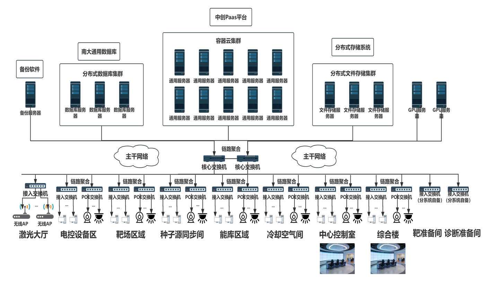

网络拓扑图

# 性能需求

## 运维任务管控组件技术指标

运维任务管控组件的主要技术指标要求如下：

- 控制束数：60束；
- 激光参数反演时间：＜10min；
- 数据后处理时间：<10min；
- 系统软件平均修复时间（MTTR）：≤0.5h；
- 系统界面响应时长＜3s，复杂页面响应时长＜5s。

## 状态监控组件技术指标需求

状态监控组件的主要设计指标要求如下：

- 系统软件平均修复时间（MTTR）：≤0.5h；
- 控制束数：60束；
- 故障预测准确率＞85%；
- 系统界面响应时长＜3s，复杂页面响应时长＜5s。

## 控制环境组件技术指标需求

控制环境组件的主要技术指标要求如下：

- 软件需适配国产及国际主流操作系统、硬件平台、数据库；
- 系统硬件平均故障恢复时间（MTTR）：≤2h；
- 系统硬件平均无故障时间（MTBF）：≥400h；
- 主干网为万兆以太网，现场机柜千兆接入。

# 软件属性需求

- 正确性：程序运行所完成的功能与需求说明书规定的各种功能相一致的程度；
- 健壮性：在不合理的输入情况下，如打错命令、输入数据超界、提供参数不合理等情况下，程序仍能运行或给出错误信息后转到预先规定的错误处理程序运行；
- 可用性：可以指定一些因素，如设备自检以保证整个系统有一个确定的可用性级别。
- 报警：出现异常或故障时报警要求；
- 安全性，遭受意外损害后的恢复能力；
- 可维护性，软件维护的难易程度，可以设置一些检测点等；
- 可移植性，程序从一个环境转移到另一个环境进行运行的难易程度；
- 软件升级：适应操作系统更改、升级或硬件更改后的软件升级要求。

# 数据需求

无。

# 数据库需求

控制软件数据库分为公共库、系统库，用于存储不同来源、不同用途的各类数据。公共库和系统库由集中管控软件与各系统控制软件协同进行库/表及权限设计，库/表及权限的建立和维护均由数据库管理方统一执行。

公共库：存储全系统共用的基础数据信息，如：系统定义、组件定义、设备定义、束组定义、实验定义等信息。权限定义：装置管控软件对公共库具有读写权限，系统控制软件对公共库具有读权限。

系统库：存储各系统的实验参数、实验数据等相关信息。权限定义：系统控制软件对各自系统库具有读写权限，对其他分系统的系统库具有读权限，装置管控软件对所有系统库具有读权限。

公共库中的核心数据结构如下图所示，各系统数据库的相关数据应以公共库中的相关编号为索引进行存储，以规范数据的组织、方便数据的查找与应用。

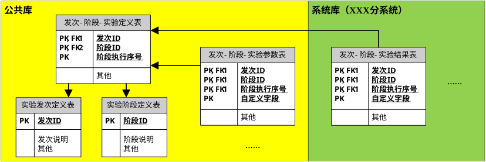

软件数据结构设计

## 数据存储规范

标量数据：要求存储为数值类型。

数据表、数据字段必须加入中文注释。

无特殊要求必须使用UTF8字符集。

不可在数据库做运算。

禁止使用TEXT、BLOB类型（大文本、大文件、大照片存放在文件系统），可以把文件放到文件服务器中，数据库以url形式保存。

字符串类型一律使用VARCHAR类型，对于明确长度的建议使用char。

实验数据仅保留原始数据及标准化后的结果数据，坚决避免数据冗余。装置各系统需提供标准化数据处理程序（包含近场处理、波形截取等），处理后的图片类数据一般不做永久保存，需要分析时采用“现用现调”策略。对各类测量数据存储的基本要求如下：

脉冲时间波形：存储原始数据，以及标准化处理数据（截取后的子束时间波形、脉宽、峰值功率、幅频调制度、波形对比度）；

近场：存储原始数据，以及标准化处理的数据（近场调制度、近场对比度、峰值通量）；

远场：存储原始数据，以及标准化处理数据（峰值强度、能量集中度曲线，95%能量集中度半径）；

波前：存储原始数据，以及标准化处理数据（PV值、RMS）。

## 数据库表命名规范

所有数据库、表的命名要求采用大写英文字母、数字或下划线组合。数据库、表的命名应能体现其中存储的数据内容。数据库采用集中存储方式，各个数据库对象命名规则如下：

- 系统库命名规则：[分系统编码]_DB；
- 数据对象命名规则：对象类型_[分系统编码][_基表类型]_自定义名[_触发器类型]。
- 对象类型定义如下几类：
- T：数据库基表；
- P：数据库存储过程；
- V：视图；
- TR：触发器；
- IDX：索引；
- TMP：临时表。
在对象类型为T（即数据库基表）时，要求定义“基表类型”字段，对于其他对象类型，基表类型字段省略，即基表的命名规则为：T_[分系统编码]_基表类型_自定义名。

基表类型定义如下几类，可根据需要增加：

- CFG：设备配置参数表；
- SYS：系统公共信息表；
- PARA：实验参数表；
- DATA：实验结果数据表。
自定义名由设计人员自定义，要求采用英文字母、数字或下划线组成。

在对象类型为TR时，要求定义“触发器类型”字段，对于其他对象类型，触发器类型字段省略，即触发器的命名规则为：TR_[分系统编码]_自定义名_触发器类型。其中，触发器类型标识为：

- I：Insert触发器；
- D：Delete触发器；
- U：Update触发器。

# 特殊操作需求

无。
