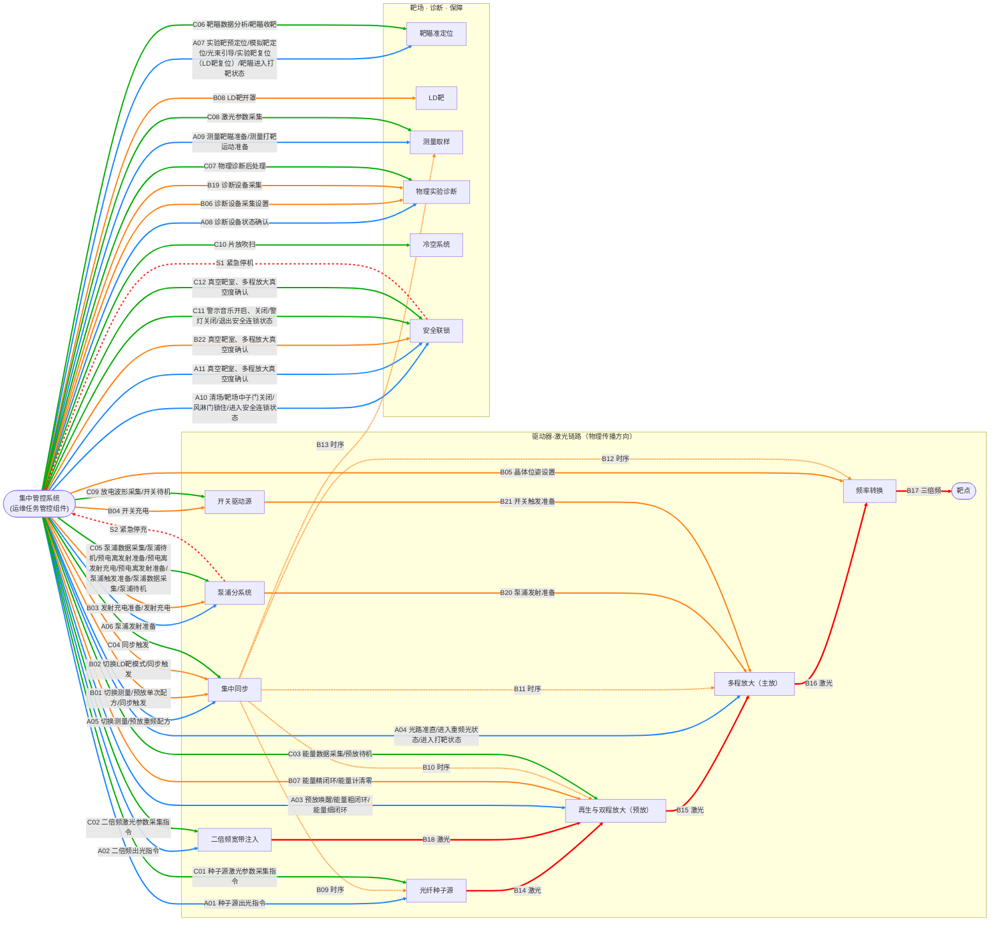

# GXLF 集中管控系统 — 子系统接口与流程定义

本文档完整定义 JZGK 控制器与 16 个子系统之间的关系、Tango 接口，以及三阶段 DAG 流程中每一步的含义。

---

## 〇、集中管控系统——各子系统关系图



### 编号说明

| 前缀 | 阶段 | 范围 |
|------|------|------|
| `A` | 发射准备 | A01 种子源出光 → A11 真空靶室确认 |
| `B` | 发射 | B01 单次同步配方 → B22 真空靶室确认 |
| `C` | 发射后处理 | C01 种子源参数采集 → C12 真空靶室确认 |
| `S` | 安全上报（全程有效） | S1 紧急停机 / S2 紧急停充 |

| 箭头样式 | 含义 |
|----------|------|
| 实线 `-->` | 控制指令或物理信号 |
| 虚线 `-.->` | 集中同步纳秒级时序（广播给多个子系统） |

### 子系统速查

| 子系统 | 参与阶段 | 核心职责 |
|--------|---------|---------|
| 光纤种子源 | 准备、后处理 | 产生初始激光种子，控制出光/待机 |
| 二倍频宽带注入 | 准备、后处理 | 种子光倍频注入预放 |
| 再生与双程放大（预放） | 准备、发射、后处理 | 激光预放大，能量粗/精闭环 |
| 多程放大（主放） | 准备、发射 | 主放大，光路准直，打靶状态确认 |
| 频率转换 | 发射 | 基频→三倍频（紫外），晶体位姿调整 |
| 泵浦分系统 | 准备、发射、后处理 | 提供放大能量，充电/触发，紧急停充上报 |
| 开关驱动源 | 发射、后处理 | 控制电光开关充电与触发 |
| 集中同步 | 准备、发射、后处理 | 全装置纳秒级时序同步 |
| 靶瞄准定位 | 准备、后处理 | 靶预定位、光束引导、发射后收靶 |
| LD靶分系统 | 发射 | 液态氘靶开罩/就位 |
| 测量取样 | 准备、发射、后处理 | 束线采样，测量激光能量/波形/近远场 |
| 物理实验诊断 | 准备、发射、后处理 | 诊断设备状态确认、采集设置，探测物理信号 |
| 冷空系统 | 后处理 | 放大片吹扫冷却 |
| 安全联锁 | 准备、发射、后处理 | 屏蔽门、警灯、人员清场、真空度确认、紧急停机 |

---

## 一、基类公共接口

所有子系统继承 `SubsystemDevice`（`simulators/_base.py`），提供以下公共属性和命令：

### 公共属性

| 属性 | 类型 | 读写 | 说明 |
|------|------|------|------|
| `adminMode` | bool | RW | 远程控制许可（服务权限签到后置 True） |
| `controlMode` | str | RW | 当前控制权持有者标识 |
| `selfCheckState` | uint16 | R | 0=未自检 1=自检中 2=通过 3=失败 |
| `selfCheckStatus` | str | R | 自检状态描述 |
| `healthState` | uint16 | R | 0=正常 1=降级 2=故障 |
| `healthStatus` | str | R | 健康状态描述 |
| `simSpeed` | float | RW | 仿真速度倍率（1.0=实时） |

### 公共命令

| 命令 | 参数 | 说明 |
|------|------|------|
| `Reset` | — | 从 FAULT 复位到 STANDBY |
| `InjectFault` | str (reason) | 注入测试故障 |
| `SelfCheck` | — | 执行自检流程 |

### Tango 状态映射

| DevState | 含义 |
|----------|------|
| STANDBY | 初始化完成，等待指令 |
| RUNNING | 正在执行操作 |
| ON | 就绪，可接收下一指令 |
| FAULT | 故障，需 Reset |
| OFF | 已关断 |
| MOVING | 运动中（靶瞄/晶体调姿等） |

---

## 二、各子系统专用接口

### 1. ZZY — 光纤种子源

产生初始激光脉冲种子（1053 nm），控制出光/待机。

**属性**

| 属性 | 类型 | 单位 | 说明 |
|------|------|------|------|
| `outputPower` | float | W | 当前输出光功率 |

**命令**

| 命令 | 输入 | 输出 | 阶段 | 说明 |
|------|------|------|------|------|
| `EnableOutput` | — | — | A01 | 种子源出光 |
| `DisableOutput` | — | — | 补偿 | 禁光/待机 |
| `ReadLaserParameters` | — | str(JSON) | C01 | 采集激光参数（功率、脉宽、重频、波长） |
| `Standby` | — | — | C | 切换待机 |

---

### 2. EPJ — 二倍频宽带注入

将种子光倍频（1053→527 nm）后注入预放大链。

**属性**

| 属性 | 类型 | 单位 | 说明 |
|------|------|------|------|
| `outputPower` | float | W | 倍频注入光功率 |
| `wavelength` | float | nm | 输出波长（~527 nm） |

**命令**

| 命令 | 输入 | 输出 | 阶段 | 说明 |
|------|------|------|------|------|
| `EnableOutput` | — | — | A02 | 二倍频出光 |
| `DisableOutput` | — | — | 补偿 | 禁光/待机 |
| `ReadLaserParameters` | — | str(JSON) | C02 | 采集参数（功率、波长、带宽、注入效率） |
| `Standby` | — | — | C | 切换待机 |

---

### 3. YF — 再生与双程放大（预放）

激光预放大器，将 mW 级种子光放大到 J 级。支持能量粗/精闭环控制。

**属性**

| 属性 | 类型 | 读写 | 单位 | 说明 |
|------|------|------|------|------|
| `energySetpoint` | float | RW | J | 能量闭环目标值 |
| `measuredEnergy` | float | R | J | 最近一次测量的输出能量 |
| `temperature` | float | R | °C | 放大片工作温度 |
| `loopClosed` | bool | R | — | 能量闭环是否已激活 |

**命令**

| 命令 | 输入 | 输出 | 阶段 | 说明 |
|------|------|------|------|------|
| `WakeUp` | — | — | A03 | 预放唤醒，温度从室温升至 ~41°C |
| `ShotOutputLight` | — | — | A03 | 预放出打靶光（单脉冲，用于准直验证） |
| `CoarseEnergyLoop` | — | — | A03 | 能量粗闭环（±5% 精度） |
| `FineEnergyLoop` | — | — | A03/B07 | 能量精闭环（±1% 精度） |
| `ClearEnergyCounter` | — | — | B07 | 能量计清零 |
| `ReceivePumpEnergy` | float(J) | float(J) | B | 接收泵浦能量，执行放大 |
| `StartClosedLoop` | — | — | — | 启动能量闭环 |
| `AcceptPurge` | — | — | C03 | 接受冷空吹扫冷却 |
| `ReadEnergyData` | — | str(JSON) | C03 | 采集能量数据 |
| `Standby` | — | — | C | 切换待机 |

---

### 4. DCF — 多程放大（主放）

主放大器，60 束并行，每束独立光路准直。将 J 级放大到百 J 级。

**属性**

| 属性 | 类型 | 单位 | 说明 |
|------|------|------|------|
| `alignmentError` | float | μrad | 光束指向误差（<10 μrad 为就绪判据） |
| `outputEnergy` | float | J | 最近一次放大输出能量 |
| `alignmentSteps` | int | — | 准直收敛步数 |

**命令**

| 命令 | 输入 | 输出 | 阶段 | 说明 |
|------|------|------|------|------|
| `Align` | — | — | A04 | 光路迭代准直（5步，阈值 10 μrad） |
| `ConfirmRepFrequencyState` | — | — | A04 | 重频光状态确认 |
| `ConfirmShotState` | — | — | A04 | 打靶就绪状态最终确认 |
| `ConfirmReady` | — | — | A04 | 就绪确认（准直完成后） |
| `ReceivePumpAndFire` | float(J) | float(J) | B | 接收泵浦能量，完成主放大 |

---

### 5. PLZ — 频率转换

KDP 晶体将 1053 nm 基频光转换为 351 nm 三倍频（紫外）光。

**属性**

| 属性 | 类型 | 单位 | 说明 |
|------|------|------|------|
| `pitchAngle` | float | mrad | 晶体俯仰角 |
| `yawAngle` | float | mrad | 晶体偏航角 |
| `uvEnergy` | float | J | 三倍频输出能量 |
| `conversionEfficiency` | float | % | 转换效率 |

**命令**

| 命令 | 输入 | 输出 | 阶段 | 说明 |
|------|------|------|------|------|
| `SetCrystalPose` | [pitch, yaw] | — | B05 | 晶体位姿设置（μrad 级精密调整） |
| `ReceiveFundamental` | float(J) | float(J) | B | 接收基频光，返回三倍频能量 |

---

### 6. BB — 泵浦分系统

为片状放大器闪光灯提供脉冲大电流（kV 级电容器组储能）。装置最危险部分。

**属性**

| 属性 | 类型 | 单位 | 说明 |
|------|------|------|------|
| `targetEnergy` | float | J | 目标泵浦能量 |
| `actualEnergy` | float | J | 实际放电能量 |
| `chargeProgress` | float | % | 充电进度（0–100%） |
| `chargeVoltage` | float | V | 当前充电电压 |
| `safetySignal` | str | — | '' = 无，'S2' = 紧急停充 |

**命令**

| 命令 | 输入 | 输出 | 阶段 | 说明 |
|------|------|------|------|------|
| `Prepare` | float(J) | — | A06 | 泵浦发射准备（设置目标能量） |
| `ChargeReady` | — | — | B03 | 充电预检查 |
| `Charge` | — | — | B03 | 发射充电（10步，每步 0.2% 故障概率） |
| `PrepareTrigger` | — | — | B20 | 触发时序预置 |
| `Trigger` | — | — | B | 放电触发 |
| `EmergencyStop` | str | — | S2 | 紧急停充（触发 S2 安全信号） |
| `PreionizeReady` | — | — | C05 | 预电离准备 |
| `PreionizeCharge` | — | — | C05 | 预电离充电 |
| `ReadPumpData` | — | str(JSON) | C05 | 泵浦数据采集 |
| `PowerOffReset` | — | — | C05 | 关机复位 |
| `Standby` | — | — | C | 切换待机 |

---

### 7. KG — 开关驱动源

控制多程放大器中的电光开关（Pockels Cell），实现激光脉冲精确开关与整形。

**属性**

| 属性 | 类型 | 单位 | 说明 |
|------|------|------|------|
| `targetVoltage` | float | kV | 充电目标电压 |
| `actualVoltage` | float | kV | 当前实际电压 |
| `chargeProgress` | float | % | 充电进度 |

**命令**

| 命令 | 输入 | 输出 | 阶段 | 说明 |
|------|------|------|------|------|
| `Charge` | float(kV) | — | B04 | 开关充电（8步线性） |
| `PrepareTrigger` | — | — | B21 | 触发时序预置 |
| `Trigger` | — | — | B | 输出高压脉冲 |
| `ReadDischargeWaveform` | — | str(JSON) | C09 | 放电波形采集 |
| `Standby` | — | — | C | 切换待机 |

---

### 8. JZT — 集中同步

全装置纳秒级时序同步系统，管理 66 路触发信号通道。

**属性**

| 属性 | 类型 | 说明 |
|------|------|------|
| `currentRecipe` | str | 当前加载的配方 ID |
| `armed` | bool | 是否已就绪等待 Fire |
| `triggerCount` | int | 累计触发次数 |

**命令**

| 命令 | 输入 | 输出 | 阶段 | 说明 |
|------|------|------|------|------|
| `LoadShotReadyRecipe` | — | — | A05 | 加载发射准备配方 |
| `LoadMeasureRepRecipe` | — | — | A05 | 加载测量重频配方 |
| `LoadPreamplifierRepRecipe` | — | — | A05 | 加载预放重频配方 |
| `LoadMeasureSingleRecipe` | — | — | B01 | 加载测量单次配方 |
| `LoadPreamplifierSingleRecipe` | — | — | B01 | 加载预放单次配方 |
| `LoadRecipe` | str | — | A05 | 通用配方加载 |
| `LoadSingleShot` | str(JSON) | — | B01 | 写入各通道纳秒级延迟 |
| `Arm` | — | — | B | 就绪（允许 Fire） |
| `Fire` | — | — | B | 广播触发脉冲 |
| `Reset` | — | — | C04 | 同步系统复位 |

---

### 9. BM — 靶瞄准定位

实验靶（靶丸）预定位、光束引导、发射后收靶。μm 级精度。

**属性**

| 属性 | 类型 | 单位 | 说明 |
|------|------|------|------|
| `targetId` | str | — | 当前靶标编号 |
| `positionX/Y/Z` | float | μm | 靶心三维坐标 |
| `pointingError` | float | μm | 光束指向误差 |

**命令**

| 命令 | 输入 | 输出 | 阶段 | 说明 |
|------|------|------|------|------|
| `PrePosition` | str(target_id) | — | A07 | 实验靶预定位（XYZ 三轴运动） |
| `SimulateTargetPosition` | str(target_id) | — | A07 | 模拟靶定位（仿真模式） |
| `BeamGuide` | — | — | A07 | 光束引导（焦斑与靶位对比） |
| `ResetTarget` | — | — | A07 | 实验靶复位至装载位 |
| `ConfirmShotState` | — | — | A07 | 打靶就绪状态确认 |
| `AnalyzeData` | — | str(JSON) | C06 | 靶瞄数据分析（弹着点、焦斑、抖动） |
| `CollectTarget` | — | — | C06 | 收靶复位 |

---

### 10. ZK — 真空靶室

维持靶室真空（~10⁻⁵ Pa），监控漏气。阈值 `VACUUM_THRESHOLD = 1e-3 Pa`。

**属性**

| 属性 | 类型 | 单位 | 说明 |
|------|------|------|------|
| `pressure` | float | Pa | 当前靶室压强 |
| `evacuated` | bool | — | 是否达到真空判据 |
| `safetySignal` | str | — | '' = 无，'S3' = 真空泄漏 |

**命令**

| 命令 | 输入 | 输出 | 阶段 | 说明 |
|------|------|------|------|------|
| `StartMonitoring` | — | — | A | 启动后台真空监控（5s周期，0.5%漏气概率） |
| `StopMonitoring` | — | — | C/补偿 | 停止真空监控 |
| `StartEvacuation` | — | — | A | 抽真空（40步指数衰减） |

---

### 11. CLY — 测量取样

62 路在线测量，采集束线的能量、波形、近场、远场、波前。

**属性**

| 属性 | 类型 | 说明 |
|------|------|------|
| `channelCount` | int | 已配置采样通道数 |
| `lastResults` | str | 最近一次采集结果（JSON） |

**命令**

| 命令 | 输入 | 输出 | 阶段 | 说明 |
|------|------|------|------|------|
| `Setup` | str(JSON) | — | A09 | 配置采样参数 |
| `MeasureTargetReady` | — | — | A09 | 测量靶瞄准备 |
| `MeasureMotionReady` | — | — | A09 | 测量打靶运动准备 |
| `MeasurementReady` | — | — | B | 打靶测量准备（切换采集就绪） |
| `StartSampling` | — | — | B13 | 启动采样 |
| `ReadResults` | — | str(JSON) | C08 | 读取激光参数测量结果 |
| `Standby` | — | — | C | 切换待机 |

---

### 12. WLZD — 物理实验诊断

协调诊断设备（X 射线、中子、散射光等），DIM 机械手控制。

**属性**

| 属性 | 类型 | 说明 |
|------|------|------|
| `detectorCount` | int | 已配置探测器数 |
| `armed` | bool | 探测器是否就绪 |
| `lastResults` | str | 最近诊断结果（JSON） |

**命令**

| 命令 | 输入 | 输出 | 阶段 | 说明 |
|------|------|------|------|------|
| `SetupDetectors` | str(JSON) | — | A08 | 探测器配置（高压加载、DIM就位） |
| `ArmDetectors` | — | — | B06 | 探测器就绪 |
| `ExecuteDeviceAction` | str | — | B | 执行设备动作（收回/就位/试触发/上电） |
| `Acquire` | — | — | C07 | 触发采集 |
| `ReadResults` | — | str(JSON) | C07 | 读取物理信号（X射线/中子/γ） |
| `PostShotProcessing` | — | — | C07 | 发射后处理（退高压/收回/下电） |

---

### 13. AQ — 安全联锁

靶场区域安全管控：屏蔽门、警灯、人员计数 RFID、紧急停机。

**属性**

| 属性 | 类型 | 说明 |
|------|------|------|
| `areaCleared` | bool | 清场确认（RFID 计数为零） |
| `lockedDown` | bool | 屏蔽门锁定、联锁激活 |
| `personCount` | int | 靶场内 RFID 检测人数 |
| `safetySignal` | str | '' = 无，'S1' = 紧急停机 |

**命令**

| 命令 | 输入 | 输出 | 阶段 | 说明 |
|------|------|------|------|------|
| `ControlAlarmSound` | int(0/1) | — | A10/C11 | 警示音：0=关 1=开 |
| `ClearArea` | — | — | A10 | 清场（等待 RFID 确认无人） |
| `ControlShieldDoor` | int(0/1/2) | — | A10 | 屏蔽门：0=开 1=关 2=锁定 |
| `LockDown` | — | — | A10 | 进入安全联锁状态 |
| `SetSafetyState` | int(0/1/2/3) | — | A10/C11 | 0=释放 1=预备 2=联锁激活 3=紧急停机 |
| `ControlWarningLight` | int(0/1/2) | — | C11 | 警灯：0=关 1=常亮 2=闪烁 |
| `Release` | — | — | C11 | 退出安全联锁 |
| `SimulateIntrusion` | — | — | 测试 | 模拟人员入侵（触发 S1） |

---

### 14. LK — 冷空系统

片状放大器冷气吹扫，防止闪光灯发射后玻璃片过热。

**属性**

| 属性 | 类型 | 单位 | 说明 |
|------|------|------|------|
| `purging` | bool | — | 吹扫是否运行中 |
| `flowRate` | float | L/min | 冷气流量 |

**命令**

| 命令 | 输入 | 输出 | 阶段 | 说明 |
|------|------|------|------|------|
| `StartPurge` | — | — | C10 | 开启吹扫气流 |
| `StopPurge` | — | — | C10/补偿 | 关闭吹扫气流 |
| `PurgeControl` | str | — | — | 统一接口（开始/结束/关机） |

---

### 15. MX — 模型校准

基于每发次测量数据更新虚拟光路预测模型，为下一发次配方参数反演提供校准因子。

**属性**

| 属性 | 类型 | 单位 | 说明 |
|------|------|------|------|
| `modelVersion` | int | — | 预测模型版本号 |
| `correctionFactors` | str | — | 校准因子（JSON） |
| `calibrationQuality` | float | % | 校准质量评分 |

**命令**

| 命令 | 输入 | 输出 | 阶段 | 说明 |
|------|------|------|------|------|
| `StartCalibration` | str(JSON) | — | C | 基于发次数据更新模型 |

---

### 16. LDB — 液氘靶分系统

液态氘（Liquid Deuterium）靶丸的开罩与就位支持。

**属性**

| 属性 | 类型 | 单位 | 说明 |
|------|------|------|------|
| `coverOpen` | bool | — | 靶丸罩盖是否开启 |
| `targetTemperature` | float | K | LD 靶温度（液氘 ~23 K） |

**命令**

| 命令 | 输入 | 输出 | 阶段 | 说明 |
|------|------|------|------|------|
| `OpenCover` | — | — | B08 | LD 靶开罩 |
| `SimulateOpenCover` | — | — | B08 | 模拟开罩（仿真模式） |
| `CloseCover` | — | — | C | LD 靶收靶 |
| `Reset` | — | — | A | LD 靶复位 |

---

## 三、安全信号定义

| 信号 | 来源 | 含义 | 触发条件 | 后果 |
|------|------|------|---------|------|
| S1 | AQ | 紧急停机 | 人员闯入靶场/屏蔽门异常 | 立即中止发次，AQ 进入 FAULT，需操作员手动复位 |
| S2 | BB | 紧急停充 | 充电过程异常/外部中止指令 | 立即放电，BB 进入 FAULT |
| S3 | ZK | 真空泄漏告警 | 后台监控检测到压强上升 | 轻度（>阈值）→警告继续；严重（>阈值×100）→中止 |

---

## 四、三阶段 DAG 流程完整定义

### Phase A — 发射准备（31 步）

```
zk_monitor ─────────────────────────────────────────────────┐
  │                                                         │
  ├── zzz_out ──────────────────────────────────────────┐   │
  ├── epj_out ──────────────────────────────────────┐   │   │
  ├── yf_wakeup → yf_shot_output → yf_coarse → yf_fine │   │
  ├── dcf_align ────────────────────────────────────┤   │   │
  ├── jzt_shot_ready → jzt_measure_rep → jzt_preamp_rep │   │
  ├── bb_prepare ───────────────────────────────────┤   │   │
  ├── bm_prepos → bm_beam_guide ────────────────────┤   │   │
  ├── zk_evacuate ──────────────────────────────────┤   │   │
  ├── wlzd_setup (soft) ───────────────────────────┤   │   │
  ├── cly_setup → cly_target_ready → cly_motion_ready   │   │
  └── ldb_reset (conditional) ─────────────────────┘   │   │
                                                        ▼   │
                                              fault_check ◄──┘
                                                   │
                                               s3_check
                                                   │
                                           dcf_rep_confirm
                                                   │
                                          dcf_shot_confirm
                                                   │
                                          bm_shot_confirm
                                                   │
                                            aq_alarm_on
                                                   │
                                              aq_clear
                                                   │
                                          aq_shield_close
                                                   │
                                          aq_shield_lock
                                                   │
                                            aq_lockdown
                                                   │
                                         aq_safety_active
```

**逐步解释：**

| 步骤 | 编号 | 子系统 | 动作 | 说明 |
|------|------|--------|------|------|
| `zk_monitor` | — | ZK | StartMonitoring | 启动真空后台监控，全阶段持续运行 |
| `zzz_out` | A01 | ZZY | EnableOutput | 种子源出光（50 mW 种子脉冲） |
| `epj_out` | A02 | EPJ | EnableOutput | 二倍频注入出光（30 mW） |
| `yf_wakeup` | A03-1 | YF | WakeUp | 预放唤醒，温度升至 ~41°C |
| `yf_shot_output` | A03-2 | YF | ShotOutputLight | 预放出打靶光，用于光路验证 |
| `yf_coarse` | A03-3 | YF | CoarseEnergyLoop | 能量粗闭环调节（±5%） |
| `yf_fine` | A03-4 | YF | FineEnergyLoop | 能量精闭环调节（±1%） |
| `dcf_align` | A04 | DCF | Align | 光路迭代准直（5步收敛到 <10 μrad） |
| `jzt_shot_ready` | A05-1 | JZT | LoadShotReadyRecipe | 加载发射准备时序配方 |
| `jzt_measure_rep` | A05-2 | JZT | LoadMeasureRepRecipe | 加载测量重频配方 |
| `jzt_preamp_rep` | A05-3 | JZT | LoadPreamplifierRepRecipe | 加载预放重频配方 |
| `bb_prepare` | A06 | BB | Prepare(energy) | 泵浦发射准备，设置目标能量 |
| `bm_prepos` | A07-1 | BM | PrePosition(target_id) | 实验靶预定位（XYZ三轴） |
| `bm_beam_guide` | A07-2 | BM | BeamGuide | 光束引导（焦斑-靶位对比校准） |
| `zk_evacuate` | — | ZK | StartEvacuation | 抽真空（40步衰减至 <1e-3 Pa） |
| `wlzd_setup` | A08 | WLZD | SetupDetectors(config) | 诊断设备参数配置（soft，失败不中止） |
| `cly_setup` | A09-1 | CLY | Setup(config) | 测量采样配置（soft） |
| `cly_target_ready` | A09-2 | CLY | MeasureTargetReady | 测量靶瞄准备 |
| `cly_motion_ready` | A09-3 | CLY | MeasureMotionReady | 测量打靶运动准备 |
| `ldb_reset` | — | LDB | Reset | LD 靶复位（仅 `use_ld_target=True`） |
| `fault_check` | — | — | _check_faults | 全量硬/软故障检查 |
| `s3_check` | — | — | _check_s3_severity | S3 真空告警严重程度评估 |
| `dcf_rep_confirm` | A04 | DCF | ConfirmRepFrequencyState | 重频光状态确认 |
| `dcf_shot_confirm` | A04 | DCF | ConfirmShotState | 主放打靶状态最终确认 |
| `bm_shot_confirm` | A07 | BM | ConfirmShotState | 靶瞄打靶状态最终确认 |
| `aq_alarm_on` | A10-1 | AQ | ControlAlarmSound(1) | 开启警示音（提示人员撤离） |
| `aq_clear` | A10-2 | AQ | ClearArea | 清场（RFID 确认无人） |
| `aq_shield_close` | A10-3 | AQ | ControlShieldDoor(1) | 关闭屏蔽门 |
| `aq_shield_lock` | A10-4 | AQ | ControlShieldDoor(2) | 锁定屏蔽门 |
| `aq_lockdown` | A10-5 | AQ | LockDown | 进入安全联锁状态 |
| `aq_safety_active` | A10-6 | AQ | SetSafetyState(2) | 安全管控置为"联锁激活" |

**补偿动作：** `zk_monitor→StopMonitoring`, `zzz_out→DisableOutput`, `epj_out→DisableOutput`, `jzt_shot_ready→Reset`, `bb_prepare→EmergencyStop`, `aq_lockdown→Release`

---

### Phase B — 发射（25 步）

```
jzt_measure_single → jzt_preamp_single
                           │
         ┌─────────────────┼──────────────────┐
         │                 │                  │
   bb_charge_ready    kg_charge          plz_crystal
         │                 │                  │
     bb_charge        (parallel)         wlzd_arm
         │                 │                  │
         │          yf_fine_loop         cly_measure_ready
         │                 │                  │
         │          yf_clear_energy      ldb_open
         │                 │                  │
         └─────────────────┼──────────────────┘
                           ▼
                     fault_check
                           │
                      safety_chk
                           │
                       s3_check
                       ┌───┴───┐
               bb_prep_trigger  kg_prep_trigger
                       └───┬───┘
                      bb_trigger
                           │
                      kg_trigger
                      ┌────┴────┐
                  yf_pump    dcf_fire
                      └────┬────┘
                        plz_uv
                           │
                      cly_sample
                           │
                       jzt_arm
                           │
                       jzt_fire
                           │
                      capture_uv
```

**逐步解释：**

| 步骤 | 编号 | 子系统 | 动作 | 说明 |
|------|------|--------|------|------|
| `jzt_measure_single` | B01-1 | JZT | LoadMeasureSingleRecipe | 加载测量单次配方 |
| `jzt_preamp_single` | B01-2 | JZT | LoadPreamplifierSingleRecipe | 加载预放单次配方 |
| `bb_charge_ready` | B03-1 | BB | ChargeReady | 充电前预检查 |
| `bb_charge` | B03-2 | BB | Charge | 发射充电（10步至 25kV） |
| `kg_charge` | B04 | KG | Charge(voltage) | 开关充电（8步至目标 kV） |
| `plz_crystal` | B05 | PLZ | SetCrystalPose(pitch, yaw) | 晶体位姿设置 |
| `wlzd_arm` | B06 | WLZD | ArmDetectors | 探测器就绪 |
| `yf_fine_loop` | B07-1 | YF | FineEnergyLoop | 能量精闭环（充电期间同步） |
| `yf_clear_energy` | B07-2 | YF | ClearEnergyCounter | 能量计清零 |
| `cly_measure_ready` | — | CLY | MeasurementReady | 打靶测量准备 |
| `ldb_open` | B08 | LDB | SimulateOpenCover | LD 靶开罩（仅 LD 靶模式） |
| `fault_check` | — | — | _check_faults | 充电后故障检查 |
| `safety_chk` | — | Safety | check | 安全信号检查 |
| `s3_check` | — | — | _check_s3_severity | S3 严重程度评估 |
| `bb_prep_trigger` | B20 | BB | PrepareTrigger | 泵浦触发时序预置 |
| `kg_prep_trigger` | B21 | KG | PrepareTrigger | 开关触发时序预置 |
| `bb_trigger` | — | BB | Trigger | 泵浦放电（向闪光灯放电） |
| `kg_trigger` | — | KG | Trigger | 开关触发（电光脉冲） |
| `yf_pump` | B14 | YF | ReceivePumpEnergy | 预放接收泵浦能量（30%） |
| `dcf_fire` | B15 | DCF | ReceivePumpAndFire | 主放接收泵浦能量（70%） |
| `plz_uv` | B17 | PLZ | ReceiveFundamental | 频率转换（1053→351 nm） |
| `cly_sample` | B13 | CLY | StartSampling | 启动采样 |
| `jzt_arm` | — | JZT | Arm | 同步系统就绪 |
| `jzt_fire` | — | JZT | Fire | **同步触发！60 束纳秒级同时出光** |
| `capture_uv` | — | — | 记录 | 记录 UV 能量到 ShotRecord |

**补偿动作：** `jzt_measure_single→Reset`, `bb_charge→EmergencyStop`, `kg_charge→Reset`

---

### Phase C — 发射后处理（31 步）

```
wlzd_acquire
     │
     ├── zzy_read ──┐
     ├── epj_read ──┤
     ├── yf_read  ──┤
     ├── bb_read  ──┤
     ├── kg_read  ──┼── record_data
     ├── bm_analyze ┤       │
     ├── cly_read ──┤       ├── lk_purge_on → yf_purge → lk_purge_off ──┐
     └── wlzd_read ─┘       ├── wlzd_post_shot ─────────────────────────┤
                             ├── bm_collect ─────────────────────────────┤
                             ├── ldb_close (conditional) ────────────────┤
                             └── bb_preionize_ready                      │
                                   → bb_preionize_charge                 │
                                   → bb_power_off ──────────────────────┘
                                                                         │
                 ┌── zzy_standby ──┐                                     │
                 ├── epj_standby ──┤                                     │
                 ├── yf_standby  ──┤                                     │
                 ├── kg_standby  ──┼─ aq_alarm_off → aq_light_off → aq_release
                 ├── cly_standby ──┤                                     │
                 ├── bb_standby  ──┤                                mx_calibrate
                 └── jzt_reset  ───┘                                     │
                                                                  zk_stop_monitor
```

**逐步解释：**

| 步骤 | 编号 | 子系统 | 动作 | 说明 |
|------|------|--------|------|------|
| `wlzd_acquire` | C07-1 | WLZD | Acquire | 触发探测器数据采集 |
| `zzy_read` | C01 | ZZY | ReadLaserParameters | 种子源激光参数采集 |
| `epj_read` | C02 | EPJ | ReadLaserParameters | 二倍频激光参数采集 |
| `yf_read` | C03 | YF | ReadEnergyData | 预放能量数据采集 |
| `bb_read` | C05-1 | BB | ReadPumpData | 泵浦放电数据采集 |
| `kg_read` | C09-1 | KG | ReadDischargeWaveform | 开关放电波形采集 |
| `bm_analyze` | C06-1 | BM | AnalyzeData | 靶瞄数据分析 |
| `cly_read` | C08 | CLY | ReadResults | 激光参数测量结果 |
| `wlzd_read` | C07-2 | WLZD | ReadResults | 物理信号读取 |
| `record_data` | — | — | 汇总 | 将所有采集数据写入 ShotRecord |
| `lk_purge_on` | C10-1 | LK | StartPurge | 开启片放吹扫 |
| `yf_purge` | C10-2 | YF | AcceptPurge | 预放接受吹扫冷却 |
| `lk_purge_off` | C10-3 | LK | StopPurge | 关闭吹扫 |
| `wlzd_post_shot` | C07-3 | WLZD | PostShotProcessing | 退高压/DIM收回/设备下电 |
| `bm_collect` | C06-2 | BM | CollectTarget | 靶瞄收靶 |
| `ldb_close` | — | LDB | CloseCover | LD 靶收靶（仅 LD 靶模式） |
| `bb_preionize_ready` | C05-2 | BB | PreionizeReady | 预电离准备 |
| `bb_preionize_charge` | C05-3 | BB | PreionizeCharge | 预电离充电 |
| `bb_power_off` | C05-4 | BB | PowerOffReset | 泵浦关机复位 |
| `zzy_standby` | C01 | ZZY | Standby | 种子源待机 |
| `epj_standby` | C02 | EPJ | Standby | 二倍频待机 |
| `yf_standby` | C03 | YF | Standby | 预放待机 |
| `kg_standby` | C09-2 | KG | Standby | 开关待机 |
| `cly_standby` | C08 | CLY | Standby | 测量待机 |
| `bb_standby` | C05-5 | BB | Standby | 泵浦待机 |
| `jzt_reset` | C04 | JZT | Reset | 同步系统复位 |
| `aq_alarm_off` | C11-1 | AQ | ControlAlarmSound(0) | 关闭警示音 |
| `aq_light_off` | C11-2 | AQ | ControlWarningLight(0) | 关闭警灯 |
| `aq_release` | C11-3 | AQ | Release | 退出安全联锁 |
| `mx_calibrate` | — | MX | StartCalibration(data) | 模型校准（更新预测模型） |
| `zk_stop_monitor` | — | ZK | StopMonitoring | 停止真空监控 |

**补偿动作：** `lk_purge_on→StopPurge`

---

## 五、接口统计

| 维度 | 数量 |
|------|------|
| 子系统总数 | 16 |
| 公共属性 | 7 |
| 公共命令 | 3 |
| 专用属性总计 | 49 |
| 专用命令总计 | 95 |
| Phase A 步骤 | 31 |
| Phase B 步骤 | 25 |
| Phase C 步骤 | 31 |
| **流程总步骤** | **87** |
| 补偿动作 | 10 |
| 安全信号 | 3 (S1/S2/S3) |
