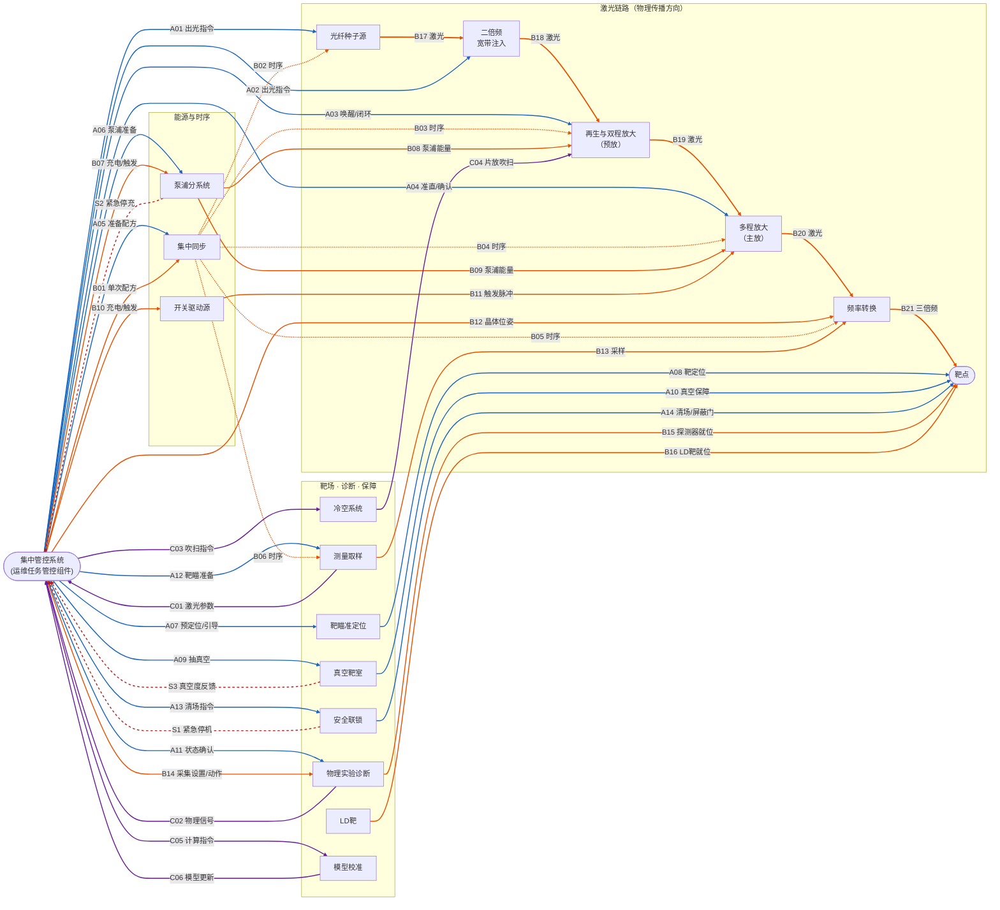

# 集中管控系统——各子系统关系图

## 编号说明

| 前缀 | 阶段 | 范围 |
|------|------|------|
| `A` | 发射准备 | A01 种子源出光 → A14 清场/屏蔽门关闭 |
| `B` | 发射 | B01 单次同步配方 → B21 三倍频激光打靶 |
| `C` | 发射后处理 | C01 激光参数采集 → C06 激光模型更新 |
| `S` | 安全上报（全程有效） | S1 紧急停机 / S2 紧急停充 / S3 真空度反馈 |

| 箭头样式 | 含义 |
|----------|------|
| 实线 `-->` | 控制指令或物理信号 |
| 虚线 `-.->` | 集中同步纳秒级时序（广播给多个子系统） |

## 子系统速查

| 子系统 | 参与阶段 | 核心职责 |
|--------|---------|---------|
| 光纤种子源 | 准备、后处理 | 产生初始激光种子，控制出光/待机 |
| 二倍频宽带注入 | 准备、后处理 | 种子光倍频注入 |
| 再生与双程放大（预放） | 准备、发射、后处理 | 激光预放大，能量粗/精闭环 |
| 多程放大（主放） | 准备、发射 | 主放大，光路准直，打靶状态确认 |
| 频率转换 | 发射 | 基频→三倍频（紫外），晶体位姿调整 |
| 泵浦分系统 | 准备、发射、后处理 | 提供放大能量，充电/触发，紧急停充上报 |
| 开关驱动源 | 发射、后处理 | 控制电光开关充电与触发 |
| 集中同步 | 准备、发射 | 全装置纳秒级时序同步 |
| 靶瞄准定位 | 准备、后处理 | 靶预定位、光束引导、发射后收靶 |
| LD靶分系统 | 准备、发射、后处理 | 液态氘靶专用流程 |
| 真空靶室 | 准备、发射 | 维持靶室真空，真空度反馈 |
| 测量取样 | 准备、发射、后处理 | 束线采样，测量激光能量/波形/近远场 |
| 物理实验诊断 | 发射、后处理 | 探测打靶产生的X射线/中子/γ射线 |
| 冷空系统 | 准备、后处理 | 放大片吹扫冷却 |
| 安全联锁 | 准备、发射、后处理 | 屏蔽门、警灯、人员计数、紧急停机 |
| 运行参数/模型校准 | 后处理 | 实测数据反校激光模型，为下一发次服务 |
