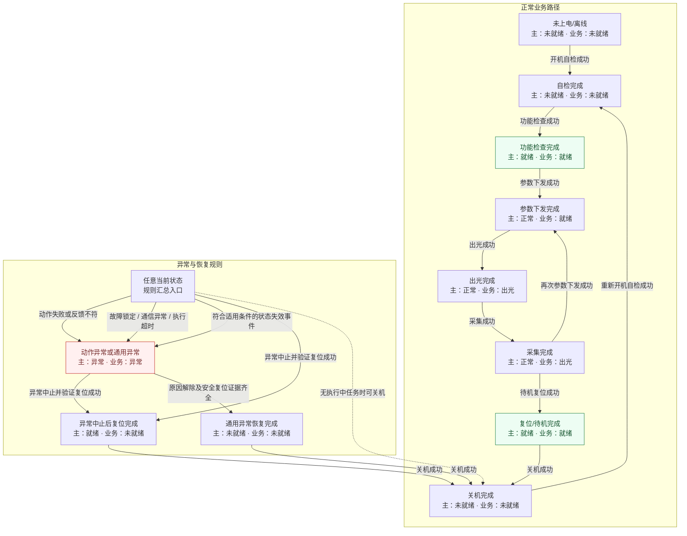
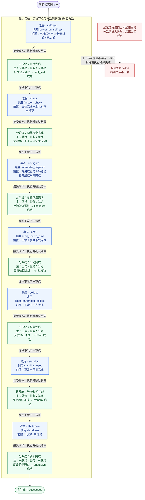
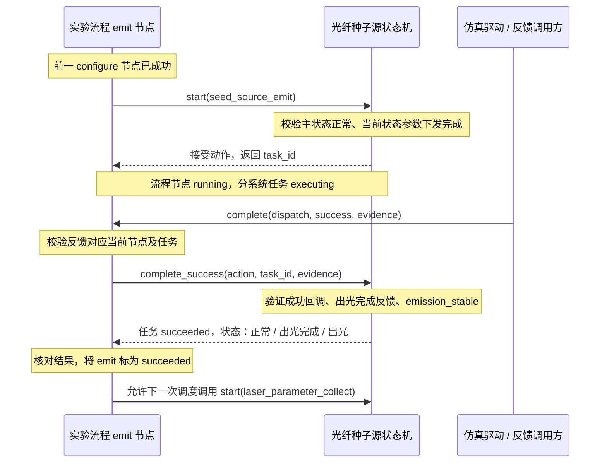
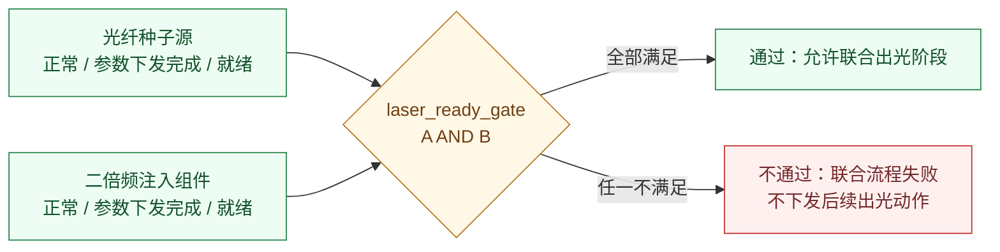
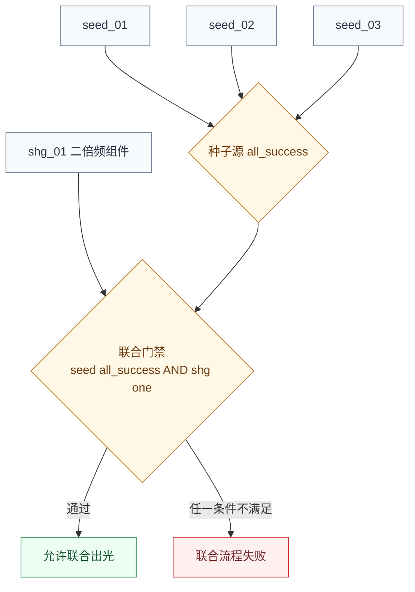

# 光纤种子源组件：状态机与最小实验流程

依据光纤种子源状态机模型 2.0、`seed-source-experiment.yaml` 和第 3 步联合模型。

## 分系统状态机

节点是分系统状态，边是动作或事件。节点内按“当前状态 / 主状态 / 业务状态”显示。
正常动作边压缩了执行中的任务状态；到达目标状态必须通过回调、采集结果和条件校验。
“任意当前状态”是汇总入口，不是运行时新增状态。



补充规则：

- 普通动作先进入 `executing`，成功/失败后进入 `succeeded/failed`。该任务生命周期与主状态、业务状态并行记录；图中不逐一展开每个执行中组合。
- 三种通用异常可以中断执行中的动作，并结束该任务；旧任务的完成反馈不能覆盖异常结果。
- 异常中止可抢占当前任务，原任务先记为 `cancelled`，再执行复位。异常中止或关机自身失败仍进入动作异常。
- 普通关机无 E/F 业务前置限制，但受“当前没有执行中任务”的约束；不能当作紧急抢占。
- `configuration_changed` 仅适用于当前结果“参数下发完成”；`emission_lost` 适用于业务“出光”；`readiness_lost` 适用于主状态“就绪/正常”。异常和失效事件都由调用方显式上报，尚无自动监测器。
- 普通待机、异常中止、通用异常恢复虽然都涉及安全复位，但主/业务状态组合不同，不能合并成一个“就绪”节点。
- 图中未绘制“待机→直接参数下发”：原表没有给出该入口，当前模型也不允许。正常最小实验以关机收尾。

O 列提供的是语义分类，而不是另一个调度阶段：

| 动作或事件 | O 列 state_definition |
|---|---|
| 开机自检 | 启动中、准备中 |
| 功能检查 | 业务就绪确认 |
| 参数下发、出光 | 结果确认/保持有效 |
| 参数采集 | 数据采集/后处理 |
| 普通待机、异常中止复位 | 待机 |
| 关机 | 关机 |
| 三种通用异常 | 异常处置 |

## 最小实验业务流程

蓝色框是**流程节点及调用动作**，绿色框是**分系统成功结果及本节点完成确认**。
每一对“蓝框→绿框”属于同一个流程节点的执行过程，绿框不是新增的流程节点。
只有前一个节点的任务反馈和结果验证成功，才允许下发下一个节点；下一个动作仍会重新校验分系统当前状态。



图中“反馈验证通过”包含三部分：

1. 反馈属于当前实验的当前节点与当前 `task_id`，不是旧任务反馈。
2. 回调成功，采集结果匹配动作的 `observed_states`，所有 `required_conditions` 满足。
3. 分系统任务为 `succeeded`，实际结果快照与该动作的成功目标一致。

无完成反馈时，节点保持 `running`。命令因前置条件不符被拒绝时，流程失败，但不因此改写分系统状态；
动作执行失败或已提交的完成证据不符时，分系统会进入对应异常结果。
错误任务编号、重复反馈、缺少证据等不合法 API 调用会被拒绝，不等同于已接受的任务结果失败。

以出光节点展开一次交互，说明图中一对蓝绿框对应的实际调用关系：



这里的“允许下一次调度”不是自动执行：当前 API 在完成反馈后开放下一节点，
由调用方再调用 `dispatch_next()`；命令行演示负责连续驱动这些调用。

当前流程没有“暂停等待人工处置”状态，也不会自动调用异常中止。失败后由外部进行恢复，
原实验实例仍然是 `failed`，不能随着设备恢复自动变为成功或继续执行。

## 两者如何关联

分系统状态机规定“当前允许什么动作、动作结果是什么”；实验流程规定“本次实验按什么顺序调用这些动作”。
流程节点的 `action` 字段引用状态机动作 `id`，没有单独复制一套设备状态转移。

| 流程节点 | 引用的分系统动作 | 确认成功后的当前状态 |
|---|---|---|
| self_test | power_on_self_test | 自检完成 |
| check | function_check | 功能检查完成 |
| configure | parameter_dispatch | 参数下发完成 |
| emit | seed_source_emit | 出光完成 |
| collect | laser_parameter_collect | 采集完成 |
| standby | standby_reset | 复位/待机完成 |
| shutdown | shutdown | 关机完成 |

以出光节点为例：

1. 流程确认参数下发节点已成功，调用 `start("seed_source_emit")`。
2. 分系统检查“主状态正常、当前状态参数下发完成”，创建任务并返回唯一 `task_id`。
3. 流程等待该任务反馈；收到命令并不等于出光成功。
4. 分系统验证回调成功、采集结果为“出光完成”、`emission_stable=True`，进入“正常/出光完成/出光”。
5. 流程核对节点与任务、结果快照，才把 emit 标为成功，并允许 collect 下发。

采集成功后，实验流程已经进入收尾阶段，但分系统业务状态仍是“出光”，直到待机复位成功才退出。
关机后，分系统是“未就绪”，实验却是“成功”：设备状态和实验完成状态回答的是不同问题。

当前最小实验只选取状态机的一条合法路径；状态机还允许采集后再次参数下发、异常中止等路径，
这些路径没有被编排进当前实验。两者现在看起来相似，是因为只有一个分系统且采用串行流程。
未来流程可以组合多个分系统，但不会把它们所有局部状态组合成一张巨大的状态表。

演示运行：`python3 -m gxlf_sim_system`。其中完成证据是显式模拟数据，不来自真实设备。

## 第 3 步：双分系统联合门禁

激光链路联合模型串行执行光纤种子源和二倍频宽带激光注入组件的自检、功能检查与参数下发。
联合门禁不是任一个节点成功的别名；它读取**两个独立分系统当下的状态快照**，逐字段按 AND 判断：

```text
seed_source.main_state     = 正常
AND seed_source.current_state  = 参数下发完成
AND seed_source.business_state = 就绪
AND shg_injector.main_state     = 正常
AND shg_injector.current_state  = 参数下发完成
AND shg_injector.business_state = 就绪
```



因此单系统局部状态保持独立：联合门禁不会把两套状态机合成一个状态枚举。流程调度仍然是串行的，
也没有多实例 fan-out。任一分系统异常都结束当前联合流程；本阶段没有人工 pending 或自动恢复。

验证场景：

- 两个系统都完成参数下发，联合门禁通过；
- 仅光纤种子源配置失效，联合门禁阻断；
- 仅二倍频注入组件配置失效，联合门禁阻断；
- 两者都准备完成后，其中一个系统报告通信异常，联合流程失败。

## 第 4 步：并行执行与多实例扇出

第 4 步使用 3 个独立的光纤种子源仿真实例。实例数量和编号是仿真配置，
不是 Excel 对光纤种子源实际数量的声明。一个扇出节点同时为所有实例创建任务：

```mermaid
flowchart TB
    N["流程节点：parallel_self_test<br/>动作：power_on_self_test"]
    N --> A["seed_01<br/>独立 task_id<br/>自检执行中"]
    N --> B["seed_02<br/>独立 task_id<br/>自检执行中"]
    N --> C["seed_03<br/>独立 task_id<br/>自检执行中"]
    A --> G{"all_success 聚合器"}
    B --> G
    C --> G
    G -->|三个都成功| OK["节点 succeeded<br/>允许下一个扇出节点"]
    G -->|任一失败或异常| BAD["节点 failed<br/>取消其他未完成实例"]
    classDef flow fill:#edf5ff,stroke:#2563eb,color:#1e3a8a;
    classDef target fill:#f7fafc,stroke:#718096,color:#2d3748;
    classDef good fill:#edfdf3,stroke:#26834a,color:#14532d;
    classDef bad fill:#fff0f0,stroke:#c53030,color:#742a2a;
    class N flow;
    class A,B,C target;
    class G fill:#fff8e7,stroke:#b7791f,color:#713f12;
    class OK good;
    class BAD bad;
```

并行节点与实例状态的关系是：

```text
节点 dispatch
    → 所有实例预检前置条件
    → 同时 start 所有实例
    → 每个实例分别接收自己的 task_id 反馈
    → all_success 聚合
    → 节点成功或整组失败
```

实现中的重要边界：

- 预检是全组原子门槛：任一实例不能执行时，不启动其他实例。
- 实例状态和历史完全独立；一个实例成功不会修改另一个实例的状态。
- 结果必须同时匹配节点、实例和该实例自己的 `task_id`。
- 任一实例失败或报告通用异常，整组节点失败，并取消仍在执行的同组任务。
- 节点只在所有实例成功且反馈证据有效后才标记为 `succeeded`。
- 这是 `all_success` 聚合，不是部分成功，也没有自动补发失败实例。

仿真运行：`python3 -m gxlf_sim_system.fanout_demo`。

## 第 4 步组合：种子源 fan-out + 二倍频单实例

联合组合模型将两种聚合关系叠加，但不混淆它们：



种子源的三个实例必须全部达到目标状态；二倍频组件只需它的唯一实例达到目标状态。
联合门禁读取各实例的当前快照：

```text
(seed_01 ready AND seed_02 ready AND seed_03 ready)
AND shg_01 ready
```

该模型仍按节点顺序调度，但每个种子节点内部并行启动三个实例。种子源任一实例失败时，
同组其他未完成任务会被取消；二倍频单实例失败也会结束整个联合流程。实例数量为仿真配置，
不能从 Excel 推断为真实设备数量。
